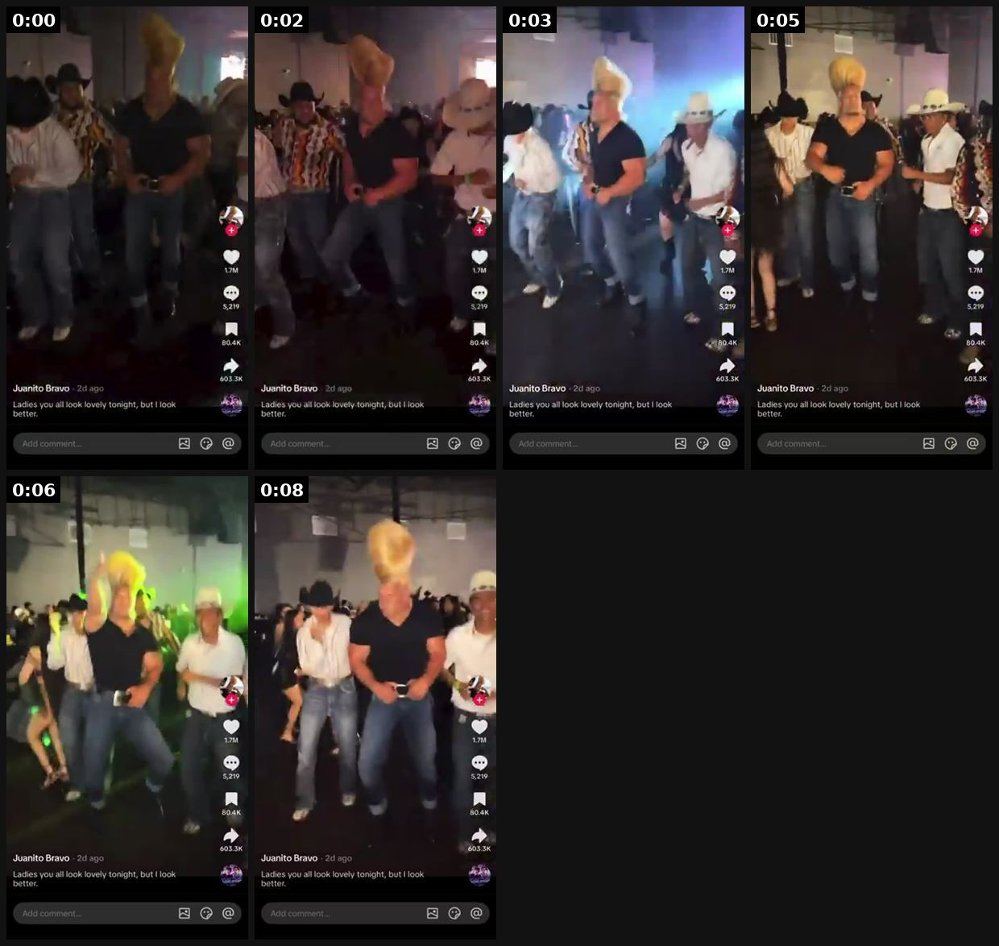
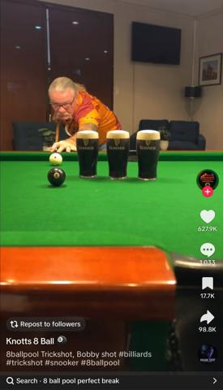
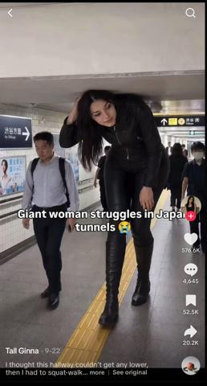
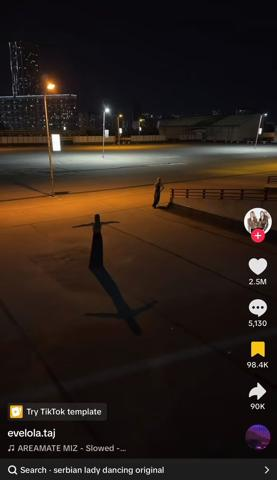
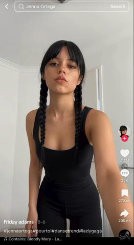
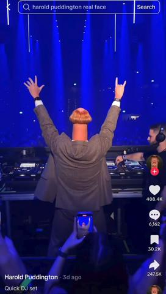
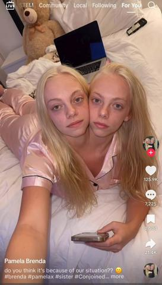
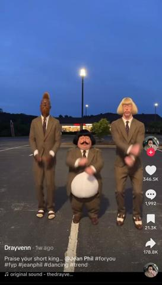

# 112 · AI character motion-swap reel (one striking AI character swapped into a dance, stage or crowd clip; hashtag-only or one-line ego caption): see it, then make it

[](https://x.com/kelmruns/status/2107508612058747114)

**The example:** [@kelmruns on X](https://x.com/kelmruns/status/2107508612058747114) · 0:09 video · 793 likes, 216K views

**Watch it:** [open the post on X](https://x.com/kelmruns/status/2107508612058747114) · [play the video file](https://video.twimg.com/amplify_video/2107507399263199233/vid/avc1/320x614/kFllez2en_COcNRU.mp4?tag=29)

> dead internet theory isn't a theory anymore this 2-day-old AI influencer made with ChatGPT already pulled $13,700 from one clip 26K followers and 2.2M likes in 48 hours on a guy with a two-foot haircut all the author did: > generate a gym bro with a giant blonde quiff in ChatGPT > pick crowded spots: a cowboy bar, a bowling alley, a lawn mower > swap him into the clip with Seedance 2.5 > caption it like an ego trip, …

## What you are seeing

A 9-second vertical reel of an AI-generated gym bro with a giant blonde two-foot quiff, swapped with Seedance 2.5 into crowded real-world clips (a cowboy bar, a bowling alley, riding a lawn mower) with a hype soundtrack. The caption is one ego line: "ladies you all look lovely tonight, but i look better". The poster claims the 2-day-old account reached 26K followers and 2.2M likes in 48 hours and "$13,700 from one clip" (unverified; replies dispute monetisation). The character was generated in ChatGPT image; every shot keeps the same exaggerated silhouette so it reads on mute in half a second.

## Beat by beat

The storyboard above samples the video every 0:01. Lines are the transcript for that stretch; on-screen text comes from OCR, so treat it as rough.

| Frame | Time | On screen | Said / sung |
|---|---|---|---|
| 1 | 0:00–0:01 | ago Ladies you all look lovely tonight, but look better. Add comment... | · |
| 2 | 0:01–0:03 | ago Ladies you all look lovely tonight, but look better. Add comment... | · |
| 3 | 0:03–0:04 | 17M $,219 a a … ago Ladies you all look lovely tonight, but look | · |
| 4 | 0:04–0:06 | a 17M 5,219 … 80.4K a 603.3K … ago Ladies you all look lovely tonight, but look better. Add comment... 89 | · |
| 5 | 0:06–0:07 | Sad 17M $219 80.4K 603.3K a … ago Ladies you all look lovely tonight, but look better. Add comment... 89 | · |
| 6 | 0:07–0:09 | if 17M 5,219 80.4K 603.3K … ago Ladies you all look lovely tonight, but look better. | · |

## More real examples (7)

Other posts that show this format, or a close cousin of it. Click a thumbnail to open it on X.

| | | |
|---|---|---|
| [](https://x.com/k4zxbt/status/2108240597421084694)<br>**@k4zxbt** · 0:07 video · 4K views<br>your local pub is an AI influencer now a small-town US bar made $16,720 off one AI trickshot clip > ask ChatGPT for the most impossible pool shot it c | [](https://x.com/k4zxbt/status/2106342154452779278)<br>**@k4zxbt** · 0:14 video · 177K views<br>this giant Tokyo girl made with ChatGPT got 23.6M views and $11,200 on one clip > generate tall girl character with ChatGPT > pick spots built for sho | [](https://x.com/k4zxbt/status/2108659775206756837)<br>**@k4zxbt** · 0:09 video · 546 views<br>real or AI, nobody can tell anymore these twins got 2.5M likes and $14,339 remaking the creepiest meme online > generate two identical girls in long b |
| [](https://x.com/kelmruns/status/2108656084890349694)<br>**@kelmruns** · 0:15 video · 42K views<br>the internet is so cooked this AI wednedsay made with GPT Astra 6 got 67.4M views and $27,433 on one clip > generate a pale girl with two black braids | [](https://x.com/kelmruns/status/2108258506801299744)<br>**@kelmruns** · 0:15 video · 187K views<br>influencers are dead this AI freak DJ made with GPT Astra 6 got 9.9M views and $19,433 on one clip > generate a guy in a grey suit with a mushroom bow | [](https://x.com/k4zxbt/status/2106690716109885936)<br>**@k4zxbt** · 0:08 video · 169K views<br>dead internet theory is real AI conjoined twins made with ChatGPT got 125k likes and $7,800 on one clip > generate one body with two faces in ChatGPT |
| [](https://x.com/kelmruns/status/2107886356496097561)<br>**@kelmruns** · 0:10 video · 162K views<br>is this a f*cking joke? this AI short king made with ChatGPT got 3.9M views and $17,339 on 1 week from tiktok > generate a short chubby guy with a bow |   |   |

## How to make one like it

**The format in one line:** A 10-15 second vertical reel of **one instantly recognisable AI character** (an exaggerated silhouette: two black braids and blunt bangs, a two-foot blonde quiff, a mushroom bowl cut in a grey suit, a short guy with a huge moustache) **dropped into motion that already went viral**: a known dance in a plain white room, a DJ booth at a sold-out show, a cowboy bar, a parking-lot dance between two tal

**Why it works:** - **Proven motion, new face.** The dance or stage already earned retention, and the novelty of the character resets pattern recognition (Voynov's "odd visuals" hook, Adam Taylor's subconscious filter: movement + face + broken pattern). - **A silhouette you can read on mute in 0.5 s.** Every winner has one absurd feature (braids, quiff, bowl cut, height gap). - **Same character daily = a parasocial page.** People follow a character, not a video, which lets the pages sell "talk with me" subscripti

**Contents:** [1. Structure](#1-copy-the-structure) · [2. Shot by shot](#2-shot-by-shot-remake) · [3. Script and hooks](#3-write-the-script) · [4. Prompts](#4-prompts) · [5. Tools and settings](#5-tools-and-settings) · [6. Louise Carter remake](#6-louise-carter-remake) · [7. Variants and test](#7-variants-and-test-plan) · [8. Pitfalls](#8-pitfalls)

### 1. Copy the structure

Use the example's timing as your beat sheet. Keep the beat, change the words and the product.

| Beat | Time | In the example | Your version |
|---|---|---|---|
| 1 | 0:00 | on screen: ago Ladies you all look lovely tonight, but look better. Add comment... | … |
| 2 | 0:02 | on screen: ago Ladies you all look lovely tonight, but look better. Add comment... | … |
| 3 | 0:03 | on screen: 17M $,219 a a … ago Ladies you all look lovely tonight, but look | … |
| 4 | 0:05 | on screen: a 17M 5,219 … 80.4K a 603.3K … ago Ladies you all look lovely tonight, but look better. Add comment... 89 | … |
| 5 | 0:06 | on screen: Sad 17M $219 80.4K 603.3K a … ago Ladies you all look lovely tonight, but look better. Add comment... 89 | … |
| 6 | 0:08 | on screen: if 17M 5,219 80.4K 603.3K … ago Ladies you all look lovely tonight, but look better. | … |

### 2. Shot-by-shot remake

**Target length / size:** 10-15s, 1080x1920, one AI character, one motion clip, hashtag-only caption

| # | Time / slot | What we see (visual + camera) | Dialogue / on-screen text |
|---|---|---|---|
| 1 | 0-1s | Goldie (an original disclosed LC AI muse: sleek platinum bob, oversized gold hoops, the same 7-piece LC stack) mid-move in a plain white room | Licensed trending sound |
| 2 | 1-10s | She performs a trend dance recorded by our own consenting LC creator, swapped in with Seedance 2.5; the stack catches the light on every arm move | - |
| 3 | 10-12s | Ends on a wrist-to-camera beat; small corner label "AI character" | Caption: "#goldie #7for85 #waterproofjewelry" |

<details><summary>Playbook shot list (Louise Carter version from the README)</summary>

| Time | Visual | Audio / copy |
|---|---|---|
| 0-1 s | Goldie (original character: sleek platinum bob, oversized gold hoops, a stack of 7 LC pieces) in a plain white room, mid-move | Trending sound (licensed in-app) |
| 1-10 s | She performs a trend dance recorded **by our own LC creator** (consented, paid) and swapped with Seedance; the stack catches the light on every arm move | — |
| 10-12 s | She ends on a wrist shot to camera; small corner label "AI character" | Caption: "#goldie #7for85 #waterproofjewelry" or "she never takes it off 💧" |

</details>

### 3. Write the script

Open with one of these hooks (first 1–3 seconds, or the headline on a static):

- A trend dance everyone already knows (motion reference you own or licensed)
- "Quick [shower / swim / gym] set" with the character wearing the stack through it
- "same soul, upgraded version" glow-up with the character's own fictional backstory (disclosed)
- The character between two of **your own** creators (height or style contrast)

Then fill the beats from the table above. Pull the wording from real customer reviews, not from ad copy: a review line beats a copywriter line almost every time. Read every line out loud and cut anything you would not say to a friend. Ready-made Louise Carter scripts are in section 6; hand [BOT.md](BOT.md) to any AI agent to write versions for another brand.

### 4. Prompts

**Character (GPT Image / Nano Banana)**

```text
"Original fashion character, not resembling any real person or franchise: sleek platinum bob, oversized gold hoop earrings, a stack of 7 dainty gold pieces (2 chains, 2 bracelets, 3 rings), black ribbed tank, full body, neutral white room, photoreal, 9:16, consistent face sheet front/3-4/profile."
```

**Motion swap (Seedance 2.5 / Kling motion control)**

```text
Reference video = our own creator dancing in a white room (signed release covering AI motion transfer). Replace the performer with the character image; keep camera and timing; preserve jewelry count and gold tone.
```

**Caption (in character)**

```text
Hashtags only, or one deadpan line: "quick swim set", "she never takes it off 💧". Turn on the AI-generated label.
```

**Full creative-agent prompt (from the playbook):**

```
Design an ORIGINAL AI character for <BRAND> (not resembling any real person, celebrity or franchise character). Give: name, one exaggerated readable feature, outfit, and exactly how the product appears in every shot. Then plan 10 reels: for each, the motion reference (from our own consented creator library), setting (plain white room / big stage / crowd), a 10-15 s beat sheet, the caption (hashtags only or one deadpan line in character), and an AI-disclosure label. Flag any shot where the product could render inaccurately.
```

### 5. Tools and settings

1. **Character bible:** one original character (never a lookalike of a real person or a franchise character) with one absurd, readable feature, plus how she wears LC (always the same 7-piece stack).
2. **Motion library:** film your own creators doing 10 trend dances and moves in a white room (paid, signed release that covers AI motion transfer). Don't take motion from other people's videos.
3. **Swap:** character image + your motion clip → Seedance 2.5 (or Kling motion control); check that the jewelry renders accurately (count the pieces, gold tone, no melting links).
4. **Caption:** hashtags only or one deadpan line in the character's voice; turn on the platform's AI-generated label.
5. **Post daily** from one brand-owned, disclosed account; reply in character.

| Setting | Value |
|---|---|
| Canvas | 1080×1920 (9:16) master; crop a 1080×1350 (4:5) cut for feed placements |
| Frame rate | 30 fps (shoot 60 fps for slow-motion water or sparkle shots) |
| Camera | Phone main lens at 1x, exposure locked on skin, HDR off, grid on; tripod or a phone clamp for product shots |
| Light | One soft key at 45° (window or ring light), white card as fill; side light for metal sparkle |
| Audio | Lavalier or phone 15–20 cm from the mouth; mix voice at -14 LUFS, music at -28 to -30 dB under voice |
| Captions | Burned in, 2–5 words per line, 64–80 px bold sans, white with a black stroke or pill; keep text inside the safe zone (top 220 px and bottom 420 px clear, 64 px side margins) |
| Pacing | A visual change every 1.5–3 s; the hook lands in the first 1.5 s with no logo intro |
| Edit / export | CapCut or Premiere; H.264, 12–20 Mbps, AAC 320 kbps; upload natively to each platform, not via links |

### 6. Louise Carter remake

- A · **"Goldie" white-room trend dance**: the stack shines on every arm move → "#7for85".
- B · **"quick swim set"**: Goldie dances on a dock and jumps into the sea, then comes up with the stack still gold → "she never takes it off 💧".
- C · **Glow-up, disclosed**: a sketch of Goldie "2019" → Goldie "2026" with the full stack, "same soul, upgraded jewelry" (no fake baby photos of real people).

Brand rules, claims you can and cannot make, and more scripts: [brands/louise-carter.md](brands/louise-carter.md). Step-by-step from idea to scale: [STAGES.md](STAGES.md).

### 7. Variants and test plan

- Hashtag-only versus one-line ego caption
- White room versus big stage versus crowd reaction
- Character alone versus character between two real LC creators
- Organic page only versus Spark-boosting the top reel to a TOF audience

**Test plan:** - **Budget/structure:** organic, 1 reel/day for 21 days on one disclosed brand-owned account; Spark the top 2 by 3-s hold at $30/day - **Primary KPIs:** 3-s hold, average watch %, follows per 1K views, profile → link clicks; Omni new-customer % on `utm_content=F112-*` - **Kill rule:** < 5 follows per 10K views after 14 posts → retire the character - **Scale rule:** a character that wins gets an F21 series and a merch/LC "Goldie stack" bundle - **Naming:** `utm_content=F112-<character>-<motion>`

**Naming:** `F112-<variant>-<hook##>-<date>` so results map back to this folder. Change one thing per test (hook, narrator, length or offer), never two.

### 8. Pitfalls

- Lookalikes of franchise characters or real people = IP and likeness risk (the Wednesday example).
- Never swap into someone else's viral video: their motion, face and audio are not licensed.
- Jewelry distorts in video models: count pieces and check links every frame; composite the real product if needed.
- Undisclosed AI persona selling subscriptions or brand deals breaks platform rules: label it and say it in the bio.
- Earnings screenshots in the source posts are unverified; judge on follows per 10K views and link clicks.
- Slow open: if the first 1.5 s does not show the hook visually, most people swipe.
- Logo or brand intro at the start reads as an ad; put the brand at the end.
- Captions covered by the platform UI: check the safe zone on a real phone before posting.
- Music over the voice: keep music at least 14 dB under speech.

**Compliance:** Baseline: [_COMPLIANCE.md](../_COMPLIANCE.md). - **Do not copy:** lookalikes of franchise characters (the Wednesday example is Netflix IP) or of real people; swapping a character into someone else's viral video (their motion, likeness and audio are not ours); fake "2006 baby photos" presented as real; undisclosed AI personas selling "talk with me" subscriptions; earnings screenshots as proof. - Label every reel as AI-generated (TikTok and Meta AI labels) and say in the bio that the character is AI. - The jewelry must render exactly as sold. If the model distorts it, composite the real product photo or don't post. - Paid boosts need the branded-content toggle and the AI label.

## More examples

Every post we found for this format, with transcripts: [examples/](examples/README.md). Playbook: [README.md](README.md). Agent brief: [BOT.md](BOT.md).
