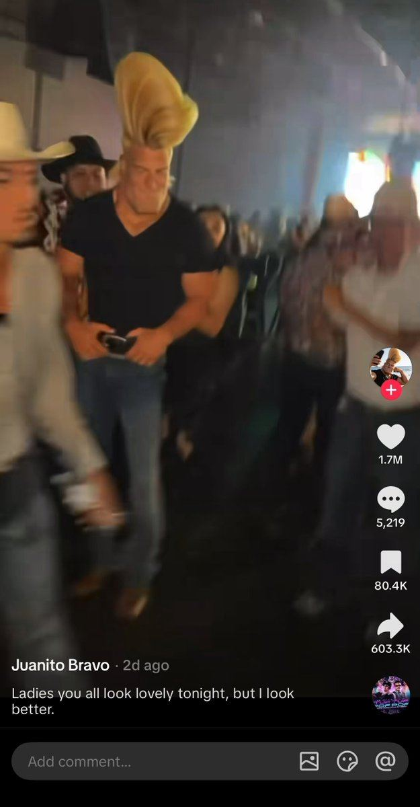

# 112 · AI character motion-swap reel

<!-- HERO:START -->
[](EXAMPLE.md)

**[See the example and how to make it →](EXAMPLE.md)** · [watch on X](https://x.com/kelmruns/status/2107508612058747114)
<!-- HERO:END -->


> **LC priority P3** · evidence: Medium, earnings disputed · hype risk: High · cost $1-10 · 15-30 min · ⚠️ IP, likeness and AI-disclosure risk

## What it is
A 10-15 second vertical reel of **one instantly recognisable AI character** (an exaggerated silhouette: two black braids and blunt bangs, a two-foot blonde quiff, a mushroom bowl cut in a grey suit, a short guy with a huge moustache) **dropped into motion that already went viral**: a known dance in a plain white room, a DJ booth at a sold-out show, a cowboy bar, a parking-lot dance between two tall creators. The motion comes from a reference clip and the character is swapped in with a video model (Seedance 2.5 in every example). The caption is either **hashtags only** or **one ego line** ("quick DJ set", "ladies you all look lovely tonight, but i look better", "praise your short king", "same soul, upgraded version"). The account posts the same character every day, so it becomes a recurring character page (F21) built at AI speed.

The pipeline @kelmruns lists, five times over:
1. Generate the character in ChatGPT image ("GPT Astra 6" in his posts): one exaggerated, readable feature.
2. Pick the stage: a dance everyone knows, the biggest stage you can find, or a crowd that reacts.
3. Swap the character into the clip with Seedance 2.5 (motion and camera stay, the person changes).
4. Caption it as the character: hashtags only, or one deadpan line.

## Why it works
- **Proven motion, new face.** The dance or stage already earned retention, and the novelty of the character resets pattern recognition (Voynov's "odd visuals" hook, Adam Taylor's subconscious filter: movement + face + broken pattern).
- **A silhouette you can read on mute in 0.5 s.** Every winner has one absurd feature (braids, quiff, bowl cut, height gap).
- **Same character daily = a parasocial page.** People follow a character, not a video, which lets the pages sell "talk with me" subscriptions, courses or brand deals.
- **Cost per post is near zero**, so pages can test 5-10 characters a week.

## Shot-by-shot (LC version: "Goldie", a disclosed LC AI muse, 12 s)
| Time | Visual | Audio / copy |
|---|---|---|
| 0-1 s | Goldie (original character: sleek platinum bob, oversized gold hoops, a stack of 7 LC pieces) in a plain white room, mid-move | Trending sound (licensed in-app) |
| 1-10 s | She performs a trend dance recorded **by our own LC creator** (consented, paid) and swapped with Seedance; the stack catches the light on every arm move | — |
| 10-12 s | She ends on a wrist shot to camera; small corner label "AI character" | Caption: "#goldie #7for85 #waterproofjewelry" or "she never takes it off 💧" |

## Hooks (swap-in openers)
- A trend dance everyone already knows (motion reference you own or licensed)
- "Quick [shower / swim / gym] set" with the character wearing the stack through it
- "same soul, upgraded version" glow-up with the character's own fictional backstory (disclosed)
- The character between two of **your own** creators (height or style contrast)

## Real examples from X (studied)
- **@kelmruns, Oct 2026 (all numbers the poster's own, unverified):**
  - Wednesday-lookalike: "a pale girl with two black braids and blunt bangs like Wednesday from Netflix… a plain white room and the dance everyone already knows… caption it with hashtags only", 67.4M views, 1M followers, sells "talk with me" subscriptions ([post](https://x.com/kelmruns/status/2108656084890349694)).
  - Mushroom-bowl-cut DJ in a grey suit "behind the decks at a sold-out show", "quick DJ set", 9.9M views; his creator sells a "make your own AI character" course ([post](https://x.com/kelmruns/status/2108258506801299744)).
  - Short king between two characters that already went viral, empty parking-lot dance, "praise your short king", 3.9M views, 47K followers ([post](https://x.com/kelmruns/status/2107886356496097561)).
  - Gym bro with a giant blonde quiff in a cowboy bar, a bowling alley and on a lawn mower, "ladies you all look lovely tonight, but i look better", 26K followers and 2.2M likes in 48 h ([post](https://x.com/kelmruns/status/2107508612058747114), 216K views, 710 bookmarks).
  - "Two-faced" twins: a fake 2006 baby photo, then a glow-up mirror selfie, "same soul, upgraded version", 1.8M likes, 823K followers, a $14,500 brand deal ([post](https://x.com/kelmruns/status/2107165250868937035)).
- **What the replies say:** "fresh accounts aren't monetised", "botted", and "clips under a minute don't monetise on TikTok", so treat the dollar figures as marketing for the poster's own content. Several replies point out the Wednesday character is Netflix IP.

<!-- K4 -->
## Same template, second account: @k4zxbt (Oct 3-9, 2026)
A second account posts **the identical template** (same "> generate… > pick… > swap with Seedance 2.5 > caption it like…" bullets, the same "GPT Astra" name-drop, a dollar figure in every post, and a "someone will sell you this as a $199 course" line). Two accounts with one script reads like a coordinated promo network, so treat every view, follower and dollar number as marketing. The mechanics are still worth stealing:
- **The height-contrast rule:** "put a guy a foot shorter next to her so the height reads in 1 second" ([post](https://x.com/k4zxbt/status/2106461236179107862)). Giant Tokyo girl squatting through tunnels and trains, "giant woman struggles in Japan tunnels": 23.6M views claimed, **821 bookmarks, the most of any post in this wave** ([post](https://x.com/k4zxbt/status/2106342154452779278)); a 7 ft girl next to a 6 ft guy with "fake heights stamped on screen", "can a woman be taller than the man?" ([post](https://x.com/k4zxbt/status/2107156912840007859)); a tall girl on a tiny motorbike, "i guess we need a bigger one" ([post](https://x.com/k4zxbt/status/2106836434883637576)).
- **"The weirder the character, the faster the account grows":** conjoined twins in boring places (bedroom, gas station, school gym), "do you think it's because of our situation??" ([post](https://x.com/k4zxbt/status/2106690716109885936), 169K views on X).
- **Creepy-meme remake:** two identical girls in long black dresses dancing arms-out under one street lamp, so the shadows stretch 10 feet, captioned only with a slowed song; "98K saves… the creepy niche is still wide open" ([post](https://x.com/k4zxbt/status/2108659775206756837)).
- **Brand variant, the impossible trickshot:** "your local pub is an AI influencer now": a small-town bar's account posts an 8-ball that jumps three pints of Guinness, "8ball pool trickshot", 10.4M views claimed ([post](https://x.com/k4zxbt/status/2108240597421084694)). Same idea in sport: two footballers kicking Xs and Os onto a giant tic-tac-toe screen ([post](https://x.com/k4zxbt/status/2107893943044309097)). **This is the variant a brand can own:** no persona, just an impossible moment with the product or venue as the set piece, captioned like it's normal.
- **The character-sheet prompt** ([post](https://x.com/k4zxbt/status/2107546499294941235)) is a clean XML brief: `<task>` one photoreal studio reference sheet · `<character>` age, height, face, hair, "adult proportions" · `<wardrobe>` identical in every view · `<layout>` top row 5 full-body angles, bottom row 3 portraits · `<consistency>` "no face drift, stretched legs, extra limbs" · `<photography>` grey seamless, soft light, no beauty-filter smoothing. ⚠️ His version says "use the attached Elina image as the identity reference", which clones a real person's face. **Do not copy.** Use the structure for an original LC character only.

**LC script D (brand trickshot, disclosed):** a gold ring flicked off the edge of a pool, skimming across the water and landing on a swimmer's finger, captioned "normal tuesday at the pool 💍" with the AI label on. Keep it obviously fantastical, so it never reads as a product-performance claim.
<!-- /K4 -->

## Production recipe
1. **Character bible:** one original character (never a lookalike of a real person or a franchise character) with one absurd, readable feature, plus how she wears LC (always the same 7-piece stack).
2. **Motion library:** film your own creators doing 10 trend dances and moves in a white room (paid, signed release that covers AI motion transfer). Don't take motion from other people's videos.
3. **Swap:** character image + your motion clip → Seedance 2.5 (or Kling motion control); check that the jewelry renders accurately (count the pieces, gold tone, no melting links).
4. **Caption:** hashtags only or one deadpan line in the character's voice; turn on the platform's AI-generated label.
5. **Post daily** from one brand-owned, disclosed account; reply in character.

## Bot prompt (copy into the creative agent)
```
Design an ORIGINAL AI character for <BRAND> (not resembling any real person, celebrity or franchise character). Give: name, one exaggerated readable feature, outfit, and exactly how the product appears in every shot. Then plan 10 reels: for each, the motion reference (from our own consented creator library), setting (plain white room / big stage / crowd), a 10-15 s beat sheet, the caption (hashtags only or one deadpan line in character), and an AI-disclosure label. Flag any shot where the product could render inaccurately.
```

## 3 LC scripts
- A · **"Goldie" white-room trend dance**: the stack shines on every arm move → "#7for85".
- B · **"quick swim set"**: Goldie dances on a dock and jumps into the sea, then comes up with the stack still gold → "she never takes it off 💧".
- C · **Glow-up, disclosed**: a sketch of Goldie "2019" → Goldie "2026" with the full stack, "same soul, upgraded jewelry" (no fake baby photos of real people).

## Variants to test
- Hashtag-only versus one-line ego caption
- White room versus big stage versus crowd reaction
- Character alone versus character between two real LC creators
- Organic page only versus Spark-boosting the top reel to a TOF audience

## Omni test plan
- **Budget/structure:** organic, 1 reel/day for 21 days on one disclosed brand-owned account; Spark the top 2 by 3-s hold at $30/day
- **Primary KPIs:** 3-s hold, average watch %, follows per 1K views, profile → link clicks; Omni new-customer % on `utm_content=F112-*`
- **Kill rule:** < 5 follows per 10K views after 14 posts → retire the character
- **Scale rule:** a character that wins gets an F21 series and a merch/LC "Goldie stack" bundle
- **Naming:** `utm_content=F112-<character>-<motion>`

## Compliance
Baseline: [_COMPLIANCE.md](../_COMPLIANCE.md).
- **Do not copy:** lookalikes of franchise characters (the Wednesday example is Netflix IP) or of real people; swapping a character into someone else's viral video (their motion, likeness and audio are not ours); fake "2006 baby photos" presented as real; undisclosed AI personas selling "talk with me" subscriptions; earnings screenshots as proof.
- Label every reel as AI-generated (TikTok and Meta AI labels) and say in the bio that the character is AI.
- The jewelry must render exactly as sold. If the model distorts it, composite the real product photo or don't post.
- Paid boosts need the branded-content toggle and the AI label.

## Related
- Strategies: 24-niche-character-account-network, 33-animated-brand-character-ads, 37-ai-realism-craft, 43-48h-trend-hijacking
- Formats: [21-recurring-ai-character-mascot](../21-recurring-ai-character-mascot/README.md), [20-ai-model-lookbook-on-body](../20-ai-model-lookbook-on-body/README.md), [85-persona-aesthetic-slideshow-caption-template](../85-persona-aesthetic-slideshow-caption-template/README.md), [05-ai-animation-format-swap](../05-ai-animation-format-swap/README.md)
