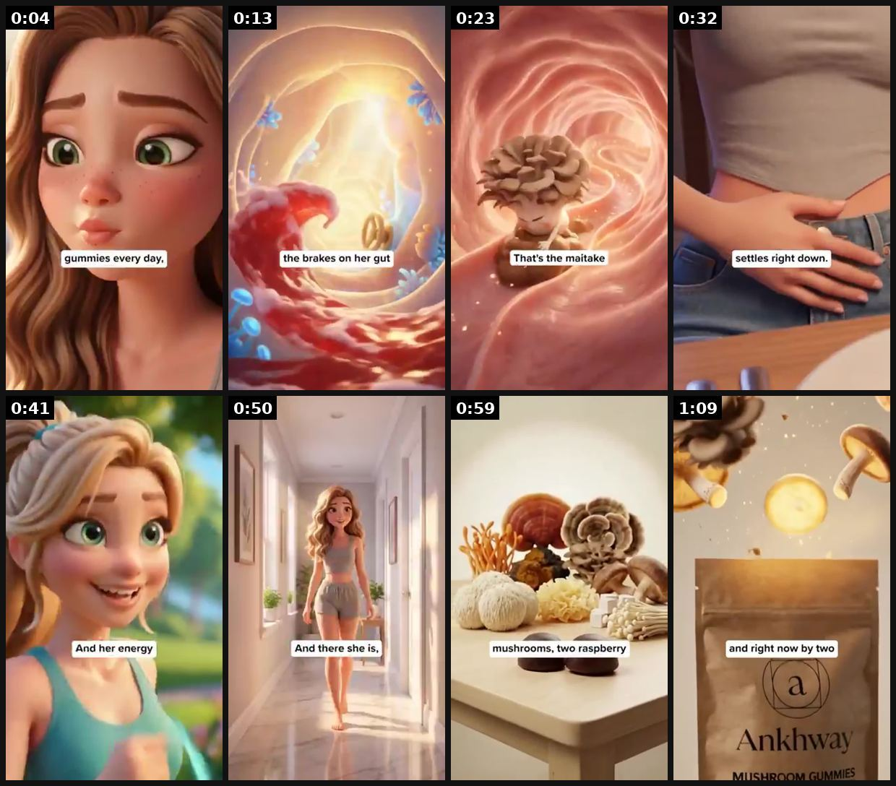

# 12 · What happens if you…" week-by-week timeline (30-second funnel): see it, then make it

[](https://x.com/tryatria_AI/status/2106069700950294836)

**The example:** [@tryatria_AI on X](https://x.com/tryatria_AI/status/2106069700950294836) · 1:13 video · 221 likes, 18K views

**Watch it:** [open the post on X](https://x.com/tryatria_AI/status/2106069700950294836) · [play the video file](https://video.twimg.com/amplify_video/2106024421463052288/vid/avc1/320x568/DbR6b2rio1aTVFz4.mp4?tag=29)

> 👀 THIS AD IS BASICALLY A 30-SECOND SALES FUNNEL 🚨 It starts with an INSANE hook: “what happens if you only poop twice a week?” Then it turns the product into a 4-week storyline. Week 1 → things start moving Week 2 → regularity Week 3 → bloat drops Week 4 → energy + clarity Every week gives you a new reason to keep watching. And the genius part: The mushrooms aren’t the story. The transformation is. The product gets i…

## What you are seeing

A Pixar-style girl character in a timeline story about 75 seconds long. A provocative opening, then week-by-week scenes (bloating, a swirling gut visual, ingredients on a table), ending on the product pouch (Ankhwa). Captions mark each week.

## Beat by beat

The storyboard above samples the video every 0:09. Lines are the transcript for that stretch; on-screen text comes from OCR, so treat it as rough.

| Frame | Time | On screen | Said / sung |
|---|---|---|---|
| 1 | 0:00–0:09 | PP every day, | If a woman who only goes to the toilet twice a week, took two mushroom gummies every day, this is what would happen. Week 1. Something that's been sitting there for months, finally starts to shift. |
| 2 | 0:09–0:18 | the brakes on her gut | That's the reishi, calming the cortisol that's slammed the brakes on her gut, so it can relax and actually start working again. Week 2. |
| 3 | 0:18–0:27 | · | What's been stuck, finally starts to move, and she's going properly for the first time in months. That's the mitake, waking her gut back up and clearing out the waste that's |
| 4 | 0:27–0:36 | settles right down. ie | been backed up. Week 3. The bloat she assumed was just her body, settles right down. That's the charger, calming the inflammation and rebuilding the gut lining that's been |
| 5 | 0:36–0:46 | · | worn away. Week 4. A fog she didn't even know she was living in lifts, and her energy comes flooding back. That's the lion's mane, repairing the nerve pathways between her gut and her brain, |
| 6 | 0:46–0:55 | · | and the cordyceps flooding her cells with oxygen. And there she is. The version of you who goes every morning without a second thought, light, comfortable, |
| 7 | 0:55–1:04 | a 2, a ma mushrooms, two raspberry fF | herself again. 10 functional mushrooms, 2 raspberry gummies a day. The only brand that combines all 10 is Anque. |
| 8 | 1:04–1:13 | · | Over 200,000 women use it. 60 day money back guarantee, and right now, buy 2, get 1 free. Links below. |

<details><summary>Full transcript (timestamped)</summary>

- `0:00` If a woman who only goes to the toilet twice a week, took two mushroom gummies every day,
- `0:04` this is what would happen.
- `0:06` Week 1.
- `0:07` Something that's been sitting there for months, finally starts to shift.
- `0:10` That's the reishi, calming the cortisol that's slammed the brakes on her gut, so it
- `0:14` can relax and actually start working again.
- `0:17` Week 2.
- `0:18` What's been stuck, finally starts to move, and she's going properly for the first
- `0:21` time in months.
- `0:22` That's the mitake, waking her gut back up and clearing out the waste that's
- `0:27` been backed up.
- `0:28` Week 3.
- `0:29` The bloat she assumed was just her body, settles right down.
- `0:32` That's the charger, calming the inflammation and rebuilding the gut lining that's been
- `0:36` worn away.
- `0:37` Week 4.
- `0:38` A fog she didn't even know she was living in lifts, and her energy comes flooding back.
- `0:43` That's the lion's mane, repairing the nerve pathways between her gut and her brain,
- `0:47` and the cordyceps flooding her cells with oxygen.
- `0:51` And there she is.
- `0:52` The version of you who goes every morning without a second thought, light, comfortable,
- `0:57` herself again.
- `0:58` 10 functional mushrooms, 2 raspberry gummies a day.
- `1:01` The only brand that combines all 10 is Anque.
- `1:04` Over 200,000 women use it.
- `1:06` 60 day money back guarantee, and right now, buy 2, get 1 free.
- `1:10` Links below.

</details>

## How to make one like it

**Contents:** [1. Structure](#1-copy-the-structure) · [2. Shot by shot](#2-shot-by-shot-remake) · [3. Script and hooks](#3-write-the-script) · [4. Prompts](#4-prompts) · [5. Tools and settings](#5-tools-and-settings) · [6. Louise Carter remake](#6-louise-carter-remake) · [7. Variants and test](#7-variants-and-test-plan) · [8. Pitfalls](#8-pitfalls)

### 1. Copy the structure

Use the example's timing as your beat sheet. Keep the beat, change the words and the product.

| Beat | Time | In the example | Your version |
|---|---|---|---|
| 1 | 0:04 | If a woman who only goes to the toilet twice a week, took two mushroom gummies every day, this is what would happen. Week 1. Something that' | … |
| 2 | 0:13 | That's the reishi, calming the cortisol that's slammed the brakes on her gut, so it can relax and actually start working again. Week 2. | … |
| 3 | 0:23 | What's been stuck, finally starts to move, and she's going properly for the first time in months. That's the mitake, waking her gut back up | … |
| 4 | 0:32 | been backed up. Week 3. The bloat she assumed was just her body, settles right down. That's the charger, calming the inflammation and rebuil | … |
| 5 | 0:41 | worn away. Week 4. A fog she didn't even know she was living in lifts, and her energy comes flooding back. That's the lion's mane, repairing | … |
| 6 | 0:50 | and the cordyceps flooding her cells with oxygen. And there she is. The version of you who goes every morning without a second thought, ligh | … |
| 7 | 0:59 | herself again. 10 functional mushrooms, 2 raspberry gummies a day. The only brand that combines all 10 is Anque. | … |
| 8 | 1:09 | Over 200,000 women use it. 60 day money back guarantee, and right now, buy 2, get 1 free. Links below. | … |

### 2. Shot-by-shot remake

**Target length / size:** 30-75s, 1080x1920

| # | Time / slot | What we see (visual + camera) | Dialogue / on-screen text |
|---|---|---|---|
| 1 | 0-3s | Provocative hook over a character close-up (real or Pixar-style) | "What happens if you never take your necklace off for 30 days?" |
| 2 | Week 1 | Small, believable change; caption "WEEK 1" | "Week 1: I forgot I was wearing it." |
| 3 | Week 2 | Real situation (shower, gym) | "Week 2: shower, gym, sea. Still gold." |
| 4 | Week 3 | Social proof moment | "Week 3: two people asked where it's from." |
| 5 | Week 4 | Result + product | "Week 4: it looks like day one." + offer |

<details><summary>Playbook shot list (Louise Carter version from the README)</summary>

0-3s provocative question hook ("what happens if you only poop twice a week?") → Week 1 / Week 2 / Week 3 / Week 4 each one beat of result → offer. ([@tryatria_AI](https://x.com/tryatria_AI/status/2106069700950294836)). Also "Day 1 skeptical… Day 7 automatic… Day 30…" (FedotOff90 example transcript).

</details>

### 3. Write the script

Then fill the beats from the table above. Pull the wording from real customer reviews, not from ad copy: a review line beats a copywriter line almost every time. Read every line out loud and cut anything you would not say to a friend. Ready-made Louise Carter scripts are in section 6; hand [BOT.md](BOT.md) to any AI agent to write versions for another brand.

### 4. Prompts

**Pixar-style frames (Midjourney)**

```text
3D animated style woman, warm Pixar lighting, standing in a steamy bathroom touching her gold necklace, week 2 of a story, consistent character --cref [ref] --ar 9:16
```

### 5. Tools and settings

Real creator 30-day diary (best) or AI animated (F05). Metric hold to 75%, CPA, Omni.

| Setting | Value |
|---|---|
| Canvas | 1080×1920 (9:16) master; crop a 1080×1350 (4:5) cut for feed placements |
| Frame rate | 30 fps (shoot 60 fps for slow-motion water or sparkle shots) |
| Camera | Phone main lens at 1x, exposure locked on skin, HDR off, grid on; tripod or a phone clamp for product shots |
| Light | One soft key at 45° (window or ring light), white card as fill; side light for metal sparkle |
| Audio | Lavalier or phone 15–20 cm from the mouth; mix voice at -14 LUFS, music at -28 to -30 dB under voice |
| Captions | Burned in, 2–5 words per line, 64–80 px bold sans, white with a black stroke or pill; keep text inside the safe zone (top 220 px and bottom 420 px clear, 64 px side margins) |
| Pacing | A visual change every 1.5–3 s; the hook lands in the first 1.5 s with no logo intro |
| Edit / export | CapCut or Premiere; H.264, 12–20 Mbps, AAC 320 kbps; upload natively to each platform, not via links |

### 6. Louise Carter remake

A. "What happens if you never take your necklace off for 30 days?" Day 1 shower (nervous) · Day 7 gym sweat · Day 14 ocean · Day 30 "still gold, and three people asked where it's from".
B. "What happens if you wear the same 3 pieces every day for a month?" Week 1 decision fatigue gone · Week 2 'signature look' compliments · Week 4 "people think it's real gold" → "it's 14K PVD".
C. 2nd-person cinematic: "You took your rings off at the beach. You put them in your shoe…" escalation → loss → "or wear ones you never take off."

Brand rules, claims you can and cannot make, and more scripts: [brands/louise-carter.md](brands/louise-carter.md). Step-by-step from idea to scale: [STAGES.md](STAGES.md).

### 7. Variants and test plan

**Test plan:** Real creator 30-day diary (best) or AI animated (F05). Metric hold to 75%, CPA, Omni.

**Naming:** `F12-<variant>-<hook##>-<date>` so results map back to this folder. Change one thing per test (hook, narrator, length or offer), never two.

### 8. Pitfalls

- Keep week 1 small; a huge week-1 result destroys believability.
- Every week claim must match what the product really does; no invented testimonials.
- Label AI visuals.
- Slow open: if the first 1.5 s does not show the hook visually, most people swipe.
- Logo or brand intro at the start reads as an ad; put the brand at the end.
- Captions covered by the platform UI: check the safe zone on a real phone before posting.
- Music over the voice: keep music at least 14 dB under speech.

**Compliance:** [_COMPLIANCE.md](../_COMPLIANCE.md). Diary claims only if actually performed.

## Field notes

Newer observations live in the playbook: [Wave 2d update: Resilia's animated "what happens if" timelines](README.md)

## More examples

Every post we found for this format, with transcripts: [examples/](examples/README.md). Playbook: [README.md](README.md). Agent brief: [BOT.md](BOT.md).
