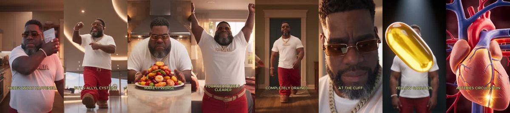
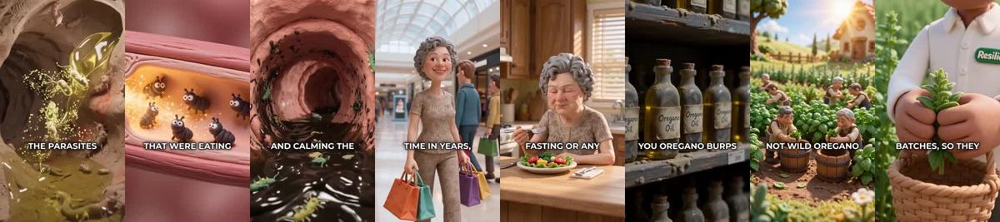
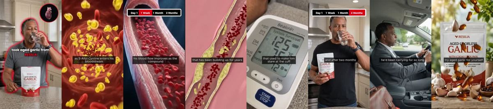

# Meta ad-library examples for F12

<!-- WAVE6 -->
## Wave 6: Resilia & Smooche live Meta ads (Oct 2026)

Pulled from the public Meta Ad Library on 2026-10-09 (Resilia: aged garlic, Ceylon cinnamon, oil of oregano; Smooche: color-changing foundation, Reverse Time peptide serum). Days live are counted to 2026-10-09; most video ads were new tests that week, while the long runners are statics and catalog templates. Transcripts are automatic. Brand claims are the advertisers', not verified, and many are health claims we would never make. The **Do not copy** line flags deceptive tactics (persona "publication" pages, undisclosed AI actors and "experts", fake stock counts).

### Resilia · Vascular Wellness Report: “A-Blood pressure took a lot of pressure on the blood pressure for two…” (10 days live)

- **Ad:** [Meta Ad Library #923507560536401](https://www.facebook.com/ads/library/?id=923507560536401) · video 2:26 · page “Vascular Wellness Report” · started 2026-09-28 · 1 copies · lands on `amazon.com/dp/B0GZJBZZY2`
- **What happens:** Opens: “A-Blood pressure took a lot of pressure on the blood pressure for two months. Here's what happened, day one.”
- **Why it works:** Skeleton and timeline explainers ("What happens if you don't clean out your arteries… Day one… Year five") turn an invisible process into a visible progression, and the product interrupts the timeline.
- **How to make one:** Narrate time stamps (day 1, week 2, month 3, year 5) over 3D or skeleton visuals and cut to the product at the turning point. Keep claims to what is documented.
- **Do not copy:** The health timelines include unsupported disease claims ("flushes calcium off artery walls"). Do not copy the claims.
- **LC remake:** "What happens to cheap jewelry: day 1 shiny, week 2 dull, month 1 green finger" vs LC at month 12.

Transcript (auto, first ~70 s)

> A-Blood pressure took a lot of pressure on the blood pressure for two months. Here's what happened, day one. You take two resilient, garlic soft-jaws in the morning. Nothing looks different yet. The gut is still there. Your knees still feel stiff. Your blood pressure may show the same number.

### Resilia · Ancient Remedy Co: “Here's what happens to your belly pooch if you it wild oregano oil…” (1 day live)

- **Ad:** [Meta Ad Library #1719588042474913](https://www.facebook.com/ads/library/?id=1719588042474913) · video 3:49 · page “Ancient Remedy Co” · started 2026-10-07 · 2 copies · lands on `resilia.shop/products/resilia-oil-of-oregano-softgels`
- **What happens:** Opens: “Here's what happens to your belly pooch if you it wild oregano oil every single day for eight weeks week one you don't feel a thing and you figure you got scammed another supplement that does nothing…”
- **Why it works:** Skeleton and timeline explainers ("What happens if you don't clean out your arteries… Day one… Year five") turn an invisible process into a visible progression, and the product interrupts the timeline.
- **How to make one:** Narrate time stamps (day 1, week 2, month 3, year 5) over 3D or skeleton visuals and cut to the product at the turning point. Keep claims to what is documented.
- **Do not copy:** The health timelines include unsupported disease claims ("flushes calcium off artery walls"). Do not copy the claims.
- **LC remake:** "What happens to cheap jewelry: day 1 shiny, week 2 dull, month 1 green finger" vs LC at month 12.

Transcript (auto, first ~70 s)

> Here's what happens to your belly pooch if you it wild oregano oil every single day for eight weeks week one you don't feel a thing and you figure you got scammed another supplement that does nothing you almost stop don't inside the oregano oil is already killing the parasites in bad bacteria that have been living in your gut rent free for years you just can't feel it yet week two the first thing you notice you eat dinner and your stomach doesn't blow up like a balloon afterward that tight swollen feeling that makes five months pregnant by 8 p.m. every single night is gone the stuff that's been sitting in your gut fermenting and puffing you up for years is finally moving out week three you make it through the afternoon without wanting to chew a lot of it no crash at 2 p.m. no dragging yourself through dinner That's because the parasites that we're eating your food before you could digest it are dead your body is actually absorbing what you eat for the first time in years week four you pull on a pair of jeans from the back of your closet the ones you kept because you kept telling yourself one day they button the lower belly pooch that's been sitting there since your second kid is softening up and going down that wasn

### Resilia · Arterial Health Review: “What happens if you don if you don't clean out your arteries once they…” (1 day live)

- **Ad:** [Meta Ad Library #1466736258705803](https://www.facebook.com/ads/library/?id=1466736258705803) · video 2:41 · page “Arterial Health Review” · started 2026-10-07 · 1 copies · lands on `resilia.shop/products/resilia-aged-odorless-garlic`
- **What happens:** Opens: “What happens if you don if you don't clean out your arteries once they start to clog? Day one, you feel completely normal, exactly like you have for years, but inside it has already begun.”
- **Why it works:** Skeleton and timeline explainers ("What happens if you don't clean out your arteries… Day one… Year five") turn an invisible process into a visible progression, and the product interrupts the timeline.
- **How to make one:** Narrate time stamps (day 1, week 2, month 3, year 5) over 3D or skeleton visuals and cut to the product at the turning point. Keep claims to what is documented.
- **Do not copy:** The health timelines include unsupported disease claims ("flushes calcium off artery walls"). Do not copy the claims.
- **LC remake:** "What happens to cheap jewelry: day 1 shiny, week 2 dull, month 1 green finger" vs LC at month 12.

Transcript (auto, first ~70 s)

> What happens if you don if you don't clean out your arteries once they start to clog? Day one, you feel completely normal, exactly like you have for years, but inside it has already begun. Cholesterol and calcium are starting to settle against your artery walls. You cannot feel a thing. That is what makes it so dangerous. Year one, the build-up is thickening, the pipes are narrowing. Your blood cannot carry oxygen and nutrients the way it used to, so your energy starts to drop. You blame it on age. It is the beginning. Year two, now your blood pressure is high. You are tired all the time. Your arteries have gone stiff, and your heart has to slam harder and harder just to push the blood through walls the walls that are almost completely blocked. The damage is no longer quiet. Year five, one ordinary morning, making coffee, climbing the stairs, tying your shoes, the artery finally closes. No warning, that is the heart attack. that is the stroke, that is the moment it all ends. In front of the people who love you, years before you, you can you the heart.

### Resilia · Arterial Health Review: “A black man with high blood pressure took aged garlic from Resilia for…” (1 day live)

- **Ad:** [Meta Ad Library #1571570448322674](https://www.facebook.com/ads/library/?id=1571570448322674) · video 0:48 · page “Arterial Health Review” · started 2026-10-07 · 9 copies · lands on `resilia.shop/products/resilia-aged-odorless-garlic`
- **What happens:** Opens: “A black man with high blood pressure took aged garlic from Resilia for two months. Here's what happened.”
- **Why it works:** Skeleton and timeline explainers ("What happens if you don't clean out your arteries… Day one… Year five") turn an invisible process into a visible progression, and the product interrupts the timeline.
- **How to make one:** Narrate time stamps (day 1, week 2, month 3, year 5) over 3D or skeleton visuals and cut to the product at the turning point. Keep claims to what is documented.
- **Do not copy:** The health timelines include unsupported disease claims ("flushes calcium off artery walls"). Do not copy the claims.
- **LC remake:** "What happens to cheap jewelry: day 1 shiny, week 2 dull, month 1 green finger" vs LC at month 12.

Transcript (auto, first ~70 s)

> A black man with high blood pressure took aged garlic from Resilia for two months. Here's what happened. After one day, his arteries begin to relax as S.L.A.L. cysteine enters his bloodstream and starts switching hydro production back on at the source. After one week, his blood flow improves as the compound starts scraping the calcium off his artery walls and melting the cholesterol that has been building up for years After one month, his home on the heart of the heart started to look different. Less of those spikes that used to make him stare at the cuff. His face less flushed in the mirror, the pressure behind his eyes easing up and after two months, his readings have settled into a range that feels familiar again. He moves through his day without the weight he'd been carrying for so long. Resilia is 30% off and comes with a 30-day money-back guarantee. Try aged garlic only for yourself. Click to learn more.

### Resilia · Arterial Health Review: “This is what happens When a 50 year old man Who struggles to get it up…” (1 day live)

- **Ad:** [Meta Ad Library #989376137527402](https://www.facebook.com/ads/library/?id=989376137527402) · video 2:04 · page “Arterial Health Review” · started 2026-10-07 · 1 copies · lands on `resilia.shop/products/garlic-blood-flow`
- **What happens:** Opens: “This is what happens When a 50 year old man Who struggles to get it up takes age garlic for 30 days A day one nothing dramatic He still can't please his wife He starts feelin' scammed Day seven He…”
- **Why it works:** Skeleton and timeline explainers ("What happens if you don't clean out your arteries… Day one… Year five") turn an invisible process into a visible progression, and the product interrupts the timeline.
- **How to make one:** Narrate time stamps (day 1, week 2, month 3, year 5) over 3D or skeleton visuals and cut to the product at the turning point. Keep claims to what is documented.
- **Do not copy:** The health timelines include unsupported disease claims ("flushes calcium off artery walls"). Do not copy the claims.
- **LC remake:** "What happens to cheap jewelry: day 1 shiny, week 2 dull, month 1 green finger" vs LC at month 12.

Transcript (auto, first ~70 s)

> This is what happens When a 50 year old man Who struggles to get it up takes age garlic for 30 days A day one nothing dramatic He still can't please his wife He starts feelin' scammed Day seven He wakes up before the alarm And notices something he hasn't felt in a long time When he would Also he's like tired even after his super busy day Day 14 His wife features for him He gets hard,they change positions And this time He doesn't lose it No panic,no racing to finish before his body quits No lying there after what wondering what happened to the man he used to be Day 21 He starts initiating again He reaches for first He stays present instead of monitoring himself every second His wife doesn't know what's changed She just knows he's hard and he stays hard For the first time in years He feels like she has her husband back day 30 He doesn't wonder if he'll be able to perform anymore When he's not thinking

<!-- /WAVE6 -->

<!-- WAVE4 -->
## Wave 4: Alex Fedotoff's October 2026 swipe boards (GetHookd public previews)

Each ad below is from the free 10-ad preview of a public GetHookd board that [@FedotOff90](https://x.com/FedotOff90) shared on X. Days live are as of 2026-10-09; brand claims are the advertisers', not verified.

### Feel Mighty: "Car chats" one-month update yapper (gifted, then hooked) (341 days live)

- **Board:** [Yapper Ads (raw talking-head UGC) - Oct 2026](https://x.com/FedotOff90/status/2108196484403663180) · video 103 s
- **What happens:** "Welcome to a new episode of car chats… I have been taking the mighty mushroom gummies for over a month now… initially these were sent to me as PR." 103 s.
- **Why it lasts:** 341 days. The update format gives time-based proof, and admitting it was PR adds honesty.
- **How to make one:** A recurring creator series name, a dated update ("over a month now"), disclosure of gifting, and what changed.
- **LC remake:** "Car chats: 30 days of never taking my LC set off."

