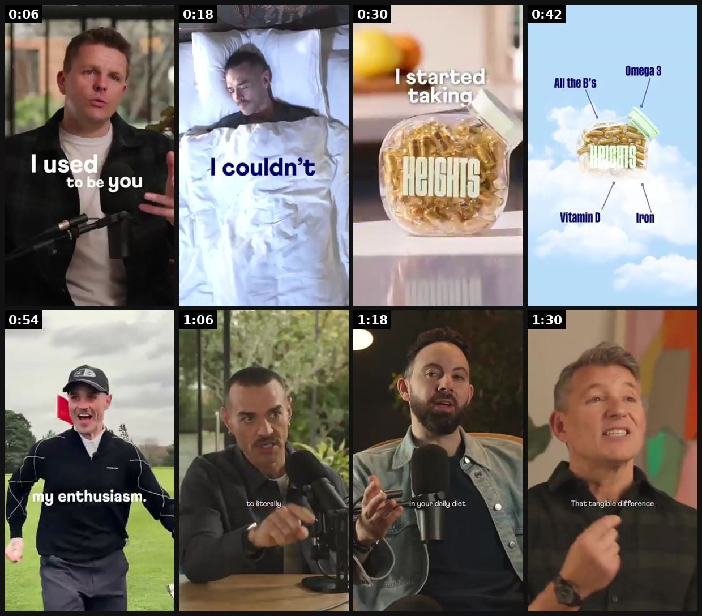
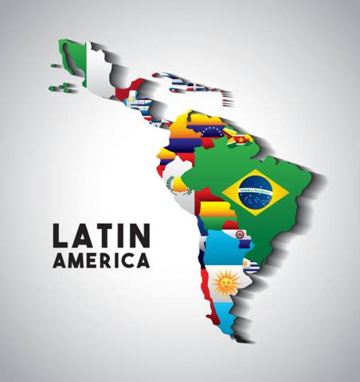
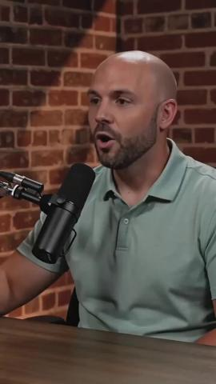
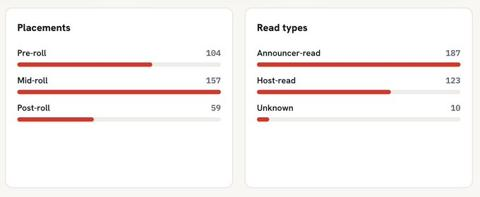

# 13 · Podcast-style ad (two mics, conversation clip): see it, then make it

[](https://x.com/tryatria_AI/status/2097763972325745046)

**The example:** [@tryatria_AI on X](https://x.com/tryatria_AI/status/2097763972325745046) · 1:36 video · 62 likes, 3K views

**Watch it:** [open the post on X](https://x.com/tryatria_AI/status/2097763972325745046) · [play the video file](https://video.twimg.com/amplify_video/2097703692212559872/vid/avc1/320x568/DhtJlwMeR5ylp5_4.mp4?tag=29)

> Podcast ads might be the most underrated performance creative format right now. 👀 Heights is quietly proving it. And there’s a really interesting reason they work. 👀 They’re not trying to make a podcast ad feel like an ad. They’re taking real conversations about energy, sleep, focus + getting older and turning the strongest moments into performance creative. The winning pattern: 🎙️ Story 🧠 Problem 💡 Product discovery…

## What you are seeing

Podcast-studio cuts: men at mics delivering lines with big captions ("I used to be you", "I couldn't"), cutaways to the Heights supplement tub ("I started taking") and an ingredients card, then several different hosts. It looks like clipped podcast content, not an ad.

## Beat by beat

The storyboard above samples the video every 0:12. Lines are the transcript for that stretch; on-screen text comes from OCR, so treat it as rough.

| Frame | Time | On screen | Said / sung |
|---|---|---|---|
| 1 | 0:00–0:12 | · | I'm 64, I feel bloody fantastic, and this is my secret. I used to be you. I was lost about what to take. I tried everything to help me. I spent decades researching. Every supplement under the sun. |
| 2 | 0:12–0:24 | · | Therapy, medication. So many different pills and potions. There were times when I couldn't be present. I couldn't switch my brain off. I'm fucking exhausted. I was incredibly skeptical. |
| 3 | 0:24–0:36 | · | That was just gonna be me forever. Everything felt like it was falling apart. Until. Until. Until. Until. I started taking heights. This. This. This. Has truly. Been a game changer. |
| 4 | 0:36–0:48 | All the B’s a3 NH vitamin Iron | Inside just two capsules, you get 20 key nutrients. Like omega-3, all the bees, plus iron and vitamin D. There's no fluff, there's no confusion, just science-backed results that I can actually feel. |
| 5 | 0:48–1:00 | Es ie tA By | Heights has been absolutely invaluable to me, just with regards to managing my energy, my recovery, my sleep, my enthusiasm. Unbelievable. Started taking two a day, and I noticed a real increase in focus and energy. |
| 6 | 1:00–1:12 | Ww ae 1. en Pao a | I went from waking up 14 times, averagely per night, sleep and recovery being on the floor, to literally just taking heights, and now asleep like a baby. Why did I have 20 tablets when you've managed to get |
| 7 | 1:12–1:24 | ay in your daily diet. Sa. le | everyone in these capsules? I mean, what actually is in this thing? These 20 essential nutrients are everything you might need in your daily diet. If you have a perfect diet, you actually don't need to take them. If you're busy like us, these are an essential insurance policy |
| 8 | 1:24–1:36 | · | to feeling your best. My energy has gone from spiking and crashing to being stable all day long. That tangible difference is really clear, and it's really powerful. |

<details><summary>Full transcript (timestamped)</summary>

- `0:00` I'm 64, I feel bloody fantastic, and this is my secret.
- `0:05` I used to be you. I was lost about what to take.
- `0:07` I tried everything to help me.
- `0:09` I spent decades researching.
- `0:11` Every supplement under the sun.
- `0:12` Therapy, medication.
- `0:13` So many different pills and potions.
- `0:15` There were times when I couldn't be present.
- `0:17` I couldn't switch my brain off.
- `0:19` I'm fucking exhausted.
- `0:21` I was incredibly skeptical.
- `0:23` That was just gonna be me forever.
- `0:25` Everything felt like it was falling apart.
- `0:27` Until.
- `0:27` Until.
- `0:28` Until.
- `0:29` Until.
- `0:29` I started taking heights.
- `0:31` This.
- `0:31` This.
- `0:32` This.
- `0:33` Has truly.
- `0:34` Been a game changer.
- `0:35` Inside just two capsules, you get 20 key nutrients.
- `0:39` Like omega-3, all the bees, plus iron and vitamin D.
- `0:42` There's no fluff, there's no confusion,
- `0:44` just science-backed results that I can actually feel.
- `0:47` Heights has been absolutely invaluable to me,
- `0:49` just with regards to managing my energy,
- `0:51` my recovery, my sleep, my enthusiasm.
- `0:54` Unbelievable.
- `0:55` Started taking two a day,
- `0:56` and I noticed a real increase in focus and energy.
- `1:00` I went from waking up 14 times,
- `1:02` averagely per night,
- `1:03` sleep and recovery being on the floor,
- `1:05` to literally just taking heights,
- `1:07` and now asleep like a baby.
- `1:09` Why did I have 20 tablets
- `1:10` when you've managed to get
- `1:12` everyone in these capsules?
- `1:13` I mean, what actually is in this thing?
- `1:15` These 20 essential nutrients
- `1:17` are everything you might need in your daily diet.
- `1:18` If you have a perfect diet,
- `1:20` you actually don't need to take them.
- `1:21` If you're busy like us,
- `1:22` these are an essential insurance policy
- `1:25` to feeling your best.
- `1:26` My energy has gone from spiking and crashing
- `1:28` to being stable all day long.
- `1:30` That tangible difference is really clear,
- `1:32` and it's really powerful.

</details>

## More real examples (4)

Other posts that show this format, or a close cousin of it. Click a thumbnail to open it on X.

| | | |
|---|---|---|
| [](https://x.com/HenryCrochemore/status/2089291503919087933)<br>**@HenryCrochemore** · 1:11 video · 4K views<br>ai podcast ads might be one of the easiest ways to make ugc feel native again instead of generating another creator holding a product put them behind | [](https://x.com/CEO_Vlad/status/2081473127985582384)<br>**@CEO_Vlad** · image · 4K views<br>take AI podcast ads like this and go run them in latin america... barely anyone is running the podcast format in spanish, so the feed there hasn't see | [](https://x.com/itsLORDROY/status/2079061186008760542)<br>**@itsLORDROY** · 0:15 video · 3K views<br>Podcast ads are entering a new era. The most impressive part isn't that this is AI generated. It's that this entire podcast ad was made inside Claude |
| [](https://x.com/adreads_ai/status/2083709698059206725)<br>**@adreads_ai** · image · 17 views<br>Podcast ads data for August 1 320 new podcast ad reads across 183 sponsors and 56 shows 187 announcer read, 123 host read Most active sponsors: @Shane |   |   |

## How to make one like it

**The format in one line:** Two people at podcast mics, warm studio, captions; clip starts mid-conversation with a strong opinion; host asks the question the viewer has; guest explains; product mentioned naturally. "They're not trying to make a podcast ad feel like an ad" ([@tryatria_AI](https://x.com/tryatria_AI/status/2097763972325745046)). "Best format for anything that needs explaining" ([@CEO_Vlad](https://x.com/CEO_Vla

**Contents:** [1. Structure](#1-copy-the-structure) · [2. Shot by shot](#2-shot-by-shot-remake) · [3. Script and hooks](#3-write-the-script) · [4. Prompts](#4-prompts) · [5. Tools and settings](#5-tools-and-settings) · [6. Louise Carter remake](#6-louise-carter-remake) · [7. Variants and test](#7-variants-and-test-plan) · [8. Pitfalls](#8-pitfalls)

### 1. Copy the structure

Use the example's timing as your beat sheet. Keep the beat, change the words and the product.

| Beat | Time | In the example | Your version |
|---|---|---|---|
| 1 | 0:06 | I'm 64, I feel bloody fantastic, and this is my secret. I used to be you. I was lost about what to take. I tried everything to help me. I sp | … |
| 2 | 0:18 | Therapy, medication. So many different pills and potions. There were times when I couldn't be present. I couldn't switch my brain off. I'm f | … |
| 3 | 0:30 | That was just gonna be me forever. Everything felt like it was falling apart. Until. Until. Until. Until. I started taking heights. This. Th | … |
| 4 | 0:42 | Inside just two capsules, you get 20 key nutrients. Like omega-3, all the bees, plus iron and vitamin D. There's no fluff, there's no confus | … |
| 5 | 0:54 | Heights has been absolutely invaluable to me, just with regards to managing my energy, my recovery, my sleep, my enthusiasm. Unbelievable. S | … |
| 6 | 1:06 | I went from waking up 14 times, averagely per night, sleep and recovery being on the floor, to literally just taking heights, and now asleep | … |
| 7 | 1:18 | everyone in these capsules? I mean, what actually is in this thing? These 20 essential nutrients are everything you might need in your daily | … |
| 8 | 1:30 | to feeling your best. My energy has gone from spiking and crashing to being stable all day long. That tangible difference is really clear, a | … |

### 2. Shot-by-shot remake

**Target length / size:** 30-90s clip, 1080x1920 (podcast set framed for vertical)

| # | Time / slot | What we see (visual + camera) | Dialogue / on-screen text |
|---|---|---|---|
| 1 | 0-3s | Mid-conversation, guest at mic, warm studio (two SM7B-style mics, bookshelf, lamp) | Starts on a strong opinion: "Most gold jewelry is a scam, honestly." |
| 2 | 3-15s | Host reaction shot | Host asks the viewer's question: "Wait, what do you mean?" |
| 3 | 15-45s | Guest explains, cutaways to product B-roll / diagram | The mechanism in plain words (plating vs PVD bond) |
| 4 | 45-60s | Both laugh / agree | Product named once, naturally |
| 5 | End | Caption card | "Full episode" or offer |

### 3. Write the script

Then fill the beats from the table above. Pull the wording from real customer reviews, not from ad copy: a review line beats a copywriter line almost every time. Read every line out loud and cut anything you would not say to a friend. Ready-made Louise Carter scripts are in section 6; hand [BOT.md](BOT.md) to any AI agent to write versions for another brand.

### 4. Prompts

**Real shoot**

```text
2 cameras (wide + guest close-up) at 4K 30fps, 2 dynamic mics, warm practical lights at 3200K, record 20 minutes of real conversation and cut 10 clips.
```

**AI version (Veo 3 / HeyGen podcast)**

```text
two people at podcast microphones in a cozy studio, warm lamp light, natural conversation, guest speaking "[line]", 8s, vertical framing
```

### 5. Tools and settings

Real: rent a podcast studio 2h → 15 clips. Metric: hold, CPA, Omni. Founder face also feeds organic (strategy 31).

| Setting | Value |
|---|---|
| Canvas | 1080×1920 (9:16) master; crop a 1080×1350 (4:5) cut for feed placements |
| Frame rate | 30 fps (shoot 60 fps for slow-motion water or sparkle shots) |
| Camera | Phone main lens at 1x, exposure locked on skin, HDR off, grid on; tripod or a phone clamp for product shots |
| Light | One soft key at 45° (window or ring light), white card as fill; side light for metal sparkle |
| Audio | Lavalier or phone 15–20 cm from the mouth; mix voice at -14 LUFS, music at -28 to -30 dB under voice |
| Captions | Burned in, 2–5 words per line, 64–80 px bold sans, white with a black stroke or pill; keep text inside the safe zone (top 220 px and bottom 420 px clear, 64 px side margins) |
| Pacing | A visual change every 1.5–3 s; the hook lands in the first 1.5 s with no logo intro |
| Edit / export | CapCut or Premiere; H.264, 12–20 Mbps, AAC 320 kbps; upload natively to each platform, not via links |

### 6. Louise Carter remake

A. Host: "Okay hot take — gold-plated jewelry is a scam." Qirra: "Most of it, yes. Here's the difference…" (PVD explained, swim test anecdote).
B. Stylist guest: "The one jewelry rule I give every client: three pieces you never take off." Host: "Which three?" → LC stack.
C. "Why do women buy their own jewelry now?" — self-purchase trend chat, ends with "build your own 7".

Brand rules, claims you can and cannot make, and more scripts: [brands/louise-carter.md](brands/louise-carter.md). Step-by-step from idea to scale: [STAGES.md](STAGES.md).

### 7. Variants and test plan

**Test plan:** Real: rent a podcast studio 2h → 15 clips. Metric: hold, CPA, Omni. Founder face also feeds organic (strategy 31).

**Naming:** `F13-<variant>-<hook##>-<date>` so results map back to this folder. Change one thing per test (hook, narrator, length or offer), never two.

### 8. Pitfalls

- Clips that start at the beginning of a thought are boring; start mid-sentence.
- A fake podcast with fake "experts" is deceptive; use a real person or label AI and avoid credentials.
- Burn in captions; 80% watch muted.
- Slow open: if the first 1.5 s does not show the hook visually, most people swipe.
- Logo or brand intro at the start reads as an ad; put the brand at the end.
- Captions covered by the platform UI: check the safe zone on a real phone before posting.
- Music over the voice: keep music at least 14 dB under speech.

**Compliance:** [_COMPLIANCE.md](../_COMPLIANCE.md). Guest credentials real; AI podcast hosts must be labelled and must not claim to be real experts.

## Field notes

Newer observations live in the playbook: [Wave 2c update: the 5 podcast "seats" (Fedotoff AI Podcast Ads Vol. 03)](README.md) · [Wave 2d update: doctor-style podcast in supplement accounts](README.md)

## More examples

Every post we found for this format, with transcripts: [examples/](examples/README.md). Playbook: [README.md](README.md). Agent brief: [BOT.md](BOT.md).
