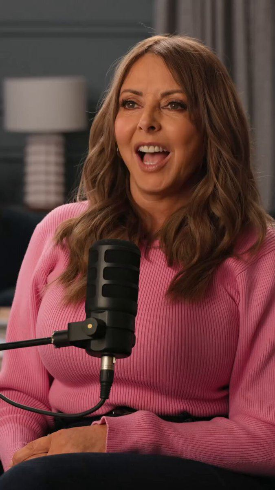

# 13 · Podcast-style ad

<!-- HERO:START -->

**[See the example and how to make it →](EXAMPLE.md)** · [watch on X](https://x.com/tryatria_AI/status/2097763972325745046)
<!-- HERO:END -->

## Looks like
Two people at podcast mics, warm studio, captions; clip starts mid-conversation with a strong opinion; host asks the question the viewer has; guest explains; product mentioned naturally. "They're not trying to make a podcast ad feel like an ad" ([@tryatria_AI](https://x.com/tryatria_AI/status/2097763972325745046)). "Best format for anything that needs explaining" ([@CEO_Vlad](https://x.com/CEO_Vlad/status/2096569603761827953)).

## LC scripts
A. Host: "Okay hot take — gold-plated jewelry is a scam." Qirra: "Most of it, yes. Here's the difference…" (PVD explained, swim test anecdote).
B. Stylist guest: "The one jewelry rule I give every client: three pieces you never take off." Host: "Which three?" → LC stack.
C. "Why do women buy their own jewelry now?" — self-purchase trend chat, ends with "build your own 7".

## Production/test
Real: rent a podcast studio 2h → 15 clips. Metric: hold, CPA, Omni. Founder face also feeds organic (strategy 31).

## Compliance
[_COMPLIANCE.md](../_COMPLIANCE.md). Guest credentials real; AI podcast hosts must be labelled and must not claim to be real experts.

## Wave 2c update: the 5 podcast "seats" (Fedotoff AI Podcast Ads Vol. 03)
- **Champion's Seat** (guest is the success story), **Myth Flip**, **Overheard Confession**, **Insider Leak**, **Host Reaction**. Zapply ran three seats; one survived.
- An AI podcast ad (Pure Rhythm) hit 280 days live, the longest-running ad in the 37-formats swipe. Winners share one rule: the guest never sells; the host asks the doubting question and the guest just answers it. 157 podcast-style ads on [board](https://app.gethookd.ai/share/board/257492?signature=ff80879e9b64d9721b290055b90aeab29e214ce9f5f2c9753c1a85414a9dd80d). Doc: [AI Podcast Ads](https://rural-lifeboat-196.notion.site/3addb9d7074d8137bd78e08a7961e3aa).

## Wave 2d update: doctor-style podcast in supplement accounts
- Lymphoria's format mix leans on "doctor-style podcast" + expert UGC overlay + medical AI animation (Felipe Gomes audit). Resilia board previews show a headset "expert" podcast cut into product demos with a "70% SALE, HUGE SAVINGS" end card.
- LC: a real jeweller or materials scientist as the guest; the host asks the skeptic's question ("why does my gold turn green?").

<!-- EVIDENCE:START -->
## Evidence from X discovery (auto-generated)

| Date | Author | Post | Engagement | Grade | Gist |
|---|---|---|---|---|---|
| 2026-09-06 | [@CEO_Vlad](https://x.com/CEO_Vlad) | [link](https://x.com/CEO_Vlad/status/2096569603761827953) | 88L/169BM/5kV | VALUE | AI UGC formats tiered: S = podcast, talking head, in-car... |
| 2026-09-09 | [@tryatria_AI](https://x.com/tryatria_AI) | [link](https://x.com/tryatria_AI/status/2097763972325745046) | 62L/74BM/3kV | VALUE | Heights podcast ads: don't feel like ads, underrated performance format. |
| 2026-09-28 | [@lorenzo_pravata](https://x.com/lorenzo_pravata) | [link](https://x.com/lorenzo_pravata/status/2104536224488738839) | 150L/196BM/10kV | VALUE | "Ads that don't look like ads": podcast clips, street interviews, skits with studio actors; pet brand $29K→$150K/mo spend in 60 days, CPA $188→$124. |
| 2026-09-08 | [@LachezarVoynov](https://x.com/LachezarVoynov) | [link](https://x.com/LachezarVoynov/status/2097351286094021034) | 86L/102BM/10kV | VALUE | $300k/mo strategy: wrappers that became top spenders = skits, carpool ads, Suno songs, AI Pixar-character podcasts; hooks must target different people. |
<!-- EVIDENCE:END -->
