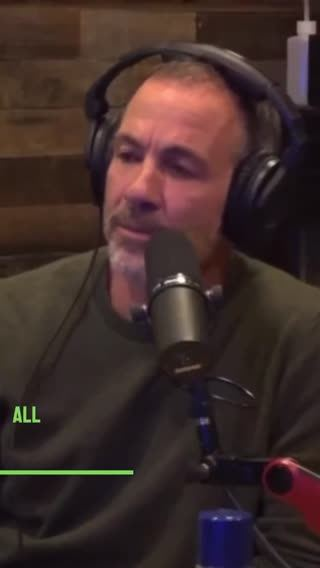
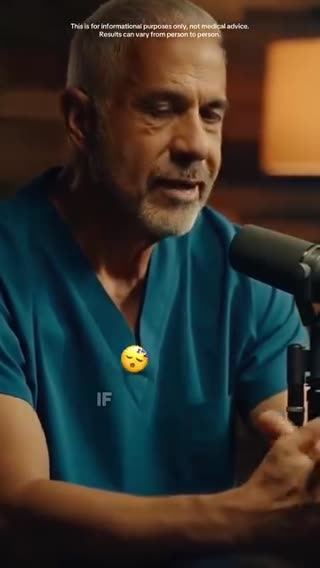

# Meta ad-library examples for F13

<!-- WAVE4 -->
## Wave 4: Alex Fedotoff's October 2026 swipe boards (GetHookd public previews)

Each ad below is from the free 10-ad preview of a public GetHookd board that [@FedotOff90](https://x.com/FedotOff90) shared on X. Days live are as of 2026-10-09; brand claims are the advertisers', not verified.

### Cellular Performance Institute: Celebrity-style podcast set clip (stem cells) (731 days live)

- **Board:** [Podcast-Style Ads — Ecom (mic/interview format)](https://x.com/FedotOff90/status/2101063012471951797) · video 47 s
- **What happens:** A Rogan-style podcast studio with headphones and mics; a guest talks about "mesenchymal stem cells… from a woman's umbilical cord". 47 s with captions.
- **Why it lasts:** 731 days, the longest in the board. The podcast set means "this is a conversation, not an ad".
- **How to make one:** A podcast set (2 mics, headphones, dark backdrop), the host asks one doubting question, and the guest answers with a mechanism. No direct sell.
- **LC remake:** A podcast clip: "Is 14K PVD actually real gold?" A host-and-jeweler conversation.

### BioRoot Labs: Podcast-plus-doctor stitched explainer (turmeric) (345 days live)

- **Board:** [AI Storytelling Ads: 13 Brands x 50 Longest-Running (Oct 2026)](https://x.com/FedotOff90/status/2107177846070202853) · dco 129 s
- **What happens:** A woman on a podcast mic, turmeric close-ups, then a doctor with "Doctor-Formulated" and a "What do you think?" overlay. 129 s DCO with 32 media.
- **Why it lasts:** 345 days. It mixes podcast credibility with doctor stitches; 32 media variations of one idea.
- **How to make one:** A podcast host intro, ingredient b-roll, an expert stitch, a CTA; build many DCO variants.
- **LC remake:** A stylist podcast clip plus a jeweler stitch.

### Pure Rhythm: "Content may go offline" podcast clip (weight loss) (326 days live)

- **Board:** [Podcast-Style Ads — Ecom (mic/interview format)](https://x.com/FedotOff90/status/2101063012471951797) · video 117 s
- **What happens:** "If you want to go from size L to size S, you need to hear this… three essential ingredients that the industry does everything to hide from you… share this with your friend because this content may go offline at any moment." 117 s.
- **Why it lasts:** 326 days, with 437 brand ads. It uses suppression and urgency framing ("may go offline").
- **How to make one:** A podcast guest, a secret framed as "what they hide", a share prompt. Use it carefully (it reads as hype).
- **LC remake:** Skip the suppression angle for LC.

### Pure Rhythm: Menopause reframe podcast (hair / energy) (326 days live)

- **Board:** [Podcast-Style Ads — Ecom (mic/interview format)](https://x.com/FedotOff90/status/2101063012471951797) · video 101 s
- **What happens:** "When your period stops, your brain literally cuts off the signal to your ovaries… that's the moment you need to say, no, I'm not going to waste away at 50. I still have 30 years ahead." 101 s.
- **Why it lasts:** 326 days. Identity and defiance ("not going to waste away") for women 50+.
- **How to make one:** An empowering reframe of the life stage, then the mechanism, then the product.
- **LC remake:** "At 50 I stopped buying jewelry that hides. I buy pieces I live in."

### Pure Rhythm: Tough-love podcast rant ("women over 40 who still don't know this") (324 days live)

- **Board:** [Podcast-Style Ads — Ecom (mic/interview format)](https://x.com/FedotOff90/status/2101063012471951797) · video 84 s
- **What happens:** "I can't believe… woman over 40 who still doesn't know this… waking up wrecked, bloated, drained… I'm not angry. I'm just tired of watching people suffer because no one tells them the truth. Magnesium is the foundation…" 84 s.
- **Why it lasts:** 324 days. Tough-love anger reads as honest (as in Fedotoff's reflux case), and a symptom list gives the viewer self-recognition.
- **How to make one:** An older male expert on a podcast set, a frustrated tone, a 6-symptom list, one ingredient as the foundation.
- **LC remake:** "I'm tired of watching women ruin their skin with cheap plated jewelry."

### Dr. Lisa Downing: "Men's health researcher" podcast (prostate DHT) (267 days live)

- **Board:** [Podcast-Style Ads — Ecom (mic/interview format)](https://x.com/FedotOff90/status/2101063012471951797) · video 54 s
- **What happens:** "As a men's health researcher, I study why the prostate swells… This is what most men over 40 get wrong about nighttime urination… Block DHT at the source… 3,000 mg cold-pressed pumpkin seed oil with saw palmetto." 54 s. Dr. Lisa Downing page, 1,357 ads.
- **Why it lasts:** 267 days. A persona "researcher" plus one mechanism (DHT) plus one dose number; the page runs 1,357 ads across personas.
- **How to make one:** A persona expert title (not "MD"), "what most [avatar] get wrong", the mechanism, the dose, the result.
- **LC remake:** "What most women get wrong about gold-plated jewelry."

