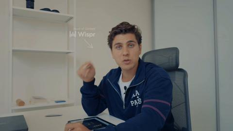
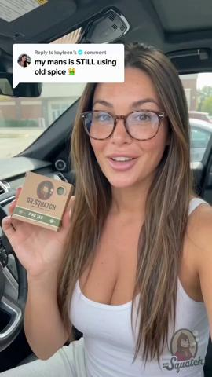
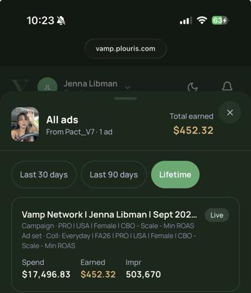

# 14 · In-car / "yapper" confession talking head: see it, then make it

[](https://x.com/contentbyroxy/status/2100991855441666519)

**The example:** [@contentbyroxy on X](https://x.com/contentbyroxy/status/2100991855441666519) · 0:36 video · 5 likes, 310 views

**Watch it:** [open the post on X](https://x.com/contentbyroxy/status/2100991855441666519) · [play the video file](https://video.twimg.com/amplify_video/2100991374493380609/vid/avc1/320x568/11Ic5VinUzWFz4Y7.mp4?tag=29)

> TALKING HEAD UGC EXAMPLE 👇🏽 We love a good car talk! I’ve worked with this app at least 20+ times, and this is one of the things I’m always paying attention to when creating talking-head content. You’ve gotta sprinkle in those believability crumbs. 👀 You don’t always need to throw something in the air, swing the product around, or do something dramatic to create a visual hook. Sometimes, it’s as simple as adding a LI…

## What you are seeing

A creator filming herself in the driver's seat with the sunroof open, talking fast and casually to the phone, with sunglasses on for the sign-off. It is one continuous car-talk monologue with captions.

## Beat by beat

The storyboard above samples the video every 0:04. Lines are the transcript for that stretch; on-screen text comes from OCR, so treat it as rough.

| Frame | Time | On screen | Said / sung |
|---|---|---|---|
| 1 | 0:00–0:04 | · | card declining the most embarrassing thing. Everyone knows it's a tough time |
| 2 | 0:04–0:09 | · | right now. The economy feels like it's the worst it's ever been but still I |
| 3 | 0:09–0:13 | · | don't need to hold up a line at the grocery store while everyone sees me |
| 4 | 0:13–0:18 | · | trying out all my cards praying one will go through. Anyways I was tired of |
| 5 | 0:18–0:22 | · | living that life so I started using Bri. I saw an ad and I was ready to try |
| 6 | 0:22–0:27 | · | anything at this point. I got approved approved for $320 in minutes which shocked me because my credit scores still recovering from when I was laid |
| 7 | 0:27–0:31 | · | off last year. The best part there is no interest there's no credit checks or |
| 8 | 0:31–0:36 | · | lathees. If you're tired of your card declining, download Bri today. |

<details><summary>Full transcript (timestamped)</summary>

- `0:00` card declining the most embarrassing thing. Everyone knows it's a tough time
- `0:04` right now. The economy feels like it's the worst it's ever been but still I
- `0:09` don't need to hold up a line at the grocery store while everyone sees me
- `0:12` trying out all my cards praying one will go through. Anyways I was tired of
- `0:17` living that life so I started using Bri. I saw an ad and I was ready to try
- `0:21` anything at this point. I got approved approved for $320 in minutes which
- `0:24` shocked me because my credit scores still recovering from when I was laid
- `0:28` off last year. The best part there is no interest there's no credit checks or
- `0:32` lathees. If you're tired of your card declining, download Bri today.

</details>

## More real examples (6)

Other posts that show this format, or a close cousin of it. Click a thumbnail to open it on X.

| | | |
|---|---|---|
| [](https://x.com/hectorserrranoo/status/2107526350605070475)<br>**@hectorserrranoo** · 2:06 video · 15K views<br>Wispr Flow paid UGC program: what companies get wrong. | [](https://x.com/hectorserrranoo/status/2106136430556672384)<br>**@hectorserrranoo** · 0:56 video · 8K views<br>Panel: you're nothing without your creators (Comfrt: 10 creators = big share of revenue). | [](https://x.com/CEO_Vlad/status/2082092962348167273)<br>**@CEO_Vlad** · 0:38 video · 9K views<br>"yapper girl in car" is such a good AI UGC format... used it this to scale my ecom brand to $200k days this format is beating every studio shot creati |
| [](https://x.com/jennamediaco/status/2106209597526540312)<br>**@jennamediaco** · image · 1K views<br>Simple in-car talking head ad scaling: car = organic, story throughout. | [](https://x.com/tiffanyxugc/status/2097636391798854069)<br>**@tiffanyxugc** · 0:42 video · 159 views<br>#ugcexample of a yapper style script read in the car, edited by their team 🍬 I had creative freedom to take this script &amp; make it my own which mak | [](https://x.com/houseofjenUGC/status/2087571793452118181)<br>**@houseofjenUGC** · 0:54 video · 145 views<br>Talking head in the car example! Yapping UGC as a mom ugc creator Hello@houseofjenugc.com https://t.co/4hlMiWlhlS |

## How to make one like it

**The format in one line:** Creator in a parked car (or walking), phone propped, talking fast and personal: "I couldn't even wait to go inside to tell you." One continuous story, light jump cuts, captions. Why it works ([@jennamediaco](https://x.com/jennamediaco/status/2106209597526540312)): car looks organic, a story the whole time, feels private and unscripted.

**Contents:** [1. Structure](#1-copy-the-structure) · [2. Shot by shot](#2-shot-by-shot-remake) · [3. Script and hooks](#3-write-the-script) · [4. Prompts](#4-prompts) · [5. Tools and settings](#5-tools-and-settings) · [6. Louise Carter remake](#6-louise-carter-remake) · [7. Variants and test](#7-variants-and-test-plan) · [8. Pitfalls](#8-pitfalls)

### 1. Copy the structure

Use the example's timing as your beat sheet. Keep the beat, change the words and the product.

| Beat | Time | In the example | Your version |
|---|---|---|---|
| 1 | 0:02 | card declining the most embarrassing thing. Everyone knows it's a tough time | … |
| 2 | 0:06 | right now. The economy feels like it's the worst it's ever been but still I | … |
| 3 | 0:11 | don't need to hold up a line at the grocery store while everyone sees me | … |
| 4 | 0:15 | trying out all my cards praying one will go through. Anyways I was tired of | … |
| 5 | 0:20 | living that life so I started using Bri. I saw an ad and I was ready to try anything at this point. I got approved approved for $320 in minu | … |
| 6 | 0:24 | anything at this point. I got approved approved for $320 in minutes which shocked me because my credit scores still recovering from when I w | … |
| 7 | 0:29 | shocked me because my credit scores still recovering from when I was laid off last year. The best part there is no interest there's no credi | … |
| 8 | 0:34 | lathees. If you're tired of your card declining, download Bri today. | … |

### 2. Shot-by-shot remake

**Target length / size:** 20-60s, 1080x1920, one continuous take with jump cuts

| # | Time / slot | What we see (visual + camera) | Dialogue / on-screen text |
|---|---|---|---|
| 1 | 0-2s | Creator in a parked car, phone on dash mount at eye level, daylight from the windscreen | "I couldn't even wait to get inside to tell you this." |
| 2 | 2-30s | Same framing, jump cuts every 3-6s to remove pauses | Fast, personal story with one specific detail per line |
| 3 | 30-45s | She shows the product to camera (pulls necklace out of her collar) | Proof: "I've worn this in the ocean all week" |
| 4 | End | Sunglasses on / starts the car | "link's in my bio, bye" |

### 3. Write the script

Then fill the beats from the table above. Pull the wording from real customer reviews, not from ad copy: a review line beats a copywriter line almost every time. Read every line out loud and cut anything you would not say to a friend. Ready-made Louise Carter scripts are in section 6; hand [BOT.md](BOT.md) to any AI agent to write versions for another brand.

### 4. Prompts

**Shoot spec**

```text
iPhone front camera, 1080p 30fps, phone mount on the dash, engine off, windows closed for clean audio, face lit by daylight (park facing the sun).
```

### 5. Tools and settings

Brief 10 creators via Trybe/creator network (strategy 28) with 3 story prompts; allow improvisation; run as Partnership ads. Metric CPA; Omni new-customer.

| Setting | Value |
|---|---|
| Canvas | 1080×1920 (9:16) master; crop a 1080×1350 (4:5) cut for feed placements |
| Frame rate | 30 fps (shoot 60 fps for slow-motion water or sparkle shots) |
| Camera | Phone main lens at 1x, exposure locked on skin, HDR off, grid on; tripod or a phone clamp for product shots |
| Light | One soft key at 45° (window or ring light), white card as fill; side light for metal sparkle |
| Audio | Lavalier or phone 15–20 cm from the mouth; mix voice at -14 LUFS, music at -28 to -30 dB under voice |
| Captions | Burned in, 2–5 words per line, 64–80 px bold sans, white with a black stroke or pill; keep text inside the safe zone (top 220 px and bottom 420 px clear, 64 px side margins) |
| Pacing | A visual change every 1.5–3 s; the hook lands in the first 1.5 s with no logo intro |
| Edit / export | CapCut or Premiere; H.264, 12–20 Mbps, AAC 320 kbps; upload natively to each platform, not via links |

### 6. Louise Carter remake

A. "I just got out of the pool at my sister's and she goes 'you're swimming in your jewelry??' and I'm like… yes? Let me show you…"
B. "I'm sitting in the parking lot of my ex's wedding. Don't ask. But I wore the stack. [shows] Seven pieces, eighty-five dollars, and I feel like a million."
C. "Confession: I've told everyone this necklace was a gift. I bought it myself. Here's why I'm not sorry."

Brand rules, claims you can and cannot make, and more scripts: [brands/louise-carter.md](brands/louise-carter.md). Step-by-step from idea to scale: [STAGES.md](STAGES.md).

### 7. Variants and test plan

**Test plan:** Brief 10 creators via Trybe/creator network (strategy 28) with 3 story prompts; allow improvisation; run as Partnership ads. Metric CPA; Omni new-customer.

**Naming:** `F14-<variant>-<hook##>-<date>` so results map back to this folder. Change one thing per test (hook, narrator, length or offer), never two.

### 8. Pitfalls

- Never film while driving; parked only.
- Over-scripted lines kill the "yapper" feel; give the creator bullet points, not a script.
- Disclose paid partnerships (#ad / Paid partnership label).
- Slow open: if the first 1.5 s does not show the hook visually, most people swipe.
- Logo or brand intro at the start reads as an ad; put the brand at the end.
- Captions covered by the platform UI: check the safe zone on a real phone before posting.
- Music over the voice: keep music at least 14 dB under speech.

**Compliance:** [_COMPLIANCE.md](../_COMPLIANCE.md). Paid partnership label; stories must be the creator's genuine use.

## Field notes

Newer observations live in the playbook: [Wave 2b update (2026-10-08) — yappers are printing](README.md) · [Wave 3 update: brands & apps crushing it (Oct 2026)](README.md) · [Wave 4 update: Fedotoff October 2026 swipe boards](README.md)

## More examples

Every post we found for this format, with transcripts: [examples/](examples/README.md). Playbook: [README.md](README.md). Agent brief: [BOT.md](BOT.md).
