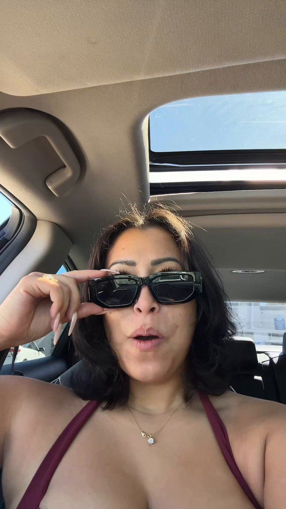

# 14 · In-car / yapper confession

<!-- HERO:START -->

**[See the example and how to make it →](EXAMPLE.md)** · [watch on X](https://x.com/contentbyroxy/status/2100991855441666519)
<!-- HERO:END -->

## Looks like
Creator in a parked car (or walking), phone propped, talking fast and personal: "I couldn't even wait to go inside to tell you." One continuous story, light jump cuts, captions. Why it works ([@jennamediaco](https://x.com/jennamediaco/status/2106209597526540312)): car looks organic, a story the whole time, feels private and unscripted.

## LC scripts
A. "I just got out of the pool at my sister's and she goes 'you're swimming in your jewelry??' and I'm like… yes? Let me show you…"
B. "I'm sitting in the parking lot of my ex's wedding. Don't ask. But I wore the stack. [shows] Seven pieces, eighty-five dollars, and I feel like a million."
C. "Confession: I've told everyone this necklace was a gift. I bought it myself. Here's why I'm not sorry."

## Production/test
Brief 10 creators via Trybe/creator network (strategy 28) with 3 story prompts; allow improvisation; run as Partnership ads. Metric CPA; Omni new-customer.

## Compliance
[_COMPLIANCE.md](../_COMPLIANCE.md). Paid partnership label; stories must be the creator's genuine use.

## Wave 2b update (2026-10-08) — yappers are printing
- **Spend proof:** RolyPoly yapper ads — $154.5k spent in a single day across 1,635 ads; single ads at **$45.1k** and **$33.1k**/day; hook rates 44-62%, hold rates 31-48% (Ads Manager screenshot, [@harrydelmege_](https://x.com/harrydelmege_/status/2106794963006861535)).
- **Swipe file:** 299 live yapper ads in one public GetHookd board "Yapper Ads (raw talking-head UGC) - Oct 2026" ([@FedotOff90](https://x.com/FedotOff90/status/2108198291242676622)). The board loads its cards client-side and stayed on loading placeholders in a headless browser, so individual ads weren't extracted. Open it logged-in or via the GetHookd API to mine hooks.
- **What a yapper is (vs. this file's in-car version):** one person talking fast and uncut to a phone camera — car, kitchen, walk — for 30-90s on ONE thing the product does, with no B-roll needed. Same LC scripts apply; also brief the swarm (F43) for kitchen/bathroom-counter yappers.
- **LC test add-on:** 10 yapper creators × 3 stories → Partnership ads; scale any ad that holds >35% hook rate and CPA ≤ target (benchmarks above).

<!-- EVIDENCE:START -->
## Wave 3 update: brands & apps crushing it (Oct 2026)
- "Yapper girl in car" AI UGC is reported as the format behind $200K days for an ecom brand, beating every studio shot ([@CEO_Vlad](https://x.com/CEO_Vlad/status/2082092962348167273)). Seed, Grüns, Arrae and Primal Queen all run yapper ads: one person, voice-memo style, almost no cuts, no music, product at ~75% ([@philhippoflynn](https://x.com/philhippoflynn/status/2081808221426397302)).

## Wave 4 update: Fedotoff October 2026 swipe boards
- Luxmend: Test-it-live yapper ("we're gonna see if this actually works"), 528 days live (Yapper Ads board). "I won't cut the video" is a proof promise, and the doubt at the start ("I want to know if this is gonna just take off random hair") buys trust.
- Kristina's Fashion Essentials: "I'll be so disappointed if this doesn't work" lash-test yapper, 382 days live (Yapper Ads board). The stakes are set before the demo, and "everyone says" is borrowed social proof.
- BioRoot Labs: Ingredient-nerd yapper (turmeric percentages), 381 days live (Yapper Ads board). A comparison with "store bought" is the enemy, and the specific numbers make it believable.
- Nothora: In-car storytime yapper (gossip hook), 350 days live (Yapper Ads board). Story first, so the viewer stays for the gossip and the product rides along.
- Feel Mighty: "Car chats" one-month update yapper (gifted, then hooked), 341 days live (Yapper Ads board). The update format gives time-based proof, and admitting it was PR adds honesty.
- Mariella Gut Health Expert: "Gross embarrassing story time" gut yapper (Mariella Gut Health Expert), 320 days live (Yapper Ads board). It's a confession, not a pitch.
- HappySupp: Girlfriend-voice men's multivitamin (HappySupp), 378 days live (Winning Men's Health / Testosterone Ads board). Primal framing told by the partner; the partner's voice is the proof.
- Stills, how-to and LC remakes: [adlibrary/](adlibrary/README.md).

## Evidence from X discovery (auto-generated)

| Date | Author | Post | Engagement | Grade | Gist |
|---|---|---|---|---|---|
| 2026-10-06 | [@hectorserrranoo](https://x.com/hectorserrranoo) | [link](https://x.com/hectorserrranoo/status/2107526350605070475) | 210L/251BM/15kV | VALUE | Wispr Flow paid UGC program: what companies get wrong. |
| 2026-09-16 | [@ZoeyBennettAi](https://x.com/ZoeyBennettAi) | [link](https://x.com/ZoeyBennettAi/status/2100341794777227769) | 137L/7BM/23kV | SOME | 'Product pitch that looks like a confession' is the format of 2026. |
| 2026-10-02 | [@hectorserrranoo](https://x.com/hectorserrranoo) | [link](https://x.com/hectorserrranoo/status/2106136430556672384) | 97L/83BM/7kV | VALUE | Panel: you're nothing without your creators (Comfrt: 10 creators = big share of revenue). |
| 2026-09-06 | [@CEO_Vlad](https://x.com/CEO_Vlad) | [link](https://x.com/CEO_Vlad/status/2096569603761827953) | 88L/169BM/5kV | VALUE | AI UGC formats tiered: S = podcast, talking head, in-car... |
| 2026-10-03 | [@jennamediaco](https://x.com/jennamediaco) | [link](https://x.com/jennamediaco/status/2106209597526540312) | 16L/7BM/1kV | VALUE | Simple in-car talking head ad scaling: car = organic, story throughout. |
| 2026-09-08 | [@LachezarVoynov](https://x.com/LachezarVoynov) | [link](https://x.com/LachezarVoynov/status/2097351286094021034) | 86L/102BM/10kV | VALUE | $300k/mo strategy: wrappers that became top spenders = skits, carpool ads, Suno songs, AI Pixar-character podcasts; hooks must target different people. |
| 2026-10-04 | [@harrydelmege_](https://x.com/harrydelmege_) | [link](https://x.com/harrydelmege_/status/2106794963006861535) | 126L/47BM/19kV | VALUE | RolyPoly yapper ads: $154.5k spend in a single day across 1,635 ads; single ads at $45.1k and $33.1k; hook rates 44-62%, hold 31-48% (Ads Manager screenshot). |
| 2026-10-08 | [@FedotOff90](https://x.com/FedotOff90) | [link](https://x.com/FedotOff90/status/2108198291242676622) | 68L/126BM/6kV | SOME | "Yappers are printing" — 299 raw talking-head yapper ads in one public swipe board (GetHookd "Yapper Ads (raw talking-head UGC) - Oct 2026"). |
<!-- EVIDENCE:END -->
