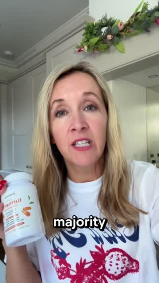
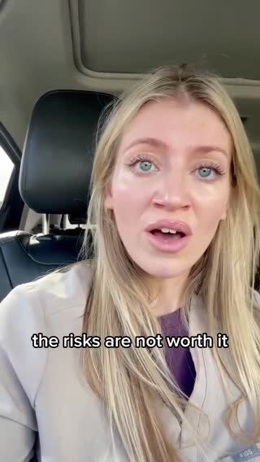

# Meta ad-library examples for F14

<!-- WAVE4 -->
## Wave 4: Alex Fedotoff's October 2026 swipe boards (GetHookd public previews)

Each ad below is from the free 10-ad preview of a public GetHookd board that [@FedotOff90](https://x.com/FedotOff90) shared on X. Days live are as of 2026-10-09; brand claims are the advertisers', not verified.

### Luxmend: Test-it-live yapper ("we're gonna see if this actually works") (528 days live)

- **Board:** [Yapper Ads (raw talking-head UGC) - Oct 2026](https://x.com/FedotOff90/status/2108196484403663180) · video 118 s
- **What happens:** A woman talks to her front camera for 118 s while testing a split-end trimmer on her own hair, in one take with no cuts: "we're gonna see if this split end trimmer actually works… I'm not gonna cut the video at all."
- **Why it lasts:** 528 days live, the longest in the board. "I won't cut the video" is a proof promise, and the doubt at the start ("I want to know if this is gonna just take off random hair") buys trust.
- **How to make one:** Phone on a stand at eye level, natural light, one continuous take. Say the doubt first, then do the test on camera and react honestly. Product name only after the result.
- **LC remake:** "I'm gonna shower in this necklace every day for a week and not cut the video". A one-take shower test with an honest reaction.

### Kristina's Fashion Essentials: "I'll be so disappointed if this doesn't work" lash-test yapper (382 days live)

- **Board:** [Yapper Ads (raw talking-head UGC) - Oct 2026](https://x.com/FedotOff90/status/2108196484403663180) · video 106 s
- **What happens:** A close-up selfie: "I'm gonna be so disappointed if this does not work exactly like everyone says it does… these lashes are seriously just so stubborn". She applies the mascara live and reacts. 106 s.
- **Why it lasts:** 382 days. The stakes are set before the demo, and "everyone says" is borrowed social proof.
- **How to make one:** Name your specific problem ("straight Asian lashes"), say what you've heard, test it live, react. Keep the camera on your face and the problem area.
- **LC remake:** "Everyone says these don't tarnish. My skin turns everything green. Let's see."

### BioRoot Labs: Ingredient-nerd yapper (turmeric percentages) (381 days live)

- **Board:** [Yapper Ads (raw talking-head UGC) - Oct 2026](https://x.com/FedotOff90/status/2108196484403663180) · video 125 s
- **What happens:** A creator in a branded tee explains why she picked BioRoot: "95% curcumin, around 30 times more than the store bought" and black pepper "which majority of store bought ones don't have". 125 s; the brand has 1,000 active ads.
- **Why it lasts:** 381 days. A comparison with "store bought" is the enemy, and the specific numbers make it believable.
- **How to make one:** A creator holds the bottle and reads 2-3 numbers off the label, compares them with a generic store version, then gives her personal routine.
- **LC remake:** "Why I switched: 14K PVD versus the 0.5 micron plating on store-bought jewelry."

### HappySupp: Girlfriend-voice men's multivitamin (HappySupp) (378 days live)

- **Board:** [Winning Men's Health / Testosterone Ads — June 2026](https://x.com/FedotOff90/status/2102455699557200246) · video 86 s
- **What happens:** A woman in a black top to camera: "Cause ain't no way he taking this without me around… this is only for you and your girl. Don't get too crazy with it. This is the men's multivitamin by HappySupp… herbal blend to support your prostate." 86 s.
- **Why it lasts:** 378 days. Primal framing told by the partner; the partner's voice is the proof.
- **How to make one:** A female partner speaks to men about the product's effect on "him", in a playful tone.
- **LC remake:** The male-gifting version: "Ladies, send this to him."

### Nothora: In-car storytime yapper (gossip hook) (350 days live)

- **Board:** [Yapper Ads (raw talking-head UGC) - Oct 2026](https://x.com/FedotOff90/status/2108196484403663180) · video 94 s
- **What happens:** A creator in the driver's seat tells a work-drama story ("I just got fired… because I told this woman…"), and the product drops in late. 94 s.
- **Why it lasts:** 350 days. Story first, so the viewer stays for the gossip and the product rides along.
- **How to make one:** Parked car, seatbelt on, phone on the dash. Open with a 1-line drama, tell it for 40-60 s, then pivot: "anyway, the thing that got me through it…".
- **LC remake:** Storytime about a wedding where her "real gold" chain turned green → LC.

### Feel Mighty: "Car chats" one-month update yapper (gifted, then hooked) (341 days live)

- **Board:** [Yapper Ads (raw talking-head UGC) - Oct 2026](https://x.com/FedotOff90/status/2108196484403663180) · video 103 s
- **What happens:** "Welcome to a new episode of car chats… I have been taking the mighty mushroom gummies for over a month now… initially these were sent to me as PR." 103 s.
- **Why it lasts:** 341 days. The update format gives time-based proof, and admitting it was PR adds honesty.
- **How to make one:** A recurring creator series name, a dated update ("over a month now"), disclosure of gifting, and what changed.
- **LC remake:** "Car chats: 30 days of never taking my LC set off."

### Mariella Gut Health Expert: "Gross embarrassing story time" gut yapper (Mariella Gut Health Expert) (320 days live)

- **Board:** [Yapper Ads (raw talking-head UGC) - Oct 2026](https://x.com/FedotOff90/status/2108196484403663180) · video 105 s
- **What happens:** A creator on a couch: "Alright, gross embarrassing story time! A few months ago I started noticing that my smells were… terrible… I was feeling bloated, icky… I consulted a few physicians, they said something was wrong with my gut health…" 105 s.
- **Why it lasts:** 320 days. Embarrassment is the hook; Fedotoff: "only sell things people are embarrassed to buy in person". It's a confession, not a pitch.
- **How to make one:** Couch, casual, pyjama energy. Say "gross/embarrassing" in the first 2 s, give 2-3 specific symptoms in their own words, what they tried, the doctor moment, then the product.
- **LC remake:** "Embarrassing story time: my ex-boyfriend's mom asked why my neck was green."

