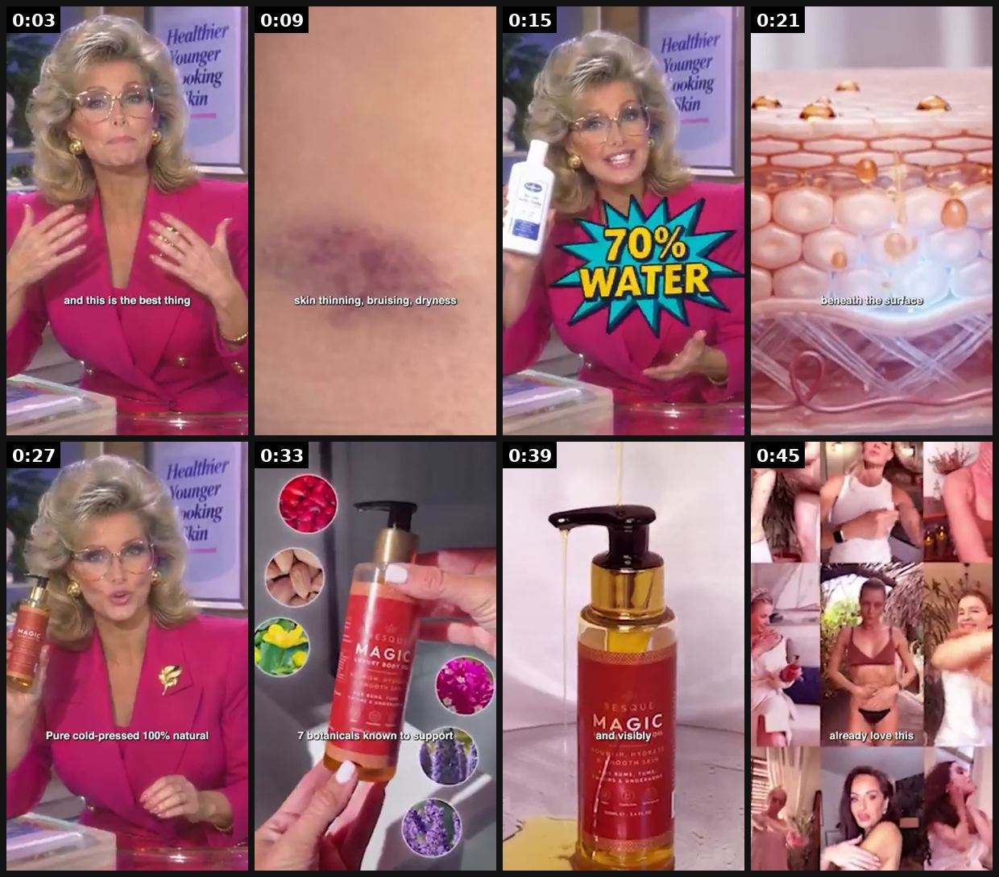
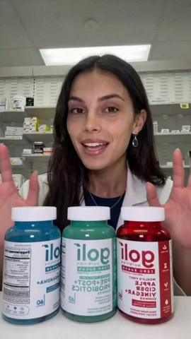
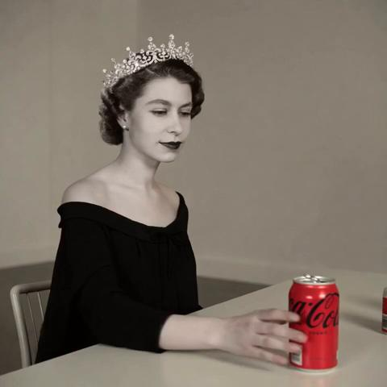
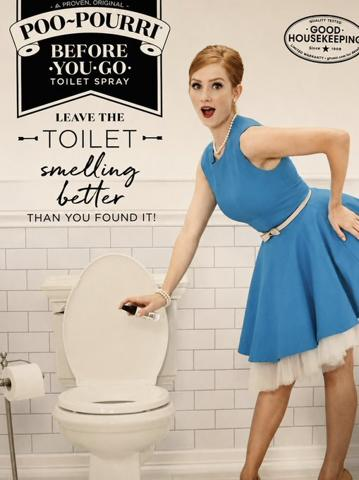

# 15 · Retro TV infomercial / expert authority (1987 daytime-TV look, "professor interview"): see it, then make it

[](https://x.com/tryatria_AI/status/2105329322496016777)

**The example:** [@tryatria_AI on X](https://x.com/tryatria_AI/status/2105329322496016777) · 0:48 video · 118 likes, 8K views

**Watch it:** [open the post on X](https://x.com/tryatria_AI/status/2105329322496016777) · [play the video file](https://video.twimg.com/amplify_video/2105125309880410112/vid/avc1/320x568/48bSEZsNtH29aeHN.mp4?tag=29)

> 🔥 WHY DOES THIS LOOK LIKE A 1987 TV COMMERCIAL 😂 15 years as a dermatologist. A very serious pink blazer. “550,000+ women.” And a product recommendation delivered straight from daytime TV. And honestly… I kinda love it. It doesn’t look like a polished DTC ad. It looks like something you’d randomly see while watching TV at 2pm, which is probably exactly why it stops the scroll. 👀

## What you are seeing

A retro late-80s TV infomercial: a big-haired presenter in a pink suit, a "70% WATER" starburst, a dermatology close-up, the product bottle (Magic serum) on a set, and a collage of archive-looking footage. The lo-fi era styling is the hook.

## Beat by beat

The storyboard above samples the video every 0:06. Lines are the transcript for that stretch; on-screen text comes from OCR, so treat it as rough.

| Frame | Time | On screen | Said / sung |
|---|---|---|---|
| 1 | 0:00–0:06 | rye in vi ey ad and this is the best thing | Fifteen years as a dermatologist, and this is the best thing I've found for aging skin. |
| 2 | 0:06–0:12 | · | Most women deal with crepiness, skin thinning, bruising, dryness, and age spots, despite moisturizing daily. |
| 3 | 0:12–0:18 | · | That's because the lotions they're using are 70% water that evaporates by noon. |
| 4 | 0:18–0:24 | · | Aging skin needs something that absorbs beneath the surface. That's where botanical oils come in. |
| 5 | 0:24–0:30 | · | Pure, cold pressed, 100% natural. That's why I recommend Besk to every woman above, above 40. |
| 6 | 0:30–0:36 | oF AG! 86 a Known tG 34 | Made from 7 botanicals known to support aging skin. Anti-inflammatory and antioxidant properties |
| 7 | 0:36–0:42 | · | with ingredients that absorb deeper and visibly improve the look and feel of skin over time. |
| 8 | 0:42–0:48 | · | 550,000 plus women already love this. So, what are you waiting for? |

<details><summary>Full transcript (timestamped)</summary>

- `0:00` Fifteen years as a dermatologist, and this is the best thing I've found for aging skin.
- `0:05` Most women deal with crepiness, skin thinning, bruising, dryness, and age spots, despite moisturizing daily.
- `0:12` That's because the lotions they're using are 70% water that evaporates by noon.
- `0:18` Aging skin needs something that absorbs beneath the surface. That's where botanical oils come in.
- `0:24` Pure, cold pressed, 100% natural. That's why I recommend Besk to every woman above, above 40.
- `0:31` Made from 7 botanicals known to support aging skin. Anti-inflammatory and antioxidant properties
- `0:38` with ingredients that absorb deeper and visibly improve the look and feel of skin over time.
- `0:43` 550,000 plus women already love this. So, what are you waiting for?

</details>

## More real examples (3)

Other posts that show this format, or a close cousin of it. Click a thumbnail to open it on X.

| | | |
|---|---|---|
| [](https://x.com/CEO_Vlad/status/2088597593949692087)<br>**@CEO_Vlad** · 0:26 video · 7K views<br>AI pharmacist ad format: $5, 4 minutes (authority-figure risk). | [](https://x.com/TomReichertWA/status/2085467482224247014)<br>**@TomReichertWA** · 0:20 video · 90 views<br>@CocaCola Quick jump to tick tock to dub in music to my Grok made clip now I made you a retro ad in a minute 😎 @nikitabier @X @elonmusk Hot weather gr | [](https://x.com/HenryCrochemore/status/2092191032645431595)<br>**@HenryCrochemore** · image · 394 views<br>this static is weird enough to make you stop poo-pourri took a product nobody wants to think about and wrapped it in a polished retro ad the contrast |

## How to make one like it

**The format in one line:** VHS grain, 4:3 framing, serious host in a pink blazer, studio set, big claims overlay ("550,000+ women"), phone number style lower-third. "It doesn't look like a polished DTC ad" ([@tryatria_AI](https://x.com/tryatria_AI/status/2105329322496016777)).

**Contents:** [1. Structure](#1-copy-the-structure) · [2. Shot by shot](#2-shot-by-shot-remake) · [3. Script and hooks](#3-write-the-script) · [4. Prompts](#4-prompts) · [5. Tools and settings](#5-tools-and-settings) · [6. Louise Carter remake](#6-louise-carter-remake) · [7. Variants and test](#7-variants-and-test-plan) · [8. Pitfalls](#8-pitfalls)

### 1. Copy the structure

Use the example's timing as your beat sheet. Keep the beat, change the words and the product.

| Beat | Time | In the example | Your version |
|---|---|---|---|
| 1 | 0:03 | Fifteen years as a dermatologist, and this is the best thing I've found for aging skin. | … |
| 2 | 0:09 | Most women deal with crepiness, skin thinning, bruising, dryness, and age spots, despite moisturizing daily. | … |
| 3 | 0:15 | That's because the lotions they're using are 70% water that evaporates by noon. | … |
| 4 | 0:21 | Aging skin needs something that absorbs beneath the surface. That's where botanical oils come in. | … |
| 5 | 0:27 | Pure, cold pressed, 100% natural. That's why I recommend Besk to every woman above, above 40. | … |
| 6 | 0:33 | Made from 7 botanicals known to support aging skin. Anti-inflammatory and antioxidant properties | … |
| 7 | 0:39 | with ingredients that absorb deeper and visibly improve the look and feel of skin over time. | … |
| 8 | 0:45 | 550,000 plus women already love this. So, what are you waiting for? | … |

### 2. Shot-by-shot remake

**Target length / size:** 30-60s, 1080x1920 with a 4:3 picture inside, VHS look

| # | Time / slot | What we see (visual + camera) | Dialogue / on-screen text |
|---|---|---|---|
| 1 | 0-3s | 4:3 frame, VHS grain, presenter in a power blazer on a pastel studio set | "Ladies, are you STILL taking off your jewelry to shower?" |
| 2 | 3-15s | Demo on a turntable, chunky 80s graphics ("WATERPROOF!" starburst) | Exaggerated infomercial delivery |
| 3 | 15-30s | Fake-retro "testimonial" lower-thirds (clearly comedic), product close-ups | Real facts, retro delivery |
| 4 | End | "CALL NOW" parody card that becomes a modern URL | Offer + AI label |

### 3. Write the script

Then fill the beats from the table above. Pull the wording from real customer reviews, not from ad copy: a review line beats a copywriter line almost every time. Read every line out loud and cut anything you would not say to a friend. Ready-made Louise Carter scripts are in section 6; hand [BOT.md](BOT.md) to any AI agent to write versions for another brand.

### 4. Prompts

**Veo 3 / Kling**

```text
1987 daytime television infomercial, VHS footage, 4:3, a woman presenter with big hair in a pink blazer on a pastel studio set holding a gold necklace, enthusiastic, scan lines, color bleed, 8s
```

**Post**

```text
CapCut: add "VHS" effect, 4:3 crop inside 9:16, date stamp, mono audio with slight hiss.
```

### 5. Tools and settings

| Setting | Value |
|---|---|
| Canvas | 1080×1920 (9:16) master; crop a 1080×1350 (4:5) cut for feed placements |
| Frame rate | 30 fps (shoot 60 fps for slow-motion water or sparkle shots) |
| Camera | Phone main lens at 1x, exposure locked on skin, HDR off, grid on; tripod or a phone clamp for product shots |
| Light | One soft key at 45° (window or ring light), white card as fill; side light for metal sparkle |
| Audio | Lavalier or phone 15–20 cm from the mouth; mix voice at -14 LUFS, music at -28 to -30 dB under voice |
| Captions | Burned in, 2–5 words per line, 64–80 px bold sans, white with a black stroke or pill; keep text inside the safe zone (top 220 px and bottom 420 px clear, 64 px side margins) |
| Pacing | A visual change every 1.5–3 s; the hook lands in the first 1.5 s with no logo intro |
| Edit / export | CapCut or Premiere; H.264, 12–20 Mbps, AAC 320 kbps; upload natively to each platform, not via links |

### 6. Louise Carter remake

A. "Home Shopping 1989" parody: host dunks the necklace in a fish tank, "STILL GOLD!" counter, call-in caller "Brenda from Ohio".
B. Jeweler-for-real: a real, named jeweler explains PVD on a retro set (with disclosure of paid partnership).
C. "Infomercial problem" opener in black-and-white ("Tired of jewelry that turns your neck GREEN?") → colour switch to LC.

Brand rules, claims you can and cannot make, and more scripts: [brands/louise-carter.md](brands/louise-carter.md). Step-by-step from idea to scale: [STAGES.md](STAGES.md).

### 7. Variants and test plan

**Test plan:** 2 parodies, $50/day; hook rate, CPA; Omni.

**Naming:** `F15-<variant>-<hook##>-<date>` so results map back to this folder. Change one thing per test (hook, narrator, length or offer), never two.

### 8. Pitfalls

- A fake "doctor" or fake credentials is not OK even as parody.
- The retro look must not hide the real product; show it clean in the last 5s.
- Slow open: if the first 1.5 s does not show the hook visually, most people swipe.
- Logo or brand intro at the start reads as an ad; put the brand at the end.
- Captions covered by the platform UI: check the safe zone on a real phone before posting.
- Music over the voice: keep music at least 14 dB under speech.

**Compliance:** [_COMPLIANCE.md](../_COMPLIANCE.md). No fake doctors/pharmacists/jewelers; customer counts verified; parody must be obviously comedic.

## More examples

Every post we found for this format, with transcripts: [examples/](examples/README.md). Playbook: [README.md](README.md). Agent brief: [BOT.md](BOT.md).
