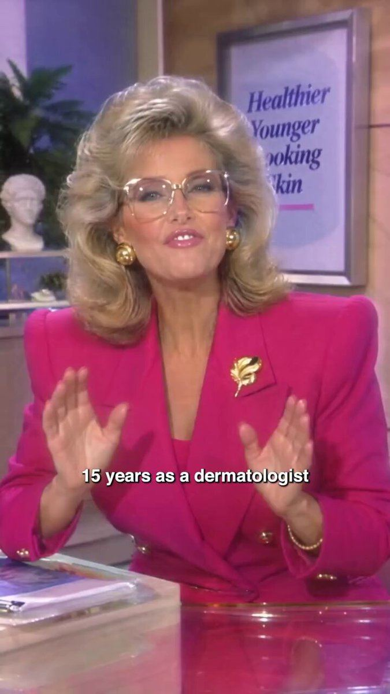

# 15 · Retro infomercial

<!-- HERO:START -->

**[See the example and how to make it →](EXAMPLE.md)** · [watch on X](https://x.com/tryatria_AI/status/2105329322496016777)
<!-- HERO:END -->

## Looks like
VHS grain, 4:3 framing, serious host in a pink blazer, studio set, big claims overlay ("550,000+ women"), phone number style lower-third. "It doesn't look like a polished DTC ad" ([@tryatria_AI](https://x.com/tryatria_AI/status/2105329322496016777)).

## LC adaptation (no fake credentials — a shopping-channel parody)
A. "Home Shopping 1989" parody: host dunks the necklace in a fish tank, "STILL GOLD!" counter, call-in caller "Brenda from Ohio".
B. Jeweler-for-real: a real, named jeweler explains PVD on a retro set (with disclosure of paid partnership).
C. "Infomercial problem" opener in black-and-white ("Tired of jewelry that turns your neck GREEN?") → colour switch to LC.

## Test/metric
2 parodies, $50/day; hook rate, CPA; Omni.

## Compliance
[_COMPLIANCE.md](../_COMPLIANCE.md). No fake doctors/pharmacists/jewelers; customer counts verified; parody must be obviously comedic.

<!-- W8NOTE -->
## Wave 8 update: Voynov page, Adam Taylor teardowns, queued posts (Oct 9, 2026)
- **Spokesperson ads:** "I don't think anyone is doing it better now than The Chocolate Bar" ([Voynov](https://x.com/LachezarVoynov/status/2062924772510433304)). The Conscious Bar framework: hook → problem intro → problem education → agitation → product intro → explanation → CTA, told through the story of cacao with ASMR B-roll ([post](https://x.com/LachezarVoynov/status/2041181235230232837)).
- **Authority educational ads** "are a cheat code for scaling: low frequency, perfect for unaware, highly convincing" ([Voynov](https://x.com/LachezarVoynov/status/2028848986182828435)). PetLab's expert "brushes past 2.3M owners and 100K reviews to get to the one thing competitors can't claim: a clinical study" ([post](https://x.com/adamtaylorl/status/2105251326498123878)). Wuffes runs a real vet, "the trust anchor everything else borrows from" ([post](https://x.com/adamtaylorl/status/2090038021265502679)). LC: name the big proof (reviews), dismiss it, then show the one only LC has (a 30-day saltwater test on camera).
<!-- /W8NOTE -->

<!-- EVIDENCE:START -->
## Evidence from X discovery (auto-generated)

| Date | Author | Post | Engagement | Grade | Gist |
|---|---|---|---|---|---|
| 2026-09-30 | [@tryatria_AI](https://x.com/tryatria_AI) | [link](https://x.com/tryatria_AI/status/2105329322496016777) | 118L/211BM/7kV | VALUE | Retro 1987-TV dermatologist ad: un-polished authority format stands out. |
| 2026-08-15 | [@CEO_Vlad](https://x.com/CEO_Vlad) | [link](https://x.com/CEO_Vlad/status/2088597593949692087) | 78L/117BM/6kV | SOME | AI pharmacist ad format: $5, 4 minutes (authority-figure risk). |
| 2026-10-08 | [@antonioventre_](https://x.com/antonioventre_) | [link](https://x.com/antonioventre_/status/2108228200421576872) | 47L/49BM/2kV | VALUE | Supplement 3.17x ROAS: 1 CBO/product, 1 ad set/persona; creatives = Suno AI ads, professor interview... |
<!-- EVIDENCE:END -->
