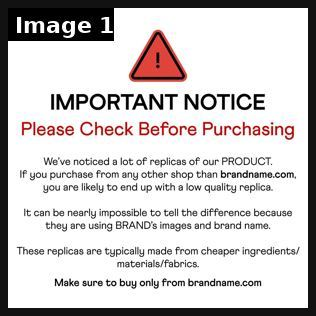
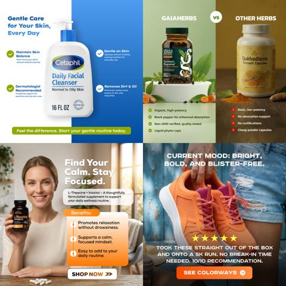
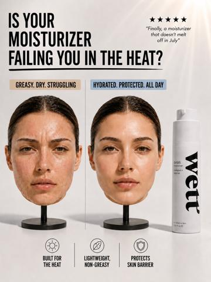
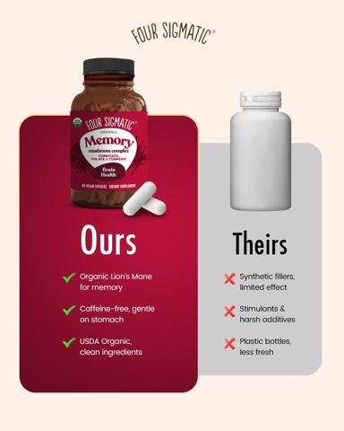

# 16 · Us-vs-copycat screen-scroll comparison (and comparison page): see it, then make it

[](https://x.com/Nate_Google_/status/2104963469548085713)

**The example:** [@Nate_Google_ on X](https://x.com/Nate_Google_/status/2104963469548085713) · 1 image · 258 likes, 23K views

**Watch it:** [open the post on X](https://x.com/Nate_Google_/status/2104963469548085713) (the media is in the post it quotes)

> not only this, but launch ads ASAP calling out copycats and replicas one of the highest CVR MOF creatives that you can launch have ads of an iphone screen scrolling through fake amazon listings while describing the difference between your product and the replicas then tailor the PDP to include the details of being the original, the only, etc. and to avoid low quality replicas such an easy lift and NEEDED going into Q…

## What you are seeing

A plain warning static: a red triangle and "IMPORTANT NOTICE: Please Check Before Purchasing", explaining that replicas use the brand's images and that you should only buy from the real site. It plays the copycat problem as a public-service notice.

## Image by image

| Image | Text on it (OCR, rough) |
|---|---|
| 1 | IMPORTANT NOTICE Please Check Before Purchasing We've noticed a lot of … of our PRODUCT. If you purchase from any other shop than … you are likely to end up with a low quality replica. It can be nearly impossible to tell the difference because they are using … images and brand name. These … are typi |

## More real examples (3)

Other posts that show this format, or a close cousin of it. Click a thumbnail to open it on X.

| | | |
|---|---|---|
| [](https://x.com/ultimategrafiks/status/2090399839309738284)<br>**@ultimategrafiks** · image · 179 views<br>I love designing static ads because every product comes with a different story and creative challenge. CALLOUT, US vs THEM, DTC &amp; UGC, I love crea | [](https://x.com/EiyanDickerson/status/2088266872194023737)<br>**@EiyanDickerson** · images · 9K views<br>4 Static Ads. 1 Angle. 1. Before &amp; After 2. Feature Callout 3. Headline Callout 4. Us vs Them A Moisturizer built for the heat☀️ https://t.co/jmYh | [](https://x.com/Hashir_Shaikh_/status/2096337779412304217)<br>**@Hashir_Shaikh_** · images · 5K views<br>We make 1,000+ statics every month. Around 10% are Us vs Them. Because showing the difference can be more powerful than simply talking about your prod |

## How to make one like it

**The format in one line:** Screen recording of an iPhone scrolling marketplace listings of look-alike products while a VO explains how to tell the difference (materials, plating, reviews mentioning tarnish), then cuts to the real product. ([@Nate_Google_](https://x.com/Nate_Google_/status/2104963469548085713)).

**Contents:** [1. Structure](#1-copy-the-structure) · [2. Shot by shot](#2-shot-by-shot-remake) · [3. Script and hooks](#3-write-the-script) · [4. Prompts](#4-prompts) · [5. Tools and settings](#5-tools-and-settings) · [6. Louise Carter remake](#6-louise-carter-remake) · [7. Variants and test](#7-variants-and-test-plan) · [8. Pitfalls](#8-pitfalls)

### 1. Copy the structure

The skeleton every version follows: **hook → problem or tension → turn (the product shows up) → proof → one clear ask.** The shot-by-shot below fills it in.

### 2. Shot-by-shot remake

**Target length / size:** 20-45s screen recording, 1080x1920

| # | Time / slot | What we see (visual + camera) | Dialogue / on-screen text |
|---|---|---|---|
| 1 | 0-3s | Screen recording of a marketplace search for "gold necklace", copycat listings | VO: "Before you buy a gold necklace on Amazon, watch this." |
| 2 | 3-20s | Scrolls and zooms into tell-tale details (plating, "gold tone", 1-star reviews mentioning green skin) | VO explains how to tell real from cheap |
| 3 | 20-35s | Switch to the brand's product page / real product in hand | What the real one has (14K PVD, warranty) |
| 4 | End | Product + offer | "only from [brand].com" |

### 3. Write the script

Then fill the beats from the table above. Pull the wording from real customer reviews, not from ad copy: a review line beats a copywriter line almost every time. Read every line out loud and cut anything you would not say to a friend. Ready-made Louise Carter scripts are in section 6; hand [BOT.md](BOT.md) to any AI agent to write versions for another brand.

### 4. Prompts

**Recording**

```text
iPhone screen recording at 60fps, then crop to 9:16, add zoom-ins with CapCut keyframes on every claim, circle tool in red.
```

### 5. Tools and settings

| Setting | Value |
|---|---|
| Canvas | 1080×1920 (9:16) master; crop a 1080×1350 (4:5) cut for feed placements |
| Frame rate | 30 fps (shoot 60 fps for slow-motion water or sparkle shots) |
| Camera | Phone main lens at 1x, exposure locked on skin, HDR off, grid on; tripod or a phone clamp for product shots |
| Light | One soft key at 45° (window or ring light), white card as fill; side light for metal sparkle |
| Audio | Lavalier or phone 15–20 cm from the mouth; mix voice at -14 LUFS, music at -28 to -30 dB under voice |
| Captions | Burned in, 2–5 words per line, 64–80 px bold sans, white with a black stroke or pill; keep text inside the safe zone (top 220 px and bottom 420 px clear, 64 px side margins) |
| Pacing | A visual change every 1.5–3 s; the hook lands in the first 1.5 s with no logo intro |
| Edit / export | CapCut or Premiere; H.264, 12–20 Mbps, AAC 320 kbps; upload natively to each platform, not via links |

### 6. Louise Carter remake

A. "I found 40 'Louise Carter' dupes on Amazon. Here's how to tell." — scroll generic listings (blur seller names), read the plating spec ("gold tone"/"flash plated") vs LC 14K PVD; read tarnish complaints in reviews (generic).
B. Tick-box table static: LC vs "typical gold-plated" (waterproof, PVD, price per wear).
C. Creator "I bought the $9 version and the LC one — 30-day shower test."

Brand rules, claims you can and cannot make, and more scripts: [brands/louise-carter.md](brands/louise-carter.md). Step-by-step from idea to scale: [STAGES.md](STAGES.md).

### 7. Variants and test plan

**Test plan:** Retargeting + broad; CVR, Omni new vs returning.

**Naming:** `F16-<variant>-<hook##>-<date>` so results map back to this folder. Change one thing per test (hook, narrator, length or offer), never two.

### 8. Pitfalls

- Do not name or show a specific competitor's brand in a way that implies something false about them; blur names.
- Every "how to tell" point must be true and checkable.
- Static version: warning notice ("Please check before purchasing") works too, as in the featured example.
- Slow open: if the first 1.5 s does not show the hook visually, most people swipe.
- Logo or brand intro at the start reads as an ad; put the brand at the end.
- Captions covered by the platform UI: check the safe zone on a real phone before posting.
- Music over the voice: keep music at least 14 dB under speech.

**Compliance:** [_COMPLIANCE.md](../_COMPLIANCE.md). Don't name or show identifiable competitor brands/sellers; comparison claims must be substantiated (test records kept).

## Field notes

Newer observations live in the playbook: [Wave 3 update: brands & apps crushing it (Oct 2026)](README.md) · [Wave 4 update: Fedotoff October 2026 swipe boards](README.md)

## More examples

Every post we found for this format, with transcripts: [examples/](examples/README.md). Playbook: [README.md](README.md). Agent brief: [BOT.md](BOT.md).
