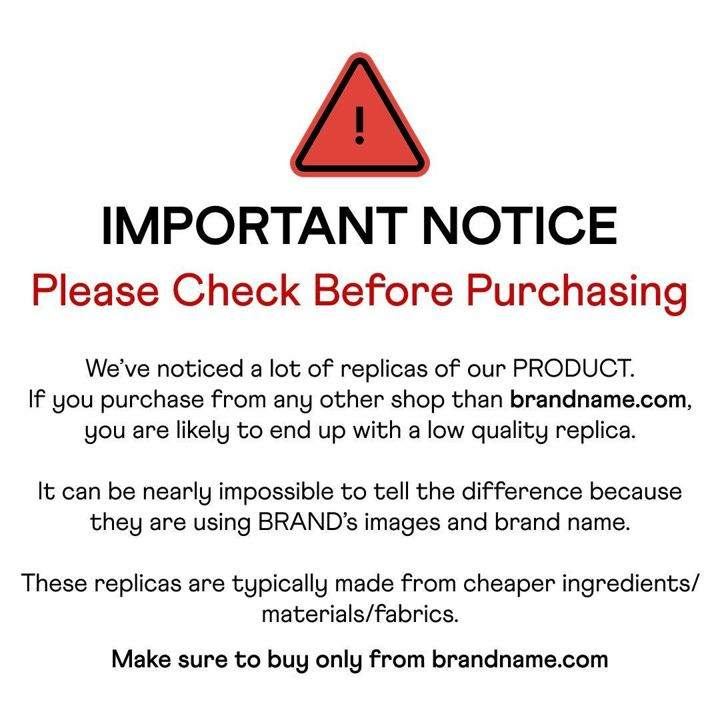

# 16 · Us-vs-copycat screen-scroll

<!-- HERO:START -->

**[See the example and how to make it →](EXAMPLE.md)** · [watch on X](https://x.com/Nate_Google_/status/2104963469548085713)
<!-- HERO:END -->

## Looks like
Screen recording of an iPhone scrolling marketplace listings of look-alike products while a VO explains how to tell the difference (materials, plating, reviews mentioning tarnish), then cuts to the real product. ([@Nate_Google_](https://x.com/Nate_Google_/status/2104963469548085713)).

## LC scripts
A. "I found 40 'Louise Carter' dupes on Amazon. Here's how to tell." — scroll generic listings (blur seller names), read the plating spec ("gold tone"/"flash plated") vs LC 14K PVD; read tarnish complaints in reviews (generic).
B. Tick-box table static: LC vs "typical gold-plated" (waterproof, PVD, price per wear).
C. Creator "I bought the $9 version and the LC one — 30-day shower test."

## Destination
Dedicated comparison landing page (table, test video, reviews) — not the PDP.

## Test/metric
Retargeting + broad; CVR, Omni new vs returning.

## Compliance
[_COMPLIANCE.md](../_COMPLIANCE.md). Don't name or show identifiable competitor brands/sellers; comparison claims must be substantiated (test records kept).

<!-- EVIDENCE:START -->
## Wave 3 update: brands & apps crushing it (Oct 2026)
- Primal Queen (women's beef-organ supplement, reported $10M+/mo, ~1,600 active Meta ads, Target + TikTok Shop) leans on Us-vs-Them as a signature angle ([@zarastrategy](https://x.com/zarastrategy/status/2090820261574529478)); subscription revenue $2M → $100M+ in under 2 years ([@piyush_jn](https://x.com/piyush_jn/status/2077070874084315386)).

## Wave 4 update: Fedotoff October 2026 swipe boards
- Penrose Skin: "Wanna pull? You need this fragrance" dupe yapper (Penrose), 89 days live (Penrose Skin: 100 Longest-Running 4-5 Star Ads board). A primal hook, a dupe-of-luxury angle and a price anchor.
- Penrose Skin: Talking-jar CGI rivalry ("You copied me! That's theft!"), 89 days live (Penrose Skin: 100 Longest-Running 4-5 Star Ads board). A rivalry skit between product characters dramatizes the dupe claim without a human making it.
- Penrose Skin: "I stopped buying $400 colognes" price-anchor demo, 89 days live (Penrose Skin: 100 Longest-Running 4-5 Star Ads board). A clear price-anchor switch story in 15 s.
- Stills, how-to and LC remakes: [adlibrary/](adlibrary/README.md).

## Evidence from X discovery (auto-generated)

| Date | Author | Post | Engagement | Grade | Gist |
|---|---|---|---|---|---|
| 2026-09-29 | [@Nate_Google_](https://x.com/Nate_Google_) | [link](https://x.com/Nate_Google_/status/2104963469548085713) | 258L/461BM/23kV | VALUE | Us-vs-copycat ads: iPhone scrolling fake Amazon listings explaining the difference - high CVR MOF. |
| 2026-08-03 | [@antonioventre_](https://x.com/antonioventre_) | [link](https://x.com/antonioventre_/status/2084404696840569332) | 39L/23BM/2kV | VALUE | 99% of comparison ads send click to PDP; send to dedicated comparison page instead. |
| 2026-08-10 | [@adamtaylorl](https://x.com/adamtaylorl) | [link](https://x.com/adamtaylorl/status/2086814826177679660) | 36L/36BM/3kV | VALUE | Dead in 2026: polished studio, "hey guys" UGC, discount statics, founder-story VSLs. Printing: ugly advertorial statics, long-form yapper, comment-reply hooks, us-vs-them statics. |
| 2026-09-14 | [@alexpagepilot](https://x.com/alexpagepilot) | [link](https://x.com/alexpagepilot/status/2099438014456045990) | 11L/19BM/1kV | SOME | Top 5 dropship formats: UGC problem/solution, "TikTok made me buy it", us vs them split, founder talking head (retargets 2-3x), text-overlay slideshow. |
<!-- EVIDENCE:END -->
