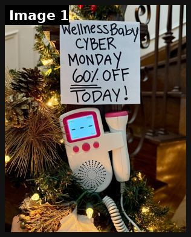

# 17 · Lo-fi promo statics (handwritten sign + 24 BFCM variants): see it, then make it

[](https://x.com/adamtaylorl/status/2106021392567198020)

**The example:** [@adamtaylorl on X](https://x.com/adamtaylorl/status/2106021392567198020) · 1 image · 57 likes, 6K views

**Watch it:** [open the post on X](https://x.com/adamtaylorl/status/2106021392567198020)

> I had lunch with a friend whose ecom brand does $400K/mo. He wants to hit $1M/mo in Q4, but it’s his first Black Friday. Here are the 25 BFCM static ads I told him to run: 1/ The Handwritten Sign https://t.co/AUQkn0NZQv

## What you are seeing

A handwritten paper sign taped above a product on a Christmas tree: "WellnessBaby CYBER MONDAY 60% OFF TODAY!". It looks shot on a phone, lo-fi on purpose.

## Image by image

| Image | Text on it (OCR, rough) |
|---|---|
| 1 | hy Nola ed CYBER MONDAY 007. OFF TODAY WH My I NS I aN gm |

## How to make one like it

**Contents:** [1. Structure](#1-copy-the-structure) · [2. Shot by shot](#2-shot-by-shot-remake) · [3. Script and hooks](#3-write-the-script) · [4. Prompts](#4-prompts) · [5. Tools and settings](#5-tools-and-settings) · [6. Louise Carter remake](#6-louise-carter-remake) · [7. Variants and test](#7-variants-and-test-plan) · [8. Pitfalls](#8-pitfalls)

### 1. Copy the structure

The skeleton every version follows: **hook → problem or tension → turn (the product shows up) → proof → one clear ask.** The shot-by-shot below fills it in.

### 2. Shot-by-shot remake

**Target length / size:** 1 static, 1080x1350

| # | Time / slot | What we see (visual + camera) | Dialogue / on-screen text |
|---|---|---|---|
| 1 | Frame | Phone photo of a real handwritten sign (marker on paper or cardboard) taped somewhere real: fridge, shop counter, Christmas tree | The offer in handwriting: "ANY 7 FOR $85. TODAY ONLY." |
| 2 | Product | Product in the photo next to the sign, natural light | Nothing else; no logo overlay |
| 3 | Primary text | - | One line that sounds like a person: "we made a sign because people kept asking" |

### 3. Write the script

Then fill the beats from the table above. Pull the wording from real customer reviews, not from ad copy: a review line beats a copywriter line almost every time. Read every line out loud and cut anything you would not say to a friend. Ready-made Louise Carter scripts are in section 6; hand [BOT.md](BOT.md) to any AI agent to write versions for another brand.

### 4. Prompts

**Shoot**

```text
Write the sign with a thick Sharpie on printer paper, tape it, shoot on iPhone in daylight, slight angle, no edits except crop.
```

### 5. Tools and settings

| Setting | Value |
|---|---|
| Canvas | 1080×1350 (4:5) for feed; 1080×1920 (9:16) story/reel version with the same elements stacked |
| Type | Headline 80–110 px, max 8 words; body 36–44 px; at most 2 typefaces |
| Layout | Headline readable at thumbnail size; product at least 40% of the canvas; logo small, bottom corner |
| Safe zone | Keep text out of the bottom 20% on 9:16 (UI overlays) |
| Tools | Figma or Canva for layout; Photoshop or Photoroom to cut out product; Midjourney or Flux only for backgrounds, never for the product itself |
| Export | PNG or JPG at quality 90, sRGB, under 1 MB |

### 6. Louise Carter remake

A. Handwritten sign on a bathroom mirror: "BLACK FRIDAY: any 7 for $[BF price] — yes you can shower in them" with LC stack on the sink.
B. "Bad news letter": typed note "Bad news: our Black Friday stack deal ends Monday. Good news: it's waterproof." 
C. Balloon letters "7 FOR $85" over a stacked wrist, gift box.

Brand rules, claims you can and cannot make, and more scripts: [brands/louise-carter.md](brands/louise-carter.md). Step-by-step from idea to scale: [STAGES.md](STAGES.md).

### 7. Variants and test plan

**Test plan:** Build 10 of 25 in week 1 of November; CPA and Omni promo revenue by `F17-<variant>`.

**Naming:** `F17-<variant>-<hook##>-<date>` so results map back to this folder. Change one thing per test (hook, narrator, length or offer), never two.

### 8. Pitfalls

- The sign must be really handwritten; fonts that imitate handwriting look fake.
- Only promote a real offer with a real end date.
- Too much text: if it cannot be read in 1 second at thumbnail size, cut it.
- AI-generated product images: show the real product; AI is fine for backgrounds only.

**Compliance:** [_COMPLIANCE.md](../_COMPLIANCE.md). Discounts and deadlines must be real; "stock countdown" only with true inventory.

## More examples

Every post we found for this format, with transcripts: [examples/](examples/README.md). Playbook: [README.md](README.md). Agent brief: [BOT.md](BOT.md).
