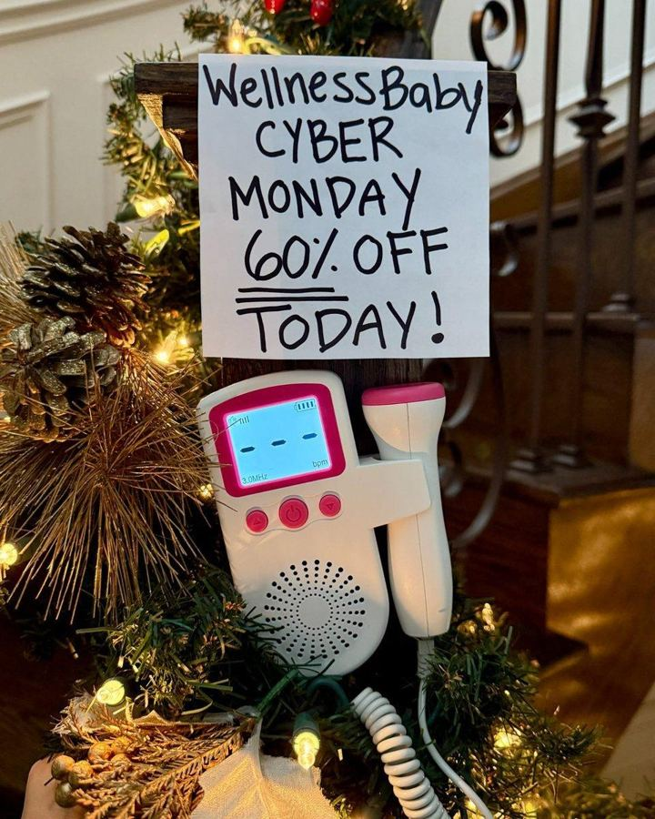

# 17 · Lo-fi promo statics

<!-- HERO:START -->

**[See the example and how to make it →](EXAMPLE.md)** · [watch on X](https://x.com/adamtaylorl/status/2106021392567198020)
<!-- HERO:END -->

## The handwritten sign
Phone photo of a hand-written paper sign ("WellnessBaby CYBER MONDAY 60% OFF TODAY!") propped next to the product in a real home with holiday lights ([@adamtaylorl](https://x.com/adamtaylorl/status/2106021392567198020)).

## The full list of 25 (thread) — use as a BFCM checklist
1 Handwritten Sign · 2 Bad News Letter · 3 The Apology · 4 Native Text Post · 5 Balloon Letters · 6 Price Tag Letters · 7 Giant Percentage · 8 Discount Tape · 9 Text Wallpaper · 10 Repeat Headline · 11 Checkout Code · 12 Doubter Story · 13 Red Bar Statement · 14 Competitor Switch · 15 With vs Without · 16 Tick-Box Table · 17 Feature Callouts · 18 Stat Stack · 19 Polaroid Proof · 20 Me Before / Me After · 21 Review Card · 22 Stock Countdown · 23 Final Call · 24 Neon Frame Bundle · 25 Coupon Ticket.
(Source tip: find last year's Q4 creative with TrendTrack "Q4 mode".)

## LC scripts
A. Handwritten sign on a bathroom mirror: "BLACK FRIDAY: any 7 for $[BF price] — yes you can shower in them" with LC stack on the sink.
B. "Bad news letter": typed note "Bad news: our Black Friday stack deal ends Monday. Good news: it's waterproof." 
C. Balloon letters "7 FOR $85" over a stacked wrist, gift box.

## Test/metric
Build 10 of 25 in week 1 of November; CPA and Omni promo revenue by `F17-<variant>`.

## Compliance
[_COMPLIANCE.md](../_COMPLIANCE.md). Discounts and deadlines must be real; "stock countdown" only with true inventory.

<!-- EVIDENCE:START -->
## Wave 4 update: Fedotoff October 2026 swipe boards
- Alicia Darling: Gym-clock POV with sticky caption ("Black leggings so I hope no one notices"), 319 days live (Native Unusual Visuals board). An embarrassing secret told as a caption over a mundane POV; the product is implied (period / odor).
- Stills, how-to and LC remakes: [adlibrary/](adlibrary/README.md).

## Evidence from X discovery (auto-generated)

| Date | Author | Post | Engagement | Grade | Gist |
|---|---|---|---|---|---|
| 2026-10-02 | [@adamtaylorl](https://x.com/adamtaylorl) | [link](https://x.com/adamtaylorl/status/2106021392567198020) | 57L/112BM/6kV | VALUE | 25 BFCM static ads incl. The Handwritten Sign. |
<!-- EVIDENCE:END -->
