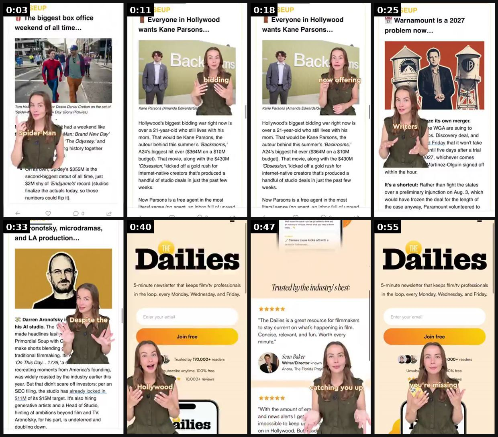
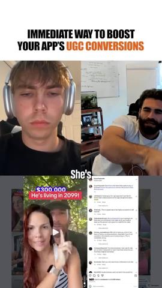
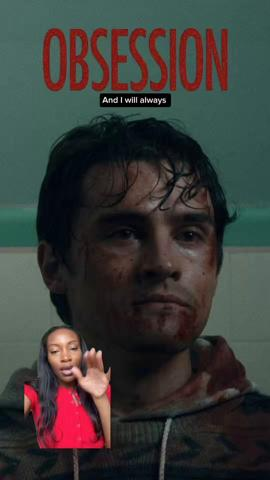
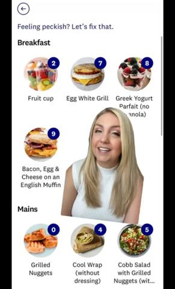
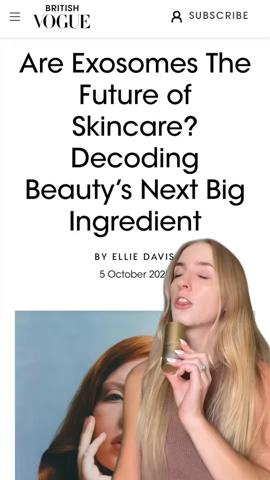
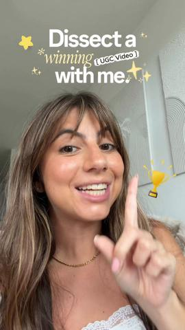
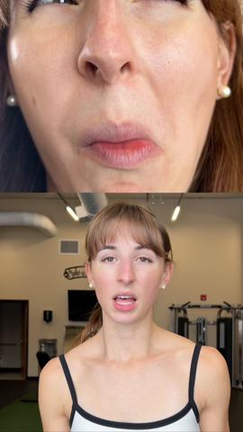
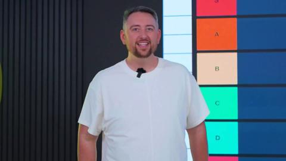

# 18 · Green-screen reaction over a proven winner + reply-to-comment overlay: see it, then make it

[](https://x.com/claireonvideo/status/2098103517680402637)

**The example:** [@claireonvideo on X](https://x.com/claireonvideo/status/2098103517680402637) · 0:58 video · 0 likes, 63 views

**Watch it:** [open the post on X](https://x.com/claireonvideo/status/2098103517680402637) · [play the video file](https://video.twimg.com/amplify_video/2098103366756798469/vid/avc1/320x568/2ApWt-MZarxr_39X.mp4?tag=14)

> UGC EXAMPLE: greenscreen style 🎭 need ads like this for your brand? Email me at for a quote 📧 We tested 3 hooks on this video and this was the winner! 🔥🎬 #actor #newsad #greenscreenugc #websitevideo #newscreator

## What you are seeing

A creator in front of a green screen of news articles (Hollywood box office, Warner Bros) reacting and explaining, then the green screen switches to the product (the "Dailies" newsletter signup page). It is UGC commentary with the background as the visual.

## Beat by beat

The storyboard above samples the video every 0:07. Lines are the transcript for that stretch; on-screen text comes from OCR, so treat it as rough.

| Frame | Time | On screen | Said / sung |
|---|---|---|---|
| 1 | 0:00–0:07 | The biggest box office weekend of all time... … on the set … Spider: Day’ Sony Pictures had a weekend like … an Man: Brand New Day’ 'The Odyssey,’ and … $355M i | The Spider-Man just crossed one billion in six days, helping deliver the biggest domestic |
| 2 | 0:07–0:14 | Everyone in Hollywood wants Kane Parsons... … bidding Kane Parsons Amanda Edwards … biggest bidding war right now is over a 21-year-old who still lives with his | horror film in history, so much for superhero fatigue. Hollywood is in a bidding war over 21-year-old... backroom director Cain Parsons. |
| 3 | 0:14–0:22 | Everyone in Hollywood wants Kane Parsons... as how offering a … Kane Parsons Amanda … biggest bidding war right now is over a 21-year-old who still lives with h | After turning a $10 million horror film into a $364 million hit, studios are now offering him deals worth up to $65 million. Paramount just agreed to freeze this murder with Warner Brothers Discovery while it fights |
| 4 | 0:22–0:29 | is a 2027 problem now... … By AS IN its own merger. … are suing to … Discovery deal, and Friday that it won't take … five days after a trial 027, whichever come | a lawsuit from 12 states and the writers. Every day after September 30th could cost the company another 7 million. |
| 5 | 0:29–0:36 | studio. The made headlines … Soup with make shorts blending traditional filmmaking. ItS’ On This Day... … moments from America's founding, was widely roasted by | And Darren Aronofsky is raising $15 million for his new studio. Despite the backlash around his involvement with AI, he's doubling down on blending AI |
| 6 | 0:36–0:43 | 5-minute newsletter that keeps film … professionals in the loop, every Monday, Wednesday. and Friday. Join free is Trusted by 170,000 readers subscribe anytime. | with traditional filmmaking. So how do I know all this? I read the Dailys. It's a free Hollywood newsletter read by more than 185,000 Hollywood insiders. |
| 7 | 0:43–0:51 | Cones Lions kicks off with Trusted … the industry's best: … is a great resource for filmmakers to stay current on what's happening in film. Concise, relevant, a | The reason I love it is because it doesn't read like a trade publication. It feels like a friend catching you up on everything happening in Hollywood, which honestly makes the news way more enjoyable and way easier to remember. |
| 8 | 0:51–0:58 | 5-minute newsletter that keeps film … professionals in the loop, every Monday, Wednesday. and Friday. 23 ,000 readers | Honestly, at this point, it's not even about trying it. It's about what you're missing if you're not reading it. It's completely free, so it's definitely worth checking out. |

<details><summary>Full transcript (timestamped)</summary>

- `0:00` The Spider-Man just crossed one billion in six days, helping deliver the biggest domestic
- `0:06` horror film in history, so much for superhero fatigue.
- `0:10` Hollywood is in a bidding war over 21-year-old... backroom director Cain Parsons.
- `0:14` After turning a $10 million horror film into a $364 million hit, studios are now offering
- `0:18` him deals worth up to $65 million.
- `0:20` Paramount just agreed to freeze this murder with Warner Brothers Discovery while it fights
- `0:23` a lawsuit from 12 states and the writers.
- `0:26` Every day after September 30th could cost the company another 7 million.
- `0:29` And Darren Aronofsky is raising $15 million for his new studio.
- `0:33` Despite the backlash around his involvement with AI, he's doubling down on blending AI
- `0:36` with traditional filmmaking.
- `0:37` So how do I know all this?
- `0:38` I read the Dailys.
- `0:39` It's a free Hollywood newsletter read by more than 185,000 Hollywood insiders.
- `0:44` The reason I love it is because it doesn't read like a trade publication.
- `0:46` It feels like a friend catching you up on everything happening in Hollywood, which
- `0:49` honestly makes the news way more enjoyable and way easier to remember.
- `0:52` Honestly, at this point, it's not even about trying it.
- `0:54` It's about what you're missing if you're not reading it.
- `0:56` It's completely free, so it's definitely worth checking out.

</details>

## More real examples (8)

Other posts that show this format, or a close cousin of it. Click a thumbnail to open it on X.

| | | |
|---|---|---|
| [](https://x.com/adamtaylorl/status/2107425650478829611)<br>**@adamtaylorl** · images · 29K views<br>If you’re in ecom Pay the f*ck attention to what Smooche is doing with their creative right now This will be taught in every DTC playbook in 2 years | [](https://x.com/evodawson/status/2103985895443398988)<br>**@evodawson** · 0:35 video · 2K views<br>Your UGC isn't converting because your creators have no credibility. Borrow the founder's. Have them green screen and react to a video from the founde | [](https://x.com/generatedbyann/status/2061823394270843156)<br>**@generatedbyann** · 1:17 video · 305 views<br>I started noticing an uptick of this video format across ads and socials. The green screen explainer style mixed with rotating visuals/photos in the b |
| [](https://x.com/jsocialstoryugc/status/2053877587928092845)<br>**@jsocialstoryugc** · 0:25 video · 191 views<br>UGC example using green screen format! This style continues to perform SO well for brands: ⚫️ Great pacing ⚫️ Gives audience a good visual reference T | [](https://x.com/naturallyshan/status/2064745463513768389)<br>**@naturallyshan** · 0:38 video · 157 views<br>Don’t be afraid to use green screen in your concepts for beauty brands!📈👇 The green screen format is high converting because it gets people interested | [](https://x.com/jennamediaco/status/2074943138205176288)<br>**@jennamediaco** · 0:45 video · 398 views<br>Want to make UGC videos that actually convert? 💸 Here is the exact strategy behind one of my winning videos: 📱 The "Scroll" Hook: Use a TikTok feed gr |
| [](https://x.com/ugcwithvan/status/1999270533557285146)<br>**@ugcwithvan** · 0:46 video · 558 views<br>Split screen videos WORK >> This brand had a winning video that consisted of a similar structure with green screen visuals but wanted to test differen | [](https://x.com/TheJeremyHaynes/status/2092620077946614206)<br>**@TheJeremyHaynes** · 18:23 video · 16K views<br>Ranking every ad creative format worst->best (video). |   |

## How to make one like it

**The format in one line:** Creator in front of a green-screen background showing **LC's own winning ad/post** (or a screenshot of a viral comment), reacting/explaining. Comment-reply: TikTok/IG comment bubble sticker ("does this actually survive the ocean??") + answer video.

**Contents:** [1. Structure](#1-copy-the-structure) · [2. Shot by shot](#2-shot-by-shot-remake) · [3. Script and hooks](#3-write-the-script) · [4. Prompts](#4-prompts) · [5. Tools and settings](#5-tools-and-settings) · [6. Louise Carter remake](#6-louise-carter-remake) · [7. Variants and test](#7-variants-and-test-plan) · [8. Pitfalls](#8-pitfalls)

### 1. Copy the structure

Use the example's timing as your beat sheet. Keep the beat, change the words and the product.

| Beat | Time | In the example | Your version |
|---|---|---|---|
| 1 | 0:03 | The Spider-Man just crossed one billion in six days, helping deliver the biggest domestic | … |
| 2 | 0:11 | horror film in history, so much for superhero fatigue. Hollywood is in a bidding war over 21-year-old... backroom director Cain Parsons. | … |
| 3 | 0:18 | After turning a $10 million horror film into a $364 million hit, studios are now offering him deals worth up to $65 million. Paramount just | … |
| 4 | 0:25 | a lawsuit from 12 states and the writers. Every day after September 30th could cost the company another 7 million. | … |
| 5 | 0:33 | And Darren Aronofsky is raising $15 million for his new studio. Despite the backlash around his involvement with AI, he's doubling down on b | … |
| 6 | 0:40 | with traditional filmmaking. So how do I know all this? I read the Dailys. It's a free Hollywood newsletter read by more than 185,000 Hollyw | … |
| 7 | 0:47 | The reason I love it is because it doesn't read like a trade publication. It feels like a friend catching you up on everything happening in | … |
| 8 | 0:55 | Honestly, at this point, it's not even about trying it. It's about what you're missing if you're not reading it. It's completely free, so it | … |

### 2. Shot-by-shot remake

**Target length / size:** 20-45s, 1080x1920

| # | Time / slot | What we see (visual + camera) | Dialogue / on-screen text |
|---|---|---|---|
| 1 | 0-2s | Creator in the lower half, green-screen background: a screenshot of a viral comment or the brand's own top post | Reads the comment: "someone asked if it really survives the ocean..." |
| 2 | 2-20s | Background switches to proof (a video of the product in water) | Creator explains, points at the background |
| 3 | 20-35s | Background: product page | Offer |
| 4 | Comment-reply variant | TikTok/IG "reply to comment" sticker on the first frame | Answers the real comment |

### 3. Write the script

Then fill the beats from the table above. Pull the wording from real customer reviews, not from ad copy: a review line beats a copywriter line almost every time. Read every line out loud and cut anything you would not say to a friend. Ready-made Louise Carter scripts are in section 6; hand [BOT.md](BOT.md) to any AI agent to write versions for another brand.

### 4. Prompts

**CapCut**

```text
Effects > Green screen (or TikTok "Green Screen" effect), creator cut-out at 55% height bottom-left, background image scaled to fill, add a subtle drop shadow under the creator.
```

### 5. Tools and settings

| Setting | Value |
|---|---|
| Canvas | 1080×1920 (9:16) master; crop a 1080×1350 (4:5) cut for feed placements |
| Frame rate | 30 fps (shoot 60 fps for slow-motion water or sparkle shots) |
| Camera | Phone main lens at 1x, exposure locked on skin, HDR off, grid on; tripod or a phone clamp for product shots |
| Light | One soft key at 45° (window or ring light), white card as fill; side light for metal sparkle |
| Audio | Lavalier or phone 15–20 cm from the mouth; mix voice at -14 LUFS, music at -28 to -30 dB under voice |
| Captions | Burned in, 2–5 words per line, 64–80 px bold sans, white with a black stroke or pill; keep text inside the safe zone (top 220 px and bottom 420 px clear, 64 px side margins) |
| Pacing | A visual change every 1.5–3 s; the hook lands in the first 1.5 s with no logo intro |
| Edit / export | CapCut or Premiere; H.264, 12–20 Mbps, AAC 320 kbps; upload natively to each platform, not via links |

### 6. Louise Carter remake

A. Creator over LC's top ad: "This ad has been following you, so let me tell you what they don't say…" (honest review).
B. Comment bubble "it's not real gold lol" → Qirra: "Correct! It's 14K PVD — here's why that's better for everyday…" + test.
C. Green-screen over a Google search "why does my jewelry turn green" → explanation → LC.

Brand rules, claims you can and cannot make, and more scripts: [brands/louise-carter.md](brands/louise-carter.md). Step-by-step from idea to scale: [STAGES.md](STAGES.md).

### 7. Variants and test plan

**Test plan:** Overlay 3 comment-reply variants on the current top 2 winners (new Entity IDs). CPA; Omni.

**Naming:** `F18-<variant>-<hook##>-<date>` so results map back to this folder. Change one thing per test (hook, narrator, length or offer), never two.

### 8. Pitfalls

- Only react to content you own or have permission to use.
- Real comments only; do not invent a comment to reply to.
- Slow open: if the first 1.5 s does not show the hook visually, most people swipe.
- Logo or brand intro at the start reads as an ad; put the brand at the end.
- Captions covered by the platform UI: check the safe zone on a real phone before posting.
- Music over the voice: keep music at least 14 dB under speech.

**Compliance:** [_COMPLIANCE.md](../_COMPLIANCE.md). Only react to LC's own assets or public comments (no other brands' videos); real comments only. <!-- W8NOTE -->

## Field notes

Newer observations live in the playbook: [Wave 8 update: Voynov page, Adam Taylor teardowns, queued posts (Oct 9, 2026)](README.md) · [Wave 5 update: comment section is half the job (Oct 2026)](README.md)

## More examples

Every post we found for this format, with transcripts: [examples/](examples/README.md). Playbook: [README.md](README.md). Agent brief: [BOT.md](BOT.md).
