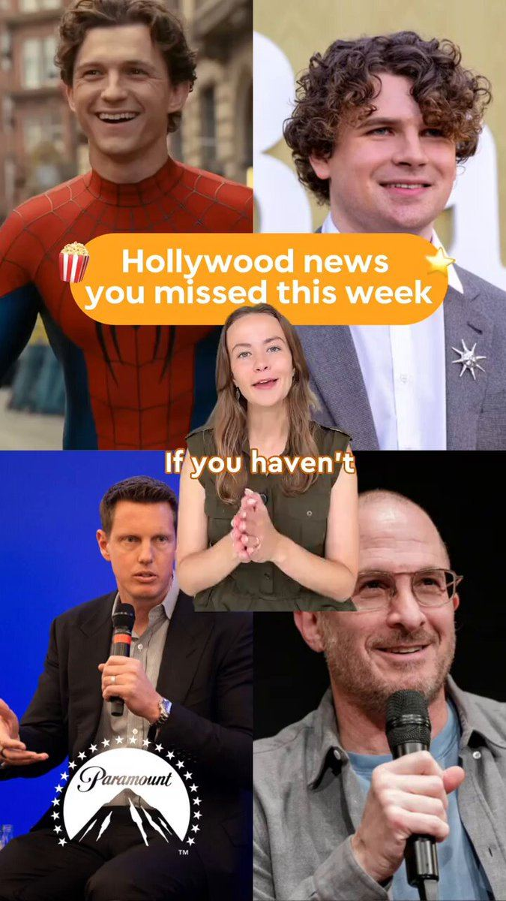

# 18 · Green-screen reaction & comment reply

<!-- HERO:START -->

**[See the example and how to make it →](EXAMPLE.md)** · [watch on X](https://x.com/claireonvideo/status/2098103517680402637)
<!-- HERO:END -->

## Looks like
Creator in front of a green-screen background showing **LC's own winning ad/post** (or a screenshot of a viral comment), reacting/explaining. Comment-reply: TikTok/IG comment bubble sticker ("does this actually survive the ocean??") + answer video.

## LC scripts
A. Creator over LC's top ad: "This ad has been following you, so let me tell you what they don't say…" (honest review).
B. Comment bubble "it's not real gold lol" → Qirra: "Correct! It's 14K PVD — here's why that's better for everyday…" + test.
C. Green-screen over a Google search "why does my jewelry turn green" → explanation → LC.

## Test/metric
Overlay 3 comment-reply variants on the current top 2 winners (new Entity IDs). CPA; Omni.

## Compliance
[_COMPLIANCE.md](../_COMPLIANCE.md). Only react to LC's own assets or public comments (no other brands' videos); real comments only.

<!-- EVIDENCE:START -->
## Evidence from X discovery (auto-generated)

| Date | Author | Post | Engagement | Grade | Gist |
|---|---|---|---|---|---|
| 2026-09-09 | [@adamtaylorl](https://x.com/adamtaylorl) | [link](https://x.com/adamtaylorl/status/2097641383355879452) | 139L/203BM/13kV | VALUE | Tier list of ecom formats: F = AI UGC, street interviews, read scripts; B = founder, testimonial compilations, listicle statics... |
| 2026-09-06 | [@CEO_Vlad](https://x.com/CEO_Vlad) | [link](https://x.com/CEO_Vlad/status/2096569603761827953) | 88L/169BM/5kV | VALUE | AI UGC formats tiered: S = podcast, talking head, in-car... |
| 2026-08-10 | [@adamtaylorl](https://x.com/adamtaylorl) | [link](https://x.com/adamtaylorl/status/2086814826177679660) | 36L/36BM/3kV | VALUE | Dead in 2026: polished studio, "hey guys" UGC, discount statics, founder-story VSLs. Printing: ugly advertorial statics, long-form yapper, comment-reply hooks, us-vs-them statics. |
| 2026-08-01 | [@williamkast_](https://x.com/williamkast_) | [link](https://x.com/williamkast_/status/2083616523134841035) | 12L/14BM/1kV | VALUE | 15 formats to repackage winners into (scaled to $30k/day on 3-4 angles): founder, yapper, AI animation, voiceless overlay, carousel, reply ad, text wall, review static, camouflage. |
| 2026-09-24 | [@Ecombos_Ai](https://x.com/Ecombos_Ai) | [link](https://x.com/Ecombos_Ai/status/2103180929057407425) | 28L/26BM/2kV | SOME | 10 AI UGC styles: talking-head testimonial, product-in-hand, first-try reaction, fake podcast, street interview, comment reply, unboxing, DITL/GRWM, before/after, whiteboard. |
<!-- EVIDENCE:END -->
