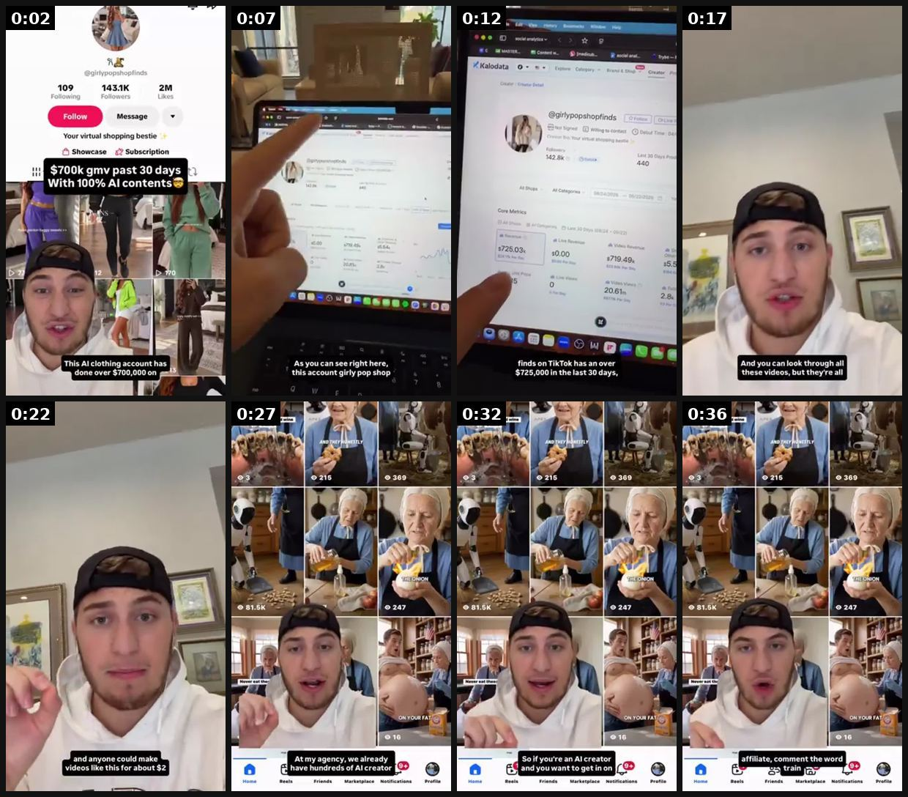
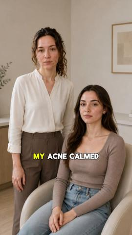
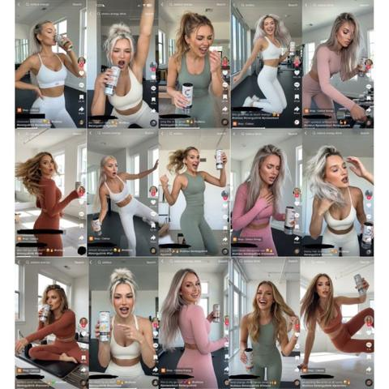
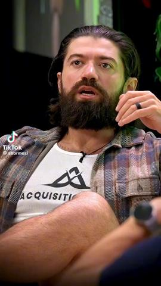
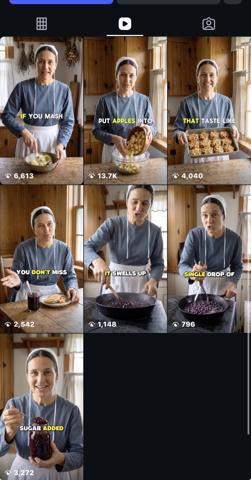
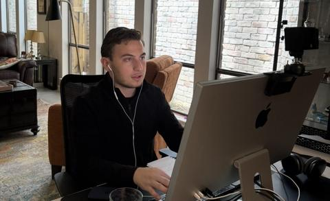

# 19 · TikTok Shop affiliate shoppable demo (real creators, sample seeding): see it, then make it

[](https://x.com/maverickecom/status/2103161679421071603)

**The example:** [@maverickecom on X](https://x.com/maverickecom/status/2103161679421071603) · 0:39 video · 57 likes, 6K views

**Watch it:** [open the post on X](https://x.com/maverickecom/status/2103161679421071603) · [play the video file](https://video.twimg.com/amplify_video/2103161614404820993/vid/avc1/320x568/F1OVje-f1ulHjrS0.mp4?tag=29)

> This tiktok shop affiliate made $724k in GMV last 30 days 😵 3 out the top 10 tiktok shop affiliates in the last 30 days are ai 🤯 We are scaling with tiktok shop and ai for 8-9 figure brands rn 🚀 https://t.co/pJtZK8Mrsg https://t.co/ozon73dSu5

## What you are seeing

A TikTok Shop affiliate explainer: the creator's profile and GMV dashboard ($100K+ in 30 days), then the creator talking to camera, then a grid of the many accounts posting the same shoppable product videos.

## Beat by beat

The storyboard above samples the video every 0:04. Lines are the transcript for that stretch; on-screen text comes from OCR, so treat it as rough.

| Frame | Time | On screen | Said / sung |
|---|---|---|---|
| 1 | 0:00–0:04 | 109 143.1K 2M Message Your virtual shopping … past 30 days With 100% … clothing account has done over $700,000 on | This AI clothing account has done over $700,000 on TikTok shop in the last 30 days. As you can |
| 2 | 0:04–0:09 | a a 2-0 … As you can see right here, this account girly pop shop | see right here, this count girly pop shop finds on TikTok has done over $725,000 in the last 30 |
| 3 | 0:09–0:14 | $725.03, $0.00 $719.49, 9.9 20.61 28 finds on … has an over $725,000 in the last 30 days, | · |
| 4 | 0:14–0:19 | we And you can look through all these videos, but they're all | days, which is about $25,000 per day. And you can look through all these videos, but they're |
| 5 | 0:19–0:24 | · | all relatively easy to make about eight to 10 seconds long. And anyone could make videos like |
| 6 | 0:24–0:29 | a as 81.5K 247 … Never eat the- ON YOUR FAT. … a a At my agency, we already have hundreds of … Friends Marketplace Notifications | this for about $2 each. At my agency, we already have hundreds of AI creator accounts |
| 7 | 0:29–0:34 | vines EVA 2165 369 … est thee: we ON YOUR FAT. … Friends Marketplace Notifications | tapping in with brands and getting 300% commission. So if you're an AI creator and you want to get |
| 8 | 0:34–0:39 | a ears of … iN 7215 369 … 81.5K 247 of a … ON YOUR FAT, … affiliate, comment the word train Reel: Friends Marketplace | in on this opportunity right now with AI and TikTok shop affiliate, comment the word train, I'll send you the invite for free to join. |

<details><summary>Full transcript (timestamped)</summary>

- `0:00` This AI clothing account has done over $700,000 on TikTok shop in the last 30 days. As you can
- `0:06` see right here, this count girly pop shop finds on TikTok has done over $725,000 in the last 30
- `0:13` days, which is about $25,000 per day. And you can look through all these videos, but they're
- `0:17` all relatively easy to make about eight to 10 seconds long. And anyone could make videos like
- `0:22` this for about $2 each. At my agency, we already have hundreds of AI creator accounts
- `0:27` tapping in with brands and getting 300% commission. So if you're an AI creator and you want to get
- `0:32` in on this opportunity right now with AI and TikTok shop affiliate, comment the word train,
- `0:37` I'll send you the invite for free to join.

</details>

## More real examples (5)

Other posts that show this format, or a close cousin of it. Click a thumbnail to open it on X.

| | | |
|---|---|---|
| [](https://x.com/maverickecom/status/2079593540380684296)<br>**@maverickecom** · 0:40 video · 10K views<br>550 AI videos/day via AI affiliate army (bulk-account; not compliant). | [](https://x.com/maverickecom/status/2107470108515782720)<br>**@maverickecom** · image · 11K views<br>Repurpose winning TTS content across hundreds of creator-style accounts (bulk-account; not compliant). | [](https://x.com/maverickecom/status/2103191756153962752)<br>**@maverickecom** · 0:43 video · 17K views<br>Hormozi loves affiliate marketing. In ecom the proper method for affiliate marketing is scaling an affiliate army. Here’s what that actually means — a |
| [](https://x.com/maverickecom/status/2103878538851950958)<br>**@maverickecom** · image · 2K views<br>GPT Astra + Fastmoss + Manus + Omni Flow = AI Content Factory We built a fully automated system that repurposes, localizes, and launches winning TikTo | [](https://x.com/maverickecom/status/2078105645757178124)<br>**@maverickecom** · images · 2K views<br>4 years and over $1M GMV into TikTok Shop, here's what I've been surprised to learn. 1. Products must be new, in season, or niche. Videos must be inte |   |

## How to make one like it

**The format in one line:** 15-40s creator video with orange shopping cart: unboxing → put on → water test → "linked below / tap the cart". One hook per video pulled from real reviews (@maverickecom). Seed widely: 1,000 free samples/month (@NotZainAgain playbook); creators doing 4+ ads get their own ad set (@zachlduncan Trybe structure); use Trybe as a **performance** platform, not gifting (@httpsean_ca).

**Contents:** [1. Structure](#1-copy-the-structure) · [2. Shot by shot](#2-shot-by-shot-remake) · [3. Script and hooks](#3-write-the-script) · [4. Prompts](#4-prompts) · [5. Tools and settings](#5-tools-and-settings) · [6. Louise Carter remake](#6-louise-carter-remake) · [7. Variants and test](#7-variants-and-test-plan) · [8. Pitfalls](#8-pitfalls)

### 1. Copy the structure

Use the example's timing as your beat sheet. Keep the beat, change the words and the product.

| Beat | Time | In the example | Your version |
|---|---|---|---|
| 1 | 0:02 | This AI clothing account has done over $700,000 on TikTok shop in the last 30 days. As you can | … |
| 2 | 0:07 | see right here, this count girly pop shop finds on TikTok has done over $725,000 in the last 30 | … |
| 3 | 0:12 | see right here, this count girly pop shop finds on TikTok has done over $725,000 in the last 30 | … |
| 4 | 0:17 | days, which is about $25,000 per day. And you can look through all these videos, but they're | … |
| 5 | 0:22 | all relatively easy to make about eight to 10 seconds long. And anyone could make videos like | … |
| 6 | 0:27 | this for about $2 each. At my agency, we already have hundreds of AI creator accounts tapping in with brands and getting 300% commission. So | … |
| 7 | 0:32 | tapping in with brands and getting 300% commission. So if you're an AI creator and you want to get in on this opportunity right now with AI | … |
| 8 | 0:36 | in on this opportunity right now with AI and TikTok shop affiliate, comment the word train, I'll send you the invite for free to join. | … |

### 2. Shot-by-shot remake

**Target length / size:** 15-40s, 1080x1920, TikTok Shop product link

| # | Time / slot | What we see (visual + camera) | Dialogue / on-screen text |
|---|---|---|---|
| 1 | 0-2s | Hook: product in hand to camera, or the water test already happening | Hook pulled from a real review: "I wore this in the pool for a week" |
| 2 | 2-10s | Unboxing: box, packaging, clasp close-up | "it comes like this, gift-ready" |
| 3 | 10-25s | Put it on, water test under the tap, rub it | "no green, no fading" |
| 4 | 25-35s | Point down at the orange cart | "it's linked below, tap the cart" |

### 3. Write the script

Then fill the beats from the table above. Pull the wording from real customer reviews, not from ad copy: a review line beats a copywriter line almost every time. Read every line out loud and cut anything you would not say to a friend. Ready-made Louise Carter scripts are in section 6; hand [BOT.md](BOT.md) to any AI agent to write versions for another brand.

### 4. Prompts

**Creator brief**

```text
Film vertical 1080p, 15-40s. Start with the water test or a real review line. Show the price and the cart in the last 5s. Use TikTok Shop product link. No medical or "never tarnishes forever" claims.
```

### 5. Tools and settings

TikTok Shop listing + open/targeted collaborations; commission 15-25%; sample requests auto-approve for creators with >X GMV; weekly creator brief with top 5 hooks; Spark-code the top 10 videos.

| Setting | Value |
|---|---|
| Canvas | 1080×1920 (9:16) master; crop a 1080×1350 (4:5) cut for feed placements |
| Frame rate | 30 fps (shoot 60 fps for slow-motion water or sparkle shots) |
| Camera | Phone main lens at 1x, exposure locked on skin, HDR off, grid on; tripod or a phone clamp for product shots |
| Light | One soft key at 45° (window or ring light), white card as fill; side light for metal sparkle |
| Audio | Lavalier or phone 15–20 cm from the mouth; mix voice at -14 LUFS, music at -28 to -30 dB under voice |
| Captions | Burned in, 2–5 words per line, 64–80 px bold sans, white with a black stroke or pill; keep text inside the safe zone (top 220 px and bottom 420 px clear, 64 px side margins) |
| Pacing | A visual change every 1.5–3 s; the hook lands in the first 1.5 s with no logo intro |
| Edit / export | CapCut or Premiere; H.264, 12–20 Mbps, AAC 320 kbps; upload natively to each platform, not via links |

### 6. Louise Carter remake

A. "Unboxing the $85 stack TikTok made me buy" → builds 7 on camera → sink water test.
B. "Jewelry you can swim in? Testing it in my pool." 
C. "Gift idea: matching waterproof initials for my bridesmaids."

Brand rules, claims you can and cannot make, and more scripts: [brands/louise-carter.md](brands/louise-carter.md). Step-by-step from idea to scale: [STAGES.md](STAGES.md).

### 7. Variants and test plan

**Test plan:** GMV, affiliate CAC, Omni `tiktok` platform revenue; halo on Shopify branded search.

**Naming:** `F19-<variant>-<hook##>-<date>` so results map back to this folder. Change one thing per test (hook, narrator, length or offer), never two.

### 8. Pitfalls

- Seed samples to many small creators instead of a few big ones; most affiliate GMV comes from volume.
- Creators must use the Shop disclosure; no unverified claims.
- Demo the one thing the reviews praise; long feature lists do not convert on Shop.
- Slow open: if the first 1.5 s does not show the hook visually, most people swipe.
- Logo or brand intro at the start reads as an ad; put the brand at the end.
- Captions covered by the platform UI: check the safe zone on a real phone before posting.
- Music over the voice: keep music at least 14 dB under speech.

**Compliance:** [_COMPLIANCE.md](../_COMPLIANCE.md). **Not** "hundreds of AI creator-style accounts" (@maverickecom's posts describe this; it violates TikTok authenticity/bulk-account rules). Creators toggle commercial content disclosure.

## More examples

Every post we found for this format, with transcripts: [examples/](examples/README.md). Playbook: [README.md](README.md). Agent brief: [BOT.md](BOT.md).
