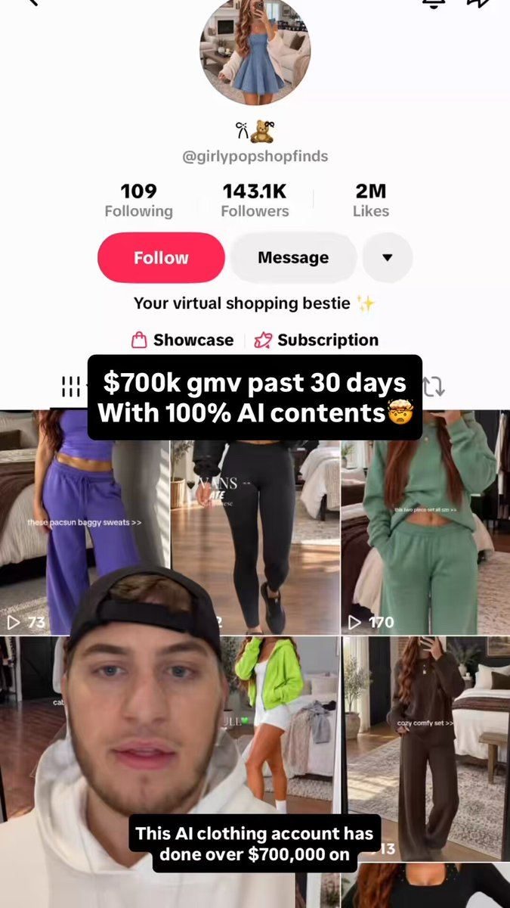

# 19 · TikTok Shop affiliate shoppable demo

<!-- HERO:START -->

**[See the example and how to make it →](EXAMPLE.md)** · [watch on X](https://x.com/maverickecom/status/2103161679421071603)
<!-- HERO:END -->

## Looks like
15-40s creator video with orange shopping cart: unboxing → put on → water test → "linked below / tap the cart". One hook per video pulled from real reviews (@maverickecom). Seed widely: 1,000 free samples/month (@NotZainAgain playbook); creators doing 4+ ads get their own ad set (@zachlduncan Trybe structure); use Trybe as a **performance** platform, not gifting (@httpsean_ca).

## LC scripts
A. "Unboxing the $85 stack TikTok made me buy" → builds 7 on camera → sink water test.
B. "Jewelry you can swim in? Testing it in my pool." 
C. "Gift idea: matching waterproof initials for my bridesmaids."

## Production
TikTok Shop listing + open/targeted collaborations; commission 15-25%; sample requests auto-approve for creators with >X GMV; weekly creator brief with top 5 hooks; Spark-code the top 10 videos.

## Metric
GMV, affiliate CAC, Omni `tiktok` platform revenue; halo on Shopify branded search.

## Compliance
[_COMPLIANCE.md](../_COMPLIANCE.md). **Not** "hundreds of AI creator-style accounts" (@maverickecom's posts describe this; it violates TikTok authenticity/bulk-account rules). Creators toggle commercial content disclosure.

<!-- EVIDENCE:START -->
## Evidence from X discovery (auto-generated)

| Date | Author | Post | Engagement | Grade | Gist |
|---|---|---|---|---|---|
| 2026-10-02 | [@maverickecom](https://x.com/maverickecom) | [link](https://x.com/maverickecom/status/2106072031687315486) | 567L/934BM/43kV | SOME | $34 product: TikTok Shop affiliates (trust) + AI affiliate pages on IG/FB to Amazon; one hook per video from reviews. |
| 2026-10-06 | [@maverickecom](https://x.com/maverickecom) | [link](https://x.com/maverickecom/status/2107470108515782720) | 190L/226BM/11kV | HYPE | Repurpose winning TTS content across hundreds of creator-style accounts (bulk-account; not compliant). |
| 2026-07-20 | [@TJ_Bongiorno](https://x.com/TJ_Bongiorno) | [link](https://x.com/TJ_Bongiorno/status/2079331861491290525) | 89L/37BM/9kV | VALUE | Guest post: seeding affiliates + creative flywheel via TikTok Shop + Trybe. |
| 2026-07-23 | [@NotZainAgain](https://x.com/NotZainAgain) | [link](https://x.com/NotZainAgain/status/2080321911918125500) | 73L/82BM/13kV | SOME | 2026 TikTok Shop playbook incl. 1,000 free samples/mo. |
| 2026-09-24 | [@maverickecom](https://x.com/maverickecom) | [link](https://x.com/maverickecom/status/2103161679421071603) | 57L/64BM/5kV | SOME | Affiliate made $724k GMV/30d; 3 of top 10 TTS affiliates are AI pages (claim). |
| 2026-07-21 | [@maverickecom](https://x.com/maverickecom) | [link](https://x.com/maverickecom/status/2079593540380684296) | 56L/61BM/10kV | HYPE | 550 AI videos/day via AI affiliate army (bulk-account; not compliant). |
| 2026-07-22 | [@NotZainAgain](https://x.com/NotZainAgain) | [link](https://x.com/NotZainAgain/status/2079765230888899036) | 24L/25BM/3kV | VALUE | 3 TikTok Shop contest types: view-based (gameable), GMV-based (free-rider risk), video-count ($100-250 for 10 videos, min-quality rules, VA review, net-30). |
<!-- EVIDENCE:END -->
