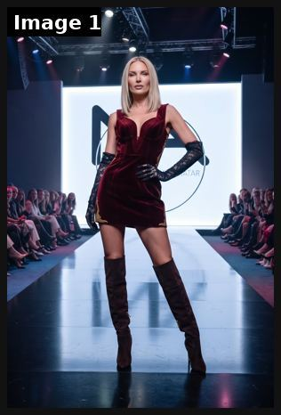
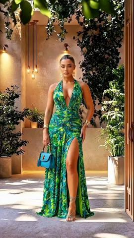
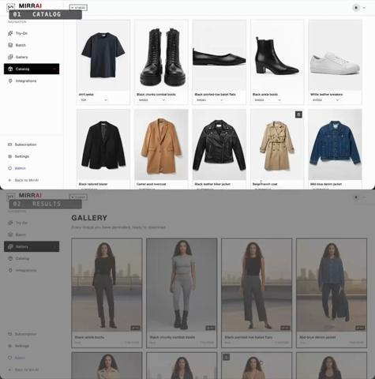

# 20 · AI model lookbook / on-body try-on (from real product photos): see it, then make it

[](https://x.com/KarinaRed123/status/2099477629078307041)

**The example:** [@KarinaRed123 on X](https://x.com/KarinaRed123/status/2099477629078307041) · 1 image · 3 likes, 230 views

**Watch it:** [open the post on X](https://x.com/KarinaRed123/status/2099477629078307041)

> Example of work: Photoshoot for a high-fashion brand. Custom runway design. Model: ALICE | 24 | Blonde - Scandinavian Type from our catalog Task: 10 product photos for online shop Result: No model booking, no studio, 24h delivery. We dress our AI models in your products. For brands who need fast e-commerce content - DM for price list. All models AI | Not real persons | Commercial use only. #Ecommerce #SwimwearBrand #…

## What you are seeing

A photoreal AI runway shot: a model in a velvet mini-dress and thigh-high boots on a lit catwalk with an audience. It is an AI "photoshoot" used as an on-body lookbook image.

## Image by image

| Image | Text on it (OCR, rough) |
|---|---|
| 1 | (mostly visual) |

## More real examples (3)

Other posts that show this format, or a close cousin of it. Click a thumbnail to open it on X.

| | | |
|---|---|---|
| [](https://x.com/MimiTheDesigner/status/2080184317771227394)<br>**@MimiTheDesigner** · 0:35 video · 2K views<br>Fashion: every model/dress in video AI-generated; boutiques advertising this way. | [](https://x.com/girlincrypto007/status/2077765449371025600)<br>**@girlincrypto007** · 1:02 video · 4K views<br>You need the right AI model for every task so you don’t burn through your limits too fast 👀 My stack is simple: > @claudeai Fable - for building a por | [](https://x.com/MirrAIHQ/status/2085708930588557789)<br>**@MirrAIHQ** · 0:20 video · 221 views<br>Every fashion brand has a folder of flat product photos. Watch what happens when you run a whole catalog through MirrAI Studio 👇 On-model try-ons for |

## How to make one like it

**The format in one line:** Diverse models wearing the exact piece in lifestyle scenes (beach, office, wedding); or a 15s photoreal UGC try-on clip generated from the product photo (prompt structure from [@Arina_hoqe](https://x.com/Arina_hoqe/status/2095071815483986241): PRODUCT · DURATION exactly 15s · STYLE photorealistic UGC · scene beats · camera · audio).

**Contents:** [1. Structure](#1-copy-the-structure) · [2. Shot by shot](#2-shot-by-shot-remake) · [3. Script and hooks](#3-write-the-script) · [4. Prompts](#4-prompts) · [5. Tools and settings](#5-tools-and-settings) · [6. Louise Carter remake](#6-louise-carter-remake) · [7. Variants and test](#7-variants-and-test-plan) · [8. Pitfalls](#8-pitfalls)

### 1. Copy the structure

The skeleton every version follows: **hook → problem or tension → turn (the product shows up) → proof → one clear ask.** The shot-by-shot below fills it in.

### 2. Shot-by-shot remake

**Target length / size:** Image set 1080x1350 (6-10 looks) or a 15s try-on clip

| # | Time / slot | What we see (visual + camera) | Dialogue / on-screen text |
|---|---|---|---|
| 1 | Look 1 | AI model in a lifestyle scene (beach, office, wedding) wearing the EXACT product composited from real product photos | Caption: occasion + piece name |
| 2 | Looks 2-6 | Different ages, skin tones and settings, same product | "wore it to work / to the beach / to her wedding" |
| 3 | Clip version | 15s photoreal try-on: hands fasten the necklace, mirror glance | Text: "how it looks on" |

### 3. Write the script

Then fill the beats from the table above. Pull the wording from real customer reviews, not from ad copy: a review line beats a copywriter line almost every time. Read every line out loud and cut anything you would not say to a friend. Ready-made Louise Carter scripts are in section 6; hand [BOT.md](BOT.md) to any AI agent to write versions for another brand.

### 4. Prompts

**Nano Banana / GPT-image (edit mode)**

```text
Place the exact necklace from image 1 on the woman in image 2, keep chain length, pendant size and gold tone identical, natural shadow on skin, do not change the jewelry design
```

**Kling / Seedance (clip)**

```text
photoreal UGC, a woman in a bright bathroom fastening a thin gold necklace, glancing in the mirror, handheld phone footage, 5s, 9:16
```

### 5. Tools and settings

Nano Banana / GPT Image edit with the real product photo as reference; QC each image against the real piece (chain link pattern, clasp, width) — reject any hallucinated detail; real photos for PDP hero.

| Setting | Value |
|---|---|
| Canvas | 1080×1350 (4:5) per slide; 1080×1920 for TikTok photo mode |
| Slides | 5–10; slide 1 is the hook only, last slide is the ask (save / follow / shop) |
| Type | 64–96 px headline per slide, one idea per slide, consistent position across slides |
| Continuity | Same template, colour and font on every slide so it reads as one piece |
| Audio (TikTok) | Add a trending sound at low volume; photo mode auto-advances |
| Tools | Canva or Figma template; Postnitro or ChatGPT for drafts; export PNG, sRGB |

### 6. Louise Carter remake

A. "One necklace, 5 skin tones" carousel. B. "Chelsea Herringbone, 4 outfits" Pinterest set. C. 15s try-on: "This is perfect. Look at this. So clean." — model clasps necklace in mirror (dramatization, labelled).

Brand rules, claims you can and cannot make, and more scripts: [brands/louise-carter.md](brands/louise-carter.md). Step-by-step from idea to scale: [STAGES.md](STAGES.md).

### 7. Variants and test plan

**Test plan:** Pinterest outbound clicks, Meta catalog CTR, Omni.

**Naming:** `F20-<variant>-<hook##>-<date>` so results map back to this folder. Change one thing per test (hook, narrator, length or offer), never two.

### 8. Pitfalls

- AI must not change the product's size, finish or design; check every image against the real piece.
- Label AI-generated models where required.
- The featured example is a fashion AI photoshoot; for jewelry, close crops of neck and wrist matter more than full-body runway shots.
- A weak first slide: nobody swipes past a boring cover.
- No reason to save: give a list, a checklist or a reference people come back to.

**Compliance:** [_COMPLIANCE.md](../_COMPLIANCE.md). Product must be accurately represented; label AI imagery; don't use real celebrities' likeness.

## Field notes

Newer observations live in the playbook: [Wave 4 update: Fedotoff October 2026 swipe boards](README.md)

## More examples

Every post we found for this format, with transcripts: [examples/](examples/README.md). Playbook: [README.md](README.md). Agent brief: [BOT.md](BOT.md).
