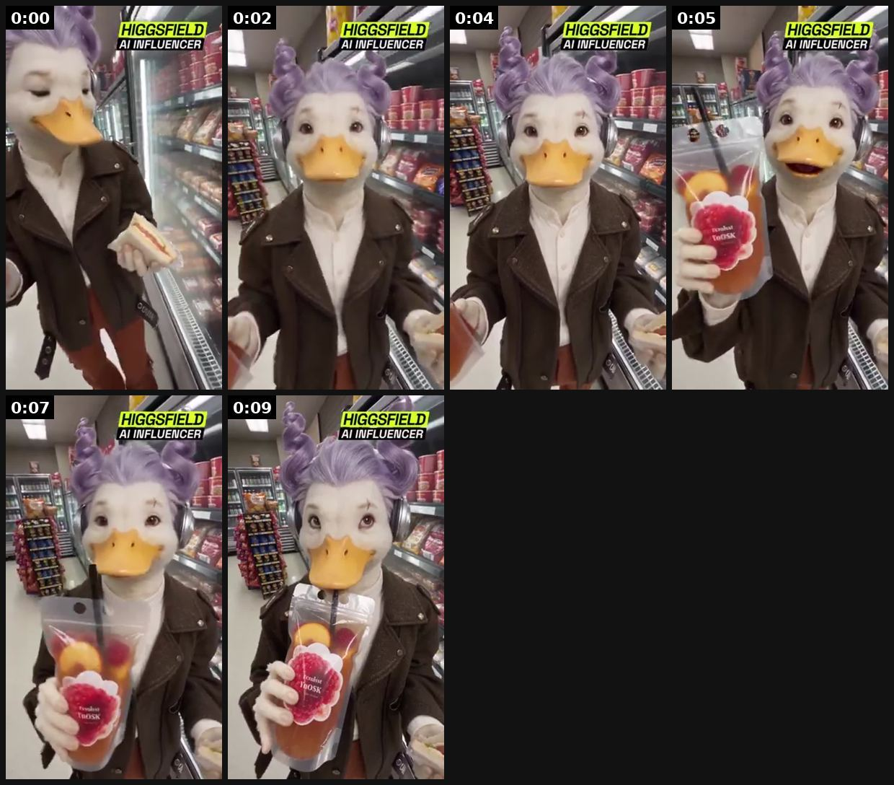
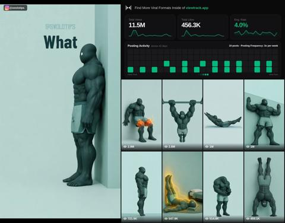

# 21 · Recurring (AI or illustrated) character / mascot page: see it, then make it

[](https://x.com/rewind02/status/2107211233405325547)

**The example:** [@rewind02 on X](https://x.com/rewind02/status/2107211233405325547) · 0:10 video · 108 likes, 4K views

**Watch it:** [open the post on X](https://x.com/rewind02/status/2107211233405325547) · [play the video file](https://video.twimg.com/amplify_video/2107211054979653632/vid/avc1/320x568/Ot8XMv3ixPAzF2Kg.mp4?tag=29)

> the only legit way to make money with an AI UGC influencer... is to sell ads to brands the trick is treating the character as a service, not a meme, but there's a smart way to set it up: - step 1: create one in Higgsfield AI Influencer with a look people recognize in half a second - step 2: pick one product niche: drinks, skincare, snacks, apps - step 3: find the most viral UGC ads in that niche and study the format:…

## What you are seeing

A recurring AI character (a duck-headed "AI influencer" in a leather jacket) walking through a store aisle and showing a drink to camera. The same character appears in every post, so the audience follows the character.

## Beat by beat

The storyboard above samples the video every 0:01. Lines are the transcript for that stretch; on-screen text comes from OCR, so treat it as rough.

| Frame | Time | On screen | Said / sung |
|---|---|---|---|
| 1 | 0:00–0:01 | · | · |
| 2 | 0:01–0:03 | a Ww Fi ta a ae SL ea oa | · |
| 3 | 0:03–0:05 | I Al ee m2: Bp ef le Se a ON | · |
| 4 | 0:05–0:06 | · | This is my third dinner. Don't judge me |
| 5 | 0:06–0:08 | te Al cane in et ae ee By #4 | · |
| 6 | 0:08–0:10 | ty av Al INFLUENCE a ay Ne a Me ow SS | · |

<details><summary>Full transcript (timestamped)</summary>

- `0:05` This is my third dinner. Don't judge me

</details>

## More real examples (5)

Other posts that show this format, or a close cousin of it. Click a thumbnail to open it on X.

| | | |
|---|---|---|
| [](https://x.com/ErnestoSOFTWARE/status/2103534688048414959)<br>**@ErnestoSOFTWARE** · 0:44 video · 95K views<br>11.5M views one faceless account; pitches Arcads automating carousels; 3-4 accounts. | [](https://x.com/MuteeAutomation/status/2107022363313279044)<br>**@MuteeAutomation** · image · 3K views<br>This channel found a crazy content loophole: Take a familiar news format → add satire → create a recurring character → keep the format consistent. The | [](https://x.com/YouTubeAut3538/status/2107104155831546119)<br>**@YouTubeAut3538** · image · 361 views<br>This channel found a crazy content loophole: Take a familiar news format → add satire → create a recurring character → keep the format consistent. The |
| [](https://x.com/AdebayoYTA/status/2107147460443275590)<br>**@AdebayoYTA** · image · 110 views<br>Familiar news format. Satire on top. One recurring character. Same shape every upload. 60–90 seconds. Millions of views across the catalog. The videos | [](https://x.com/Automation94453/status/2107048376558567547)<br>**@Automation94453** · image · 55 views<br>This channel found a crazy content loophole: Take a familiar news format → add satire → create a recurring character → keep the format consistent. The |   |

## How to make one like it

**The format in one line:** One distinctive character (odd, recognisable — accent, look, catchphrase) in short repeatable bits; motion borrowed from trending formats; same character every post builds a following ([@sairahul1](https://x.com/sairahul1/status/2107172215586513360)).

**Contents:** [1. Structure](#1-copy-the-structure) · [2. Shot by shot](#2-shot-by-shot-remake) · [3. Script and hooks](#3-write-the-script) · [4. Prompts](#4-prompts) · [5. Tools and settings](#5-tools-and-settings) · [6. Louise Carter remake](#6-louise-carter-remake) · [7. Variants and test](#7-variants-and-test-plan) · [8. Pitfalls](#8-pitfalls)

### 1. Copy the structure

Use the example's timing as your beat sheet. Keep the beat, change the words and the product.

| Beat | Time | In the example | Your version |
|---|---|---|---|
| 1 | 0:00 | (visual beat, see frame 1) | … |
| 2 | 0:02 | on screen: a Ww Fi ta a ae SL ea oa | … |
| 3 | 0:04 | This is my third dinner. Don't judge me | … |
| 4 | 0:05 | This is my third dinner. Don't judge me | … |
| 5 | 0:07 | This is my third dinner. Don't judge me | … |
| 6 | 0:09 | This is my third dinner. Don't judge me | … |

### 2. Shot-by-shot remake

**Target length / size:** 10-30s per bit, 1080x1920, same character every post

| # | Time / slot | What we see (visual + camera) | Dialogue / on-screen text |
|---|---|---|---|
| 1 | 0-2s | The character (odd, recognisable: a talking duck in a leather jacket, a grumpy gold chain) in a real-looking place | Catchphrase or a trending audio line |
| 2 | 2-15s | One bit borrowed from a trending format (POV, "tell me without telling me", store walk) | Character delivers the joke in its voice |
| 3 | 15-25s | Product appears as part of the bit, never pitched | One natural mention |
| 4 | Series rule | Same look, voice and framing every time | Pin a "who is this?" intro post |

### 3. Write the script

Then fill the beats from the table above. Pull the wording from real customer reviews, not from ad copy: a review line beats a copywriter line almost every time. Read every line out loud and cut anything you would not say to a friend. Ready-made Louise Carter scripts are in section 6; hand [BOT.md](BOT.md) to any AI agent to write versions for another brand.

### 4. Prompts

**Character sheet (Midjourney)**

```text
character design sheet, a small anthropomorphic gold necklace with expressive eyes and tiny arms, sassy personality, Pixar style, front/side/back views, white background --ar 16:9
```

**Kling / Seedance**

```text
the same character [ref image] walking down a supermarket aisle holding a drink, handheld phone footage, realistic store, 5s, 9:16
```

### 5. Tools and settings

| Setting | Value |
|---|---|
| Canvas | 1080×1920 (9:16) master; crop a 1080×1350 (4:5) cut for feed placements |
| Frame rate | 30 fps (shoot 60 fps for slow-motion water or sparkle shots) |
| Camera | Phone main lens at 1x, exposure locked on skin, HDR off, grid on; tripod or a phone clamp for product shots |
| Light | One soft key at 45° (window or ring light), white card as fill; side light for metal sparkle |
| Audio | Lavalier or phone 15–20 cm from the mouth; mix voice at -14 LUFS, music at -28 to -30 dB under voice |
| Captions | Burned in, 2–5 words per line, 64–80 px bold sans, white with a black stroke or pill; keep text inside the safe zone (top 220 px and bottom 420 px clear, 64 px side margins) |
| Pacing | A visual change every 1.5–3 s; the hook lands in the first 1.5 s with no logo intro |
| Edit / export | CapCut or Premiere; H.264, 12–20 Mbps, AAC 320 kbps; upload natively to each platform, not via links |

### 6. Louise Carter remake

A. "Goldie" — a 3D-animated sassy gold chain who refuses to come off in the shower ("not today"). B. "Grandma Lou" — illustrated grandmother giving brutally honest jewelry advice weekly. C. A clay "jewelry box" sitcom: the cheap ring that keeps turning green vs. the LC pieces.

Brand rules, claims you can and cannot make, and more scripts: [brands/louise-carter.md](brands/louise-carter.md). Step-by-step from idea to scale: [STAGES.md](STAGES.md).

### 7. Variants and test plan

**Test plan:** Follower growth, avg watch time; Omni bio link.

**Naming:** `F21-<variant>-<hook##>-<date>` so results map back to this folder. Change one thing per test (hook, narrator, length or offer), never two.

### 8. Pitfalls

- A new character every week builds nothing; the repeat is the asset.
- Do not copy an existing IP character's look.
- Post 3-5 times a week for a month before judging.
- Slow open: if the first 1.5 s does not show the hook visually, most people swipe.
- Logo or brand intro at the start reads as an ad; put the brand at the end.
- Captions covered by the platform UI: check the safe zone on a real phone before posting.
- Music over the voice: keep music at least 14 dB under speech.

**Compliance:** [_COMPLIANCE.md](../_COMPLIANCE.md). AI label; character clearly LC's; don't base on real people.

## More examples

Every post we found for this format, with transcripts: [examples/](examples/README.md). Playbook: [README.md](README.md). Agent brief: [BOT.md](BOT.md).
