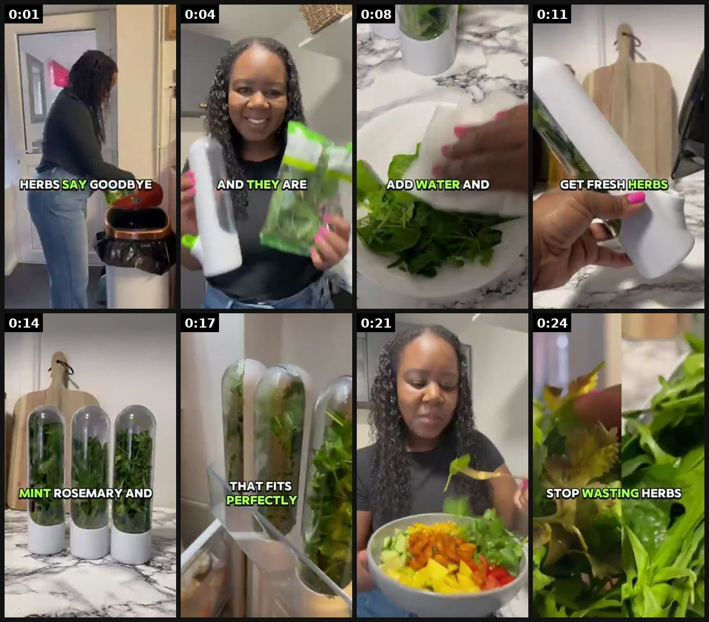
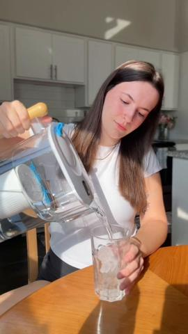
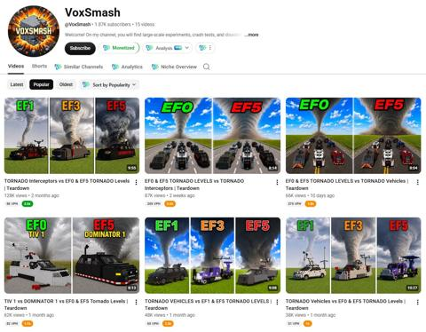
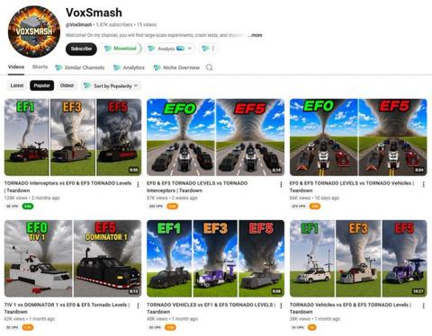

# 22 · Split-screen "two versions of the same person" day: see it, then make it

[](https://x.com/Charconsults/status/2081629763882430905)

**The example:** [@Charconsults on X](https://x.com/Charconsults/status/2081629763882430905) · 0:25 video · 3 likes, 172 views

**Watch it:** [open the post on X](https://x.com/Charconsults/status/2081629763882430905) · [play the video file](https://video.twimg.com/amplify_video/2081629688942768128/vid/avc1/320x568/lATJiGIvw83AxLjT.mp4?tag=29)

> Day 7/14 This one is an oldie, brief show the product in use and the pay off for using. This ad was very visual use before after/split screen pacing and brolls. Hello@charlotteconsults.com https://t.co/eKiJCAFica #ugcexample #contentcreator #ugc #ugclifestyle #ugccommunity https://t.co/NJHy0jjHsN

## What you are seeing

Fast UGC cuts for an herb-keeper product: wilted herbs ("HERBS SAY GOODBYE"), the creator smiling with the product, adding water, fresh mint and rosemary in the tubes ("THAT FITS PERFECTLY"), a finished salad and "STOP WASTING HERBS". The before and after sit next to each other.

## Beat by beat

The storyboard above samples the video every 0:03. Lines are the transcript for that stretch; on-screen text comes from OCR, so treat it as rough.

| Frame | Time | On screen | Said / sung |
|---|---|---|---|
| 1 | 0:00–0:03 | HERB GOODBYE a | Tired of wasting herbs? Say goodbye to waste. I found these herb saver bottles to |
| 2 | 0:03–0:06 | · | · |
| 3 | 0:06–0:09 | ADD WATER AND a | keep your herbs fresh and they are so useful. You simply rinse, add water and |
| 4 | 0:09–0:12 | · | let the bottle do the rest. The results you get fresh herbs, delicious meals and |
| 5 | 0:12–0:16 | MINT ROSEMARY AND a | they're perfect for parsley, mint, rosemary and more. They come in a compact |
| 6 | 0:16–0:19 | · | design that fits perfectly in a fridge and save space while preserving your |
| 7 | 0:19–0:22 | · | · |
| 8 | 0:22–0:25 | · | favorite herbs. Upgrade your kitchen now and order yours today and stop wasting herbs. |

<details><summary>Full transcript (timestamped)</summary>

- `0:00` Tired of wasting herbs? Say goodbye to waste. I found these herb saver bottles to
- `0:05` keep your herbs fresh and they are so useful. You simply rinse, add water and
- `0:09` let the bottle do the rest. The results you get fresh herbs, delicious meals and
- `0:13` they're perfect for parsley, mint, rosemary and more. They come in a compact
- `0:17` design that fits perfectly in a fridge and save space while preserving your
- `0:20` favorite herbs. Upgrade your kitchen now and order yours today and stop
- `0:24` wasting herbs.

</details>

## More real examples (4)

Other posts that show this format, or a close cousin of it. Click a thumbnail to open it on X.

| | | |
|---|---|---|
| [](https://x.com/creativesbycare/status/2099292610175361351)<br>**@creativesbycare** · 0:55 video · 114 views<br>If you're a smart brand... Here is one of the formats you'll start testing now, to avoid scrambling in Q4! (part 1/4) ⭐️ READING REVIEWS ⭐️ Social pro | [](https://x.com/DailyYTNiches/status/2096979805346673029)<br>**@DailyYTNiches** · image · 7K views<br>This channel hasn't even had a single flop video 👀 ~ 1.86k subscribers ~ 547,079 total views ~ $875 in the 30 days alone (assuming a $2.59 RPM) Format | [](https://x.com/YouTubeAut3538/status/2097064734474256890)<br>**@YouTubeAut3538** · image · 633 views<br>This channel hasn't even had a single flop video. ~ 1.86k subs ~ 547,079 total views ~ $875 in the 30 days alone (assume $2.59 RPM) Format &gt; Split |
| [](https://x.com/ytaeliteacademy/status/2096998590971269290)<br>**@ytaeliteacademy** · image · 428 views<br>This channel hasn't even had a single flop video 👀 ~ 1.86k subscribers ~ 547,079 total views ~ $875 in the 30 days alone (assuming a $2.59 RPM) Format |   |   |

## How to make one like it

**The format in one line:** Left: version A of a person's day; right: version B (with product), synced timelines, captions with times.

**Contents:** [1. Structure](#1-copy-the-structure) · [2. Shot by shot](#2-shot-by-shot-remake) · [3. Script and hooks](#3-write-the-script) · [4. Prompts](#4-prompts) · [5. Tools and settings](#5-tools-and-settings) · [6. Louise Carter remake](#6-louise-carter-remake) · [7. Variants and test](#7-variants-and-test-plan) · [8. Pitfalls](#8-pitfalls)

### 1. Copy the structure

Use the example's timing as your beat sheet. Keep the beat, change the words and the product.

| Beat | Time | In the example | Your version |
|---|---|---|---|
| 1 | 0:01 | Tired of wasting herbs? Say goodbye to waste. I found these herb saver bottles to | … |
| 2 | 0:04 | Tired of wasting herbs? Say goodbye to waste. I found these herb saver bottles to keep your herbs fresh and they are so useful. You simply r | … |
| 3 | 0:08 | keep your herbs fresh and they are so useful. You simply rinse, add water and | … |
| 4 | 0:11 | let the bottle do the rest. The results you get fresh herbs, delicious meals and | … |
| 5 | 0:14 | they're perfect for parsley, mint, rosemary and more. They come in a compact | … |
| 6 | 0:17 | they're perfect for parsley, mint, rosemary and more. They come in a compact design that fits perfectly in a fridge and save space while pre | … |
| 7 | 0:21 | design that fits perfectly in a fridge and save space while preserving your favorite herbs. Upgrade your kitchen now and order yours today a | … |
| 8 | 0:24 | favorite herbs. Upgrade your kitchen now and order yours today and stop wasting herbs. | … |

### 2. Shot-by-shot remake

**Target length / size:** 15-30s, 1080x1920, left/right split

| # | Time / slot | What we see (visual + camera) | Dialogue / on-screen text |
|---|---|---|---|
| 1 | 0-2s | Split screen, same person twice, timestamps top ("7:00 AM") | Hook: "same girl, two jewelry boxes" |
| 2 | 2-20s | Synced timelines: left takes jewelry off to shower/swim, loses an earring; right keeps it on | Time captions advance together (7:00 / 12:30 / 18:00) |
| 3 | 20-30s | End: left frustrated, right getting compliments | Product + offer on the right side |

### 3. Write the script

Then fill the beats from the table above. Pull the wording from real customer reviews, not from ad copy: a review line beats a copywriter line almost every time. Read every line out loud and cut anything you would not say to a friend. Ready-made Louise Carter scripts are in section 6; hand [BOT.md](BOT.md) to any AI agent to write versions for another brand.

### 4. Prompts

**Shoot**

```text
Tripod, locked camera, shoot both versions with the same framing and light, edit side by side in CapCut (Layout > Split), 2px white divider.
```

### 5. Tools and settings

| Setting | Value |
|---|---|
| Canvas | 1080×1920 (9:16) master; crop a 1080×1350 (4:5) cut for feed placements |
| Frame rate | 30 fps (shoot 60 fps for slow-motion water or sparkle shots) |
| Camera | Phone main lens at 1x, exposure locked on skin, HDR off, grid on; tripod or a phone clamp for product shots |
| Light | One soft key at 45° (window or ring light), white card as fill; side light for metal sparkle |
| Audio | Lavalier or phone 15–20 cm from the mouth; mix voice at -14 LUFS, music at -28 to -30 dB under voice |
| Captions | Burned in, 2–5 words per line, 64–80 px bold sans, white with a black stroke or pill; keep text inside the safe zone (top 220 px and bottom 420 px clear, 64 px side margins) |
| Pacing | A visual change every 1.5–3 s; the hook lands in the first 1.5 s with no logo intro |
| Edit / export | CapCut or Premiere; H.264, 12–20 Mbps, AAC 320 kbps; upload natively to each platform, not via links |

### 6. Louise Carter remake

A. "Taking jewelry off before every shower/gym/beach" (left: fumbling, losing earring) vs "never taking it off" (right). B. "Getting ready: 15 min choosing jewelry" vs "3-piece stack, 10 seconds". C. "Vacation with real gold (anxious, hotel safe)" vs "vacation with LC (swimming in it)".

Brand rules, claims you can and cannot make, and more scripts: [brands/louise-carter.md](brands/louise-carter.md). Step-by-step from idea to scale: [STAGES.md](STAGES.md).

### 7. Variants and test plan

**Test plan:** Hook rate, CPA; [_COMPLIANCE.md](../_COMPLIANCE.md).

**Naming:** `F22-<variant>-<hook##>-<date>` so results map back to this folder. Change one thing per test (hook, narrator, length or offer), never two.

### 8. Pitfalls

- Unsynced timing between halves confuses viewers; keep the beats aligned.
- Do not exaggerate the "without" side into a false claim about other products.
- Slow open: if the first 1.5 s does not show the hook visually, most people swipe.
- Logo or brand intro at the start reads as an ad; put the brand at the end.
- Captions covered by the platform UI: check the safe zone on a real phone before posting.
- Music over the voice: keep music at least 14 dB under speech.

**Compliance:** Hook rate, CPA; [_COMPLIANCE.md](../_COMPLIANCE.md).

## Field notes

Newer observations live in the playbook: [Wave 3 update: AI debate split-screen (Oct 2026)](README.md)

## More examples

Every post we found for this format, with transcripts: [examples/](examples/README.md). Playbook: [README.md](README.md). Agent brief: [BOT.md](BOT.md).
