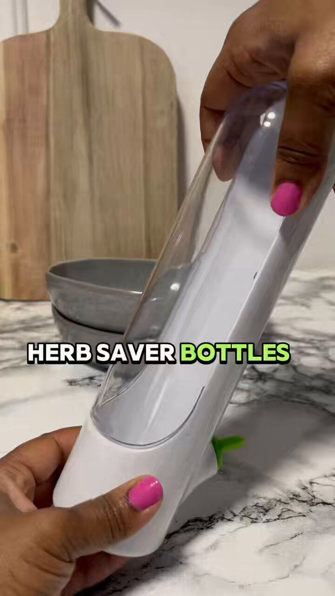

# 22 · Split-screen two versions

<!-- HERO:START -->

**[See the example and how to make it →](EXAMPLE.md)** · [watch on X](https://x.com/Charconsults/status/2081629763882430905)
<!-- HERO:END -->

## Looks like
Left: version A of a person's day; right: version B (with product), synced timelines, captions with times.

## LC scripts
A. "Taking jewelry off before every shower/gym/beach" (left: fumbling, losing earring) vs "never taking it off" (right). B. "Getting ready: 15 min choosing jewelry" vs "3-piece stack, 10 seconds". C. "Vacation with real gold (anxious, hotel safe)" vs "vacation with LC (swimming in it)".

## Metric/compliance
Hook rate, CPA; [_COMPLIANCE.md](../_COMPLIANCE.md).

<!-- EVIDENCE:START -->
## Wave 3 update: AI debate split-screen (Oct 2026)
- "Almost every winner in our scaling CBO this month is AI debate": not an interview but an argument; extreme character contrast (young girl vs old man, karen vs Gen-Z skater); outdoors (park, street), not a podcast set; a layer of rage-bait; split screen beats cutting back and forth; then move the same character into a podcast talking about the debate ([@thankyouecom](https://x.com/thankyouecom/status/2093386984349700402)).
- LC: split-screen debate "real gold or nothing" (older woman) vs "I shower in mine" (25-year-old) at a beach boardwalk; keep it playful, no product bashing.

## Evidence from X discovery (auto-generated)

| Date | Author | Post | Engagement | Grade | Gist |
|---|---|---|---|---|---|
| 2026-09-06 | [@CEO_Vlad](https://x.com/CEO_Vlad) | [link](https://x.com/CEO_Vlad/status/2096569603761827953) | 88L/169BM/5kV | VALUE | AI UGC formats tiered: S = podcast, talking head, in-car... |
<!-- EVIDENCE:END -->
