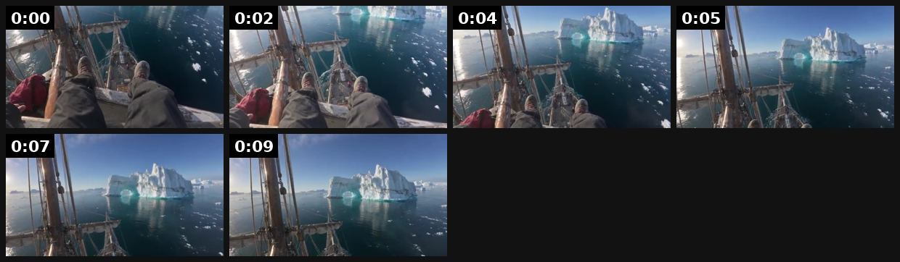
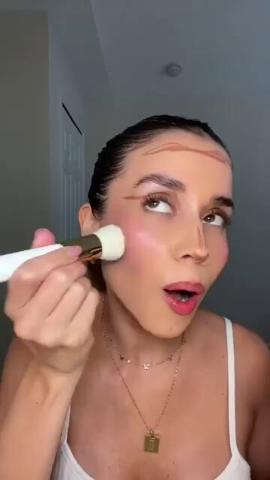
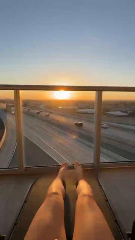

# 23 · Hyper-real first-person POV footage: see it, then make it

[](https://x.com/spwfeijen/status/2105648964716380197)

**The example:** [@spwfeijen on X](https://x.com/spwfeijen/status/2105648964716380197) · 0:10 video · 46 likes, 5K views

**Watch it:** [open the post on X](https://x.com/spwfeijen/status/2105648964716380197) · [play the video file](https://video.twimg.com/amplify_video/2105648735929696258/vid/avc1/640x360/v3W3K8QWC50FDmfK.mp4?tag=29)

> 100% Hyper-Realistic First-Person Footage... one of the biggest conversion unlockers right now is ditching obvious CGI looks for raw, ultra-realistic visual tension. the easiest way to keep watch time near 100% is building a narrative hook around a high-stakes, real-world perspective that triggers immediate vertigo and curiosity. hook them in the first 2 seconds with pure, authentic detail: - worn hiking boots dangli…

## What you are seeing

A hyper-real first-person POV clip: the camera is the viewer's eyes, standing on a ship's deck looking out over the sea, with no cuts away from the POV.

## Beat by beat

The storyboard above samples the video every 0:01. Lines are the transcript for that stretch; on-screen text comes from OCR, so treat it as rough.

| Frame | Time | On screen | Said / sung |
|---|---|---|---|
| 1 | 0:00–0:01 | in pos ye oy ww poe. ae | · |
| 2 | 0:01–0:03 | Be a my Ve wo a Eq im a pa | · |
| 3 | 0:03–0:05 | a5 wes Rae ie 33 | · |
| 4 | 0:05–0:06 | · | · |
| 5 | 0:06–0:08 | · | · |
| 6 | 0:08–0:10 | · | · |

## More real examples (3)

Other posts that show this format, or a close cousin of it. Click a thumbnail to open it on X.

| | | |
|---|---|---|
| [](https://x.com/LordofAds/status/1905654783823782374)<br>**@LordofAds** · 0:42 video · 32 views<br>🛡️Creative #1: First Person POV Example An influencer takes the audience through her makeup routine using OGEE contour products. The ad-libs and comme | [](https://x.com/DeQueenofSpaces/status/2100177884975612016)<br>**@DeQueenofSpaces** · 0:12 video · 2K views<br>First-person POV vs Third-person POV. Welcome back to this week's AI Creation Lab, where we're exploring Point of View. For this experiment, I created | [](https://x.com/MarketingE80034/status/2101990359379099861)<br>**@MarketingE80034** · 0:39 video · 13 views<br>One product photo. One prompt. A cinematic POV ad in seconds 🎬 No camera, no studio, no models. Here's the exact AI workflow 👇 #AIVideo #AIMarketing # |

## How to make one like it

**The format in one line:** Camera = viewer's eyes; hands wearing the product doing real things; a narrative tension (will it survive?).

**Contents:** [1. Structure](#1-copy-the-structure) · [2. Shot by shot](#2-shot-by-shot-remake) · [3. Script and hooks](#3-write-the-script) · [4. Prompts](#4-prompts) · [5. Tools and settings](#5-tools-and-settings) · [6. Louise Carter remake](#6-louise-carter-remake) · [7. Variants and test](#7-variants-and-test-plan) · [8. Pitfalls](#8-pitfalls)

### 1. Copy the structure

Use the example's timing as your beat sheet. Keep the beat, change the words and the product.

| Beat | Time | In the example | Your version |
|---|---|---|---|
| 1 | 0:00 | on screen: in pos ye oy ww poe. ae | … |
| 2 | 0:02 | on screen: Be a my Ve wo a Eq im a pa | … |
| 3 | 0:04 | on screen: a5 wes Rae ie 33 | … |
| 4 | 0:05 | (visual beat, see frame 4) | … |
| 5 | 0:07 | (visual beat, see frame 5) | … |
| 6 | 0:09 | (visual beat, see frame 6) | … |

### 2. Shot-by-shot remake

**Target length / size:** 8-30s, 1080x1920, first-person

| # | Time / slot | What we see (visual + camera) | Dialogue / on-screen text |
|---|---|---|---|
| 1 | 0-3s | Camera at eye level as the viewer's eyes; hands wearing the product enter frame | Tension caption: "will it survive a week on a boat?" |
| 2 | 3-20s | Real actions: diving, showering, lifting, cooking. No cutaways to a presenter | Minimal text, ambient sound |
| 3 | 20-end | Hands in close-up, product unchanged | "day 7." + brand |

### 3. Write the script

Then fill the beats from the table above. Pull the wording from real customer reviews, not from ad copy: a review line beats a copywriter line almost every time. Read every line out loud and cut anything you would not say to a friend. Ready-made Louise Carter scripts are in section 6; hand [BOT.md](BOT.md) to any AI agent to write versions for another brand.

### 4. Prompts

**Real shoot**

```text
Chest or head mount (GoPro/Insta360 or iPhone on a chest rig), 4K 60fps, horizon lock on.
```

**AI (Veo 3 / Kling)**

```text
first-person POV footage, the viewer's own hands with a thin gold bracelet reaching into the sea from a boat deck, sunlight, realistic, slight motion, 6s, 9:16
```

### 5. Tools and settings

Real GoPro/phone chest-mount (preferred) — AI only for impossible shots, labelled.

| Setting | Value |
|---|---|
| Canvas | 1080×1920 (9:16) master; crop a 1080×1350 (4:5) cut for feed placements |
| Frame rate | 30 fps (shoot 60 fps for slow-motion water or sparkle shots) |
| Camera | Phone main lens at 1x, exposure locked on skin, HDR off, grid on; tripod or a phone clamp for product shots |
| Light | One soft key at 45° (window or ring light), white card as fill; side light for metal sparkle |
| Audio | Lavalier or phone 15–20 cm from the mouth; mix voice at -14 LUFS, music at -28 to -30 dB under voice |
| Captions | Burned in, 2–5 words per line, 64–80 px bold sans, white with a black stroke or pill; keep text inside the safe zone (top 220 px and bottom 420 px clear, 64 px side margins) |
| Pacing | A visual change every 1.5–3 s; the hook lands in the first 1.5 s with no logo intro |
| Edit / export | CapCut or Premiere; H.264, 12–20 Mbps, AAC 320 kbps; upload natively to each platform, not via links |

### 6. Louise Carter remake

A. POV: diving off a boat wearing rings, surfacing, looking at hands. B. POV: getting ready in the morning, adding pieces one by one to a stack, caption countdown. C. POV: kneading dough/gardening/washing dishes with rings on → rinse → still gold.

Brand rules, claims you can and cannot make, and more scripts: [brands/louise-carter.md](brands/louise-carter.md). Step-by-step from idea to scale: [STAGES.md](STAGES.md).

### 7. Variants and test plan

**Test plan:** Hold rate; [_COMPLIANCE.md](../_COMPLIANCE.md).

**Naming:** `F23-<variant>-<hook##>-<date>` so results map back to this folder. Change one thing per test (hook, narrator, length or offer), never two.

### 8. Pitfalls

- AI POV must not show the product doing things it cannot; real footage for proof claims.
- Fast POV motion causes nausea; stabilise.
- Slow open: if the first 1.5 s does not show the hook visually, most people swipe.
- Logo or brand intro at the start reads as an ad; put the brand at the end.
- Captions covered by the platform UI: check the safe zone on a real phone before posting.
- Music over the voice: keep music at least 14 dB under speech.

**Compliance:** Hold rate; [_COMPLIANCE.md](../_COMPLIANCE.md).

## More examples

Every post we found for this format, with transcripts: [examples/](examples/README.md). Playbook: [README.md](README.md). Agent brief: [BOT.md](BOT.md).
