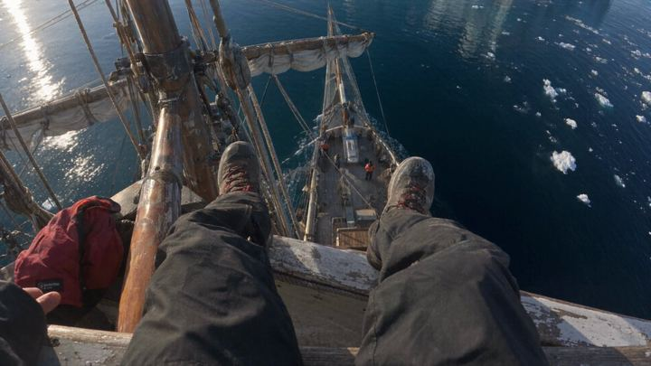

# 23 · First-person POV

<!-- HERO:START -->

**[See the example and how to make it →](EXAMPLE.md)** · [watch on X](https://x.com/spwfeijen/status/2105648964716380197)
<!-- HERO:END -->

## Looks like
Camera = viewer's eyes; hands wearing the product doing real things; a narrative tension (will it survive?).

## LC scripts
A. POV: diving off a boat wearing rings, surfacing, looking at hands. B. POV: getting ready in the morning, adding pieces one by one to a stack, caption countdown. C. POV: kneading dough/gardening/washing dishes with rings on → rinse → still gold.

## Production
Real GoPro/phone chest-mount (preferred) — AI only for impossible shots, labelled.

## Metric/compliance
Hold rate; [_COMPLIANCE.md](../_COMPLIANCE.md).

<!-- W8NOTE -->
## Wave 8 update: Voynov page, Adam Taylor teardowns, queued posts (Oct 9, 2026)
- **Third-person POV:** "When you 'sneakily' film someone else performing an action (which is staged, of course), people don't perceive it as an ad… it does not trigger their pattern-recognition system" ([Voynov](https://x.com/LachezarVoynov/status/1996596411031277950)). Voynov's "Hidden camera" (Tumbler) is on his [29 TOF list](https://x.com/LachezarVoynov/status/2086842038457098499).
- **Secret-advantage POV (CloudSole):** pure POV that proves the product is invisible under a sock and sells dating confidence ([post](https://x.com/adamtaylorl/status/2092205349738545388)). **Loop's high-energy POV:** Tomorrowland crowds sell earplugs "nobody is searching for" ([post](https://x.com/adamtaylorl/status/2100540267937906908)). LC: festival POV, the stack through rain and a crowd.
<!-- /W8NOTE -->

<!-- EVIDENCE:START -->
## Wave 4 update: Fedotoff October 2026 swipe boards
- Skincare Tips: Mundane car-door POV (Skincare Tips), 290 days live (Native Unusual Visuals board). The "ugly ads print" thesis: weird or mundane visuals stop the scroll and long copy sells.
- Stills, how-to and LC remakes: [adlibrary/](adlibrary/README.md).

## Evidence from X discovery (auto-generated)

| Date | Author | Post | Engagement | Grade | Gist |
|---|---|---|---|---|---|
| 2026-10-01 | [@spwfeijen](https://x.com/spwfeijen) | [link](https://x.com/spwfeijen/status/2105648964716380197) | 46L/49BM/4kV | SOME | Hyper-real first-person POV footage with narrative tension keeps watch time near 100%. |
| 2026-08-24 | [@antonioventre_](https://x.com/antonioventre_) | [link](https://x.com/antonioventre_/status/2091895054755373116) | 8L/4BM/1kV | VALUE | Production rule: reaction can't be scripted — founder-customer call + POV reaction ads with live unscripted reaction. |
<!-- EVIDENCE:END -->
