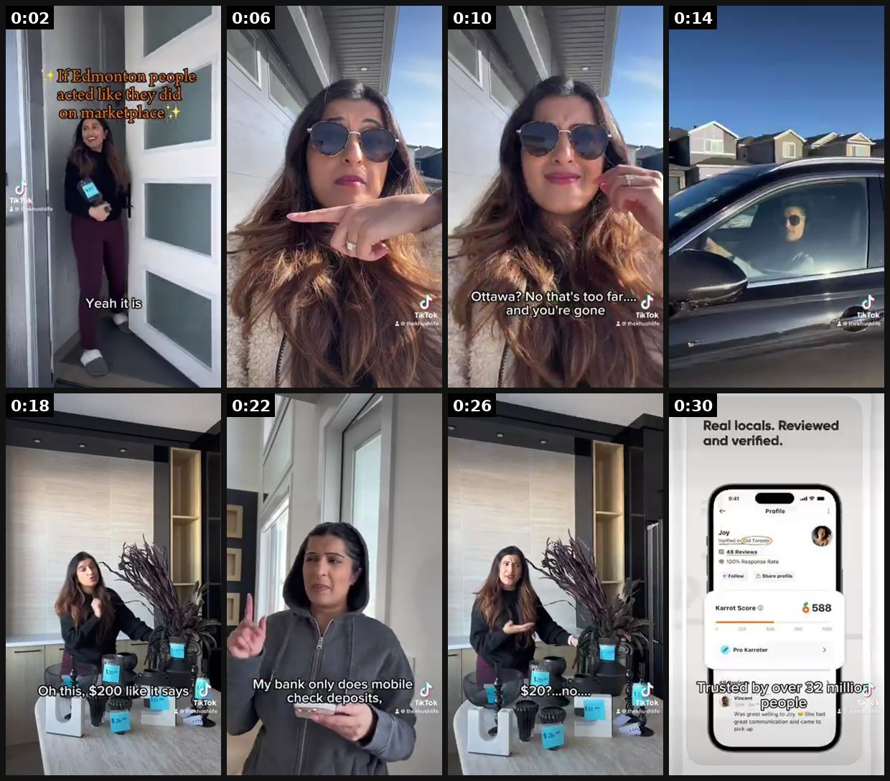

# 24 · Skit + "Beginner / Intermediate / Expert" tiers: see it, then make it

[](https://x.com/TheKhushLife/status/2079287229164442041)

**The example:** [@TheKhushLife on X](https://x.com/TheKhushLife/status/2079287229164442041) · 0:32 video · 10 likes, 467 views

**Watch it:** [open the post on X](https://x.com/TheKhushLife/status/2079287229164442041) · [play the video file](https://video.twimg.com/amplify_video/2079286426399907840/vid/avc1/320x568/a_vpOiwrdBknuhnF.mp4?tag=14)

> #ugcexample 13/30 Lately I've been doing a lot more skit ADs &amp; SUPER excited to film one at the grocery store this week!🛒 Throwback to a Karrot AD I did, 5M+ views! Skit content? I GOT U 💌 haveakhushlife@gmail.com 🔗 https://t.co/fcqFbVUikg #ugc #ugccreator #ugccommunity https://t.co/e3B7bn6R5X

## What you are seeing

A skit where one creator plays several levels of the same person (beginner, intermediate, expert) in different outfits and locations: outside a house, in sunglasses, in a car, at a desk. It ends on the app screen ("Real locals. Reviewed and verified.").

## Beat by beat

The storyboard above samples the video every 0:04. Lines are the transcript for that stretch; on-screen text comes from OCR, so treat it as rough.

| Frame | Time | On screen | Said / sung |
|---|---|---|---|
| 1 | 0:00–0:04 | · | Is the item still available? Yep, it is. |
| 2 | 0:04–0:08 | a hy af I Ve the! | Is it still available? It's still here. |
| 3 | 0:08–0:12 | fe. a Ve ae hy,’ Ottawa? No that's too fare and' you're gone | Great, can you deliver it to Ottawa? |
| 4 | 0:12–0:16 | · | Ottawa? No, that's too far and you're gone. Hey, how much is this? |
| 5 | 0:16–0:20 | · | Oh, this? Uh, 200, like it says. |
| 6 | 0:20–0:24 | My. bank only does mobile check deposits, ae | 20? That's a great deal. My bank only does mobile check deposits. |
| 7 | 0:24–0:28 | a RAN aX on -$20?...no Wi ze | Does that work for you? 20? No. |
| 8 | 0:28–0:32 | Real locals. Reviewed and verified. 9:41 GD Profile Joy wed NG 48 Reviews Rate Share profile Score 6588 Pro ted Over &2 Vas Sie had great comes and came to pick | Sound familiar? Try cared instead. Trusted by over 32 million people around the world. |

<details><summary>Full transcript (timestamped)</summary>

- `0:00` Is the item still available?
- `0:01` Yep, it is.
- `0:03` Is it still available?
- `0:06` It's still here.
- `0:07` Great, can you deliver it to Ottawa?
- `0:10` Ottawa? No, that's too far and you're gone.
- `0:14` Hey, how much is this?
- `0:16` Oh, this? Uh, 200, like it says.
- `0:20` 20? That's a great deal.
- `0:21` My bank only does mobile check deposits.
- `0:23` Does that work for you?
- `0:24` 20? No.
- `0:27` Sound familiar? Try cared instead.
- `0:29` Trusted by over 32 million people around the world.

</details>

## How to make one like it

**The format in one line:** Skit: 2-character comedic scene with a relatable problem; B-I-E: same task done at 3 skill levels, product at "expert".

**Contents:** [1. Structure](#1-copy-the-structure) · [2. Shot by shot](#2-shot-by-shot-remake) · [3. Script and hooks](#3-write-the-script) · [4. Prompts](#4-prompts) · [5. Tools and settings](#5-tools-and-settings) · [6. Louise Carter remake](#6-louise-carter-remake) · [7. Variants and test](#7-variants-and-test-plan) · [8. Pitfalls](#8-pitfalls)

### 1. Copy the structure

Use the example's timing as your beat sheet. Keep the beat, change the words and the product.

| Beat | Time | In the example | Your version |
|---|---|---|---|
| 1 | 0:02 | Is the item still available? Yep, it is. Is it still available? | … |
| 2 | 0:06 | Is it still available? It's still here. Great, can you deliver it to Ottawa? | … |
| 3 | 0:10 | Great, can you deliver it to Ottawa? Ottawa? No, that's too far and you're gone. | … |
| 4 | 0:14 | Ottawa? No, that's too far and you're gone. Hey, how much is this? | … |
| 5 | 0:18 | Hey, how much is this? Oh, this? Uh, 200, like it says. 20? That's a great deal. | … |
| 6 | 0:22 | 20? That's a great deal. My bank only does mobile check deposits. Does that work for you? | … |
| 7 | 0:26 | Does that work for you? 20? No. Sound familiar? Try cared instead. | … |
| 8 | 0:30 | Sound familiar? Try cared instead. Trusted by over 32 million people around the world. | … |

### 2. Shot-by-shot remake

**Target length / size:** 20-45s, 1080x1920

| # | Time / slot | What we see (visual + camera) | Dialogue / on-screen text |
|---|---|---|---|
| 1 | 0-2s | Title card over the creator: "Beginner vs Intermediate vs Expert: wearing gold" | - |
| 2 | Beginner (2-10s) | Creator in outfit A takes jewelry off for everything, loses an earring | Self-deprecating line |
| 3 | Intermediate (10-20s) | Outfit B, keeps a jewelry dish by the sink, still forgets | Slightly smarter line |
| 4 | Expert (20-35s) | Outfit C, showers and swims wearing the product | "Expert: never takes it off" + product name |
| 5 | End | Product close-up | Offer |

### 3. Write the script

Then fill the beats from the table above. Pull the wording from real customer reviews, not from ad copy: a review line beats a copywriter line almost every time. Read every line out loud and cut anything you would not say to a friend. Ready-made Louise Carter scripts are in section 6; hand [BOT.md](BOT.md) to any AI agent to write versions for another brand.

### 4. Prompts

**Script (Claude)**

```text
Write a 30-second beginner/intermediate/expert skit about [task]. Each tier: one costume change, one visual gag, one line. Product appears only at expert level.
```

### 5. Tools and settings

| Setting | Value |
|---|---|
| Canvas | 1080×1920 (9:16) master; crop a 1080×1350 (4:5) cut for feed placements |
| Frame rate | 30 fps (shoot 60 fps for slow-motion water or sparkle shots) |
| Camera | Phone main lens at 1x, exposure locked on skin, HDR off, grid on; tripod or a phone clamp for product shots |
| Light | One soft key at 45° (window or ring light), white card as fill; side light for metal sparkle |
| Audio | Lavalier or phone 15–20 cm from the mouth; mix voice at -14 LUFS, music at -28 to -30 dB under voice |
| Captions | Burned in, 2–5 words per line, 64–80 px bold sans, white with a black stroke or pill; keep text inside the safe zone (top 220 px and bottom 420 px clear, 64 px side margins) |
| Pacing | A visual change every 1.5–3 s; the hook lands in the first 1.5 s with no logo intro |
| Edit / export | CapCut or Premiere; H.264, 12–20 Mbps, AAC 320 kbps; upload natively to each platform, not via links |

### 6. Louise Carter remake

A. B-I-E "Jewelry stacking": Beginner one chunky necklace · Intermediate two chains tangled · Expert: 3 lengths + huggies + ring, "all waterproof so I never take it off".
B. Skit: boyfriend "babe your necklace is going to turn green" → she cannonballs into pool.
C. B-I-E "Gift-giving": Beginner gift card · Intermediate candle · Expert: matching waterproof initials.

Brand rules, claims you can and cannot make, and more scripts: [brands/louise-carter.md](brands/louise-carter.md). Step-by-step from idea to scale: [STAGES.md](STAGES.md).

### 7. Variants and test plan

**Test plan:** CPA; [_COMPLIANCE.md](../_COMPLIANCE.md).

**Naming:** `F24-<variant>-<hook##>-<date>` so results map back to this folder. Change one thing per test (hook, narrator, length or offer), never two.

### 8. Pitfalls

- Costume changes sell the tiers; a hat or glasses is enough.
- Keep each tier under 10s.
- Slow open: if the first 1.5 s does not show the hook visually, most people swipe.
- Logo or brand intro at the start reads as an ad; put the brand at the end.
- Captions covered by the platform UI: check the safe zone on a real phone before posting.
- Music over the voice: keep music at least 14 dB under speech.

**Compliance:** CPA; [_COMPLIANCE.md](../_COMPLIANCE.md).

## More examples

Every post we found for this format, with transcripts: [examples/](examples/README.md). Playbook: [README.md](README.md). Agent brief: [BOT.md](BOT.md).
