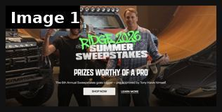

# 25 · Sweepstakes / celebrity giveaway campaign ad: see it, then make it

[](https://x.com/Seanfrank/status/2080703453853282629)

**The example:** [@Seanfrank on X](https://x.com/Seanfrank/status/2080703453853282629) · 1 image · 100 likes, 9K views

**Watch it:** [open the post on X](https://x.com/Seanfrank/status/2080703453853282629)

> Me and Tony Hawk want to give you a Lamborghini: Every year, ridge does a sweepstakes. You have watched them evolve from tiny little campaigns, to gold plated cyber trucks, to the "Mcdonalds Monopoly of Ecom" This years was the most intense, most difficult, highest lift one yet. I wanted to raise the stakes. Here is what we changed and why: 1- International parity: We run 5 different shopify stores in core markets- U…

## What you are seeing

Ridge's "2026 Summer Sweepstakes" key visual: two men next to a lifted truck under the headline "Prizes worthy of a pro", with Shop Now and Learn More buttons. A celebrity-backed giveaway is the creative.

## Image by image

| Image | Text on it (OCR, rough) |
|---|---|
| 1 | bi pa AX 6. STi! ive ot TA eA a PRIZES OF APR The 6th Annual Sweepstakes goes pro by Tony Hawk himself LEARN MORE |

## How to make one like it

**The format in one line:** Hero creative: celebrity/creator + big prize visual; entry = email/SMS (or purchase = bonus entries); countdown; recap winners. Ridge used Marden Kane / RTM Media for administration ([@couuor](https://x.com/couuor/status/2098515153654562908)). Their 2026 mix shifted toward Facebook (46.7%) and TikTok (9.1%, ROAS +361%).

**Contents:** [1. Structure](#1-copy-the-structure) · [2. Shot by shot](#2-shot-by-shot-remake) · [3. Script and hooks](#3-write-the-script) · [4. Prompts](#4-prompts) · [5. Tools and settings](#5-tools-and-settings) · [6. Louise Carter remake](#6-louise-carter-remake) · [7. Variants and test](#7-variants-and-test-plan) · [8. Pitfalls](#8-pitfalls)

### 1. Copy the structure

The skeleton every version follows: **hook → problem or tension → turn (the product shows up) → proof → one clear ask.** The shot-by-shot below fills it in.

### 2. Shot-by-shot remake

**Target length / size:** Hero static 1080x1350 + 15s video + winner recap

| # | Time / slot | What we see (visual + camera) | Dialogue / on-screen text |
|---|---|---|---|
| 1 | Hero static | Celebrity/creator + the big prize visual | "WIN [prize]" + entry method + end date |
| 2 | Video 0-3s | Celebrity says the prize to camera | "I'm giving away..." |
| 3 | Video 3-12s | Prize B-roll + how to enter | Email/SMS entry, no purchase necessary |
| 4 | Recap ad | Real winners announced | Social proof for the next round |

### 3. Write the script

Then fill the beats from the table above. Pull the wording from real customer reviews, not from ad copy: a review line beats a copywriter line almost every time. Read every line out loud and cut anything you would not say to a friend. Ready-made Louise Carter scripts are in section 6; hand [BOT.md](BOT.md) to any AI agent to write versions for another brand.

### 4. Prompts

**Legal checklist**

```text
Official rules, no-purchase-necessary entry, eligibility, odds, sponsor address, end date; use an administrator (e.g. Marden-Kane) for US sweepstakes.
```

### 5. Tools and settings

| Setting | Value |
|---|---|
| Canvas | 1080×1920 (9:16) master; crop a 1080×1350 (4:5) cut for feed placements |
| Frame rate | 30 fps (shoot 60 fps for slow-motion water or sparkle shots) |
| Camera | Phone main lens at 1x, exposure locked on skin, HDR off, grid on; tripod or a phone clamp for product shots |
| Light | One soft key at 45° (window or ring light), white card as fill; side light for metal sparkle |
| Audio | Lavalier or phone 15–20 cm from the mouth; mix voice at -14 LUFS, music at -28 to -30 dB under voice |
| Captions | Burned in, 2–5 words per line, 64–80 px bold sans, white with a black stroke or pill; keep text inside the safe zone (top 220 px and bottom 420 px clear, 64 px side margins) |
| Pacing | A visual change every 1.5–3 s; the hook lands in the first 1.5 s with no logo intro |
| Edit / export | CapCut or Premiere; H.264, 12–20 Mbps, AAC 320 kbps; upload natively to each platform, not via links |

### 6. Louise Carter remake

A. "Win a year of jewelry + a beach trip" with a lifestyle creator partner; entry via quiz (strategy 04). B. "Bridesmaid sweepstakes: win stacks for your whole bridal party". C. Mother's Day "Nominate your mom" UGC-entry contest.

Brand rules, claims you can and cannot make, and more scripts: [brands/louise-carter.md](brands/louise-carter.md). Step-by-step from idea to scale: [STAGES.md](STAGES.md).

### 7. Variants and test plan

**Test plan:** Cost per entry, entry→purchase within 30 days (Omni), list growth (Omnisend/OneText).

**Naming:** `F25-<variant>-<hook##>-<date>` so results map back to this folder. Change one thing per test (hook, narrator, length or offer), never two.

### 8. Pitfalls

- Sweepstakes law: purchase cannot be required to enter in the US; get official rules reviewed.
- Collect consent for email/SMS properly (TCPA).
- Celebrity likeness needs a contract.
- Slow open: if the first 1.5 s does not show the hook visually, most people swipe.
- Logo or brand intro at the start reads as an ad; put the brand at the end.
- Captions covered by the platform UI: check the safe zone on a real phone before posting.
- Music over the voice: keep music at least 14 dB under speech.

**Compliance:** Use a sweepstakes administrator; official rules, no purchase necessary (US), state registration (NY/FL) for large prizes; platform promo rules. [_COMPLIANCE.md](../_COMPLIANCE.md).

## More examples

Every post we found for this format, with transcripts: [examples/](examples/README.md). Playbook: [README.md](README.md). Agent brief: [BOT.md](BOT.md).
