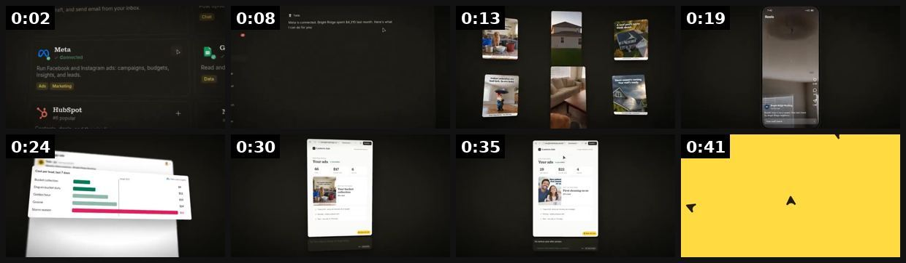
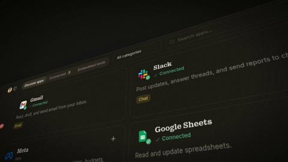
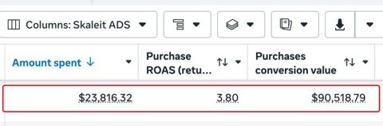
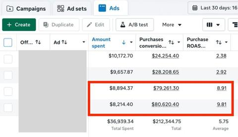

# 26 · Founder surprise customer call (+ customer-service call variant): see it, then make it

[](https://x.com/houseoffelsteve/status/2064683771484320042)

**The example:** [@houseoffelsteve on X](https://x.com/houseoffelsteve/status/2064683771484320042) · 0:10 video · 3 likes, 121 views

**Watch it:** [open the post on X](https://x.com/houseoffelsteve/status/2064683771484320042) · [play the video file](https://video.twimg.com/amplify_video/2064683635219824640/vid/avc1/320x568/ijGyWSjVzpEWFUIx.mp4?tag=27)

> **How close is this example?** Close: a playful 'we call our customers' shop clip. The gallery below has more examples.

> Calling our customers isn’t just about business, it’s about showing them why House of Felsteve is worth the visit. Premium bespoke shoes. Quality outfits. Exceptional service. Your next favorite outfit is waiting.

## What you are seeing

A 9-second clip from a bespoke shoe shop: caption "POV: calling our customers to convince them why House of Felsteve is worth a visit" over quick shots of shoe walls, racks and shelves. It plays the 'we phone our customers' idea for laughs and as a shop tour.

## Beat by beat

The storyboard above samples the video every 0:01. Lines are the transcript for that stretch; on-screen text comes from OCR, so treat it as rough.

| Frame | Time | On screen | Said / sung |
|---|---|---|---|
| 1 | 0:00–0:01 | rf WHY HOUSE OF IS WORTH VISIT. ant ie sl Za a fo a $4 Ke 2! a of Ay a | · |
| 2 | 0:01–0:03 | · | I just want the best for you, and I think that you deserve the world. |
| 3 | 0:03–0:05 | · | · |
| 4 | 0:05–0:06 | · | · |
| 5 | 0:06–0:08 | a! ae bn ee Za ig be VS aA | Thank you, so that's really all I want. |
| 6 | 0:08–0:10 | ae gg See ay ie | · |

<details><summary>Full transcript (timestamped)</summary>

- `0:00` I just want the best for you, and I think that you deserve the world.
- `0:05` Thank you, so that's really all I want.

</details>

## More real examples (5)

Other posts that show this format, or a close cousin of it. Click a thumbnail to open it on X.

| | | |
|---|---|---|
| [](https://x.com/QueenCarlo11/status/2057819667067015529)<br>**@QueenCarlo11** · 1:56 video · 95 views<br>Another day to get exciting news from @airtelmoneyug . Today our host Nichole was in studio calling our customers that received UGX 300,000 straight t | [](https://x.com/antonioventre_/status/2091592059517837677)<br>**@antonioventre_** · image · 995 views<br>Customer-SERVICE call ad: record a real pre-purchase support call answering the 5-6 questions buyers actually ask. | [](https://x.com/ecomchasedimond/status/2108225940962914650)<br>**@ecomchasedimond** · 0:44 video · 19K views<br>Your next winning Meta ad might already be sitting in a customer call, a TikTok trend, or something a competitor just posted. The problem is, all of t |
| [](https://x.com/antonioventre_/status/2107597529130873250)<br>**@antonioventre_** · image · 11K views<br>Customer service call ads are scaling like crazy for us right now If you haven't tried them yet, please do it https://t.co/laU2bgRZht | [](https://x.com/antonioventre_/status/2079573874883104926)<br>**@antonioventre_** · image · 7K views<br>Call ads are quietly becoming their own category on Meta. Every variation of a recorded conversation is working for us right now: - FaceTime call ads, |   |

## How to make one like it

**The format in one line:** The founder phones a real repeat customer who does not know the call is coming, asks normal questions ("why do you keep ordering?"), and the recorded, unscripted conversation IS the ad. Variant: a real customer-SERVICE call where a shopper asks the 5-6 pre-purchase questions and support answers them.

**Why it works:** - It is a testimonial that does not look like one — you overhear a conversation instead of watching an actor (@antonioventre_). - Surprise cannot be faked; viewers have learned to spot coached answers and AI voices. - The CS-call variant removes objections instead of piling on claims: the viewer hears their own doubt asked and answered before the PDP. - Founder + customer in one asset = two trust signals; works cold (TOF story) and warm (MOF objection handling).

**Contents:** [1. Structure](#1-copy-the-structure) · [2. Shot by shot](#2-shot-by-shot-remake) · [3. Script and hooks](#3-write-the-script) · [4. Prompts](#4-prompts) · [5. Tools and settings](#5-tools-and-settings) · [6. Louise Carter remake](#6-louise-carter-remake) · [7. Variants and test](#7-variants-and-test-plan) · [8. Pitfalls](#8-pitfalls)

### 1. Copy the structure

Use the example's timing as your beat sheet. Keep the beat, change the words and the product.

| Beat | Time | In the example | Your version |
|---|---|---|---|
| 1 | 0:00 | I just want the best for you, and I think that you deserve the world. | … |
| 2 | 0:02 | I just want the best for you, and I think that you deserve the world. | … |
| 3 | 0:04 | I just want the best for you, and I think that you deserve the world. | … |
| 4 | 0:06 | Thank you, so that's really all I want. | … |
| 5 | 0:07 | Thank you, so that's really all I want. | … |
| 6 | 0:09 | Thank you, so that's really all I want. | … |

### 2. Shot-by-shot remake

**Target length / size:** 30-90s, 1080x1920 (screen + audio) or video call

| # | Time / slot | What we see (visual + camera) | Dialogue / on-screen text |
|---|---|---|---|
| 1 | 0-3s | Phone screen showing an outgoing call to "Sarah (repeat customer)" or a FaceTime grid | Caption: "calling a customer who's ordered 6 times (she has no idea)" |
| 2 | 3-40s | Call audio with waveform or the two faces | Unscripted: "why do you keep ordering?" → her real answer |
| 3 | 40-60s | Best line repeated as a caption | Her words, unedited |
| 4 | End | Founder thanks her; offer card | "[Brand], any 7 for $85" |

<details><summary>Playbook shot list (Louise Carter version from the README)</summary>

| Time / slot | Visual | Audio / copy |
|---|---|---|
| 0-2s | Split screen: Qirra at desk with phone on speaker + caption "Calling a customer who has ordered 6 times (she has no idea)" | Ringtone SFX |
| 2-6s | Customer picks up, confused/laughs — keep the real reaction | "Hello?… wait, THE Qirra?" |
| 6-20s | Q1 "Why do you keep ordering?" → answer in her words; waveform + live captions | Unedited audio, light noise reduction only |
| 20-35s | Q2 "What changed since you started wearing it?" → story (swims, showers, compliments, a gift) | B-roll of the pieces she names (LC footage) |
| 35-45s | Q3 "Would you tell a friend?" / she asks Qirra a question back | Genuine laugh/emotion moment |
| 45-55s | End card: piece names + "any 7 for $85" + review count | VO or text CTA |

</details>

### 3. Write the script

Open with one of these hooks (first 1–3 seconds, or the headline on a static):

- "I called a customer who has bought from us 6 times. She had no idea."
- "POV: the founder calls you at 9am to ask why you keep buying necklaces"
- "I asked our most loyal customer one question…"
- "She thought this was a scam call 😂"
- (CS variant) "The 5 questions everyone asks before buying waterproof jewelry — answered on a real call"
- "We called the customer who left this review →" (review card on screen)

Then fill the beats from the table above. Pull the wording from real customer reviews, not from ad copy: a review line beats a copywriter line almost every time. Read every line out loud and cut anything you would not say to a friend. Ready-made Louise Carter scripts are in section 6; hand [BOT.md](BOT.md) to any AI agent to write versions for another brand.

### 4. Prompts

**Process**

```text
Pick 10 repeat customers, get permission to record at the start of the call, record with a call recorder or Riverside, keep the best 30-60s, get written consent before using it in ads.
```

**Full creative-agent prompt (from the playbook):**

```
You are an LC ad editor. Here is the transcript of a recorded founder→customer call with timestamps: {{TRANSCRIPT}}. 1) Mark the 3 most emotional or surprising 5-12s moments. 2) Mark every objection answered (waterproof, tarnish, real gold?, gift, price). 3) Propose 3 cuts (20s / 35s / 55s) with in/out timestamps, an on-screen hook line (≤9 words) for each, and a caption plan. Never change her words; never add claims she did not make; flag any claim that is not on the LC PDP.
```

### 5. Tools and settings

1. Pull 30 repeat customers (3+ orders) and 20 recent 5-star reviewers from Shopify/Omni; email first asking permission "to maybe give you a quick call from our founder" WITHOUT saying when (consent to call + record; surprise = timing).
2. Record with a call app that announces recording (or get verbal consent on tape at the start and keep it in the raw).
3. Qirra asks only 3-4 open questions; never leads ("isn't it amazing that…").
4. Edit: keep ums and laughs; captions word-for-word; cut to 30-60s for Meta, 20-35s for TikTok; 3 hook variants per call (different opening line or on-screen text).
5. CS variant: export the top 6 pre-purchase questions from Gorgias/inbox + ad comments; record a real support call (or a real customer who agreed to ask them) — never script fake customers.
6. Bot prompt for picking cuts: see below.

| Setting | Value |
|---|---|
| Canvas | 1080×1920 (9:16) master; crop a 1080×1350 (4:5) cut for feed placements |
| Frame rate | 30 fps (shoot 60 fps for slow-motion water or sparkle shots) |
| Camera | Phone main lens at 1x, exposure locked on skin, HDR off, grid on; tripod or a phone clamp for product shots |
| Light | One soft key at 45° (window or ring light), white card as fill; side light for metal sparkle |
| Audio | Lavalier or phone 15–20 cm from the mouth; mix voice at -14 LUFS, music at -28 to -30 dB under voice |
| Captions | Burned in, 2–5 words per line, 64–80 px bold sans, white with a black stroke or pill; keep text inside the safe zone (top 220 px and bottom 420 px clear, 64 px side margins) |
| Pacing | A visual change every 1.5–3 s; the hook lands in the first 1.5 s with no logo intro |
| Edit / export | CapCut or Premiere; H.264, 12–20 Mbps, AAC 320 kbps; upload natively to each platform, not via links |

### 6. Louise Carter remake

- A · "The 6-order customer": Qirra: "Hi, is this Dana? It's Qirra from Louise Carter—" Dana: "Shut up. Why are you calling me?" Q: "You've ordered six times, I had to ask why." D: "Honestly? I swim in them. My sister stole my first necklace so I bought it again…" → end card "any 7 for $85".
- B · "The gift giver": call a customer who bought a stack for bridesmaids: "What did they say when they opened it?" → story → "Would you do it again?"
- C · CS-call variant "Before you buy": real support call: "Can I shower in it?" "Will it turn my neck green?" "Is it real gold?" — support answers with the PDP wording (14K PVD) — end on the guarantee.

Brand rules, claims you can and cannot make, and more scripts: [brands/louise-carter.md](brands/louise-carter.md). Step-by-step from idea to scale: [STAGES.md](STAGES.md).

### 7. Variants and test plan

- Founder vs support agent as caller
- Audio-only waterfall + captions vs split-screen video
- Customer on video (FaceTime, with consent) vs audio
- Hook = customer's first reaction vs on-screen stat ("6 orders")

**Test plan:** - **Budget/structure:** 3 calls × 3 hook cuts = 9 ads; $60-100/day per ad set for 5 days (CBO, broad) - **Primary KPIs:** Hook rate ≥28%, avg watch ≥12s, CPA ≤ account baseline; Omni first-order ROAS + new-customer % vs baseline - **Kill rule:** Kill a cut at 2× target CPA with hook rate <20% after $150 - **Scale rule:** Winner → Partnership/whitelist test on founder handle; re-cut into podcast-clip (F13) and static quote (F32) - **Naming:** `utm_content=F26-<concept>-<variant>`; weekly Omni roll-up of new-customer revenue by format.

**Naming:** `F26-<variant>-<hook##>-<date>` so results map back to this folder. Change one thing per test (hook, narrator, length or offer), never two.

### 8. Pitfalls

- Recording calls without consent is illegal in many US states; get consent on the recording.
- Do not script the customer; scripted "surprise" calls are deceptive.
- Customer-service variant: record real pre-purchase questions answered well.
- Slow open: if the first 1.5 s does not show the hook visually, most people swipe.
- Logo or brand intro at the start reads as an ad; put the brand at the end.
- Captions covered by the platform UI: check the safe zone on a real phone before posting.
- Music over the voice: keep music at least 14 dB under speech.

**Compliance:** Baseline: [_COMPLIANCE.md](../_COMPLIANCE.md) (no fake testimonials, AI disclosure, no bulk/spoofed accounts, copy structure not assets, PDP-only claims). - Written consent to be contacted + verbal consent to record captured in the raw file; signed release before use in ads. Follow call-recording consent law for both parties' states (two-party consent states). - No scripted or staged customers presented as real; no paid actors in the customer seat. If a call is reenacted, label it "dramatization". - Customer claims stay within PDP wording (14K PVD, waterproof as worded). Bleep/remove personal data (names of others, addresses).

## Field notes

Newer observations live in the playbook: [Wave 3 update: Meta ad-library long-runners (Fedotoff gut-health board)](README.md)

## More examples

Every post we found for this format, with transcripts: [examples/](examples/README.md). Playbook: [README.md](README.md). Agent brief: [BOT.md](BOT.md).
