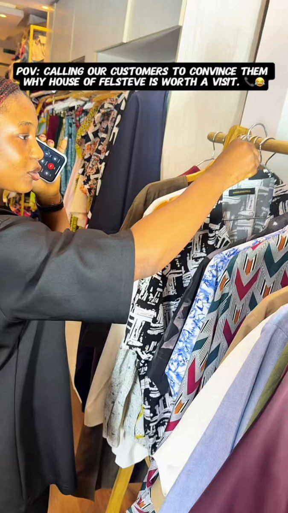

# 26 · Founder surprise customer call (+ customer-service call variant)

<!-- HERO:START -->
[](EXAMPLE.md)

**[See the example and how to make it →](EXAMPLE.md)** · [watch on X](https://x.com/houseoffelsteve/status/2064683771484320042)
<!-- HERO:END -->


> **LC priority P0** · evidence: High (4.80 ROAS first-party; 3 sources) · hype risk: Low · cost $0-50 (phone + recording consent) · 1-2 h per call, 3-5 cuts per call

## What it is
The founder phones a real repeat customer who does not know the call is coming, asks normal questions ("why do you keep ordering?"), and the recorded, unscripted conversation IS the ad. Variant: a real customer-SERVICE call where a shopper asks the 5-6 pre-purchase questions and support answers them.

## Why it works
- It is a testimonial that does not look like one — you overhear a conversation instead of watching an actor (@antonioventre_).
- Surprise cannot be faked; viewers have learned to spot coached answers and AI voices.
- The CS-call variant removes objections instead of piling on claims: the viewer hears their own doubt asked and answered before the PDP.
- Founder + customer in one asset = two trust signals; works cold (TOF story) and warm (MOF objection handling).

## Shot-by-shot (LC version)

| Time / slot | Visual | Audio / copy |
|---|---|---|
| 0-2s | Split screen: Qirra at desk with phone on speaker + caption "Calling a customer who has ordered 6 times (she has no idea)" | Ringtone SFX |
| 2-6s | Customer picks up, confused/laughs — keep the real reaction | "Hello?… wait, THE Qirra?" |
| 6-20s | Q1 "Why do you keep ordering?" → answer in her words; waveform + live captions | Unedited audio, light noise reduction only |
| 20-35s | Q2 "What changed since you started wearing it?" → story (swims, showers, compliments, a gift) | B-roll of the pieces she names (LC footage) |
| 35-45s | Q3 "Would you tell a friend?" / she asks Qirra a question back | Genuine laugh/emotion moment |
| 45-55s | End card: piece names + "any 7 for $85" + review count | VO or text CTA |

## Hooks (swap-in openers)
- "I called a customer who has bought from us 6 times. She had no idea."
- "POV: the founder calls you at 9am to ask why you keep buying necklaces"
- "I asked our most loyal customer one question…"
- "She thought this was a scam call 😂"
- (CS variant) "The 5 questions everyone asks before buying waterproof jewelry — answered on a real call"
- "We called the customer who left this review →" (review card on screen)

## Real examples from X (studied)
- @antonioventre_ — "surprise customer call… going really crazy for us right now"; screenshot of 5 top ads, the call ad highlighted at $20,971 spend → $100,622 purchases (4.80 ROAS) vs 2.25-3.32 for the others ([post](https://x.com/antonioventre_/status/2084767090116837682)).
- @antonioventre_ — rule: "the reaction cannot be scripted… the moment you script it, it dies" ([post](https://x.com/antonioventre_/status/2091895054755373116)).
- @antonioventre_ — CS-call variant: pull questions from the real support inbox + comment sections ([post](https://x.com/antonioventre_/status/2091592059517837677)).
- @therahulissar — "Founder calling customers… not one-hit wonders but continuously deliver bangers" ([post](https://x.com/therahulissar/status/2103485927528009820)).
- @williamkast_ diversity matrix lists "phone call" as a framework for founder, UGC, static (iMessage screenshot) and podcast (listener call-in) ([post](https://x.com/williamkast_/status/2084659151578202574)).

## Production recipe
1. Pull 30 repeat customers (3+ orders) and 20 recent 5-star reviewers from Shopify/Omni; email first asking permission "to maybe give you a quick call from our founder" WITHOUT saying when (consent to call + record; surprise = timing).
2. Record with a call app that announces recording (or get verbal consent on tape at the start and keep it in the raw).
3. Qirra asks only 3-4 open questions; never leads ("isn't it amazing that…").
4. Edit: keep ums and laughs; captions word-for-word; cut to 30-60s for Meta, 20-35s for TikTok; 3 hook variants per call (different opening line or on-screen text).
5. CS variant: export the top 6 pre-purchase questions from Gorgias/inbox + ad comments; record a real support call (or a real customer who agreed to ask them) — never script fake customers.
6. Bot prompt for picking cuts: see below.

## Bot prompt (copy into the creative agent)
```
You are an LC ad editor. Here is the transcript of a recorded founder→customer call with timestamps: {{TRANSCRIPT}}. 1) Mark the 3 most emotional or surprising 5-12s moments. 2) Mark every objection answered (waterproof, tarnish, real gold?, gift, price). 3) Propose 3 cuts (20s / 35s / 55s) with in/out timestamps, an on-screen hook line (≤9 words) for each, and a caption plan. Never change her words; never add claims she did not make; flag any claim that is not on the LC PDP.
```

## 3 LC scripts
- A · "The 6-order customer": Qirra: "Hi, is this Dana? It's Qirra from Louise Carter—" Dana: "Shut up. Why are you calling me?" Q: "You've ordered six times, I had to ask why." D: "Honestly? I swim in them. My sister stole my first necklace so I bought it again…" → end card "any 7 for $85".
- B · "The gift giver": call a customer who bought a stack for bridesmaids: "What did they say when they opened it?" → story → "Would you do it again?"
- C · CS-call variant "Before you buy": real support call: "Can I shower in it?" "Will it turn my neck green?" "Is it real gold?" — support answers with the PDP wording (14K PVD) — end on the guarantee.

## Variants to test
- Founder vs support agent as caller
- Audio-only waterfall + captions vs split-screen video
- Customer on video (FaceTime, with consent) vs audio
- Hook = customer's first reaction vs on-screen stat ("6 orders")

## Omni test plan
- **Budget/structure:** 3 calls × 3 hook cuts = 9 ads; $60-100/day per ad set for 5 days (CBO, broad)
- **Primary KPIs:** Hook rate ≥28%, avg watch ≥12s, CPA ≤ account baseline; Omni first-order ROAS + new-customer % vs baseline
- **Kill rule:** Kill a cut at 2× target CPA with hook rate <20% after $150
- **Scale rule:** Winner → Partnership/whitelist test on founder handle; re-cut into podcast-clip (F13) and static quote (F32)
- **Naming:** `utm_content=F26-<concept>-<variant>`; weekly Omni roll-up of new-customer revenue by format.

## Compliance
Baseline: [_COMPLIANCE.md](../_COMPLIANCE.md) (no fake testimonials, AI disclosure, no bulk/spoofed accounts, copy structure not assets, PDP-only claims).
- Written consent to be contacted + verbal consent to record captured in the raw file; signed release before use in ads. Follow call-recording consent law for both parties' states (two-party consent states).
- No scripted or staged customers presented as real; no paid actors in the customer seat. If a call is reenacted, label it "dramatization".
- Customer claims stay within PDP wording (14K PVD, waterproof as worded). Bleep/remove personal data (names of others, addresses).

## Related
- Strategies: 11-social-proof-credibility-engine, 17-review-prompt-timing, 31-founder-daily-posting-product-as-ad
- Formats: [40-testimonial-mashup](../40-testimonial-mashup/README.md), [48-the-dm-i-get-every-day](../48-the-dm-i-get-every-day/README.md), [13-podcast-style-ad](../13-podcast-style-ad/README.md)

<!-- W8NOTE -->
## Wave 8 update: Voynov page, Adam Taylor teardowns, queued posts (Oct 9, 2026)
- **Customer calls:** "This ad has done over $500k in sales. We've been running this creative format since 2022" ([Voynov](https://x.com/LachezarVoynov/status/2062924873022795932), Sweet Zzz; also on his [13 top types](https://x.com/LachezarVoynov/status/2057847704403972533)).
- **Do not copy, GroundingWell's "front desk" call** ([teardown](https://x.com/adamtaylorl/status/2094742062755422423)): a staged call presented as a real hotel conversation ("I'm probably not supposed to be telling you this"), with health claims. Real customer calls are fine; scripted calls must be labelled as dramatizations.
<!-- /W8NOTE -->

<!-- EVIDENCE:START -->
## Wave 3 update: Meta ad-library long-runners (Fedotoff gut-health board)
- Rachel's Tea: Co-founder spouse explains the new product line, 481 days live. A trust update from a real person reads like a customer email, not an ad, and pre-empts the 'why did my product change?' objection for returning buyers.
- Stills, transcripts and LC remakes: [adlibrary/](adlibrary/README.md).

## Evidence from X discovery (auto-generated)

| Date | Author | Post | Engagement | Grade | Gist |
|---|---|---|---|---|---|
| 2026-08-10 | [@williamkast_](https://x.com/williamkast_) | [link](https://x.com/williamkast_/status/2086835243474985414) | 38L/46BM/3kV | VALUE | Turn 1 winning ad into 5: same message, different frameworks (DITL, 3 reasons, old me/new me, phone call). |
| 2026-08-04 | [@antonioventre_](https://x.com/antonioventre_) | [link](https://x.com/antonioventre_/status/2084767090116837682) | 37L/34BM/2kV | VALUE | Surprise founder→customer call ad: customer doesn't know the call is coming; ad-manager screenshot shows it as top ROAS (4.80 on $20.9k) in a $112k set. |
| 2026-08-23 | [@antonioventre_](https://x.com/antonioventre_) | [link](https://x.com/antonioventre_/status/2091592059517837677) | 12L/13BM/1kV | VALUE | Customer-SERVICE call ad: record a real pre-purchase support call answering the 5-6 questions buyers actually ask. |
| 2026-09-25 | [@therahulissar](https://x.com/therahulissar) | [link](https://x.com/therahulissar/status/2103485927528009820) | 12L/7BM/1kV | VALUE | Trends beyond AI: greenscreen personal story with no product until late; natives → quiz funnel; founder calling customers. |
| 2026-08-24 | [@antonioventre_](https://x.com/antonioventre_) | [link](https://x.com/antonioventre_/status/2091895054755373116) | 8L/4BM/1kV | VALUE | Production rule: reaction can't be scripted — founder-customer call + POV reaction ads with live unscripted reaction. |
| 2026-08-04 | [@williamkast_](https://x.com/williamkast_) | [link](https://x.com/williamkast_/status/2084659151578202574) | 2L/4BM/0kV | VALUE | Creative diversity matrix image: 5 production formats × 5 frameworks = 25 concepts from one message. |
| 2026-07-31 | [@raph_guilhem](https://x.com/raph_guilhem) | [link](https://x.com/raph_guilhem/status/2083288607062732816) | 55L/105BM/7kV | SOME | 30-format tree: hooks, founder (walking/car monologue, whiteboard), social proof (customer call, DM I get every day), news report. |
<!-- EVIDENCE:END -->
