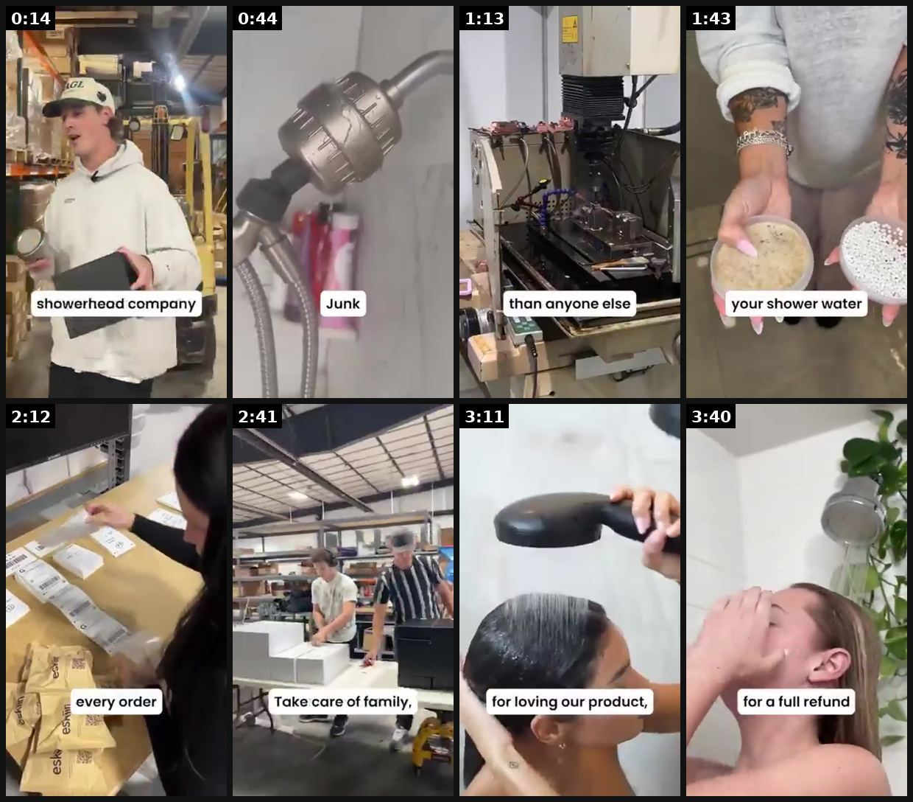
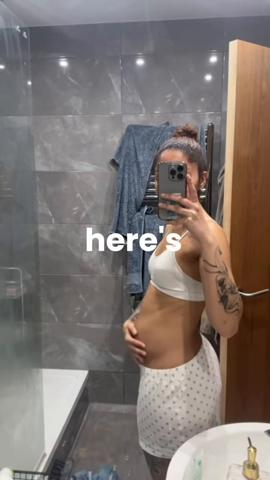
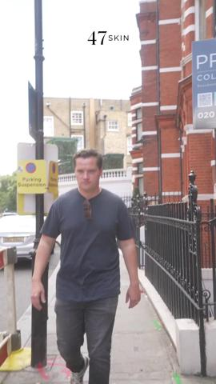
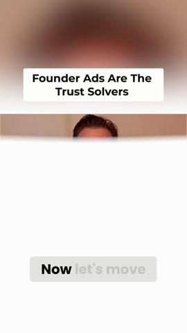
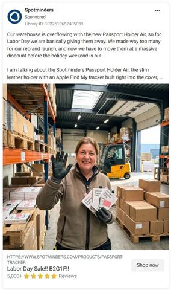
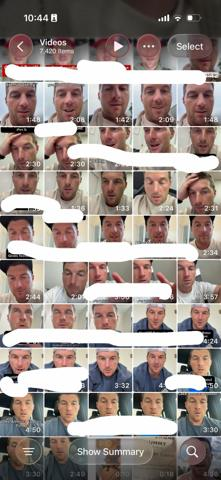

# 27 · Founder walk-and-talk / founder-story ad (incl. host interview): see it, then make it

[](https://x.com/luisfelipebfr2/status/2101018997508669891)

**The example:** [@luisfelipebfr2 on X](https://x.com/luisfelipebfr2/status/2101018997508669891) · 3:55 video · 0 likes, 166 views

**Watch it:** [open the post on X](https://x.com/luisfelipebfr2/status/2101018997508669891) · [play the video file](https://video.twimg.com/amplify_video/2101017775611203584/vid/avc1/320x568/LjEaLb_ZdCup2dps.mp4?tag=29)

> This Eskiin ad is by far one of the best founder-led DTC ads I’ve seen lately. And it’s not because the founders are charismatic. It’s because the ad barely feels like an ad for the first half. From a copywriting perspective, the structure is ridiculously smart: It opens with a vision board. A 16-year-old kid. One goal: retire his mom. Immediately, there’s an open loop: How did he do it? That question earns the atten…

## What you are seeing

A founder mini-documentary of almost 4 minutes for Eskiin (shower filters): the founder walking the factory floor ("showerhead company"), a junk-filled showerhead, the filter cartridge, packing orders ("every order"), staff ("Take care of family") and a customer washing her hair ("for a full refund").

## Beat by beat

The storyboard above samples the video every 0:29. Lines are the transcript for that stretch; on-screen text comes from OCR, so treat it as rough.

| Frame | Time | On screen | Said / sung |
|---|---|---|---|
| 1 | 0:00–0:29 | · | This picture on my little brother's vision board for a full decade. A 16-year-old kid, insane work ethic, insatiable drive. One goal, retire our mom. This is the story of how we finally did it. My brother Wes, two years ago, doesn't know it yet, about to start a filtered showerhead company. Chronic, |
| 2 | 0:29–0:58 | · | Chlorine, heavy metals, pesticides, chemicals, mold? I had no idea. And our hot water tang? Hot, dark. Parasite and bacteria, breeding ground. Disgusting. Flying filtered showerhead, immediately. Amazon wants horrible reviews. Cheap, drop-ship junk. Weak filters. Expensive ones. Triumph. Water press |
| 3 | 0:58–1:28 | than anyone else in | Hydra Boost, technology. Strong, but not prickly. Soft, like a feather. Spa like? Euphoric. Perfect. Onto filtering. The best in the market. Must remove more contaminants, more heavy metals, more parasites, and more skin and hair damaging contaminants than anyone else. Have mom test it. She's obsess |
| 4 | 1:28–1:57 | your shower water | Educate on how toxic the rusty, rat-infested city water pipes are in this country. Americans deserve to know. Been left in the dark for too long. Spread awareness. People don't know their shower water is the number one chemical exposure zone in the home. Don't know you're supposed to filter your sho |
| 5 | 1:57–2:27 | · | The goal is to give people back their comfort and confidence through clean shower water. Now, the business must be American. Ship from USA. Pack with care. No dropshipping. Be founder-led. Tell our story. No hiding behind a crap product. Stand behind every order. Love our customers. Bring them along |
| 6 | 2:27–2:56 | Take oats of family, | Make clean water more accessible. Not less. Innovate innovate innovate. They want a handheld. Give it to them. No shortcuts. Listen to our customers. Give them that they want. . Be the trusted brand and |
| 7 | 2:56–3:26 | for loving our product, | · |
| 8 | 3:26–3:55 | AN a for a full refund | Thank you for helping us turn a promise, |

<details><summary>Full transcript (timestamped)</summary>

- `0:00` This picture on my little brother's vision board for a full decade.
- `0:03` A 16-year-old kid, insane work ethic, insatiable drive.
- `0:06` One goal, retire our mom.
- `0:08` This is the story of how we finally did it.
- `0:10` My brother Wes, two years ago, doesn't know it yet,
- `0:13` about to start a filtered showerhead company.
- `0:15` Chronic, painful, eczema, dry skin.
- `0:17` Me, hair loss, in clumps.
- `0:19` Mystery rash that will not go away.
- `0:21` Suffering, try to everything.
- `0:23` Medications, shampoos, treatments, nothing working.
- `0:26` Could it be our water?
- `0:27` Test it.
- `0:28` Whoa.
- `0:29` Chlorine, heavy metals, pesticides, chemicals, mold?
- `0:32` I had no idea.
- `0:33` And our hot water tang?
- `0:34` Hot, dark.
- `0:35` Parasite and bacteria, breeding ground.
- `0:37` Disgusting.
- `0:38` Flying filtered showerhead, immediately.
- `0:41` Amazon wants horrible reviews.
- `0:43` Cheap, drop-ship junk.
- `0:44` Weak filters.
- `0:45` Expensive ones.
- `0:46` Triumph.
- `0:46` Water pressure?
- `0:47` Brutal.
- `0:48` That's when Wes said,
- `0:49` Screw it.
- `0:49` Let's make our own.
- `0:50` Design.
- `0:51` Not a nice or sleek.
- `0:53` Minimalist.
- `0:53` Clean.
- `0:54` Now, pressure.
- `0:55` Lots of pressure.
- `0:56` More than any other filtered showerhead brand.
- `0:58` Hydra Boost, technology.
- `1:00` Strong, but not prickly.
- `1:01` Soft, like a feather.
- `1:03` Spa like?
- `1:04` Euphoric.
- `1:04` Perfect.
- `1:05` Onto filtering.
- `1:06` The best in the market.
- `1:07` Must remove more contaminants, more heavy metals,
- `1:10` more parasites, and more skin and hair damaging contaminants
- `1:12` than anyone else.
- `1:13` Have mom test it.
- `1:14` She's obsessed.
- `1:16` Hair and skin like silk.
- `1:17` Mom approved.
- `1:18` Give it to friends and family.
- `1:19` Skin and hair problems improving.
- `1:21` More onto something.
- `1:22` Keep working.
- `1:23` Win best filtration rating on Oasis Water App.
- `1:25` Check.
- `1:26` Protect Americans from the health dangers of tap water.
- `1:28` Educate on how toxic the rusty, rat-infested city water pipes
- `1:32` are in this country.
- `1:33` Americans deserve to know.
- `1:34` Been left in the dark for too long.
- `1:36` Spread awareness.
- `1:37` People don't know their shower water
- `1:39` is the number one chemical exposure zone in the home.
- `1:41` Don't know you're supposed to filter your shower water.
- `1:43` Tell them.
- `1:44` Especially for babies and kids.
- `1:45` Now, skin and hair results.
- `1:47` Give the best damn results.
- `1:49` Reduce hair loss.
- `1:50` Eliminate dry skin.
- `1:51` Help with eczema acne scalp issues.
- `1:53` Guarantee improvements or give a full refund
- `1:55` because the product works that good.
- `1:57` The goal is to give people back their comfort
- `1:59` and confidence through clean shower water.
- `2:02` Now, the business must be American.
- `2:04` Ship from USA.
- `2:05` Pack with care.
- `2:06` No dropshipping.
- `2:07` Be founder-led.
- `2:08` Tell our story.
- `2:09` No hiding behind a crap product.
- `2:11` Stand behind every order.
- `2:12` Love our customers.
- `2:13` Bring them along on the journey.
- `2:15` Build something people are proud to support.
- `2:17` Have the best customer service ever.
- `2:19` Tough financial times.
- `2:20` Bound to happen.
- `2:21` No price hikes.
- `2:22` While everyone.
- `2:26` Stand by our people.
- `2:27` Make clean water more accessible.
- `2:29` Not less.
- `2:30` Innovate innovate innovate.
- `2:31` They want a handheld.
- `2:33` Give it to them.
- `2:33` No shortcuts.
- `2:34` Listen to our customers.
- `2:36` Give them that they want.
- `2:37` . Be the trusted brand and
- `3:25` Thank you for helping us turn a promise,

</details>

## More real examples (7)

Other posts that show this format, or a close cousin of it. Click a thumbnail to open it on X.

| | | |
|---|---|---|
| [](https://x.com/ecomrudolfs/status/2059559665520795790)<br>**@ecomrudolfs** · 1:29 video · 16K views<br>Out of 997 active ads, this founder led ad is CRUSHING it Break it down and use the same winning format | [](https://x.com/LachezarVoynov/status/2057488725769163085)<br>**@LachezarVoynov** · 2:10 video · 1K views<br>This ad combines 2 of the top-performing ad creative elements in 2026: > AI-generated clips > Founder-led content Here’s why you should re-create it f | [](https://x.com/JoeJMarston/status/2007102582058340515)<br>**@JoeJMarston** · 0:53 video · 2K views<br>Here’s how we’ve been reskinning our existing, top-performing founder ads. Founder ads still work. But when performance softens, it’s rarely because t |
| [](https://x.com/LoukasHambi/status/1978090871296782364)<br>**@LoukasHambi** · 0:19 video · 3K views<br>We know Founders ads crush, but if yours are starting to fatigue, here’s a few quick-win format adaptations you can make: (These are flying for us rig | [](https://x.com/metaadsatscale/status/2093049398024384915)<br>**@metaadsatscale** · 1:11 video · 86 views<br>New brands face a trust gap. A founder story ad flips that. Face, voice, real skin in the game. People buy from people they relate to, not logos. | [](https://x.com/strikerecom/status/2106092593511837880)<br>**@strikerecom** · image · 2K views<br>the amount of directions u can take a native is STUPIDDD if a video concept already works just turn that shit into a native founder ads have been crus |
| [](https://x.com/ecom_cork/status/2098433621077983648)<br>**@ecom_cork** · image · 6K views<br>Few million more founder ads https://t.co/IKeYhoxbMc |   |   |

## How to make one like it

**The format in one line:** The founder walks (street, studio, warehouse) and talks to camera — or is interviewed by a handheld-mic host — about ONE thing: why the product exists, the problem she hated, or the mechanism. Unscripted, raw, one idea per ad. Long version = founder-story mini-VSL (personal open loop → problem → failed solutions → mechanism → product → mission → payoff).

**Why it works:** - The founder conveys the most conviction and is "impossible to copy" (@williamkast_). - Looks like an organic interview, so it humanises before it sells (@joshsuggss). - Founder story sells two things: the product and the people you trust to make it — every feature becomes a character trait (Eskiin breakdown). - Unscripted, single-claim founder ads beat polished scripted ones, which have become wallpaper (@KanishDigital quoting @ujjawalasthana).

**Contents:** [1. Structure](#1-copy-the-structure) · [2. Shot by shot](#2-shot-by-shot-remake) · [3. Script and hooks](#3-write-the-script) · [4. Prompts](#4-prompts) · [5. Tools and settings](#5-tools-and-settings) · [6. Louise Carter remake](#6-louise-carter-remake) · [7. Variants and test](#7-variants-and-test-plan) · [8. Pitfalls](#8-pitfalls)

### 1. Copy the structure

Use the example's timing as your beat sheet. Keep the beat, change the words and the product.

| Beat | Time | In the example | Your version |
|---|---|---|---|
| 1 | 0:14 | This picture on my little brother's vision board for a full decade. A 16-year-old kid, insane work ethic, insatiable drive. One goal, retire | … |
| 2 | 0:44 | Chlorine, heavy metals, pesticides, chemicals, mold? I had no idea. And our hot water tang? Hot, dark. Parasite and bacteria, breeding groun | … |
| 3 | 1:13 | Hydra Boost, technology. Strong, but not prickly. Soft, like a feather. Spa like? Euphoric. Perfect. Onto filtering. The best in the market. | … |
| 4 | 1:43 | Educate on how toxic the rusty, rat-infested city water pipes are in this country. Americans deserve to know. Been left in the dark for too | … |
| 5 | 2:12 | The goal is to give people back their comfort and confidence through clean shower water. Now, the business must be American. Ship from USA. | … |
| 6 | 2:41 | Make clean water more accessible. Not less. Innovate innovate innovate. They want a handheld. Give it to them. No shortcuts. Listen to our c | … |
| 7 | 3:11 | on screen: for loving our product, | … |
| 8 | 3:40 | Thank you for helping us turn a promise, | … |

### 2. Shot-by-shot remake

**Target length / size:** 45s-4min, 1080x1920

| # | Time / slot | What we see (visual + camera) | Dialogue / on-screen text |
|---|---|---|---|
| 1 | 0-5s | Founder walking toward camera (street, studio, warehouse), gimbal or handheld | Open loop: "I started this because my mom's chain turned her neck green" |
| 2 | 5-60s | Walking cutaways: workshop, packing orders, the product being tested | Why it exists, the problem, what she refused to compromise on |
| 3 | 60-120s | Customers / reviews on screen | Proof |
| 4 | End | Founder stops, looks at camera | Guarantee + offer |

<details><summary>Playbook shot list (Louise Carter version from the README)</summary>

| Time / slot | Visual | Audio / copy |
|---|---|---|
| 0-3s | Walking shot, Qirra mid-sentence (start in motion) + text hook | "I started Louise Carter because I was sick of taking my jewelry off." |
| 3-15s | Keep walking; problem in her words (green necks, tarnish, losing earrings at the gym) | Ambient street sound, lav mic |
| 15-30s | Cut to hands: dunk the Chelsea Herringbone in a glass of water / show 6-month-old piece | "This is 14K PVD — here is why it doesn't do that." |
| 30-45s | Back to walk: one belief/mission line ("jewelry you never take off") | Natural pace, jump cuts allowed |
| 45-55s | CTA beat: "any 7 for $85" card over her walking away | Soft music under |

</details>

### 3. Write the script

Open with one of these hooks (first 1–3 seconds, or the headline on a static):

- "I'm the founder, and I need to tell you why I made jewelry you can shower in."
- "Every jewelry brand told me 'just take it off before you shower.' So I made my own."
- Host: "What's the one thing people get wrong about gold jewelry?" Qirra: "That it has to be fragile."
- "This necklace is 6 months old. I have never taken it off."
- "I'm not supposed to tell you this as a jewelry founder, but…"
- (Story VSL) "This picture was on my vision board for ten years."

Then fill the beats from the table above. Pull the wording from real customer reviews, not from ad copy: a review line beats a copywriter line almost every time. Read every line out loud and cut anything you would not say to a friend. Ready-made Louise Carter scripts are in section 6; hand [BOT.md](BOT.md) to any AI agent to write versions for another brand.

### 4. Prompts

**Shoot**

```text
Gimbal (DJI Osmo Mobile), 4K 30fps, wireless lav (Rode Wireless GO), walk slowly toward the camera, record 3 full takes, cut to the best lines.
```

**Full creative-agent prompt (from the playbook):**

```
You are writing founder walk-and-talk ad beats for Louise Carter (waterproof 14K PVD jewelry, founder Qirra). Input: {{QIRRA_INTERVIEW_TRANSCRIPT}} + {{TOP_20_REVIEWS}}. Output 12 single-idea ads. For each: belief line (≤12 words, in her phrasing), problem in customer words (quote the review), one proof beat she can do with her hands on camera, a 9-word on-screen hook, and length (20/35/50s). Then outline ONE 90s founder-story mini-VSL using: open loop → problem → failed solutions → mechanism → product → mission → payoff → guarantee. No claims beyond the PDP.
```

### 5. Tools and settings

1. Write 15 one-line "beliefs" Qirra actually holds (from interviews, reviews, DMs); each = one ad.
2. Shoot 2-hour block: 10 walk-and-talk takes + 5 host-interview questions (host off-camera, handheld mic on Qirra).
3. Lav mic (Rode Wireless), phone 4K 30fps, 0.5x lens for one variant (see F45).
4. Edit 20-45s cuts; captions; never add music over first 3s.
5. Long version (60-120s) uses the Eskiin sequence: open loop → problem → failed fixes → mechanism (PVD) → product → mission → payoff + guarantee.
6. Run as Partnership ad from Qirra's personal IG if she has one.

| Setting | Value |
|---|---|
| Canvas | 1080×1920 (9:16) master; crop a 1080×1350 (4:5) cut for feed placements |
| Frame rate | 30 fps (shoot 60 fps for slow-motion water or sparkle shots) |
| Camera | Phone main lens at 1x, exposure locked on skin, HDR off, grid on; tripod or a phone clamp for product shots |
| Light | One soft key at 45° (window or ring light), white card as fill; side light for metal sparkle |
| Audio | Lavalier or phone 15–20 cm from the mouth; mix voice at -14 LUFS, music at -28 to -30 dB under voice |
| Captions | Burned in, 2–5 words per line, 64–80 px bold sans, white with a black stroke or pill; keep text inside the safe zone (top 220 px and bottom 420 px clear, 64 px side margins) |
| Pacing | A visual change every 1.5–3 s; the hook lands in the first 1.5 s with no logo intro |
| Edit / export | CapCut or Premiere; H.264, 12–20 Mbps, AAC 320 kbps; upload natively to each platform, not via links |

### 6. Louise Carter remake

- A · "Take it off" walk: "Every jewelry brand told me to take it off before I shower. I thought, why? So we made it 14K PVD. Six months, never taken off." (holds up necklace) "Any seven for eighty-five."
- B · Host interview: Host: "What's the most-returned complaint in jewelry?" Q: "It turns green. Ours doesn't, and here's the boring science…"
- C · Story mini-VSL (90s): "My mom had one gold chain she never took off…" → the cheap-jewelry problem → failed fixes (clear nail polish, taking it off) → the PVD discovery → building LC → customers' swim photos → guarantee.

Brand rules, claims you can and cannot make, and more scripts: [brands/louise-carter.md](brands/louise-carter.md). Step-by-step from idea to scale: [STAGES.md](STAGES.md).

### 7. Variants and test plan

- Walk vs seated vs car (F14)
- Host-interview vs solo
- One claim (waterproof) vs origin story
- 20s vs 90s

**Test plan:** - **Budget/structure:** 10 cuts, $50/day each in a founder ad set for 5 days - **Primary KPIs:** Hold rate (ThruPlay/3s) ≥35%, CPA; Omni new-customer revenue; retargeting lift (founder face retargets 2-3x per @alexpagepilot claim — verify) - **Kill rule:** <20% hook rate after $100 - **Scale rule:** Winning belief → re-shoot as podcast clip (F13), static quote (F32) and DITL (F45) - **Naming:** `utm_content=F27-<concept>-<variant>`; weekly Omni roll-up of new-customer revenue by format.

**Naming:** `F27-<variant>-<hook##>-<date>` so results map back to this folder. Change one thing per test (hook, narrator, length or offer), never two.

### 8. Pitfalls

- ONE topic per video; founders try to say everything.
- Hook in the first sentence, not after the intro.
- All claims (warranty, materials) must match the product page.
- Slow open: if the first 1.5 s does not show the hook visually, most people swipe.
- Logo or brand intro at the start reads as an ad; put the brand at the end.
- Captions covered by the platform UI: check the safe zone on a real phone before posting.
- Music over the voice: keep music at least 14 dB under speech.

**Compliance:** Baseline: [_COMPLIANCE.md](../_COMPLIANCE.md) (no fake testimonials, AI disclosure, no bulk/spoofed accounts, copy structure not assets, PDP-only claims). - Qirra speaks only to verified facts (PVD process, testing, guarantee); no "solid gold" or medical claims. - If a host is paid, the content is still LC's ad — no fake "independent interview" framing. - Customer photos/quotes shown need permission.

## Field notes

Newer observations live in the playbook: [Wave 2b update — founder-story angles (GetHookd library)](README.md) · [Wave 3 update: Meta ad-library long-runners (Fedotoff gut-health board)](README.md) · [Wave 4 update: Fedotoff October 2026 swipe boards](README.md)

## More examples

Every post we found for this format, with transcripts: [examples/](examples/README.md). Playbook: [README.md](README.md). Agent brief: [BOT.md](BOT.md).
