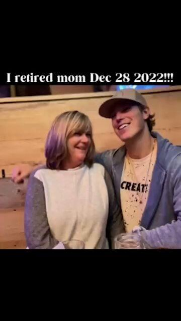

# 27 · Founder walk-and-talk / founder-story ad (incl. host interview)

<!-- HERO:START -->
[](EXAMPLE.md)

**[See the example and how to make it →](EXAMPLE.md)** · [watch on X](https://x.com/luisfelipebfr2/status/2101018997508669891)
<!-- HERO:END -->


> **LC priority P1** · evidence: High (multiple operator lists; contested for scripted versions) · hype risk: Low-Med · cost $0-300 (phone, lav mic, optional host) · half day = 10-20 cuts

## What it is
The founder walks (street, studio, warehouse) and talks to camera — or is interviewed by a handheld-mic host — about ONE thing: why the product exists, the problem she hated, or the mechanism. Unscripted, raw, one idea per ad. Long version = founder-story mini-VSL (personal open loop → problem → failed solutions → mechanism → product → mission → payoff).

## Why it works
- The founder conveys the most conviction and is "impossible to copy" (@williamkast_).
- Looks like an organic interview, so it humanises before it sells (@joshsuggss).
- Founder story sells two things: the product and the people you trust to make it — every feature becomes a character trait (Eskiin breakdown).
- Unscripted, single-claim founder ads beat polished scripted ones, which have become wallpaper (@KanishDigital quoting @ujjawalasthana).

## Shot-by-shot (LC version)

| Time / slot | Visual | Audio / copy |
|---|---|---|
| 0-3s | Walking shot, Qirra mid-sentence (start in motion) + text hook | "I started Louise Carter because I was sick of taking my jewelry off." |
| 3-15s | Keep walking; problem in her words (green necks, tarnish, losing earrings at the gym) | Ambient street sound, lav mic |
| 15-30s | Cut to hands: dunk the Chelsea Herringbone in a glass of water / show 6-month-old piece | "This is 14K PVD — here is why it doesn't do that." |
| 30-45s | Back to walk: one belief/mission line ("jewelry you never take off") | Natural pace, jump cuts allowed |
| 45-55s | CTA beat: "any 7 for $85" card over her walking away | Soft music under |

## Hooks (swap-in openers)
- "I'm the founder, and I need to tell you why I made jewelry you can shower in."
- "Every jewelry brand told me 'just take it off before you shower.' So I made my own."
- Host: "What's the one thing people get wrong about gold jewelry?" Qirra: "That it has to be fragile."
- "This necklace is 6 months old. I have never taken it off."
- "I'm not supposed to tell you this as a jewelry founder, but…"
- (Story VSL) "This picture was on my vision board for ten years."

## Real examples from X (studied)
- @williamkast_ — "Founders Ads: one of the best ad formats to run. Very authentic and impossible to copy" + live Atria example ([post](https://x.com/williamkast_/status/2083616523134841035), [post](https://x.com/williamkast_/status/2084298521251860579)).
- @luisfelipebfr2 — Eskiin founder ad teardown (transcribed, 3:55): vision board → eczema/hair loss → "could it be our water?" → Amazon filters junk → build our own → mom approved → retired mom → guarantee ([post](https://x.com/luisfelipebfr2/status/2101018997508669891)).
- @joshsuggss — 105 founder interviews in 16 weeks ("StreetTalk"): walk-and-talk about your brand, built for ads not organic ([post](https://x.com/joshsuggss/status/2091887902137454922)).
- @nicktheriot_ 2026 tier list: Founder story = A-tier; Talking head = C-tier — i.e. story beats generic talking ([post](https://x.com/nicktheriot_/status/2108173638033871013)).
- Counter-signal: @adamtaylorl lists "founder story VSLs" as dead and founder ads only B-tier ([post](https://x.com/adamtaylorl/status/2086814826177679660)) → keep them unscripted and single-claim.

## Production recipe
1. Write 15 one-line "beliefs" Qirra actually holds (from interviews, reviews, DMs); each = one ad.
2. Shoot 2-hour block: 10 walk-and-talk takes + 5 host-interview questions (host off-camera, handheld mic on Qirra).
3. Lav mic (Rode Wireless), phone 4K 30fps, 0.5x lens for one variant (see F45).
4. Edit 20-45s cuts; captions; never add music over first 3s.
5. Long version (60-120s) uses the Eskiin sequence: open loop → problem → failed fixes → mechanism (PVD) → product → mission → payoff + guarantee.
6. Run as Partnership ad from Qirra's personal IG if she has one.

## Bot prompt (copy into the creative agent)
```
You are writing founder walk-and-talk ad beats for Louise Carter (waterproof 14K PVD jewelry, founder Qirra). Input: {{QIRRA_INTERVIEW_TRANSCRIPT}} + {{TOP_20_REVIEWS}}. Output 12 single-idea ads. For each: belief line (≤12 words, in her phrasing), problem in customer words (quote the review), one proof beat she can do with her hands on camera, a 9-word on-screen hook, and length (20/35/50s). Then outline ONE 90s founder-story mini-VSL using: open loop → problem → failed solutions → mechanism → product → mission → payoff → guarantee. No claims beyond the PDP.
```

## 3 LC scripts
- A · "Take it off" walk: "Every jewelry brand told me to take it off before I shower. I thought, why? So we made it 14K PVD. Six months, never taken off." (holds up necklace) "Any seven for eighty-five."
- B · Host interview: Host: "What's the most-returned complaint in jewelry?" Q: "It turns green. Ours doesn't, and here's the boring science…"
- C · Story mini-VSL (90s): "My mom had one gold chain she never took off…" → the cheap-jewelry problem → failed fixes (clear nail polish, taking it off) → the PVD discovery → building LC → customers' swim photos → guarantee.

## Variants to test
- Walk vs seated vs car (F14)
- Host-interview vs solo
- One claim (waterproof) vs origin story
- 20s vs 90s

## Omni test plan
- **Budget/structure:** 10 cuts, $50/day each in a founder ad set for 5 days
- **Primary KPIs:** Hold rate (ThruPlay/3s) ≥35%, CPA; Omni new-customer revenue; retargeting lift (founder face retargets 2-3x per @alexpagepilot claim — verify)
- **Kill rule:** <20% hook rate after $100
- **Scale rule:** Winning belief → re-shoot as podcast clip (F13), static quote (F32) and DITL (F45)
- **Naming:** `utm_content=F27-<concept>-<variant>`; weekly Omni roll-up of new-customer revenue by format.

## Compliance
Baseline: [_COMPLIANCE.md](../_COMPLIANCE.md) (no fake testimonials, AI disclosure, no bulk/spoofed accounts, copy structure not assets, PDP-only claims).
- Qirra speaks only to verified facts (PVD process, testing, guarantee); no "solid gold" or medical claims.
- If a host is paid, the content is still LC's ad — no fake "independent interview" framing.
- Customer photos/quotes shown need permission.

## Related
- Strategies: 31-founder-daily-posting-product-as-ad, 10-skit-and-problem-first-ugc-hooks
- Formats: [14-in-car-yapper-confession](../14-in-car-yapper-confession/README.md), [50-mini-documentary-how-its-made](../50-mini-documentary-how-its-made/README.md), [45-day-in-the-life-behind-the-scenes](../45-day-in-the-life-behind-the-scenes/README.md)

## Wave 2b update — founder-story angles (GetHookd library)
Pick the angle that is truest: **Hero's Journey** (problem → solution, WelleCo), **Mission-Driven Origin** (why you started, Palmonas), **Underdog** (Panic Panties), **Expert Authority** (ARMRA). Phone + lapel mic + natural light; open with the problem; CTA only after the emotional payoff. Jewelry "meet the maker" ads also work as retargeting for PDP visitors (Mejuri). Sources: [https://www.gethookd.ai/learn/founder-story-ads-examples-how-to-create-them/](https://www.gethookd.ai/learn/founder-story-ads-examples-how-to-create-them/), [https://www.gethookd.ai/learn/7-best-instagram-jewelry-ads-examples-for-2026/](https://www.gethookd.ai/learn/7-best-instagram-jewelry-ads-examples-for-2026/).

<!-- EVIDENCE:START -->
## Evidence from X discovery (auto-generated)

| Date | Author | Post | Engagement | Grade | Gist |
|---|---|---|---|---|---|
| 2026-08-03 | [@williamkast_](https://x.com/williamkast_) | [link](https://x.com/williamkast_/status/2084298521251860579) | 227L/549BM/17kV | VALUE | 5 formats that win in every account, each with a live Atria ad link: founder, yapper, AI educator, B-roll text overlay, long VSL. |
| 2026-10-08 | [@nicktheriot_](https://x.com/nicktheriot_) | [link](https://x.com/nicktheriot_/status/2108173638033871013) | 219L/348BM/12kV | VALUE | 2026 FB creative styles tier list: S = long primary text + organic image, LTO, UGC, VSL, reaction, news; A = demo, us vs them, testimonial, close-up, founder story, podcast, BTS, authority, x reasons; C = unboxing, DITL. |
| 2026-07-17 | [@williamkast_](https://x.com/williamkast_) | [link](https://x.com/williamkast_/status/2078179704050246125) | 28L/34BM/3kV | VALUE | 5 formats to test: founder talking head, voiceless B-roll text overlay, yapper (uncut), AI educational, camouflage static + long copy. |
| 2026-08-01 | [@williamkast_](https://x.com/williamkast_) | [link](https://x.com/williamkast_/status/2083616523134841035) | 12L/14BM/1kV | VALUE | 15 formats to repackage winners into (scaled to $30k/day on 3-4 angles): founder, yapper, AI animation, voiceless overlay, carousel, reply ad, text wall, review static, camouflage. |
| 2026-09-18 | [@luisfelipebfr2](https://x.com/luisfelipebfr2) | [link](https://x.com/luisfelipebfr2/status/2101018997508669891) | 0L/0BM/0kV | VALUE | Eskiin founder mini-VSL breakdown: vision-board open loop → problem → failed solutions → mechanism → product → mission → retire mom. |
| 2026-07-31 | [@raph_guilhem](https://x.com/raph_guilhem) | [link](https://x.com/raph_guilhem/status/2083288607062732816) | 55L/105BM/7kV | SOME | 30-format tree: hooks, founder (walking/car monologue, whiteboard), social proof (customer call, DM I get every day), news report. |
| 2026-08-24 | [@joshsuggss](https://x.com/joshsuggss) | [link](https://x.com/joshsuggss/status/2091887902137454922) | 38L/11BM/7kV | SOME | 105 founder interviews in 16 weeks; "founder ads" = walk-and-talk about your brand (agency pitch). |
| 2026-08-27 | [@joshsuggss](https://x.com/joshsuggss) | [link](https://x.com/joshsuggss/status/2092987127051010235) | 14L/2BM/4kV | SOME | Founder interview ads print because they look like an organic interview; built for ads not organic. |
| 2026-09-14 | [@alexpagepilot](https://x.com/alexpagepilot) | [link](https://x.com/alexpagepilot/status/2099438014456045990) | 11L/19BM/1kV | SOME | Top 5 dropship formats: UGC problem/solution, "TikTok made me buy it", us vs them split, founder talking head (retargets 2-3x), text-overlay slideshow. |
| 2026-07-11 | [@KanishDigital](https://x.com/KanishDigital) | [link](https://x.com/KanishDigital/status/2075890802140873202) | 1L/3BM/1kV | SOME | Scripted founder ads are boring; unscripted ones about ONE thing the product does well have taken over. |
<!-- EVIDENCE:END -->
