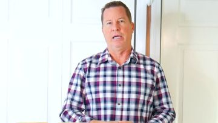

# Meta ad-library examples for F27 (GetHookd board 155932, gut health)

From [@FedotOff90](https://x.com/FedotOff90/status/2108212319113412929)'s public board preview. Days live are as of 2026-10-09. Full board breakdown is in the internal sources folder.

## Rachel's Tea: Co-founder spouse explains the new product line (481 days live)

- **What happens:** Plain kitchen talking head: "Hi, this is Mike. Rachel has asked me to explain why she has a new product line." No hook graphics, no music; he explains that the brand now has its own manufactured line and why the labels changed. Cut-ins of the product row on the counter.
- **Why it lasts:** 481 days live, the longest in the preview. A trust update from a real person reads like a customer email, not an ad, and pre-empts the 'why did my product change?' objection for returning buyers.
- **How to make one:** iPhone on a tripod at eye level, window light, kitchen counter with 5-6 products lined up behind; 60-75 s one take; captions only; no music.
- **LC remake:** Jay/Qirra to camera: "Why our new pieces look a little different" (PVD upgrade, new clasp) → shows old vs new → 'same shower-proof promise'. Use for retention + warm audiences.

Transcript

> Hi, this is Mike. Rachel has asked me to kind of explain why she has a new product line. So first of all, a couple of the products are exactly what you're used to, but three or four or five of these products are actually new or recently new. And I wanted to explain that to you. So over time, you know, Rachel, I spend a lot of time working. I still give her my two cents for she still usually listens. And some of these products, we were dealing with the best available products at the time that we could get to you at an affordable price, but they weren't all as good as they could have been. So Rachel's T.com has now gotten to the point where she has a little bit of muscle with some manufacturing companies. And she has actually, you know, with my two cents as well, but she's actually gotten her own line, some of her own design products. And believe me, in every case where there's a product that's labeled as Rachel's T is the company branded as Rachel's T. These are superior products to anything we've ever carried. So I just want to kind of give you that overview really quickly so you can understand why some of the labels and things that you see are different and what that means to you.

<!-- WAVE4 -->
## Wave 4: Alex Fedotoff's October 2026 swipe boards (GetHookd public previews)

Each ad below is from the free 10-ad preview of a public GetHookd board that [@FedotOff90](https://x.com/FedotOff90) shared on X. Days live are as of 2026-10-09; brand claims are the advertisers', not verified.

### BioRoot Labs: "A message from our founder" scarcity text static (378 days live)

- **Board:** [AI Storytelling Ads: 13 Brands x 50 Longest-Running (Oct 2026)](https://x.com/FedotOff90/status/2107177846070202853) · dco
- **What happens:** A white text static: "A MESSAGE FROM OUR FOUNDER 💔 We never expected this. Thousands of people are turning to BioRoot Labs' Doctor-Formulated Turmeric daily, and our limited Buy Two, Get One Free offer is about to expire… our stock is dangerously low… Sale ends at midnight." DCO with 29 media.
- **Why it lasts:** 378 days. A letter format reads as personal, not an ad, and adds offer scarcity.
- **How to make one:** A plain white letter, a heart emoji, 5 short paragraphs: surprise, demand, offer, scarcity, deadline. Sign-off.
- **LC remake:** "A message from our founder: the 7-for-$85 bundle is almost gone."

