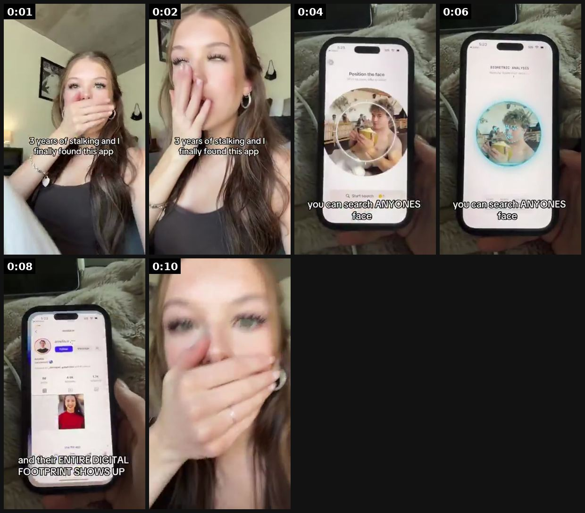

# 28 · Reaction hook + fast demo (Cal AI / app-UGC 'hook and demo'): see it, then make it

[](https://x.com/carlynorthmedia/status/2077482959620190437)

**The example:** [@carlynorthmedia on X](https://x.com/carlynorthmedia/status/2077482959620190437) · 0:11 video · 29 likes, 4K views

**Watch it:** [open the post on X](https://x.com/carlynorthmedia/status/2077482959620190437) · [play the video file](https://video.twimg.com/amplify_video/2077481592100880384/vid/avc1/320x568/Rf3sAno3qrRsFL_S.mp4?tag=28)

> this video got 4.7M views and showcased the whole product in 10 seconds &gt; first clip with shocked reaction + hook (draws curiosity about what she's going to show) &gt; directly into sped up app demo (viewer stays engaged) &gt; text on screen explaining steps any app can do this... https://t.co/LXzw5K7IEq

## What you are seeing

A woman covers her mouth in shock (the reaction hook, captioned), then a fast screen demo of a face-search app ("you can search ANYONE's face"), and she reacts again. The whole thing is 11 seconds.

## Beat by beat

The storyboard above samples the video every 0:01. Lines are the transcript for that stretch; on-screen text comes from OCR, so treat it as rough.

| Frame | Time | On screen | Said / sung |
|---|---|---|---|
| 1 | 0:00–0:01 | · | Life does not... |
| 2 | 0:01–0:03 | · | Oh my God. |
| 3 | 0:03–0:05 | · | · |
| 4 | 0:05–0:07 | · | Oh... |
| 5 | 0:07–0:09 | · | · |
| 6 | 0:09–0:11 | · | · |

<details><summary>Full transcript (timestamped)</summary>

- `0:00` Life does not...
- `0:02` Oh my God.
- `0:05` Oh...

</details>

## How to make one like it

**The format in one line:** 1-4 second shocked/emotional reaction with a curiosity text hook ("3 years of X and I finally found this") → hard cut to a sped-up demo of the product doing the thing → on-screen text explains the steps → optional reaction-return. 7-15 seconds. The app-marketing workhorse behind Cal AI/Umax-style growth; for LC the "demo" is a physical reveal.

**Why it works:** - The face sells before the script: surprise is contagious and creates an open loop ("what is she looking at?"). - Whole product shown in ~10 seconds, so completion and rewatch rates are high (@carlynorthmedia). - One locked format + many creators = volume: Musa runs the same hook across 100+ creators (@leonclipping). - Reaction discovery ranked the highest-converting app hook across 500+ UGC videos (@lucaspatiri_).

**Contents:** [1. Structure](#1-copy-the-structure) · [2. Shot by shot](#2-shot-by-shot-remake) · [3. Script and hooks](#3-write-the-script) · [4. Prompts](#4-prompts) · [5. Tools and settings](#5-tools-and-settings) · [6. Louise Carter remake](#6-louise-carter-remake) · [7. Variants and test](#7-variants-and-test-plan) · [8. Pitfalls](#8-pitfalls)

### 1. Copy the structure

Use the example's timing as your beat sheet. Keep the beat, change the words and the product.

| Beat | Time | In the example | Your version |
|---|---|---|---|
| 1 | 0:01 | Life does not... Oh my God. | … |
| 2 | 0:02 | Life does not... Oh my God. | … |
| 3 | 0:04 | Oh my God. Oh... | … |
| 4 | 0:06 | Oh... | … |
| 5 | 0:08 | Oh... | … |
| 6 | 0:10 | (visual beat, see frame 6) | … |

### 2. Shot-by-shot remake

**Target length / size:** 8-15s, 1080x1920

| # | Time / slot | What we see (visual + camera) | Dialogue / on-screen text |
|---|---|---|---|
| 1 | 0-2s | Shocked reaction: hand over mouth, eyes wide, phone selfie | Text hook: "3 years of green fingers and I finally found this" |
| 2 | 2-8s | Hard cut to sped-up demo (2x): product under the shower, rubbing, still gold | Text: "showered in it for 30 days" |
| 3 | 8-12s | Back to reaction, or product close-up | "[brand]" + "link in bio" |

<details><summary>Playbook shot list (Louise Carter version from the README)</summary>

| Time / slot | Visual | Audio / copy |
|---|---|---|
| 0-2s | Creator close-up, hand over mouth / wide eyes; big caption hook | No VO or a gasp; trending sound low |
| 2-3s | Hard cut (match the gesture) to hands + product | Whoosh SFX |
| 3-9s | Sped-up demo: dunk necklace in a glass of water → wipe → still gold; or build a 7-piece stack in 5s | Captions per step ("put it in water", "scrub it", "still gold??") |
| 9-11s | Return to face: second reaction or "where has this been" caption | — |
| 11-12s | Product name + "any 7 for $85" sticker (paid) / nothing (organic) | — |

</details>

### 3. Write the script

Open with one of these hooks (first 1–3 seconds, or the headline on a static):

- "3 years of green necks and I finally found this"
- "I'm sorry WHAT is this jewelry made of"
- "POV: you find out you never have to take your jewelry off again"
- "Why did nobody tell me you can shower in gold-tone jewelry"
- "My boyfriend said it would turn green in a week. It's been 6 months."
- "I was today years old when I found out what PVD means"
- "That friend who never takes her jewelry off" (identity hook)

Then fill the beats from the table above. Pull the wording from real customer reviews, not from ad copy: a review line beats a copywriter line almost every time. Read every line out loud and cut anything you would not say to a friend. Ready-made Louise Carter scripts are in section 6; hand [BOT.md](BOT.md) to any AI agent to write versions for another brand.

### 4. Prompts

**Edit**

```text
CapCut: speed 2x on the demo, hard cut on a sound hit, captions in TikTok default font, white with black outline.
```

**Full creative-agent prompt (from the playbook):**

```
Generate 40 reaction-hook captions for Louise Carter (waterproof 14K PVD jewelry; any 7 for $85). Mix 8 hook types: discovery ("3 years of X and I finally found…"), POV, identity ("that friend who…"), disbelief, stat in first 0.5s, boyfriend/mom doubt, "I was today years old", confession. ≤10 words each, lowercase TikTok voice, no claims beyond: shower-proof/waterproof as on PDP, won't turn skin green, 14K PVD. Pair each with one demo clip from: water dunk, sink scrub, ocean dip, 6-month comparison, stack build, gift open.
```

### 5. Tools and settings

1. Lock ONE template: hook caption style, cut point, demo action, caption font (TikTok Classic white w/ black stroke), 7-12s length.
2. Brief 10 creators (strategy 28): film 5 reactions each in different outfits/locations + 1 demo clip set we supply (LC can shoot the demo B-roll once and share it).
3. Demo library (shoot once): water dunk, sink scrub, ocean dip, sweat/gym, 6-month-old vs new, 7-piece stack build, gift-box open.
4. Assemble in CapCut template; swap hook text per post; post 1-3/day across LC TikTok + creators' own accounts.
5. Paid: take top 10% by 3s-hold into Spark/Partnership ads.

| Setting | Value |
|---|---|
| Canvas | 1080×1920 (9:16) master; crop a 1080×1350 (4:5) cut for feed placements |
| Frame rate | 30 fps (shoot 60 fps for slow-motion water or sparkle shots) |
| Camera | Phone main lens at 1x, exposure locked on skin, HDR off, grid on; tripod or a phone clamp for product shots |
| Light | One soft key at 45° (window or ring light), white card as fill; side light for metal sparkle |
| Audio | Lavalier or phone 15–20 cm from the mouth; mix voice at -14 LUFS, music at -28 to -30 dB under voice |
| Captions | Burned in, 2–5 words per line, 64–80 px bold sans, white with a black stroke or pill; keep text inside the safe zone (top 220 px and bottom 420 px clear, 64 px side margins) |
| Pacing | A visual change every 1.5–3 s; the hook lands in the first 1.5 s with no logo intro |
| Edit / export | CapCut or Premiere; H.264, 12–20 Mbps, AAC 320 kbps; upload natively to each platform, not via links |

### 6. Louise Carter remake

- A · Face: hand over mouth, caption "6 months of showering in this necklace and…" → cut: necklace dunked, scrubbed, still gold → caption "it literally looks new" → face: "where has this been".
- B · Face: confused, caption "my mom asked me why my jewelry never turns green" → cut: stack build 7 pieces in 5s → "any 7 for $85 and you never take it off".
- C · Face: shocked, caption "I was today years old when I learned what PVD gold is" → cut: macro of herringbone under tap → caption "14K PVD = bonded, not painted on".

Brand rules, claims you can and cannot make, and more scripts: [brands/louise-carter.md](brands/louise-carter.md). Step-by-step from idea to scale: [STAGES.md](STAGES.md).

### 7. Variants and test plan

- Reaction length 1s vs 3s
- Demo: water vs stack vs comparison
- Caption hook type (8 types)
- Creator age 22-30 vs 35-50

**Test plan:** - **Budget/structure:** Organic: 30 posts in 14 days across LC TikTok + 5 creators; paid: top 5 as Spark ads $50/day - **Primary KPIs:** Organic: 3s hold ≥65%, completion ≥40%, saves/1k; paid: hook rate ≥30%, CPA; Omni bio-link + Spark revenue (F28-*) - **Kill rule:** Hook text that underperforms median 2 posts in a row - **Scale rule:** Freeze the winning hook, recruit 10 more creators on the same template (Musa model) - **Naming:** `utm_content=F28-<concept>-<variant>`; weekly Omni roll-up of new-customer revenue by format.

**Naming:** `F28-<variant>-<hook##>-<date>` so results map back to this folder. Change one thing per test (hook, narrator, length or offer), never two.

### 8. Pitfalls

- The reaction must be under 2s; longer and people scroll.
- Demo must show the real product doing the real thing.
- Slow open: if the first 1.5 s does not show the hook visually, most people swipe.
- Logo or brand intro at the start reads as an ad; put the brand at the end.
- Captions covered by the platform UI: check the safe zone on a real phone before posting.
- Music over the voice: keep music at least 14 dB under speech.

**Compliance:** Baseline: [_COMPLIANCE.md](../_COMPLIANCE.md) (no fake testimonials, AI disclosure, no bulk/spoofed accounts, copy structure not assets, PDP-only claims). - Real creators with #ad / Paid partnership toggle; AI-generated reactions need the AI label and may not be presented as a real customer. - Demo must be real footage of LC product (no CGI "still gold" faking). - Don't copy another brand's exact caption/footage; template = structure only.

## More examples

Every post we found for this format, with transcripts: [examples/](examples/README.md). Playbook: [README.md](README.md). Agent brief: [BOT.md](BOT.md).
