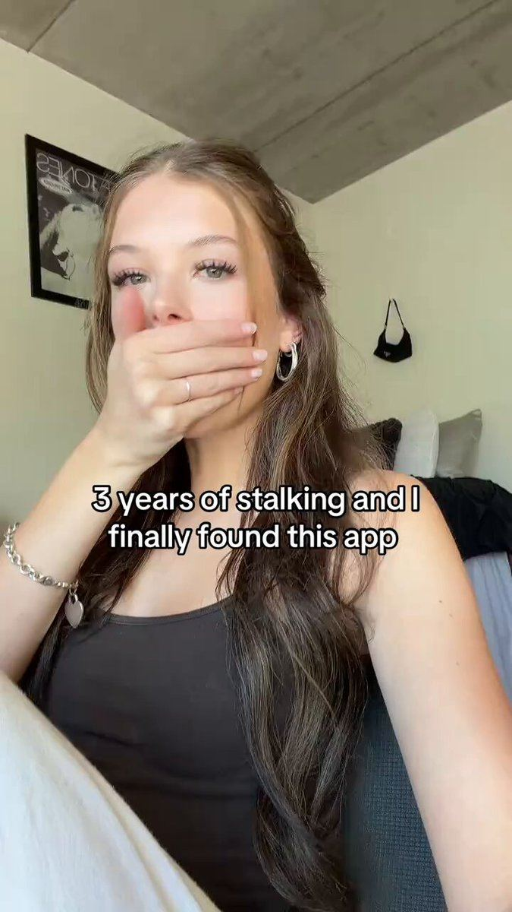

# 28 · Reaction hook + fast demo (Cal AI / app-UGC "hook and demo")

<!-- HERO:START -->
[](EXAMPLE.md)

**[See the example and how to make it →](EXAMPLE.md)** · [watch on X](https://x.com/carlynorthmedia/status/2077482959620190437)
<!-- HERO:END -->


> **LC priority P0** · evidence: Very high (522M-view case, 4.7M example, multiple app operators) · hype risk: Low-Med · cost $15-60 per creator video (or in-house) · 15-30 min per video once the template exists

## What it is
1-4 second shocked/emotional reaction with a curiosity text hook ("3 years of X and I finally found this") → hard cut to a sped-up demo of the product doing the thing → on-screen text explains the steps → optional reaction-return. 7-15 seconds. The app-marketing workhorse behind Cal AI/Umax-style growth; for LC the "demo" is a physical reveal.

## Why it works
- The face sells before the script: surprise is contagious and creates an open loop ("what is she looking at?").
- Whole product shown in ~10 seconds, so completion and rewatch rates are high (@carlynorthmedia).
- One locked format + many creators = volume: Musa runs the same hook across 100+ creators (@leonclipping).
- Reaction discovery ranked the highest-converting app hook across 500+ UGC videos (@lucaspatiri_).

## Shot-by-shot (LC version)

| Time / slot | Visual | Audio / copy |
|---|---|---|
| 0-2s | Creator close-up, hand over mouth / wide eyes; big caption hook | No VO or a gasp; trending sound low |
| 2-3s | Hard cut (match the gesture) to hands + product | Whoosh SFX |
| 3-9s | Sped-up demo: dunk necklace in a glass of water → wipe → still gold; or build a 7-piece stack in 5s | Captions per step ("put it in water", "scrub it", "still gold??") |
| 9-11s | Return to face: second reaction or "where has this been" caption | — |
| 11-12s | Product name + "any 7 for $85" sticker (paid) / nothing (organic) | — |

## Hooks (swap-in openers)
- "3 years of green necks and I finally found this"
- "I'm sorry WHAT is this jewelry made of"
- "POV: you find out you never have to take your jewelry off again"
- "Why did nobody tell me you can shower in gold-tone jewelry"
- "My boyfriend said it would turn green in a week. It's been 6 months."
- "I was today years old when I found out what PVD means"
- "That friend who never takes her jewelry off" (identity hook)

## Real examples from X (studied)
- @leonclipping — Musa (period app): "a 4 sec shocked reaction to a period fact nobody told you, then the dragon in the app explains it"; 522M views, 930 videos >100K, top 12.2M, 100+ creators on the same hook (image: darkugc grid) ([post](https://x.com/leonclipping/status/2107903429490135362)).
- @carlynorthmedia — 4.7M views: shocked reaction + "3 years of stalking and I finally found this app" → sped-up demo → text steps (frames reviewed) ([post](https://x.com/carlynorthmedia/status/2077482959620190437)).
- @danclipping — manifestation app 250K downloads from 2 formats: reaction + app demo, and the yap format (1.3M views) ([post](https://x.com/danclipping/status/2078147137049923751)).
- @jesseabed_ — creator pay for this format: ~$400 base + view milestones for 40-60 hook-and-demo videos ([post](https://x.com/jesseabed_/status/2102818749384421524)).
- @lucaspatiri_ — 9 hooks in 80% of top app UGC; reaction discovery = highest converting; text in first 0.5s → 60%+ hook rates ([post](https://x.com/lucaspatiri_/status/2076336849111449657)).
- @nicktheriot_ — "Reaction" in S-tier of the 2026 FB creative tier list ([post](https://x.com/nicktheriot_/status/2108173638033871013)).

## Production recipe
1. Lock ONE template: hook caption style, cut point, demo action, caption font (TikTok Classic white w/ black stroke), 7-12s length.
2. Brief 10 creators (strategy 28): film 5 reactions each in different outfits/locations + 1 demo clip set we supply (LC can shoot the demo B-roll once and share it).
3. Demo library (shoot once): water dunk, sink scrub, ocean dip, sweat/gym, 6-month-old vs new, 7-piece stack build, gift-box open.
4. Assemble in CapCut template; swap hook text per post; post 1-3/day across LC TikTok + creators' own accounts.
5. Paid: take top 10% by 3s-hold into Spark/Partnership ads.

## Bot prompt (copy into the creative agent)
```
Generate 40 reaction-hook captions for Louise Carter (waterproof 14K PVD jewelry; any 7 for $85). Mix 8 hook types: discovery ("3 years of X and I finally found…"), POV, identity ("that friend who…"), disbelief, stat in first 0.5s, boyfriend/mom doubt, "I was today years old", confession. ≤10 words each, lowercase TikTok voice, no claims beyond: shower-proof/waterproof as on PDP, won't turn skin green, 14K PVD. Pair each with one demo clip from: water dunk, sink scrub, ocean dip, 6-month comparison, stack build, gift open.
```

## 3 LC scripts
- A · Face: hand over mouth, caption "6 months of showering in this necklace and…" → cut: necklace dunked, scrubbed, still gold → caption "it literally looks new" → face: "where has this been".
- B · Face: confused, caption "my mom asked me why my jewelry never turns green" → cut: stack build 7 pieces in 5s → "any 7 for $85 and you never take it off".
- C · Face: shocked, caption "I was today years old when I learned what PVD gold is" → cut: macro of herringbone under tap → caption "14K PVD = bonded, not painted on".

## Variants to test
- Reaction length 1s vs 3s
- Demo: water vs stack vs comparison
- Caption hook type (8 types)
- Creator age 22-30 vs 35-50

## Omni test plan
- **Budget/structure:** Organic: 30 posts in 14 days across LC TikTok + 5 creators; paid: top 5 as Spark ads $50/day
- **Primary KPIs:** Organic: 3s hold ≥65%, completion ≥40%, saves/1k; paid: hook rate ≥30%, CPA; Omni bio-link + Spark revenue (F28-*)
- **Kill rule:** Hook text that underperforms median 2 posts in a row
- **Scale rule:** Freeze the winning hook, recruit 10 more creators on the same template (Musa model)
- **Naming:** `utm_content=F28-<concept>-<variant>`; weekly Omni roll-up of new-customer revenue by format.

## Compliance
Baseline: [_COMPLIANCE.md](../_COMPLIANCE.md) (no fake testimonials, AI disclosure, no bulk/spoofed accounts, copy structure not assets, PDP-only claims).
- Real creators with #ad / Paid partnership toggle; AI-generated reactions need the AI label and may not be presented as a real customer.
- Demo must be real footage of LC product (no CGI "still gold" faking).
- Don't copy another brand's exact caption/footage; template = structure only.

## Related
- Strategies: 10-skit-and-problem-first-ugc-hooks, 28-ugc-creator-network-per-video-pay, 36-owned-winner-video-remix
- Formats: [18-green-screen-reaction-and-comment-reply](../18-green-screen-reaction-and-comment-reply/README.md), [43-hudson-method-creator-swarm](../43-hudson-method-creator-swarm/README.md), [53-ai-ugc-outlier-remake-lab](../53-ai-ugc-outlier-remake-lab/README.md)

<!-- EVIDENCE:START -->
## Wave 4 update: Fedotoff October 2026 swipe boards
- Luxmend: Test-it-live yapper ("we're gonna see if this actually works"), 528 days live (Yapper Ads board). "I won't cut the video" is a proof promise, and the doubt at the start ("I want to know if this is gonna just take off random hair") buys trust.
- Kristina's Fashion Essentials: "I'll be so disappointed if this doesn't work" lash-test yapper, 382 days live (Yapper Ads board). The stakes are set before the demo, and "everyone says" is borrowed social proof.
- Muscle Mat: "I transform your bed today" demo (Muscle Mat), 819 days live (Hook Frameworks That Stop the Scroll board). A before/after demo in one location with a clear transformation.
- Stills, how-to and LC remakes: [adlibrary/](adlibrary/README.md).

## Evidence from X discovery (auto-generated)

| Date | Author | Post | Engagement | Grade | Gist |
|---|---|---|---|---|---|
| 2026-10-08 | [@nicktheriot_](https://x.com/nicktheriot_) | [link](https://x.com/nicktheriot_/status/2108173638033871013) | 219L/348BM/12kV | VALUE | 2026 FB creative styles tier list: S = long primary text + organic image, LTO, UGC, VSL, reaction, news; A = demo, us vs them, testimonial, close-up, founder story, podcast, BTS, authority, x reasons; C = unboxing, DITL. |
| 2026-09-23 | [@jesseabed_](https://x.com/jesseabed_) | [link](https://x.com/jesseabed_/status/2102818749384421524) | 148L/324BM/18kV | VALUE | Sideshift creator pay: hook-and-demo creators ~$400 base + view milestones for 40-60 videos; talking head/skit ~$400 for 20-30; 25% upfront. |
| 2026-07-12 | [@lucaspatiri_](https://x.com/lucaspatiri_) | [link](https://x.com/lucaspatiri_/status/2076336849111449657) | 53L/122BM/4kV | VALUE | 9 hooks in 80% of top app UGC (500+ videos/30 apps): POV, reaction discovery (highest-converting), "that friend who…", before/after, guilty confession, stat in first 0.5s. |
| 2026-09-05 | [@nicktheriot_](https://x.com/nicktheriot_) | [link](https://x.com/nicktheriot_/status/2096219973139992840) | 45L/55BM/4kV | VALUE | Stuck-account order: new avatar → new style (AI UGC, animation, unboxing, reaction, native) → curiosity text hook → uncommon location → combos. |
| 2026-10-07 | [@leonclipping](https://x.com/leonclipping) | [link](https://x.com/leonclipping/status/2107903429490135362) | 44L/66BM/3kV | VALUE | Musa app: ONE format (4-sec shocked reaction to a body fact → mascot explains) = 522M views, 930 videos >100K, 100+ creators. |
| 2026-07-15 | [@carlynorthmedia](https://x.com/carlynorthmedia) | [link](https://x.com/carlynorthmedia/status/2077482959620190437) | 29L/57BM/4kV | VALUE | 4.7M views in 11 seconds: shocked reaction + hook text → sped-up demo → on-screen text steps. |
| 2026-10-08 | [@themariaines](https://x.com/themariaines) | [link](https://x.com/themariaines/status/2108191952047153611) | 16L/35BM/2kV | VALUE | Same hook, same format, different app: Albo 891.8K views, $70K/mo — "been shopping at Aldi for 10 years and NOW I FIND THIS" + silent demo. |
| 2026-06-24 | [@cesaralvarezll](https://x.com/cesaralvarezll) | [link](https://x.com/cesaralvarezll/status/2069747240634032364) | 74L/108BM/9kV | SOME | UGC reaction + app demo works for almost any product (Arcads pitch). |
| 2026-08-10 | [@alexolim_](https://x.com/alexolim_) | [link](https://x.com/alexolim_/status/2086830919587942456) | 55L/192BM/9kV | SOME | Glam AI / Cal AI / Umax used the same 5 UGC content patterns to $1M MRR (image + thread). |
| 2026-07-17 | [@danclipping](https://x.com/danclipping) | [link](https://x.com/danclipping/status/2078147137049923751) | 43L/52BM/6kV | SOME | Manifestation app 250K downloads from 2 formats: reaction + app demo, and the yap format (1.3M views, strong hook). Comment-gated guide. |
| 2026-09-24 | [@Ecombos_Ai](https://x.com/Ecombos_Ai) | [link](https://x.com/Ecombos_Ai/status/2103180929057407425) | 28L/26BM/2kV | SOME | 10 AI UGC styles: talking-head testimonial, product-in-hand, first-try reaction, fake podcast, street interview, comment reply, unboxing, DITL/GRWM, before/after, whiteboard. |
| 2026-09-18 | [@jhueri](https://x.com/jhueri) | [link](https://x.com/jhueri/status/2101054562253631699) | 25L/24BM/5kV | SOME | UGC formats ranked by conversion: talking head > hook-and-demo > skit … long text on screen last. |
| 2026-09-07 | [@consumerxai](https://x.com/consumerxai) | [link](https://x.com/consumerxai/status/2096916156389240853) | 14L/24BM/1kV | SOME | Outlier: aesthetic desk-setup hook + split-screen app demo, 558K views/4.4K saves. |
| 2026-07-30 | [@youravgtechbro](https://x.com/youravgtechbro) | [link](https://x.com/youravgtechbro/status/2082865419950452866) | 5L/4BM/0kV | SOME | Formats that worked: hook (AI avatar + spicy text) then demo; text-on-screen over a background clip for awareness. |
<!-- EVIDENCE:END -->
