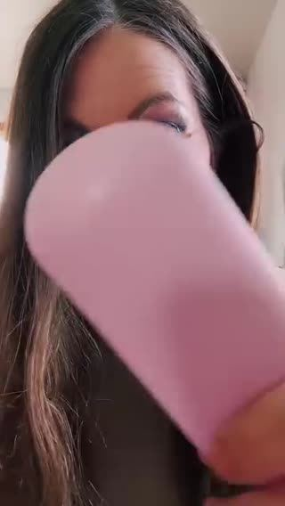
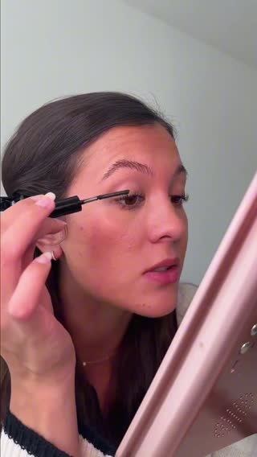

# Meta ad-library examples for F28

<!-- WAVE4 -->
## Wave 4: Alex Fedotoff's October 2026 swipe boards (GetHookd public previews)

Each ad below is from the free 10-ad preview of a public GetHookd board that [@FedotOff90](https://x.com/FedotOff90) shared on X. Days live are as of 2026-10-09; brand claims are the advertisers', not verified.

### Muscle Mat: "I transform your bed today" demo (Muscle Mat) (819 days live)

- **Board:** [Hook Frameworks That Stop the Scroll (Top 150)](https://x.com/FedotOff90/status/2106774251777020286) · dco 27 s
- **What happens:** A man sits on a hard bed, rolls out the topper, sits again and smiles; end card "SALE ON NOW · swipe up to save". 27 s.
- **Why it lasts:** 819 days. A before/after demo in one location with a clear transformation.
- **How to make one:** Same spot, before (discomfort), the product goes on, after (relief); end card offer.
- **LC remake:** "Watch me fix a green neck in 10 seconds."

### Luxmend: Test-it-live yapper ("we're gonna see if this actually works") (528 days live)

- **Board:** [Yapper Ads (raw talking-head UGC) - Oct 2026](https://x.com/FedotOff90/status/2108196484403663180) · video 118 s
- **What happens:** A woman talks to her front camera for 118 s while testing a split-end trimmer on her own hair, in one take with no cuts: "we're gonna see if this split end trimmer actually works… I'm not gonna cut the video at all."
- **Why it lasts:** 528 days live, the longest in the board. "I won't cut the video" is a proof promise, and the doubt at the start ("I want to know if this is gonna just take off random hair") buys trust.
- **How to make one:** Phone on a stand at eye level, natural light, one continuous take. Say the doubt first, then do the test on camera and react honestly. Product name only after the result.
- **LC remake:** "I'm gonna shower in this necklace every day for a week and not cut the video". A one-take shower test with an honest reaction.

### Kristina's Fashion Essentials: "I'll be so disappointed if this doesn't work" lash-test yapper (382 days live)

- **Board:** [Yapper Ads (raw talking-head UGC) - Oct 2026](https://x.com/FedotOff90/status/2108196484403663180) · video 106 s
- **What happens:** A close-up selfie: "I'm gonna be so disappointed if this does not work exactly like everyone says it does… these lashes are seriously just so stubborn". She applies the mascara live and reacts. 106 s.
- **Why it lasts:** 382 days. The stakes are set before the demo, and "everyone says" is borrowed social proof.
- **How to make one:** Name your specific problem ("straight Asian lashes"), say what you've heard, test it live, react. Keep the camera on your face and the problem area.
- **LC remake:** "Everyone says these don't tarnish. My skin turns everything green. Let's see."

