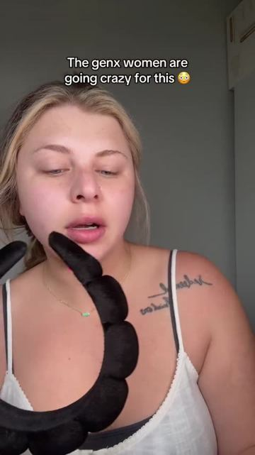
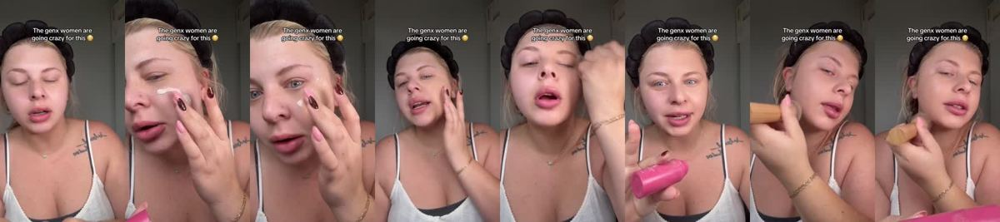
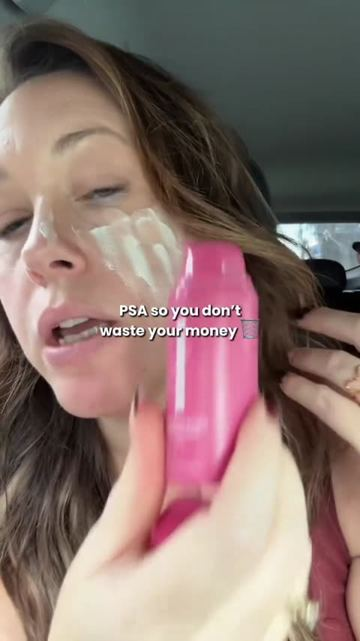
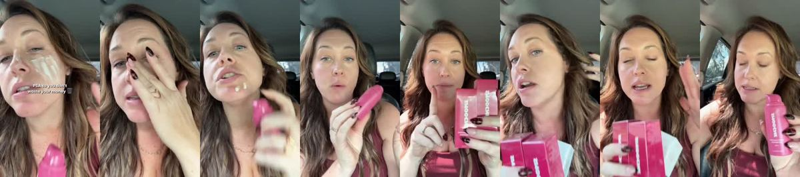

# Meta ad-library examples for F28

<!-- WAVE6 -->
## Wave 6: Resilia & Smooche live Meta ads (Oct 2026)

Pulled from the public Meta Ad Library on 2026-10-09 (Resilia: aged garlic, Ceylon cinnamon, oil of oregano; Smooche: color-changing foundation, Reverse Time peptide serum). Days live are counted to 2026-10-09; most video ads were new tests that week, while the long runners are statics and catalog templates. Transcripts are automatic. Brand claims are the advertisers', not verified, and many are health claims we would never make. The **Do not copy** line flags deceptive tactics (persona "publication" pages, undisclosed AI actors and "experts", fake stock counts).

### Smooche · Smooche: “Apparently all the Gen XONES are going crazy for that foundation…” (10 days live)

- **Ad:** [Meta Ad Library #1590071382897437](https://www.facebook.com/ads/library/?id=1590071382897437) · video 1:23 · page “Smooche” · started 2026-09-28 · 1 copies · lands on `smooche.com/products/ccf2`
- **What happens:** Opens: “Apparently all the Gen XONES are going crazy for that foundation because it looks really there. And it matches perfectly only.”
- **Why it works:** "Apparently all the Gen X-ers are going crazy for this foundation…" A curious creator tries the viral product on camera, with the reaction first and the demo second.
- **How to make one:** Use the social-proof line, the first application on camera, a split-face proof, and an honest verdict.
- **LC remake:** "Everyone in my pilates class wears this necklace, so I tested it in the sauna for a week."

Transcript (auto, first ~70 s)

> Apparently all the Gen XONES are going crazy for that foundation because it looks really there. And it matches perfectly only. Now I'm not GenX but I want to see how this does on my skin. This is apparently a color changing foundation. So if you struggle with your makeup looking too orange is supposed to turn to your perfect shade as I rub it in. It does look like there's a little bit dark so I'm a little nervous but we're just going to trust the process and see why the women are going crazy for this. and I'm almost 30 so I'm not a Gen X woman but they're going crazy for this one. So I have some freckles, some redness, some dark under eyes and as I blend it in... it does actually look like it is kind of turning to my perfect shade. Almost let's just keep blending it. Let's go on my nose right there. Underneath my eye, under the eye, under the eye, under the eye, under the eye, under the eye, under the eye, under the eye, under the eye, under the eye, under the eye, under the eye, under the eye, under the eye, under the eye, under the eye, under the eye, under the eye, under the eye, under the eye, under the eye, Aunty, i tookunch checked and

### Smooche · Smooche: “on this color changing foundation that you're seeing everywhere right…” (10 days live)

- **Ad:** [Meta Ad Library #1459763555969328](https://www.facebook.com/ads/library/?id=1459763555969328) · video 0:59 · page “Smooche” · started 2026-09-28 · 1 copies · lands on `smooche.com/products/ccf2`
- **What happens:** Opens: “on this color changing foundation that you're seeing everywhere right now. New one says that it's supposed to...”
- **Why it works:** "Apparently all the Gen X-ers are going crazy for this foundation…" A curious creator tries the viral product on camera, with the reaction first and the demo second.
- **How to make one:** Use the social-proof line, the first application on camera, a split-face proof, and an honest verdict.
- **LC remake:** "Everyone in my pilates class wears this necklace, so I tested it in the sauna for a week."

Transcript (auto, first ~70 s)

> on this color changing foundation that you're seeing everywhere right now. New one says that it's supposed to... match your skin tone and that it's a lightweight, buildable coverage and it also skin care in it. The one video that I saw said I had hyaluronic acid for hydration and that I also has SPF in it too. Do not waste your money on this because if you are going to get this, you should know that they actually have a deal where you can buy one and then get one for $10 more. Basically, you could buy one at the sale price or you can spend $10 more and get two.

<!-- /WAVE6 -->

<!-- WAVE4 -->
## Wave 4: Alex Fedotoff's October 2026 swipe boards (GetHookd public previews)

Each ad below is from the free 10-ad preview of a public GetHookd board that [@FedotOff90](https://x.com/FedotOff90) shared on X. Days live are as of 2026-10-09; brand claims are the advertisers', not verified.

### Muscle Mat: "I transform your bed today" demo (Muscle Mat) (819 days live)

- **Board:** [Hook Frameworks That Stop the Scroll (Top 150)](https://x.com/FedotOff90/status/2106774251777020286) · dco 27 s
- **What happens:** A man sits on a hard bed, rolls out the topper, sits again and smiles; end card "SALE ON NOW · swipe up to save". 27 s.
- **Why it lasts:** 819 days. A before/after demo in one location with a clear transformation.
- **How to make one:** Same spot, before (discomfort), the product goes on, after (relief); end card offer.
- **LC remake:** "Watch me fix a green neck in 10 seconds."

### Luxmend: Test-it-live yapper ("we're gonna see if this actually works") (528 days live)

- **Board:** [Yapper Ads (raw talking-head UGC) - Oct 2026](https://x.com/FedotOff90/status/2108196484403663180) · video 118 s
- **What happens:** A woman talks to her front camera for 118 s while testing a split-end trimmer on her own hair, in one take with no cuts: "we're gonna see if this split end trimmer actually works… I'm not gonna cut the video at all."
- **Why it lasts:** 528 days live, the longest in the board. "I won't cut the video" is a proof promise, and the doubt at the start ("I want to know if this is gonna just take off random hair") buys trust.
- **How to make one:** Phone on a stand at eye level, natural light, one continuous take. Say the doubt first, then do the test on camera and react honestly. Product name only after the result.
- **LC remake:** "I'm gonna shower in this necklace every day for a week and not cut the video". A one-take shower test with an honest reaction.

### Kristina's Fashion Essentials: "I'll be so disappointed if this doesn't work" lash-test yapper (382 days live)

- **Board:** [Yapper Ads (raw talking-head UGC) - Oct 2026](https://x.com/FedotOff90/status/2108196484403663180) · video 106 s
- **What happens:** A close-up selfie: "I'm gonna be so disappointed if this does not work exactly like everyone says it does… these lashes are seriously just so stubborn". She applies the mascara live and reacts. 106 s.
- **Why it lasts:** 382 days. The stakes are set before the demo, and "everyone says" is borrowed social proof.
- **How to make one:** Name your specific problem ("straight Asian lashes"), say what you've heard, test it live, react. Keep the camera on your face and the problem area.
- **LC remake:** "Everyone says these don't tarnish. My skin turns everything green. Let's see."

