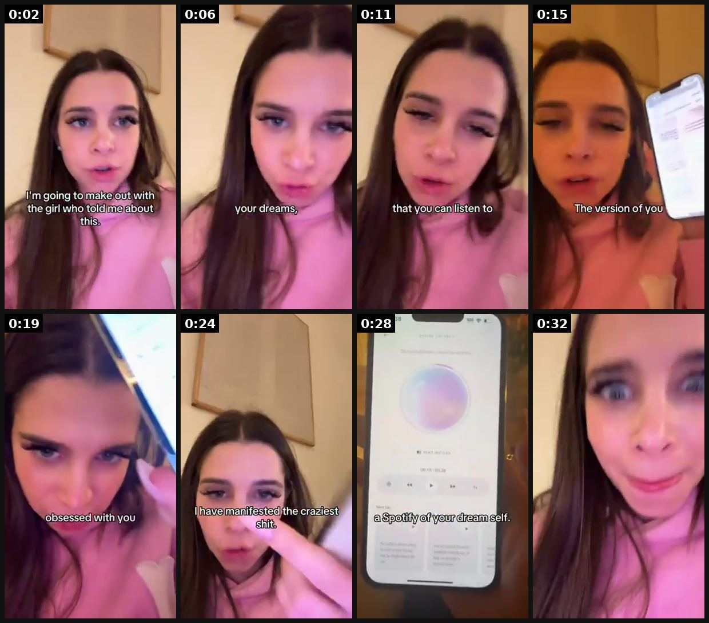
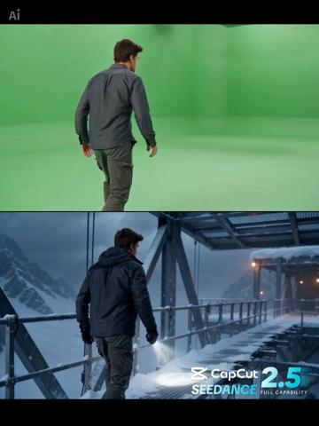
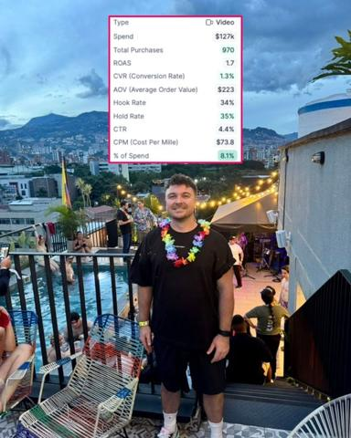
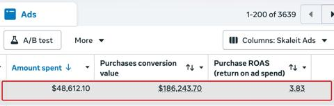
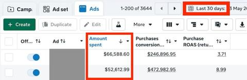

# 29 · Green-screen personal story / long-form yapper (brand appears late): see it, then make it

[](https://x.com/danclipping/status/2078147137049923751)

**The example:** [@danclipping on X](https://x.com/danclipping/status/2078147137049923751) · 0:35 video · 43 likes, 6K views

**Watch it:** [open the post on X](https://x.com/danclipping/status/2078147137049923751) · [play the video file](https://video.twimg.com/amplify_video/2078147101792604160/vid/avc1/320x568/-Reg_ytn0MQNd93P.mp4?tag=14)

> This manifestation app did 250K downloads with 2 UGC formats The reaction + app demo format And the yap format This views got 1.3M views 9K saves 32K likes, With the yap format Ppl avoid this format cause it need a strong hook like she used “I’m going to make out with the girl that showed me this” That instantly stops the views from scrolling and I put together a guide to help u master this format Hooks Pacing e.t.c …

## What you are seeing

A creator talking to camera in her bedroom with captions ("I'm going to make you fall in love with the girl who...") that tells a personal manifestation story. The app (a mood or affirmation screen) only appears late, as part of her story.

## Beat by beat

The storyboard above samples the video every 0:04. Lines are the transcript for that stretch; on-screen text comes from OCR, so treat it as rough.

| Frame | Time | On screen | Said / sung |
|---|---|---|---|
| 1 | 0:00–0:04 | I'm going to make out with the girl who this | to make out with the girl who told me about this. You're telling me there's an app |
| 2 | 0:04–0:08 | · | where you tell it your desires, your dreams, |
| 3 | 0:08–0:13 | that you to | and it will write stories, detailed stories that you can listen to about your future self |
| 4 | 0:13–0:17 | The version of you | who already has it. The version of you that already became a millionaire, |
| 5 | 0:17–0:21 | obsessed with you | the version of you where that guy is obsessed with you and is getting down on one knee to marry you. |
| 6 | 0:21–0:26 | · | I have manifested the craziest shit using it. |
| 7 | 0:26–0:30 | · | It is literally a Spotify of your dream self. |
| 8 | 0:30–0:35 | · | Gate keep this. |

<details><summary>Full transcript (timestamped)</summary>

- `0:00` to make out with the girl who told me about this.
- `0:03` You're telling me there's an app
- `0:04` where you tell it your desires, your dreams,
- `0:07` and it will write stories, detailed stories
- `0:10` that you can listen to about your future self
- `0:13` who already has it.
- `0:15` The version of you that already became a millionaire,
- `0:17` the version of you where that guy is obsessed with you
- `0:20` and is getting down on one knee to marry you.
- `0:22` I have manifested the craziest shit using it.
- `0:26` It is literally a Spotify of your dream self.
- `0:33` Gate keep this.

</details>

## More real examples (6)

Other posts that show this format, or a close cousin of it. Click a thumbnail to open it on X.

| | | |
|---|---|---|
| [](https://x.com/StefanGeorgi/status/2090446853565296658)<br>**@StefanGeorgi** · image · 39K views<br>Stefan Georgi: yapper-style winner ~$750k spend in <3 weeks on an angle the brand said "doesn't work"; double 80/20 rule (80% proven formats). | [](https://x.com/ginacostag_/status/2082130750204428404)<br>**@ginacostag_** · 0:15 video · 34K views<br>The next AI video advantage may not come from generating more clips. It may come from making the entire production workflow easier to control. Dreamin | [](https://x.com/AvaGrace_AI/status/2083984888127271189)<br>**@AvaGrace_AI** · 0:15 video · 27K views<br>🚨 AI videos are getting easier to generate. The real challenge is controlling the final result. That's why Seedance 2.5 inside CapCut caught my attent |
| [](https://x.com/Geoffreyhurth/status/2102106541394399259)<br>**@Geoffreyhurth** · image · 230 views<br>💸 10 ad concepts quietly printing money on Meta right now: 1. Yapping: Raw, unscripted, straight to camera. Feels like a friend, not an ad. 2. Pixar A | [](https://x.com/antonioventre_/status/2105303432424767662)<br>**@antonioventre_** · image · 4K views<br>Native ads, end to end, for anyone who wants to build one The image - A normal looking photo, like something a friend posted - A bit weird on purpose, | [](https://x.com/antonioventre_/status/2078849094311674138)<br>**@antonioventre_** · image · 2K views<br>Green screen reaction ads are working really well right now. Here is the setup. You have a main video, usually a creator or an AI creator telling a st |

## How to make one like it

**The format in one line:** A creator talks straight to camera (often over a green-screen background of a relevant image — a Reddit post, a photo, a text, a map) telling a personal story in depth for 30-90 seconds; the product is not shown or named until late, when it arrives as the natural resolution. Uncut "yapper" energy; no polished B-roll.

**Why it works:** - Feels like content, not an ad, so attention is earned before the pitch (@therahulissar). - Viewers who stay through a long story arrive at the CTA with high intent. - Uncut yapping builds trust "like a friend telling you about something" (@williamkast_). - The execution variables (creator, pacing, captions, hook) make or break it — the same angle can flop or spend $750k (@StefanGeorgi).

**Contents:** [1. Structure](#1-copy-the-structure) · [2. Shot by shot](#2-shot-by-shot-remake) · [3. Script and hooks](#3-write-the-script) · [4. Prompts](#4-prompts) · [5. Tools and settings](#5-tools-and-settings) · [6. Louise Carter remake](#6-louise-carter-remake) · [7. Variants and test](#7-variants-and-test-plan) · [8. Pitfalls](#8-pitfalls)

### 1. Copy the structure

Use the example's timing as your beat sheet. Keep the beat, change the words and the product.

| Beat | Time | In the example | Your version |
|---|---|---|---|
| 1 | 0:02 | to make out with the girl who told me about this. You're telling me there's an app | … |
| 2 | 0:06 | You're telling me there's an app where you tell it your desires, your dreams, and it will write stories, detailed stories | … |
| 3 | 0:11 | and it will write stories, detailed stories that you can listen to about your future self | … |
| 4 | 0:15 | who already has it. The version of you that already became a millionaire, | … |
| 5 | 0:19 | the version of you where that guy is obsessed with you and is getting down on one knee to marry you. | … |
| 6 | 0:24 | and is getting down on one knee to marry you. I have manifested the craziest shit using it. | … |
| 7 | 0:28 | It is literally a Spotify of your dream self. | … |
| 8 | 0:32 | It is literally a Spotify of your dream self. Gate keep this. | … |

### 2. Shot-by-shot remake

**Target length / size:** 45s-3min, 1080x1920

| # | Time / slot | What we see (visual + camera) | Dialogue / on-screen text |
|---|---|---|---|
| 1 | 0-3s | Creator to camera, green-screen background of a relevant image (a photo, a Reddit post, a text) | "I'm going to tell you the story of the necklace my grandmother..." |
| 2 | 3-60s | Same framing, background changes with the story | Personal story, detailed, emotional |
| 3 | 60-90s | Product appears as part of the story (late) | One natural line |
| 4 | End | Creator | Soft CTA |

<details><summary>Playbook shot list (Louise Carter version from the README)</summary>

| Time / slot | Visual | Audio / copy |
|---|---|---|
| 0-3s | Creator in front of green-screen image (e.g. photo of a beach / Reddit post "AITA for wearing my jewelry in the pool?") | Hook line spoken immediately, captions on |
| 3-30s | Story: setup + stakes, personal details, light jump cuts | No product, no brand |
| 30-45s | Turn: "and that's when my friend showed me…" — background switches to LC piece | First product mention |
| 45-60s | Proof: shows the piece on her, tells the after | "I haven't taken it off since" |
| 60-70s | Soft CTA | "They do any 7 for $85, link's there" |

</details>

### 3. Write the script

Open with one of these hooks (first 1–3 seconds, or the headline on a static):

- "I lost my grandmother's ring in a hotel pool and I'm still not over it"
- "Storytime: I was the bridesmaid with the green neck in every photo"
- "AITA for wearing my jewelry in the ocean?" (Reddit post on green screen)
- "I'm allergic to basically every cheap earring — here's what finally worked"
- "My husband bet me $100 this necklace would tarnish in a month"

Then fill the beats from the table above. Pull the wording from real customer reviews, not from ad copy: a review line beats a copywriter line almost every time. Read every line out loud and cut anything you would not say to a friend. Ready-made Louise Carter scripts are in section 6; hand [BOT.md](BOT.md) to any AI agent to write versions for another brand.

### 4. Prompts

**Brief**

```text
Ask the creator for a real personal story where jewelry mattered. Record in one take; trim pauses only.
```

**Full creative-agent prompt (from the playbook):**

```
From these LC reviews {{REVIEWS}}, extract 10 personal stories with stakes (loss, embarrassment, gift, allergy, travel). For each write: a spoken first line (≤14 words, mid-action), 4 story beats, the moment the piece enters, the after, and a soft CTA. Product must not appear before 50% of runtime. Keep claims to PDP wording.
```

### 5. Tools and settings

1. Mine 30 real stories from reviews/DMs/post-purchase survey ("tell us the moment you knew").
2. Brief creators with the story beats, not a script; require first line within 1s and product not before 50% of runtime.
3. Green-screen backgrounds: Reddit-style post (written by LC, clearly not a fake real post — or a real one with permission), beach photo, wedding photo, text thread.
4. Edit lightly: jump cuts only, captions, no music for first 10s.
5. Make 3 hooks per story (first 3s swapped).

| Setting | Value |
|---|---|
| Canvas | 1080×1920 (9:16) master; crop a 1080×1350 (4:5) cut for feed placements |
| Frame rate | 30 fps (shoot 60 fps for slow-motion water or sparkle shots) |
| Camera | Phone main lens at 1x, exposure locked on skin, HDR off, grid on; tripod or a phone clamp for product shots |
| Light | One soft key at 45° (window or ring light), white card as fill; side light for metal sparkle |
| Audio | Lavalier or phone 15–20 cm from the mouth; mix voice at -14 LUFS, music at -28 to -30 dB under voice |
| Captions | Burned in, 2–5 words per line, 64–80 px bold sans, white with a black stroke or pill; keep text inside the safe zone (top 220 px and bottom 420 px clear, 64 px side margins) |
| Pacing | A visual change every 1.5–3 s; the hook lands in the first 1.5 s with no logo intro |
| Edit / export | CapCut or Premiere; H.264, 12–20 Mbps, AAC 320 kbps; upload natively to each platform, not via links |

### 6. Louise Carter remake

- A · "Bridesmaid green neck": "I was a bridesmaid four times last year and in every single photo my neck is green…" → story → "my sister-in-law sent me this" → "14K PVD, I swam in it in Cabo" → CTA.
- B · "Hotel pool ring": loss story over a photo of a pool → "I stopped wearing jewelry for a year" → found LC → "now I don't take it off".
- C · "The $100 bet": husband bets it'll tarnish → timeline → "pay up" → shows 6-month piece.

Brand rules, claims you can and cannot make, and more scripts: [brands/louise-carter.md](brands/louise-carter.md). Step-by-step from idea to scale: [STAGES.md](STAGES.md).

### 7. Variants and test plan

- Green screen vs plain wall
- 45s vs 90s
- Story type (loss / embarrassment / bet / gift)
- Product reveal at 40% vs 70%

**Test plan:** - **Budget/structure:** 6 creators × 2 stories × 2 hooks = 24 ads; $40/day each, 5 days - **Primary KPIs:** Avg watch time ≥15s, hold to reveal ≥20%, CPA; Omni first-order ROAS - **Kill rule:** Hook rate <20% after $80 - **Scale rule:** Winning story → same story in F14 car and F13 podcast - **Naming:** `utm_content=F29-<concept>-<variant>`; weekly Omni roll-up of new-customer revenue by format.

**Naming:** `F29-<variant>-<hook##>-<date>` so results map back to this folder. Change one thing per test (hook, narrator, length or offer), never two.

### 8. Pitfalls

- The brand appearing early turns it into an ad; hold it to the last third.
- The story must be real and the creator must disclose the partnership.
- Slow open: if the first 1.5 s does not show the hook visually, most people swipe.
- Logo or brand intro at the start reads as an ad; put the brand at the end.
- Captions covered by the platform UI: check the safe zone on a real phone before posting.
- Music over the voice: keep music at least 14 dB under speech.

**Compliance:** Baseline: [_COMPLIANCE.md](../_COMPLIANCE.md) (no fake testimonials, AI disclosure, no bulk/spoofed accounts, copy structure not assets, PDP-only claims). - Stories must be the creator's own true experience or clearly framed as a dramatization. - Paid partnership disclosure. - Green-screen images: owned or licensed; no real people's Reddit posts without permission.

## More examples

Every post we found for this format, with transcripts: [examples/](examples/README.md). Playbook: [README.md](README.md). Agent brief: [BOT.md](BOT.md).
