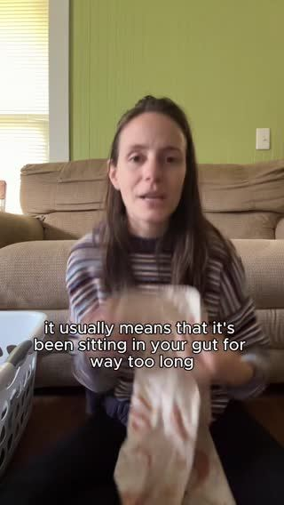

# Meta ad-library examples for F29

<!-- WAVE4 -->
## Wave 4: Alex Fedotoff's October 2026 swipe boards (GetHookd public previews)

Each ad below is from the free 10-ad preview of a public GetHookd board that [@FedotOff90](https://x.com/FedotOff90) shared on X. Days live are as of 2026-10-09; brand claims are the advertisers', not verified.

### Mariella Gut Health Expert: "Gross embarrassing story time" gut yapper (Mariella Gut Health Expert) (320 days live)

- **Board:** [Yapper Ads (raw talking-head UGC) - Oct 2026](https://x.com/FedotOff90/status/2108196484403663180) · video 105 s
- **What happens:** A creator on a couch: "Alright, gross embarrassing story time! A few months ago I started noticing that my smells were… terrible… I was feeling bloated, icky… I consulted a few physicians, they said something was wrong with my gut health…" 105 s.
- **Why it lasts:** 320 days. Embarrassment is the hook; Fedotoff: "only sell things people are embarrassed to buy in person". It's a confession, not a pitch.
- **How to make one:** Couch, casual, pyjama energy. Say "gross/embarrassing" in the first 2 s, give 2-3 specific symptoms in their own words, what they tried, the doctor moment, then the product.
- **LC remake:** "Embarrassing story time: my ex-boyfriend's mom asked why my neck was green."

