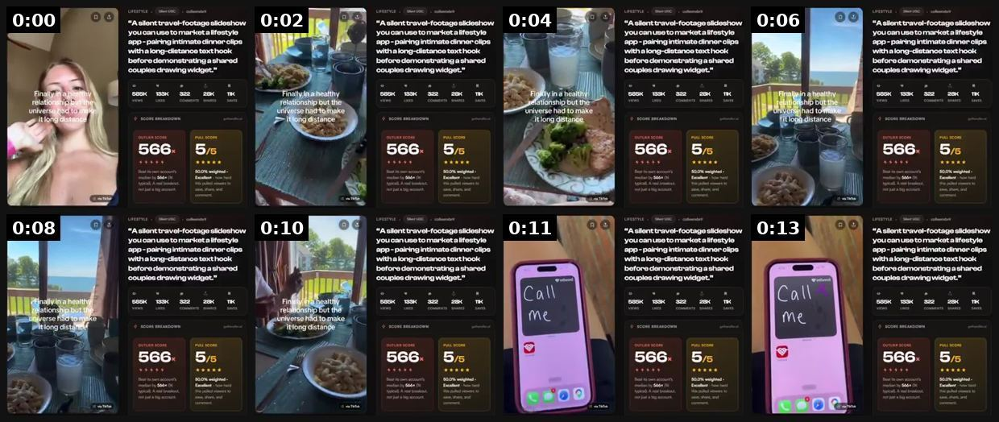

# 30 · Voiceless B-roll + text-overlay ad (mute-first): see it, then make it

[](https://x.com/consumerxai/status/2092629155036987751)

**The example:** [@consumerxai on X](https://x.com/consumerxai/status/2092629155036987751) · 0:14 video · 7 likes, 1K views

**Watch it:** [open the post on X](https://x.com/consumerxai/status/2092629155036987751) · [play the video file](https://video.twimg.com/amplify_video/2092629141313273856/vid/avc1/432x360/Dv8bWFD50a6xxLUU.mp4?tag=14)

> ‼️Tiktok Outlier Alert ‼️ 📉 585K Views, 133K Likes, 322 Comments, 28K Shares, 11K Saves 🧐What this is: > A silent travel-footage slideshow you can use to market a lifestyle app - pairing intimate dinner clips with a long-distance text hook before demonstrating a shared couples drawing widget. 🔥Why it works: (put this into 🤖claude to copy structure) > The hook captures attention by contrasting a positive relationship …

## What you are seeing

Silent travel and food B-roll (beach, plates, a café table) with a long on-screen text story about a long-distance relationship, ending on a phone screen. There is no voice: the text overlay is the whole message.

## Beat by beat

The storyboard above samples the video every 0:01. Lines are the transcript for that stretch; on-screen text comes from OCR, so treat it as rough.

| Frame | Time | On screen | Said / sung |
|---|---|---|---|
| 1 | 0:00–0:01 | a HE to app pairing intimate dinner clips a with along-distance text hook before demonstrating couples drawing val az SCORE BREAKDOWN 566. 5s 454 ly, CT | · |
| 2 | 0:01–0:03 | art travel-footage to app pairing intimate dinner clips with a long-distance text hook before demonstrating at di couples drawing Finally thy 133K 28K SCORE BRE | · |
| 3 | 0:03–0:05 | travel-footage to app pairing intimate dinner clips with a long-distance text hook before demonstrating a shared couples drawing ina 133K 322 28K universe had t | · |
| 4 | 0:05–0:07 | 00 silent travel-footage to lifestyle app pairing intimate dinner clips long-distance text hook before demonstrating a shared couples drawing Si ja in ie hip bo | · |
| 5 | 0:07–0:09 | · | · |
| 6 | 0:09–0:10 | · | · |
| 7 | 0:10–0:12 | a a cent isla to lifestyle app pairing intimate dinner clips with a long-distance text hook before demonstrating a shared a couples drawing Cal Me 866 Excellent | · |
| 8 | 0:12–0:14 | silent travel-footage to app pairing intimate dinner clips with a long-distance before demonstrating a shared couples drawing Me 568. Excellent 50.0% weighted e | · |

## How to make one like it

**The format in one line:** No one talks. Product and lifestyle B-roll (pool, shower, beach, stacking hands) with the script delivered as short on-screen text beats, one per shot, plus music. The "mute text overlay" version of a winning message — cheap to scale into dozens of variants.

**Why it works:** - Most feed video is watched muted; the message survives with sound off. - Fast to scale: same footage, new text = new ad (@williamkast_ "clean, fast, easy to scale"). - A different production format = new Entity ID for a proven message. - Short phrases highlighting key points read faster than VO.

**Contents:** [1. Structure](#1-copy-the-structure) · [2. Shot by shot](#2-shot-by-shot-remake) · [3. Script and hooks](#3-write-the-script) · [4. Prompts](#4-prompts) · [5. Tools and settings](#5-tools-and-settings) · [6. Louise Carter remake](#6-louise-carter-remake) · [7. Variants and test](#7-variants-and-test-plan) · [8. Pitfalls](#8-pitfalls)

### 1. Copy the structure

Use the example's timing as your beat sheet. Keep the beat, change the words and the product.

| Beat | Time | In the example | Your version |
|---|---|---|---|
| 1 | 0:00 | on screen: a HE to app pairing intimate dinner clips a with along-distance text hook before demonstrating couples drawing val az SC | … |
| 2 | 0:02 | on screen: art travel-footage to app pairing intimate dinner clips with a long-distance text hook before demonstrating at di couple | … |
| 3 | 0:04 | on screen: travel-footage to app pairing intimate dinner clips with a long-distance text hook before demonstrating a shared couples | … |
| 4 | 0:06 | on screen: 00 silent travel-footage to lifestyle app pairing intimate dinner clips long-distance text hook before demonstrating a s | … |
| 5 | 0:08 | (visual beat, see frame 5) | … |
| 6 | 0:10 | (visual beat, see frame 6) | … |
| 7 | 0:11 | on screen: a a cent isla to lifestyle app pairing intimate dinner clips with a long-distance text hook before demonstrating a share | … |
| 8 | 0:13 | on screen: silent travel-footage to app pairing intimate dinner clips with a long-distance before demonstrating a shared couples dr | … |

### 2. Shot-by-shot remake

**Target length / size:** 10-25s, 1080x1920, music only

| # | Time / slot | What we see (visual + camera) | Dialogue / on-screen text |
|---|---|---|---|
| 1 | 0-2s | Most beautiful B-roll shot (wet necklace in sun) | Text beat 1: hook (max 8 words) |
| 2 | 2-15s | 1 shot per text beat, 2-3s each: shower, pool, stacking hands, beach | One short line per shot |
| 3 | 15-20s | Product close-up | Offer line |
| 4 | Audio | Licensed or commercial-library track | No voice |

<details><summary>Playbook shot list (Louise Carter version from the README)</summary>

| Time / slot | Visual | Audio / copy |
|---|---|---|
| 0-2s | Macro: water droplets on gold herringbone | TEXT: "you can shower in this" |
| 2-4s | Hand in pool, rings | TEXT: "and swim in it" |
| 4-6s | Gym, sweat, huggies | TEXT: "and sweat in it" |
| 6-8s | 6-month-old necklace vs new | TEXT: "6 months later 👇" |
| 8-10s | Stack being built | TEXT: "any 7 for $85" |
| 10-12s | Logo/end card | TEXT: "Louise Carter · 14K PVD" |

</details>

### 3. Write the script

Open with one of these hooks (first 1–3 seconds, or the headline on a static):

- "you can shower in this"
- "things I never take off (and why)"
- "my jewelry rules after 30"
- "if your necklace turns green, read this"
- "the 7 pieces I live in"

Then fill the beats from the table above. Pull the wording from real customer reviews, not from ad copy: a review line beats a copywriter line almost every time. Read every line out loud and cut anything you would not say to a friend. Ready-made Louise Carter scripts are in section 6; hand [BOT.md](BOT.md) to any AI agent to write versions for another brand.

### 4. Prompts

**Text styling**

```text
Centered, white, 54-64px, black 30% shadow, one line per beat, appears on the cut.
```

**Full creative-agent prompt (from the playbook):**

```
Convert this winning LC ad script {{SCRIPT}} into 6 voiceless text-overlay beats (≤7 words each, sentence case, no emojis except 👇). For each beat pick a B-roll scene tag from {{LIBRARY_TAGS}}. Then write 10 alternative first beats (hooks) of ≤6 words. No claims beyond PDP.
```

### 5. Tools and settings

1. Build a B-roll library tagged by scene (water, gym, beach, office, stack, gift, macro).
2. Write text beats from a winning script: max 7 words per beat, 5-7 beats.
3. Edit in CapCut/Premiere template (9:16 + 4:5), safe-zone text, 1-2s per beat, licensed music.
4. Generate 10 variants by swapping beat 1 and the music.
5. Optional AI B-roll for scenes LC lacks — label if realistic people are AI.

| Setting | Value |
|---|---|
| Canvas | 1080×1920 (9:16) master; crop a 1080×1350 (4:5) cut for feed placements |
| Frame rate | 30 fps (shoot 60 fps for slow-motion water or sparkle shots) |
| Camera | Phone main lens at 1x, exposure locked on skin, HDR off, grid on; tripod or a phone clamp for product shots |
| Light | One soft key at 45° (window or ring light), white card as fill; side light for metal sparkle |
| Audio | Lavalier or phone 15–20 cm from the mouth; mix voice at -14 LUFS, music at -28 to -30 dB under voice |
| Captions | Burned in, 2–5 words per line, 64–80 px bold sans, white with a black stroke or pill; keep text inside the safe zone (top 220 px and bottom 420 px clear, 64 px side margins) |
| Pacing | A visual change every 1.5–3 s; the hook lands in the first 1.5 s with no logo intro |
| Edit / export | CapCut or Premiere; H.264, 12–20 Mbps, AAC 320 kbps; upload natively to each platform, not via links |

### 6. Louise Carter remake

- A · "Things I never take off": beats = "things I never take off" / "this herringbone (showers)" / "these huggies (gym)" / "this ring (ocean)" / "all 14K PVD" / "any 7 for $85".
- B · "If your necklace turns green": "if your necklace turns green" / "it's plated, not bonded" / "PVD bonds the gold" / "so you can shower in it" / "6 months later 👇" / "LC".
- C · "Rules for packing jewelry": "my beach trip jewelry rule" / "only bring what you can swim in" / ... / "any 7 for $85".

Brand rules, claims you can and cannot make, and more scripts: [brands/louise-carter.md](brands/louise-carter.md). Step-by-step from idea to scale: [STAGES.md](STAGES.md).

### 7. Variants and test plan

- Beat count 4 vs 7
- Music: trending vs calm
- Text style: native TikTok vs serif brand
- Real vs AI B-roll

**Test plan:** - **Budget/structure:** 10 variants, $30/day each in one ad set, 4 days - **Primary KPIs:** Thumb-stop ≥25%, CTR ≥1%, CPA; Omni (F30-*) - **Kill rule:** CTR <0.6% after 2k impressions - **Scale rule:** Winning text beats → static carousel (F39) and voiced UGC - **Naming:** `utm_content=F30-<concept>-<variant>`; weekly Omni roll-up of new-customer revenue by format.

**Naming:** `F30-<variant>-<hook##>-<date>` so results map back to this folder. Change one thing per test (hook, narrator, length or offer), never two.

### 8. Pitfalls

- Too many words per beat; viewers read 6-8 words in 2s.
- Use licensed music only for ads (TikTok Commercial Music Library).
- Slow open: if the first 1.5 s does not show the hook visually, most people swipe.
- Logo or brand intro at the start reads as an ad; put the brand at the end.
- Captions covered by the platform UI: check the safe zone on a real phone before posting.
- Music over the voice: keep music at least 14 dB under speech.

**Compliance:** Baseline: [_COMPLIANCE.md](../_COMPLIANCE.md) (no fake testimonials, AI disclosure, no bulk/spoofed accounts, copy structure not assets, PDP-only claims). - Licensed music only on paid. - B-roll must show LC product; AI people labelled.

## More examples

Every post we found for this format, with transcripts: [examples/](examples/README.md). Playbook: [README.md](README.md). Agent brief: [BOT.md](BOT.md).
