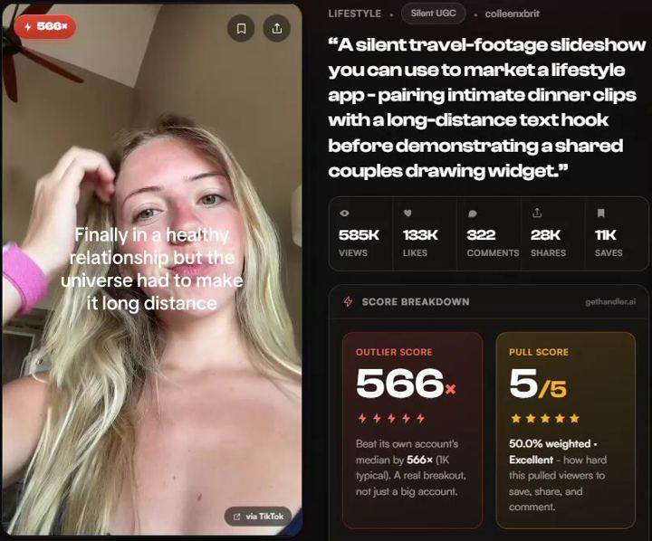

# 30 · Voiceless B-roll + text-overlay ad (mute-first)

<!-- HERO:START -->
[](EXAMPLE.md)

**[See the example and how to make it →](EXAMPLE.md)** · [watch on X](https://x.com/consumerxai/status/2092629155036987751)
<!-- HERO:END -->


> **LC priority P1** · evidence: Med-High (operator lists + outliers; contested) · hype risk: Low · cost $0-50 (existing footage) · 20-40 min per ad

## What it is
No one talks. Product and lifestyle B-roll (pool, shower, beach, stacking hands) with the script delivered as short on-screen text beats, one per shot, plus music. The "mute text overlay" version of a winning message — cheap to scale into dozens of variants.

## Why it works
- Most feed video is watched muted; the message survives with sound off.
- Fast to scale: same footage, new text = new ad (@williamkast_ "clean, fast, easy to scale").
- A different production format = new Entity ID for a proven message.
- Short phrases highlighting key points read faster than VO.

## Shot-by-shot (LC version)

| Time / slot | Visual | Audio / copy |
|---|---|---|
| 0-2s | Macro: water droplets on gold herringbone | TEXT: "you can shower in this" |
| 2-4s | Hand in pool, rings | TEXT: "and swim in it" |
| 4-6s | Gym, sweat, huggies | TEXT: "and sweat in it" |
| 6-8s | 6-month-old necklace vs new | TEXT: "6 months later 👇" |
| 8-10s | Stack being built | TEXT: "any 7 for $85" |
| 10-12s | Logo/end card | TEXT: "Louise Carter · 14K PVD" |

## Hooks (swap-in openers)
- "you can shower in this"
- "things I never take off (and why)"
- "my jewelry rules after 30"
- "if your necklace turns green, read this"
- "the 7 pieces I live in"

## Real examples from X (studied)
- @williamkast_ — voiceless B-roll: "mix of B-roll and product shots, no one talking; script delivered through text overlay bullet points; clean, fast, easy to scale" ([post](https://x.com/williamkast_/status/2078179704050246125)); live B-roll text overlay ad linked ([post](https://x.com/williamkast_/status/2084298521251860579)).
- @williamkast_ — voiceless text overlay listed as a TOF format (with founder, yapper, AI animation, natives, 3 reasons) ([post](https://x.com/williamkast_/status/2103910235005935644)).
- @consumerxai — silent travel-footage slideshow + text hook → widget demo: 585K views, 28K shares ([post](https://x.com/consumerxai/status/2092629155036987751)).
- Counter: @jhueri ranks "long text on screen" last for conversion ([post](https://x.com/jhueri/status/2101054562253631699)) → keep text beats ≤7 words, one per shot.

## Production recipe
1. Build a B-roll library tagged by scene (water, gym, beach, office, stack, gift, macro).
2. Write text beats from a winning script: max 7 words per beat, 5-7 beats.
3. Edit in CapCut/Premiere template (9:16 + 4:5), safe-zone text, 1-2s per beat, licensed music.
4. Generate 10 variants by swapping beat 1 and the music.
5. Optional AI B-roll for scenes LC lacks — label if realistic people are AI.

## Bot prompt (copy into the creative agent)
```
Convert this winning LC ad script {{SCRIPT}} into 6 voiceless text-overlay beats (≤7 words each, sentence case, no emojis except 👇). For each beat pick a B-roll scene tag from {{LIBRARY_TAGS}}. Then write 10 alternative first beats (hooks) of ≤6 words. No claims beyond PDP.
```

## 3 LC scripts
- A · "Things I never take off": beats = "things I never take off" / "this herringbone (showers)" / "these huggies (gym)" / "this ring (ocean)" / "all 14K PVD" / "any 7 for $85".
- B · "If your necklace turns green": "if your necklace turns green" / "it's plated, not bonded" / "PVD bonds the gold" / "so you can shower in it" / "6 months later 👇" / "LC".
- C · "Rules for packing jewelry": "my beach trip jewelry rule" / "only bring what you can swim in" / ... / "any 7 for $85".

## Variants to test
- Beat count 4 vs 7
- Music: trending vs calm
- Text style: native TikTok vs serif brand
- Real vs AI B-roll

## Omni test plan
- **Budget/structure:** 10 variants, $30/day each in one ad set, 4 days
- **Primary KPIs:** Thumb-stop ≥25%, CTR ≥1%, CPA; Omni (F30-*)
- **Kill rule:** CTR <0.6% after 2k impressions
- **Scale rule:** Winning text beats → static carousel (F39) and voiced UGC
- **Naming:** `utm_content=F30-<concept>-<variant>`; weekly Omni roll-up of new-customer revenue by format.

## Compliance
Baseline: [_COMPLIANCE.md](../_COMPLIANCE.md) (no fake testimonials, AI disclosure, no bulk/spoofed accounts, copy structure not assets, PDP-only claims).
- Licensed music only on paid.
- B-roll must show LC product; AI people labelled.

## Related
- Strategies: 36-owned-winner-video-remix, 40-modular-variation-testing-review
- Formats: [39-x-reasons-why](../39-x-reasons-why/README.md), [49-cinematic-macro-product-film](../49-cinematic-macro-product-film/README.md), [01-faceless-niche-slideshow](../01-faceless-niche-slideshow/README.md)

<!-- EVIDENCE:START -->
## Evidence from X discovery (auto-generated)

| Date | Author | Post | Engagement | Grade | Gist |
|---|---|---|---|---|---|
| 2026-09-26 | [@williamkast_](https://x.com/williamkast_) | [link](https://x.com/williamkast_/status/2103910235005935644) | 252L/400BM/13kV | VALUE | Formats by funnel: TOF founder/yapper/AI animation/natives/3 reasons/voiceless overlay; MOF comment reply/testimonial mashup/text wall; BOF urgency statics. |
| 2026-08-03 | [@williamkast_](https://x.com/williamkast_) | [link](https://x.com/williamkast_/status/2084298521251860579) | 227L/549BM/17kV | VALUE | 5 formats that win in every account, each with a live Atria ad link: founder, yapper, AI educator, B-roll text overlay, long VSL. |
| 2026-07-17 | [@williamkast_](https://x.com/williamkast_) | [link](https://x.com/williamkast_/status/2078179704050246125) | 28L/34BM/3kV | VALUE | 5 formats to test: founder talking head, voiceless B-roll text overlay, yapper (uncut), AI educational, camouflage static + long copy. |
| 2026-08-01 | [@williamkast_](https://x.com/williamkast_) | [link](https://x.com/williamkast_/status/2083616523134841035) | 12L/14BM/1kV | VALUE | 15 formats to repackage winners into (scaled to $30k/day on 3-4 angles): founder, yapper, AI animation, voiceless overlay, carousel, reply ad, text wall, review static, camouflage. |
| 2026-07-31 | [@raph_guilhem](https://x.com/raph_guilhem) | [link](https://x.com/raph_guilhem/status/2083288607062732816) | 55L/105BM/7kV | SOME | 30-format tree: hooks, founder (walking/car monologue, whiteboard), social proof (customer call, DM I get every day), news report. |
| 2026-09-18 | [@jhueri](https://x.com/jhueri) | [link](https://x.com/jhueri/status/2101054562253631699) | 25L/24BM/5kV | SOME | UGC formats ranked by conversion: talking head > hook-and-demo > skit … long text on screen last. |
| 2026-09-29 | [@williamkast_](https://x.com/williamkast_) | [link](https://x.com/williamkast_/status/2104952871691117052) | 13L/8BM/1kV | SOME | One message → podcast, street interview, no-cut native talk, UGC, mute text overlay, statics; 3 hooks each. |
| 2026-09-14 | [@alexpagepilot](https://x.com/alexpagepilot) | [link](https://x.com/alexpagepilot/status/2099438014456045990) | 11L/19BM/1kV | SOME | Top 5 dropship formats: UGC problem/solution, "TikTok made me buy it", us vs them split, founder talking head (retargets 2-3x), text-overlay slideshow. |
| 2026-08-26 | [@consumerxai](https://x.com/consumerxai) | [link](https://x.com/consumerxai/status/2092629155036987751) | 7L/11BM/1kV | SOME | Outlier: silent travel-footage slideshow with long-distance text hook → widget demo, 585K views/28K shares. |
| 2026-07-30 | [@youravgtechbro](https://x.com/youravgtechbro) | [link](https://x.com/youravgtechbro/status/2082865419950452866) | 5L/4BM/0kV | SOME | Formats that worked: hook (AI avatar + spicy text) then demo; text-on-screen over a background clip for awareness. |
| 2026-10-06 | [@carlynorthmedia](https://x.com/carlynorthmedia) | [link](https://x.com/carlynorthmedia/status/2107566671787364446) | 5L/0BM/0kV | SOME | UGC is getting more intentional: better cuts, more visuals, text overlays — produced ≠ polished. |
<!-- EVIDENCE:END -->
