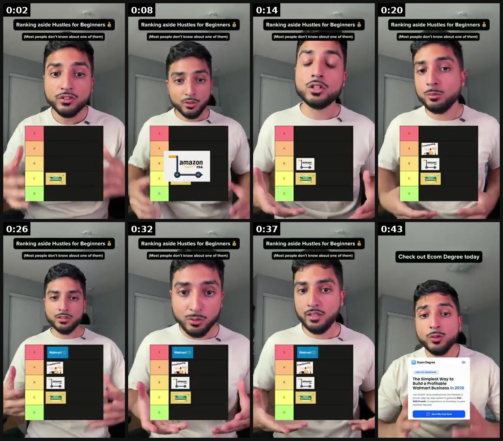
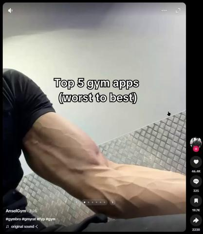
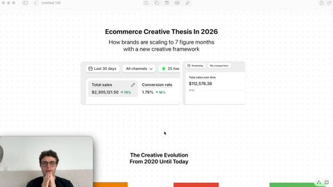
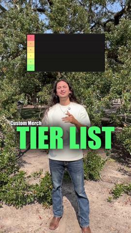
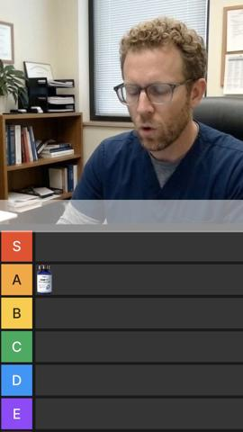
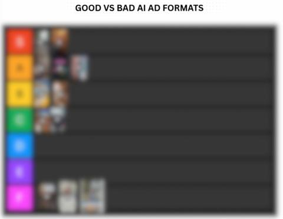

# 31 · Tier-list / ranking ad: see it, then make it

[](https://x.com/deepbajwacreate/status/2098014748570739055)

**The example:** [@deepbajwacreate on X](https://x.com/deepbajwacreate/status/2098014748570739055) · 0:46 video · 0 likes, 21 views

**Watch it:** [open the post on X](https://x.com/deepbajwacreate/status/2098014748570739055) · [play the video file](https://video.twimg.com/amplify_video/2098014630513725443/vid/avc1/320x568/eDZlSVsQ8uj0XTaA.mp4?tag=29)

> Good morning X ☀️ Starting the day with a recent UGC example I created for Ecom Degree. For this one, I used a tier-list format to rank popular side hustles, keep the hook interesting, and introduce the brand naturally without making it feel like a hard sell. #ugc #ugccreator

## What you are seeing

A creator holding a printed tier list (S/A/B/C/D) and ranking popular side hustles one card at a time, with captions, ending on the product he places at the top (an Ecom Degree signup page).

## Beat by beat

The storyboard above samples the video every 0:05. Lines are the transcript for that stretch; on-screen text comes from OCR, so treat it as rough.

| Frame | Time | On screen | Said / sung |
|---|---|---|---|
| 1 | 0:00–0:05 | Most people don't … ate one of them | Dropshipping C tier. Sure it's cheap to start but it's very saturated right now so that most |
| 2 | 0:05–0:11 | Most people don't know about one of them | beginners end up blowing through their entire ad budget before they even see a single sale. Amazon FBA B tier. I know this is probably going to get me some hate but hear me out. |
| 3 | 0:11–0:17 | for Beginners Most people don't know about one of them | You're competing with millions of sellers and inventory costs eating away at your margins |
| 4 | 0:17–0:23 | for Beginners Most people don't know about one of them | pretty fast. Freelancing. Now I'm going to put this into A tier. It's a solid way to make extra money with your skills but let's be honest you're still trading your hours for |
| 5 | 0:23–0:29 | · | dollars. It's not really building anything. Walmart selling S tier. Most people aren't |
| 6 | 0:29–0:35 | for Beginners Most people don't know about one of them … on WE Boy a | actually very familiar with this one and I thought it'd be another looks good on paper side hustle. But there's way less competition than Amazon. No inventory needed and most people are only |
| 7 | 0:35–0:40 | for Beginners Most … don't know about one of them 3& | putting in one to two hours of work every day. There's even a free workshop showing you exactly |
| 8 | 0:40–0:46 | The Simplest Way to Build Profitable Walmart Business in 2026 28K: | how people are selling a Walmart step-by-step called eCom degree. So if you've been wanting to start a side hustle definitely check this one out. |

<details><summary>Full transcript (timestamped)</summary>

- `0:00` Dropshipping C tier. Sure it's cheap to start but it's very saturated right now so that most
- `0:04` beginners end up blowing through their entire ad budget before they even see a single sale.
- `0:08` Amazon FBA B tier. I know this is probably going to get me some hate but hear me out.
- `0:12` You're competing with millions of sellers and inventory costs eating away at your margins
- `0:16` pretty fast. Freelancing. Now I'm going to put this into A tier. It's a solid way to make
- `0:20` extra money with your skills but let's be honest you're still trading your hours for
- `0:23` dollars. It's not really building anything. Walmart selling S tier. Most people aren't
- `0:27` actually very familiar with this one and I thought it'd be another looks good on paper side hustle.
- `0:32` But there's way less competition than Amazon. No inventory needed and most people are only
- `0:36` putting in one to two hours of work every day. There's even a free workshop showing you exactly
- `0:39` how people are selling a Walmart step-by-step called eCom degree. So if you've been
- `0:43` wanting to start a side hustle definitely check this one out.

</details>

## More real examples (6)

Other posts that show this format, or a close cousin of it. Click a thumbnail to open it on X.

| | | |
|---|---|---|
| [](https://x.com/adamtwtz/status/2097925109155549689)<br>**@adamtwtz** · 0:20 video · 9K views<br>there's a gym app called Symmetry doing 150,000 downloads a month off one slideshow format the product is basically an AI body scanner, you just take | [](https://x.com/fuxps32/status/2067026390588039329)<br>**@fuxps32** · 22:13 video · 188 views<br>400,000 likes, 80,000 saves, 0 sales pitches A woman scrolls her feed and stops on a supplement tier list. S tier, A tier, B tier, ranked on screen. S | [](https://x.com/ViralSpyApp/status/2106822218961293724)<br>**@ViralSpyApp** · 0:11 video · 4 views<br>Tutti put piano in 'easy to learn' and its own practice app among the hardest. The one-screen instrument tier list got 824k plays and 4,532 comments. |
| [](https://x.com/JamestheUGCguy/status/2027472175339332091)<br>**@JamestheUGCguy** · 1:18 video · 97 views<br>UGC example video for custom promo products in a tier list format. Really enjoy using formats that showcase products in fun ways. Brands, if you need | [](https://x.com/BuckleUp99/status/2074426426942722118)<br>**@BuckleUp99** · 0:34 video · 85 views<br>Everyone's using AI to fake UGC ads. I used it to invent a new ad format. An AI doctor. A live tier list. Real supplement verdicts. No script feel. No | [](https://x.com/adswithcami/status/2095208948764668068)<br>**@adswithcami** · image · 2K views<br>I Ranked Every AI Ad Format For Ecom Brand Owners Whether your struggling to find winners with AI ads, or just need to know which AI formats work best |

## How to make one like it

**The format in one line:** The creator (or a static) ranks options in S/A/B/C/D/F tiers — e.g. "every type of gold jewelry ranked for people who never take it off" — explaining each placement; the product lands in S-tier with the reason. Works as video (talking over a tier-maker board) or static image.

**Why it works:** - Feels organic and borrows authority — the ranker looks like an impartial expert (@mattdenegri). - People can't scroll past a ranking: they want to see where their pick lands; disagreement drives comments. - Educates the category (plated vs vermeil vs PVD vs solid) while positioning LC. - Cheap to produce and endlessly re-rankable.

**Contents:** [1. Structure](#1-copy-the-structure) · [2. Shot by shot](#2-shot-by-shot-remake) · [3. Script and hooks](#3-write-the-script) · [4. Prompts](#4-prompts) · [5. Tools and settings](#5-tools-and-settings) · [6. Louise Carter remake](#6-louise-carter-remake) · [7. Variants and test](#7-variants-and-test-plan) · [8. Pitfalls](#8-pitfalls)

### 1. Copy the structure

Use the example's timing as your beat sheet. Keep the beat, change the words and the product.

| Beat | Time | In the example | Your version |
|---|---|---|---|
| 1 | 0:02 | Dropshipping C tier. Sure it's cheap to start but it's very saturated right now so that most | … |
| 2 | 0:08 | beginners end up blowing through their entire ad budget before they even see a single sale. Amazon FBA B tier. I know this is probably going | … |
| 3 | 0:14 | You're competing with millions of sellers and inventory costs eating away at your margins | … |
| 4 | 0:20 | pretty fast. Freelancing. Now I'm going to put this into A tier. It's a solid way to make extra money with your skills but let's be honest y | … |
| 5 | 0:26 | dollars. It's not really building anything. Walmart selling S tier. Most people aren't | … |
| 6 | 0:32 | actually very familiar with this one and I thought it'd be another looks good on paper side hustle. But there's way less competition than Am | … |
| 7 | 0:37 | putting in one to two hours of work every day. There's even a free workshop showing you exactly | … |
| 8 | 0:43 | how people are selling a Walmart step-by-step called eCom degree. So if you've been wanting to start a side hustle definitely check this one | … |

### 2. Shot-by-shot remake

**Target length / size:** 30-60s video or 1 static

| # | Time / slot | What we see (visual + camera) | Dialogue / on-screen text |
|---|---|---|---|
| 1 | 0-2s | Creator holding or in front of an S/A/B/C/D/F tier board | "Ranking every type of gold jewelry for people who never take it off" |
| 2 | 2-40s | Places each option card, explains each placement in one line | Fair, specific reasons (plated: D, vermeil: B, solid: A, PVD: S) |
| 3 | 40-50s | Product placed in S with a reason | Why it wins |
| 4 | End | Full board | Offer |

<details><summary>Playbook shot list (Louise Carter version from the README)</summary>

| Time / slot | Visual | Audio / copy |
|---|---|---|
| 0-2s | Empty tier board on screen + creator face cut-out (green screen) | "Ranking every type of gold jewelry for people who never take it off" |
| 2-10s | F/D tier: gold-plated brass, "gold tone" | "Turns green in a week. F." |
| 10-18s | C/B: gold-filled, vermeil | "Okay, but not in the ocean." |
| 18-26s | A: solid 14K | "Amazing… if you have $900." |
| 26-35s | S: 14K PVD (LC piece image) | "Bonded, shower-proof, and any 7 are $85. S-tier." |
| 35-40s | Full board | "Where would you put yours?" |

</details>

### 3. Write the script

Open with one of these hooks (first 1–3 seconds, or the headline on a static):

- "Ranking every type of gold jewelry (I'm going to make people mad)"
- "Jewelry you can shower in: tier list"
- "Tier-ranking my most-worn pieces after 6 months"
- "Gifts for her ranked by how often she'll actually wear them"
- "Every way to stop your jewelry turning green, ranked"

Then fill the beats from the table above. Pull the wording from real customer reviews, not from ad copy: a review line beats a copywriter line almost every time. Read every line out loud and cut anything you would not say to a friend. Ready-made Louise Carter scripts are in section 6; hand [BOT.md](BOT.md) to any AI agent to write versions for another brand.

### 4. Prompts

**Board**

```text
Use tiermaker.com or a printed board; cards with category names, not competitor brands.
```

**Full creative-agent prompt (from the playbook):**

```
Write 5 tier-list ad scripts for Louise Carter. Topics: materials (plated, filled, vermeil, sterling, solid 14K, 14K PVD), stack types, gift ideas, "ways to stop green neck", travel jewelry. Each: hook ≤10 words, 6 items with tier + 1-line verdict (≤12 words), LC lands S with a factual reason from {{PDP_FACTS}}. No competitor brand names; no false claims about other materials (keep generalised, factual).
```

### 5. Tools and settings

1. Tier board template (Figma/Canva) in LC colors + generic tiermaker version for native feel.
2. Script: 5-7 items, each with a one-line verdict; LC never ranks competitor brands by name — rank categories/materials.
3. Shoot creator on green screen over the board; or make static 4:5 version.
4. Organic: invite disagreement ("where would you put yours?").

| Setting | Value |
|---|---|
| Canvas | 1080×1920 (9:16) master; crop a 1080×1350 (4:5) cut for feed placements |
| Frame rate | 30 fps (shoot 60 fps for slow-motion water or sparkle shots) |
| Camera | Phone main lens at 1x, exposure locked on skin, HDR off, grid on; tripod or a phone clamp for product shots |
| Light | One soft key at 45° (window or ring light), white card as fill; side light for metal sparkle |
| Audio | Lavalier or phone 15–20 cm from the mouth; mix voice at -14 LUFS, music at -28 to -30 dB under voice |
| Captions | Burned in, 2–5 words per line, 64–80 px bold sans, white with a black stroke or pill; keep text inside the safe zone (top 220 px and bottom 420 px clear, 64 px side margins) |
| Pacing | A visual change every 1.5–3 s; the hook lands in the first 1.5 s with no logo intro |
| Edit / export | CapCut or Premiere; H.264, 12–20 Mbps, AAC 320 kbps; upload natively to each platform, not via links |

### 6. Louise Carter remake

- A · Materials tier list (above shot list).
- B · "Gifts for her ranked by how often she'll actually wear them": candles (C), scarves (B), perfume (A), a necklace she can shower in (S).
- C · Static: tier board image with category icons; LC piece photo in S; headline "Shower-proof jewelry, ranked."

Brand rules, claims you can and cannot make, and more scripts: [brands/louise-carter.md](brands/louise-carter.md). Step-by-step from idea to scale: [STAGES.md](STAGES.md).

### 7. Variants and test plan

- Video vs static
- Creator ranker vs faceless board
- Material vs gifting topic
- Controversial F-tier pick vs safe

**Test plan:** - **Budget/structure:** 3 video + 3 static, $40/day each, 5 days - **Primary KPIs:** Hook rate ≥28%, comments/1k, CPA; Omni new-customer revenue (F31-*) - **Kill rule:** CPA >2× baseline after $150 - **Scale rule:** New topics monthly; organic ranking series - **Naming:** `utm_content=F31-<concept>-<variant>`; weekly Omni roll-up of new-customer revenue by format.

**Naming:** `F31-<variant>-<hook##>-<date>` so results map back to this folder. Change one thing per test (hook, narrator, length or offer), never two.

### 8. Pitfalls

- Ranking named competitors unfairly is risky; rank categories.
- The product must deserve its tier; give a real reason.
- Slow open: if the first 1.5 s does not show the hook visually, most people swipe.
- Logo or brand intro at the start reads as an ad; put the brand at the end.
- Captions covered by the platform UI: check the safe zone on a real phone before posting.
- Music over the voice: keep music at least 14 dB under speech.

**Compliance:** Baseline: [_COMPLIANCE.md](../_COMPLIANCE.md) (no fake testimonials, AI disclosure, no bulk/spoofed accounts, copy structure not assets, PDP-only claims). - Rank generic categories, not named competitors; statements about other materials must be accurate and general. - No fake "expert" credentials (see _COMPLIANCE §6).

## Field notes

Newer observations live in the playbook: [Wave 3 update: brands & apps crushing it (Oct 2026)](README.md) · [Wave 4 update: Fedotoff October 2026 swipe boards](README.md)

## More examples

Every post we found for this format, with transcripts: [examples/](examples/README.md). Playbook: [README.md](README.md). Agent brief: [BOT.md](BOT.md).
