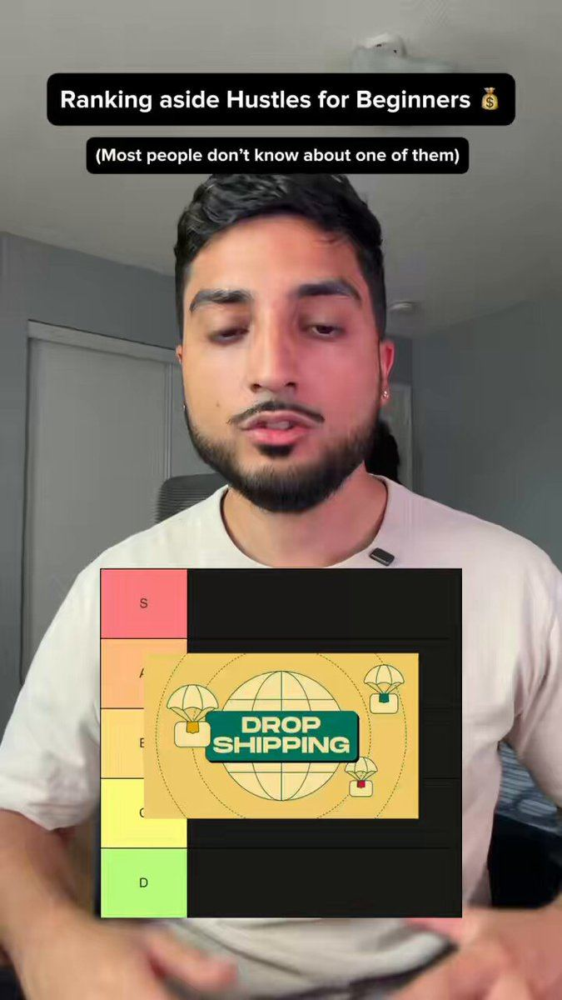

# 31 · Tier-list / ranking ad

<!-- HERO:START -->
[](EXAMPLE.md)

**[See the example and how to make it →](EXAMPLE.md)** · [watch on X](https://x.com/deepbajwacreate/status/2098014748570739055)
<!-- HERO:END -->


> **LC priority P0** · evidence: High (operator: top spender across accounts) · hype risk: Low · cost $0-150 · 1-2 h

## What it is
The creator (or a static) ranks options in S/A/B/C/D/F tiers — e.g. "every type of gold jewelry ranked for people who never take it off" — explaining each placement; the product lands in S-tier with the reason. Works as video (talking over a tier-maker board) or static image.

## Why it works
- Feels organic and borrows authority — the ranker looks like an impartial expert (@mattdenegri).
- People can't scroll past a ranking: they want to see where their pick lands; disagreement drives comments.
- Educates the category (plated vs vermeil vs PVD vs solid) while positioning LC.
- Cheap to produce and endlessly re-rankable.

## Shot-by-shot (LC version)

| Time / slot | Visual | Audio / copy |
|---|---|---|
| 0-2s | Empty tier board on screen + creator face cut-out (green screen) | "Ranking every type of gold jewelry for people who never take it off" |
| 2-10s | F/D tier: gold-plated brass, "gold tone" | "Turns green in a week. F." |
| 10-18s | C/B: gold-filled, vermeil | "Okay, but not in the ocean." |
| 18-26s | A: solid 14K | "Amazing… if you have $900." |
| 26-35s | S: 14K PVD (LC piece image) | "Bonded, shower-proof, and any 7 are $85. S-tier." |
| 35-40s | Full board | "Where would you put yours?" |

## Hooks (swap-in openers)
- "Ranking every type of gold jewelry (I'm going to make people mad)"
- "Jewelry you can shower in: tier list"
- "Tier-ranking my most-worn pieces after 6 months"
- "Gifts for her ranked by how often she'll actually wear them"
- "Every way to stop your jewelry turning green, ranked"

## Real examples from X (studied)
- @mattdenegri — tier list = top spender across almost every account for a month: "feels organic, borrows authority, people can't scroll past it" ([post](https://x.com/mattdenegri/status/2083206044423991637)).
- @FedotOff90 — tier list among 37 live formats with days-active data ([post](https://x.com/FedotOff90/status/2104949773539442831)).
- @ads4apps — tier list in 39 converting Meta formats (930 bookmarks) ([post](https://x.com/ads4apps/status/2081785032679518490)).
- @nicktheriot_ — published a 2026 FB creative-style tier list — ranking content is itself highly saved/shared ([post](https://x.com/nicktheriot_/status/2108173638033871013)).

## Production recipe
1. Tier board template (Figma/Canva) in LC colors + generic tiermaker version for native feel.
2. Script: 5-7 items, each with a one-line verdict; LC never ranks competitor brands by name — rank categories/materials.
3. Shoot creator on green screen over the board; or make static 4:5 version.
4. Organic: invite disagreement ("where would you put yours?").

## Bot prompt (copy into the creative agent)
```
Write 5 tier-list ad scripts for Louise Carter. Topics: materials (plated, filled, vermeil, sterling, solid 14K, 14K PVD), stack types, gift ideas, "ways to stop green neck", travel jewelry. Each: hook ≤10 words, 6 items with tier + 1-line verdict (≤12 words), LC lands S with a factual reason from {{PDP_FACTS}}. No competitor brand names; no false claims about other materials (keep generalised, factual).
```

## 3 LC scripts
- A · Materials tier list (above shot list).
- B · "Gifts for her ranked by how often she'll actually wear them": candles (C), scarves (B), perfume (A), a necklace she can shower in (S).
- C · Static: tier board image with category icons; LC piece photo in S; headline "Shower-proof jewelry, ranked."

## Variants to test
- Video vs static
- Creator ranker vs faceless board
- Material vs gifting topic
- Controversial F-tier pick vs safe

## Omni test plan
- **Budget/structure:** 3 video + 3 static, $40/day each, 5 days
- **Primary KPIs:** Hook rate ≥28%, comments/1k, CPA; Omni new-customer revenue (F31-*)
- **Kill rule:** CPA >2× baseline after $150
- **Scale rule:** New topics monthly; organic ranking series
- **Naming:** `utm_content=F31-<concept>-<variant>`; weekly Omni roll-up of new-customer revenue by format.

## Compliance
Baseline: [_COMPLIANCE.md](../_COMPLIANCE.md) (no fake testimonials, AI disclosure, no bulk/spoofed accounts, copy structure not assets, PDP-only claims).
- Rank generic categories, not named competitors; statements about other materials must be accurate and general.
- No fake "expert" credentials (see _COMPLIANCE §6).

## Related
- Strategies: 11-social-proof-credibility-engine, 41-von-restorff-static-copy-prompt
- Formats: [35-diagram-statics-venn-report-card](../35-diagram-statics-venn-report-card/README.md), [39-x-reasons-why](../39-x-reasons-why/README.md), [51-quiz-guess-game](../51-quiz-guess-game/README.md)

<!-- EVIDENCE:START -->
## Wave 3 update: brands & apps crushing it (Oct 2026)
- Symmetry (AI body-scan gym app): 150K downloads/month and ~$25K MRR from one slideshow format, no ads: slide 1 "Top 5 gym apps (worst to best)", slides 2-5 four other apps with their problems, slide 6 a 10/10 for Symmetry with features ([@adamtwtz](https://x.com/adamtwtz/status/2097925109155549689)).

## Wave 4 update: Fedotoff October 2026 swipe boards
- FurryWell Philippines: Report-card rating static (FurryWell "A+ / 9.7"), 188 days live (iPhone Notes / Text Messages / Reddit / Google Search / Breaking News / DMs / Amazon Review / TikTok Comments board). A report-card UI makes a claim look like a third-party rating.
- Stills, how-to and LC remakes: [adlibrary/](adlibrary/README.md).

## Evidence from X discovery (auto-generated)

| Date | Author | Post | Engagement | Grade | Gist |
|---|---|---|---|---|---|
| 2026-07-27 | [@ads4apps](https://x.com/ads4apps) | [link](https://x.com/ads4apps/status/2081785032679518490) | 412L/930BM/27kV | VALUE | 39 Meta formats that convert (930 bookmarks): X reasons, IG story, us vs them, Venn, don't buy this, iPhone notes, text message, low stock, we're sorry, breaking news, Reddit, Google search, text on skin, tier list, zero stars… |
| 2026-07-31 | [@mattdenegri](https://x.com/mattdenegri) | [link](https://x.com/mattdenegri/status/2083206044423991637) | 3L/5BM/0kV | VALUE | Tier-list ad = top spender across almost every account for a month (ecom, supplements, software): feels organic, borrows authority. |
| 2026-08-12 | [@MethodByVid](https://x.com/MethodByVid) | [link](https://x.com/MethodByVid/status/2087570057262256130) | 37L/67BM/4kV | SOME | 12 no-edit video formats: text story over gameplay, would-you-rather, guess-the-X quizzes, rankings, restoration, recipes from above. |
| 2026-09-16 | [@masterhooks_](https://x.com/masterhooks_) | [link](https://x.com/masterhooks_/status/2100071930074390796) | 12L/13BM/1kV | SOME | 10 organic formats from a creator agency: storytelling, talking head, reaction, ranking, tier list, object lesson, play/pause reaction, AMA, comparison, before/after. |
| 2026-08-21 | [@raph_guilhem](https://x.com/raph_guilhem) | [link](https://x.com/raph_guilhem/status/2090725512976970065) | 9L/6BM/0kV | SOME | 35 static/native formats tree: Trustpilot, text msg, email screenshot, Reddit, text on skin, crossed-out, tier list, Venn, breaking news. |
| 2026-08-05 | [@Yannlce](https://x.com/Yannlce) | [link](https://x.com/Yannlce/status/2085017654364958737) | 3L/2BM/1kV | SOME | Same 40-format list (adds claymation, AI podcast). |
<!-- EVIDENCE:END -->
