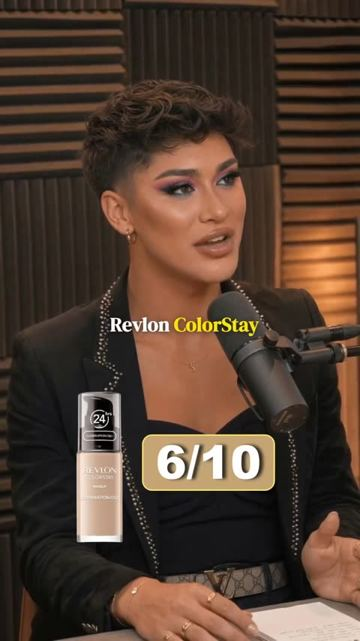
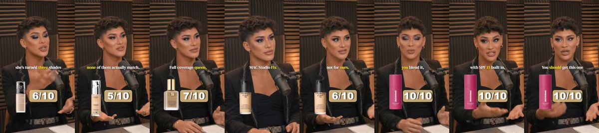
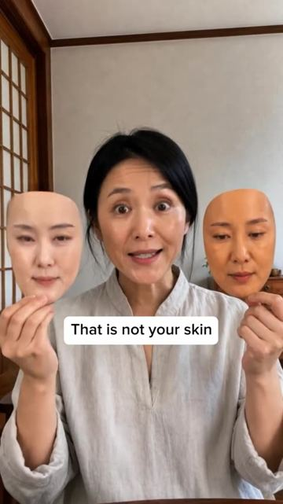
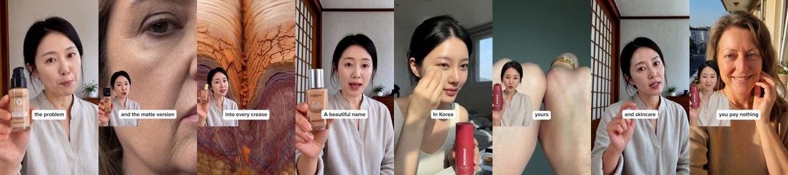
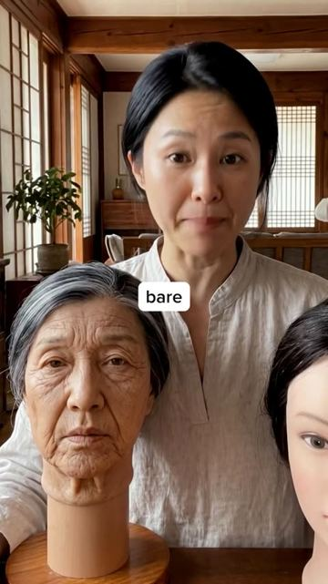
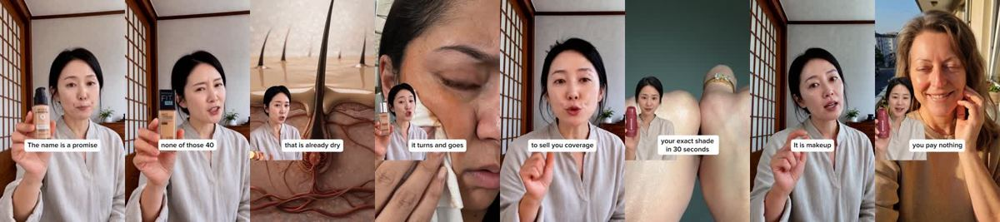
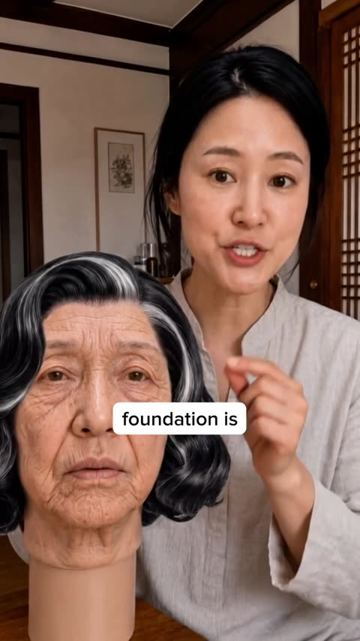
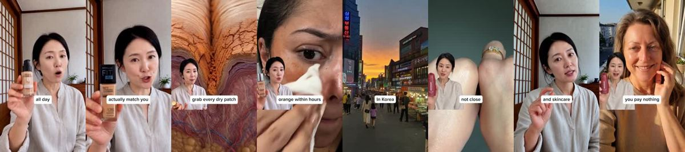
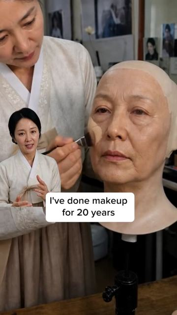
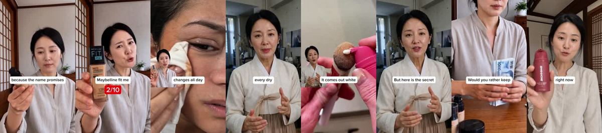

# Meta ad-library examples for F31

<!-- WAVE6 -->
## Wave 6: Resilia & Smooche live Meta ads (Oct 2026)

Pulled from the public Meta Ad Library on 2026-10-09 (Resilia: aged garlic, Ceylon cinnamon, oil of oregano; Smooche: color-changing foundation, Reverse Time peptide serum). Days live are counted to 2026-10-09; most video ads were new tests that week, while the long runners are statics and catalog templates. Transcripts are automatic. Brand claims are the advertisers', not verified, and many are health claims we would never make. The **Do not copy** line flags deceptive tactics (persona "publication" pages, undisclosed AI actors and "experts", fake stock counts).

### Smooche · Cosmetic Times: “Revlon color stay. Six out of ten. Yes, she stays put…” (9 days live)

- **Ad:** [Meta Ad Library #1089794753821593](https://www.facebook.com/ads/library/?id=1089794753821593) · video 1:32 · page “Cosmetic Times” · started 2026-09-29 · 1 copies · lands on `smooche.com/pages/makeupartist`
- **What happens:** Opens: “Revlon color stay. Six out of ten.”
- **Why it works:** An AI "Korean makeup artist" persona ranks drugstore foundations ("Revlon ColorStay, three out of ten… orange by lunch") and lands on Smooche at 10/10. Naming real competitors makes it feel unbiased.
- **How to make one:** Hold up each competitor, give it a score, and name one visible flaw with a macro shot. The product comes last with the top score. Put the scores on screen.
- **Do not copy:** The ranking presenter is an AI persona with an invented credential, posted from pages like "Korean Beauty Tips" and "James Miami MUA". Use a real, disclosed reviewer.
- **LC remake:** "Ranking jewelry that survives the shower": brass 2/10, sterling 6/10, LC 14K PVD 10/10, with a 30-day wear test.

Transcript (auto, first ~70 s)

> Revlon color stay. Six out of ten. Yes, she stays put. I'll give her that. But by lunchtime, she's turned three shades darker on your face, and she's camping out in every fine line like she pays rent there. For the price, I expected better. …Loriel true match. Five out of ten. Forty shades sounds impressive until you've swatched 15 of them and none of them actually match. And even when you find the one by 3pm, she's shifted to a completely different color on your face. The audacity. A stay-lotter double wear. Seven out of ten. Full coverage queen. Absolutely. And get oxidized. And there's no mid-day color shift. It comes out white, you blend it, and it finds your exact color in about 30 seconds. If you have redness, uneven patches, or fine lines, they will be gone. And it stays that way for 16 hours. She's so lightweight. With with SPF 15 built in, and she refuses to settle into fine lines. It's Korean, with over 2 million users sold in Korea alone. Here, it's recommended by dermatologist and, and not influencers. Except for me. You should get this one. Now, they

### Smooche · Korean Beauty Tips: “See this orange? That is not your skin. That is your foundation…” (7 days live)

- **Ad:** [Meta Ad Library #1107244338349193](https://www.facebook.com/ads/library/?id=1107244338349193) · video 3:40 · page “Korean Beauty Tips” · started 2026-10-01 · 1 copies · lands on `smooche.com/pages/reverse`
- **What happens:** Opens: “See this orange? That is not your skin.”
- **Why it works:** An AI "Korean makeup artist" persona ranks drugstore foundations ("Revlon ColorStay, three out of ten… orange by lunch") and lands on Smooche at 10/10. Naming real competitors makes it feel unbiased.
- **How to make one:** Hold up each competitor, give it a score, and name one visible flaw with a macro shot. The product comes last with the top score. Put the scores on screen.
- **Do not copy:** The ranking presenter is an AI persona with an invented credential, posted from pages like "Korean Beauty Tips" and "James Miami MUA". Use a real, disclosed reviewer.
- **LC remake:** "Ranking jewelry that survives the shower": brass 2/10, sterling 6/10, LC 14K PVD 10/10, with a 30-day wear test.

Transcript (auto, first ~70 s)

> See this orange? That is not your skin. That is your foundation. Let me show you the four that I miss to you. Number one Revlon color state. I know why you wear it. The name is a promise. It is , it is supposed to stay put all day. That is exactly the problem. It is built to grip for 24 hours. So on dryer mature skin, it grips onto every dry patch and settls into every line you have. It does not stay flawless. It stays stuck. Looks fine at 8 in the morning, cakey by noon. That is what this one does. Number two, Maybeline fit me. This is the one everybody grabs because it is cheap and it is everywhere and it comes in 40 shades. But here is the thing. None of those 40 actually match you and the matte version cleans to your dry skin and shows every wrinkle. It fits everyone in the advertisement and nobody over 45 in real life. It is not matching your skin. It is fighting it. Number three, Estee Lauder double wear. This is the one you spent real money on because you thought expensive meant better and it last I will give it that. But it is not formula and matte works by packing in powder to soak up oil on skin over 50 that is already dry. Those powders grab every dry patch and sink into every day. You paid $60 to look older by 3 o'lm, that is the crew list. I'm not sure if this is the fixed pigment cannot adapt. They know a matte formula cleans to dry skin. They know heavy coverage settles into your lines. They sell it anyway because it looks good in the store for the five minutes you stand at the mirror. They are not trying to help you. They are trying to sell you coverage, in 

### Smooche · Korean Beauty Tips: “This is how your skin looks bare. And this is what 40 years of the…” (7 days live)

- **Ad:** [Meta Ad Library #1737525717356360](https://www.facebook.com/ads/library/?id=1737525717356360) · video 3:44 · page “Korean Beauty Tips” · started 2026-10-01 · 1 copies · lands on `smooche.com/pages/reverse`
- **What happens:** Opens: “This is how your skin looks bare. And this is what 40 years of the wrong foundation did to it.”
- **Why it works:** An AI "Korean makeup artist" persona ranks drugstore foundations ("Revlon ColorStay, three out of ten… orange by lunch") and lands on Smooche at 10/10. Naming real competitors makes it feel unbiased.
- **How to make one:** Hold up each competitor, give it a score, and name one visible flaw with a macro shot. The product comes last with the top score. Put the scores on screen.
- **Do not copy:** The ranking presenter is an AI persona with an invented credential, posted from pages like "Korean Beauty Tips" and "James Miami MUA". Use a real, disclosed reviewer.
- **LC remake:** "Ranking jewelry that survives the shower": brass 2/10, sterling 6/10, LC 14K PVD 10/10, with a 30-day wear test.

Transcript (auto, first ~70 s)

> This is how your skin looks bare. And this is what 40 years of the wrong foundation did to it. Let me show you the four foundations aging you the most. Number one, Revlon Color State. I know why you wear it. The name is a promise. It is supposed to stay put all day. That is exactly the problem. It is built to grit for 24 hours. So on dryer mature skin, it grips onto every dry patch. And settles into every line you have. It does not stay flawless. It stays. Looks fine at 8 in the morning, cakey by noon. That is what this one does. Number two, Maybelline Fitney. This is the one everybody grabs because it is cheap and it is everywhere. And it comes in 40 shades. But here is the thing. None of those four. Actually, match you and the matte version. Clean skin and shows every wrinkle. It fits everyone in the advertisement and nobody over 45 in real life. It is not matching your skin. It is right. Number three, Estée Lauder Double Wear. This is the one you spent real money on because you're going to be a massive mint that it last. I will give it that. But it is a matte formula and matte works by by packing in powders to soak up oil. 50 that is already.

### Smooche · Korean Beauty Tips: “This is what you're found in your fine lines by lunch. Let me show you…” (7 days live)

- **Ad:** [Meta Ad Library #2782000632196016](https://www.facebook.com/ads/library/?id=2782000632196016) · video 3:42 · page “Korean Beauty Tips” · started 2026-10-01 · 1 copies · lands on `smooche.com/pages/reverse`
- **What happens:** Opens: “This is what you're found in your fine lines by lunch. Let me show you the four worst offenders.”
- **Why it works:** An AI "Korean makeup artist" persona ranks drugstore foundations ("Revlon ColorStay, three out of ten… orange by lunch") and lands on Smooche at 10/10. Naming real competitors makes it feel unbiased.
- **How to make one:** Hold up each competitor, give it a score, and name one visible flaw with a macro shot. The product comes last with the top score. Put the scores on screen.
- **Do not copy:** The ranking presenter is an AI persona with an invented credential, posted from pages like "Korean Beauty Tips" and "James Miami MUA". Use a real, disclosed reviewer.
- **LC remake:** "Ranking jewelry that survives the shower": brass 2/10, sterling 6/10, LC 14K PVD 10/10, with a 30-day wear test.

Transcript (auto, first ~70 s)

> This is what you're found in your fine lines by lunch. Let me show you the four worst offenders. Number one, Revlon Color State. I know why the name is a promise. It is supposed to stay put all day. That is exactly the problem. It is built for 24 hours. So on dry, dry patch and it settles into every line. It does not stay flawless. It stays stuck. Looks fine at 8 in the morning. Kaky by noon. That is what this one does. Number two, Maybeline Fitney. This is the one everybody grabs because it is cheap and it is cheap and it is everywhere and it comes in 40 shades. But here is the thing, none of those 40 actually match you. And the matte version cleans to your dry skin and shows every wrinkle. It fits everyone in the advertisement and nobody over 45 in real life. It is not

### Smooche · Korean Beauty Tips: “and this is what your foundation is really doing to your face. Let me…” (6 days live)

- **Ad:** [Meta Ad Library #1398692098533361](https://www.facebook.com/ads/library/?id=1398692098533361) · video 2:43 · page “Korean Beauty Tips” · started 2026-10-02 · 3 copies · lands on `smooche.com/pages/reverse`
- **What happens:** Opens: “and this is what your foundation is really doing to your face. Let me rank the one.”
- **Why it works:** An AI "Korean makeup artist" persona ranks drugstore foundations ("Revlon ColorStay, three out of ten… orange by lunch") and lands on Smooche at 10/10. Naming real competitors makes it feel unbiased.
- **How to make one:** Hold up each competitor, give it a score, and name one visible flaw with a macro shot. The product comes last with the top score. Put the scores on screen.
- **Do not copy:** The ranking presenter is an AI persona with an invented credential, posted from pages like "Korean Beauty Tips" and "James Miami MUA". Use a real, disclosed reviewer.
- **LC remake:** "Ranking jewelry that survives the shower": brass 2/10, sterling 6/10, LC 14K PVD 10/10, with a 30-day wear test.

Transcript (auto, first ~70 s)

> and this is what your foundation is really doing to your face. Let me rank the one. Rev Lawn Color Stay, three out of ten. You buy it because the name promises it stays put all day. That is the problem. It is built to grip for 24 hours. So on drier, mature skin. It grips on to every dry patch and settles into every line you have. t. It does it stays stuck. Look, look, that's eight in it's the morning. Kaky by noon. You are paying to look older by lunch. Maybelline fit me. Two from two out of ten. Cheap, everywhere. It's 40 shades. But none of those 40 acts, and the matte version clings to your dry skin and shows every wrinkle. It fits everyone in the advertisement and nobody over 45 in real life. L'Oreal True Match. Two out of ten. The whole promise is right there in the one name and it is the one thing it cannot do. Your skin changes all day and a rigid pigment locked into one shade cannot change with it. So even when you find the closest shade it turns and goes orange within hours. A beautiful name and completely the wrong technology. Matt Studio Fix. Two out of ten. A classic and a powder which is exactly the problem. After 40, powder settles into every fine.

<!-- /WAVE6 -->

<!-- WAVE4 -->
## Wave 4: Alex Fedotoff's October 2026 swipe boards (GetHookd public previews)

Each ad below is from the free 10-ad preview of a public GetHookd board that [@FedotOff90](https://x.com/FedotOff90) shared on X. Days live are as of 2026-10-09; brand claims are the advertisers', not verified.

### FurryWell Philippines: Report-card rating static (FurryWell "A+ / 9.7") (188 days live)

- **Board:** [iPhone Notes / Text Messages / Reddit / Google Search / Breaking News / DMs / Amazon Review / TikTok Comments](https://x.com/FedotOff90/status/2106046297434374289) · image
- **What happens:** An "Overall Guide A+ / Total Rating 9.7/10" card with bars (Ingredient quality 9.7, Flavour 10, Scent 10, Value 9) and a SHOP NOW button.
- **Why it lasts:** 188 days. A report-card UI makes a claim look like a third-party rating.
- **How to make one:** A report-card template, 4 scored bars, a letter grade.
- **LC remake:** "LC rated: waterproof 10/10, skin-safe 10/10, value 10/10".

