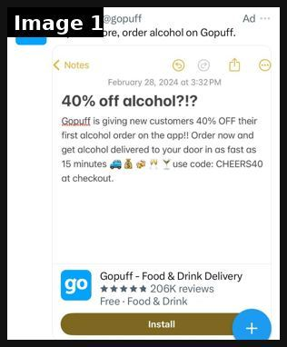
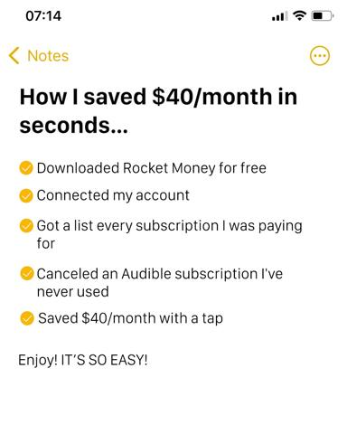
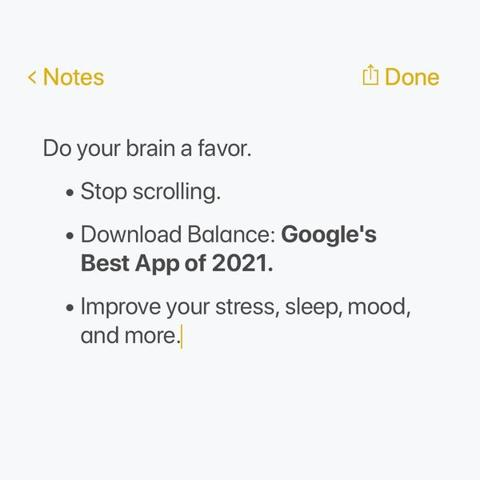
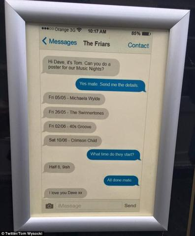
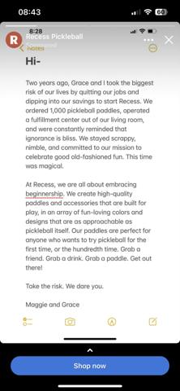

# 32 · Screenshot-native static pack (iPhone Notes, text thread, Reddit, email, Google, IG story/DM, Trustpilot): see it, then make it

[](https://x.com/liv_unltd/status/1774923299136716885)

**The example:** [@liv_unltd on X](https://x.com/liv_unltd/status/1774923299136716885) · 1 image · 1 likes, 94 views

**Watch it:** [open the post on X](https://x.com/liv_unltd/status/1774923299136716885)

> really loving the notes app ad format, i especially loved the one that was for a news publication. really imbues a sense of professionalism to the advertiser

## What you are seeing

A real Gopuff ad shown in the Instagram feed, built to look like an iPhone Notes page: a 'Notes' header, a bold line "40% off alcohol?!?" and a few casual sentences about getting drinks delivered in minutes with a promo code. Under it sits the normal app-install card (logo, stars, Install). It reads like a note someone typed, not like an ad.

## Image by image

| Image | Text on it (OCR, rough) |
|---|---|
| 1 | Ad a Skip the store, order alcohol on Notes February 28, 2024 at 40% off alcohol?!? is giving new customers 40% OFF their first alcohol order on the app!! Order now and get alcohol delivered to your door in as fast as 15 minutes 43 WV use code: at checkout. Food Drink Delivery kk kw kw 206K reviews  |

## More real examples (4)

Other posts that show this format, or a close cousin of it. Click a thumbnail to open it on X.

| | | |
|---|---|---|
| [](https://x.com/growthquesthq/status/1922749862262489528)<br>**@growthquesthq** · image · 13 views<br>1⃣ Notes App Ad This one has cut client CPLs by 75%+ | [](https://x.com/pearmill_agency/status/1674091921508007944)<br>**@pearmill_agency** · image · 27 views<br>2/7 The Notes App Static 📒 - Open the Notes app on an iPhone - Create copy that reads like a note to self - think natural and human - Screenshot and p | [](https://x.com/daniel_eckler/status/1678803289243041793)<br>**@daniel_eckler** · image · 3K views<br>Literal iMessage Ad 👀 |
| [](https://x.com/gregmfitz/status/1621504769079517184)<br>**@gregmfitz** · image · 366 views<br>Whatever agency or consultant is recommending this notes app ad creative style must be stopped |   |   |

## How to make one like it

**The format in one line:** Statics that mimic native phone UI: an iPhone Notes list, an iMessage thread, a Reddit post, an email, a Google search results page, an IG story/DM, a Trustpilot review card, a tweet. The UI is the hook; the copy carries the angle; usually paired with long primary text.

**Why it works:** - Cheapest reach in two accounts: screenshot/fake-text/Reddit $7-12 CPM vs $20 for educational talking heads (@PhilKiel). - Reads as content from a person, not a brand — the brain files it as "someone I follow". - Each UI = a different Entity ID for the same message; dozens per hour with AI image tools. - Pairs with long primary text (S-tier "long primary text with organic image", @nicktheriot_).

**Contents:** [1. Structure](#1-copy-the-structure) · [2. Shot by shot](#2-shot-by-shot-remake) · [3. Script and hooks](#3-write-the-script) · [4. Prompts](#4-prompts) · [5. Tools and settings](#5-tools-and-settings) · [6. Louise Carter remake](#6-louise-carter-remake) · [7. Variants and test](#7-variants-and-test-plan) · [8. Pitfalls](#8-pitfalls)

### 1. Copy the structure

The skeleton every version follows: **hook → problem or tension → turn (the product shows up) → proof → one clear ask.** The shot-by-shot below fills it in.

### 2. Shot-by-shot remake

**Target length / size:** 5-10 statics, 1080x1350/1080x1920

| # | Time / slot | What we see (visual + camera) | Dialogue / on-screen text |
|---|---|---|---|
| 1 | iPhone Notes | Notes app screenshot | "things I stopped doing at 35: 1. taking my jewelry off to shower..." |
| 2 | iMessage thread | Two friends texting | "where is your necklace from?? you wore it in the pool" |
| 3 | Reddit post | Reddit-style post in a relevant community | A question + top answer mentioning the product |
| 4 | Google results | Search bar "jewelry you can shower in" | Top result is the product |
| 5 | Trustpilot / review card | Review layout | A real review verbatim |

<details><summary>Playbook shot list (Louise Carter version from the README)</summary>

| Time / slot | Visual | Audio / copy |
|---|---|---|
| Notes | iPhone Notes titled "jewelry I never take off" with 5 bullets, last = "LC herringbone (14K PVD, showers fine)" | Primary text: personal story |
| iMessage | Thread: friend "wait is that the necklace you swam in??" / "yes 6 months, still gold" / "SEND LINK" | Primary text: "my sister made me post this" |
| Reddit | r/jewelry-style post (LC-authored, labeled): "Finally found gold jewelry I can shower in — 6 month update" | Primary text: update copy |
| Google | Search bar "jewelry you can shower in" → LC as result with stars | Headline: "Stop googling" |
| Trustpilot | 5-star card with a real review quote + name initial | Primary text: 3 more reviews |
| Email | Inbox screenshot "Your necklace is still gold? (6-month check-in)" | — |

</details>

### 3. Write the script

Open with one of these hooks (first 1–3 seconds, or the headline on a static):

- Notes: "things I stopped doing at 30" (#4: taking my necklace off)
- iMessage: "WAIT is that the necklace you wore in Cabo"
- Google: "why does my necklace turn green"
- Reddit-style: "6 months of showering in the same necklace — update"
- IG DM: "where is your necklace from?? I need it"
- Trustpilot: real review "I swim, shower, sleep in it"

Then fill the beats from the table above. Pull the wording from real customer reviews, not from ad copy: a review line beats a copywriter line almost every time. Read every line out loud and cut anything you would not say to a friend. Ready-made Louise Carter scripts are in section 6; hand [BOT.md](BOT.md) to any AI agent to write versions for another brand.

### 4. Prompts

**Build**

```text
Recreate UIs in Figma with community UI kits (iOS 17 Notes/Messages, Reddit). Use generic names, no real usernames. Export at 1080 wide.
```

**Full creative-agent prompt (from the playbook):**

```
For each LC angle in {{ANGLES}}, write copy for 3 native UI statics chosen from: iPhone Notes list, iMessage thread (2 friends), Reddit-style post (clearly LC's own account), Google search page, IG DM, Trustpilot card (REAL review text from {{REVIEWS}} only), email subject+preview. Output UI type, exact on-image text (fits a phone screen), and 200-word primary text in first person. No invented testimonials; flag where a real quote is required.
```

### 5. Tools and settings

1. Make 7 UI templates in Figma (Notes, iMessage, Reddit-style, Google SERP, IG DM/story, Trustpilot card, email) at 1080×1350 and 1080×1920.
2. Fill from the angle bank: each angle × 3 UIs.
3. Use real customer quotes (with permission) for review/DM/text content; LC-authored posts must not impersonate a real Reddit user.
4. Long primary text (150-400 words) telling the story behind the screenshot.
5. Batch 20 per week; let Meta pick.

| Setting | Value |
|---|---|
| Canvas | 1080×1350 (4:5) for feed; 1080×1920 (9:16) story/reel version with the same elements stacked |
| Type | Headline 80–110 px, max 8 words; body 36–44 px; at most 2 typefaces |
| Layout | Headline readable at thumbnail size; product at least 40% of the canvas; logo small, bottom corner |
| Safe zone | Keep text out of the bottom 20% on 9:16 (UI overlays) |
| Tools | Figma or Canva for layout; Photoshop or Photoroom to cut out product; Midjourney or Flux only for backgrounds, never for the product itself |
| Export | PNG or JPG at quality 90, sRGB, under 1 MB |

### 6. Louise Carter remake

- A · Notes "Jewelry rules I live by now": 1 if it can't go in the shower it doesn't go on me / 2 gold > silver for my skin tone / 3 stacks > statement / 4 14K PVD only (LC) / 5 any 7 for $85 is a cheat code.
- B · iMessage from sister (real customer thread with permission): "ok I need the necklace" "which one" "THE ONE YOU SWAM IN".
- C · Google SERP: query "jewelry you can shower in" → LC listing card with real rating + "any 7 for $85".

Brand rules, claims you can and cannot make, and more scripts: [brands/louise-carter.md](brands/louise-carter.md). Step-by-step from idea to scale: [STAGES.md](STAGES.md).

### 7. Variants and test plan

- UI type (7)
- Long vs short primary text
- Real review vs founder Notes
- Feed 4:5 vs story 9:16

**Test plan:** - **Budget/structure:** 21 statics (7 UIs × 3 angles) in one CBO, $150/day total, 7 days - **Primary KPIs:** CPM (expect lower), CTR ≥1.2%, CPA; Omni new-customer revenue by UI type (F32-<ui>-*) - **Kill rule:** Bottom third by CPA after $40 each - **Scale rule:** Winning UI × new angles weekly - **Naming:** `utm_content=F32-<concept>-<variant>`; weekly Omni roll-up of new-customer revenue by format.

**Naming:** `F32-<variant>-<hook##>-<date>` so results map back to this folder. Change one thing per test (hook, narrator, length or offer), never two.

### 8. Pitfalls

- Do not fabricate reviews or present a fake conversation as real; reviews must be real and attributed.
- Do not use other platforms' logos in a way that implies endorsement.
- No clean public example was found in this research pass; the visual is a mock.
- Too much text: if it cannot be read in 1 second at thumbnail size, cut it.
- AI-generated product images: show the real product; AI is fine for backgrounds only.

**Compliance:** Baseline: [_COMPLIANCE.md](../_COMPLIANCE.md) (no fake testimonials, AI disclosure, no bulk/spoofed accounts, copy structure not assets, PDP-only claims). - Testimonials/DMs/texts must be real (with permission) — no fabricated conversations presented as real. LC-authored "Notes"/Reddit-style posts are fine as the brand's own voice. - Don't use Reddit/Google/Trustpilot logos in a way that implies endorsement; Trustpilot card only if LC actually has that rating there. - Meta: avoid fake system notifications/buttons that mislead (no fake "play" or "unread message" UI).

## Field notes

Newer observations live in the playbook: [Wave 2c update: more screenshot UIs found running (Fedotoff)](README.md) · [Wave 3 update: Meta ad-library long-runners (Fedotoff gut-health board)](README.md)

## More examples

Every post we found for this format, with transcripts: [examples/](examples/README.md). Playbook: [README.md](README.md). Agent brief: [BOT.md](BOT.md).
