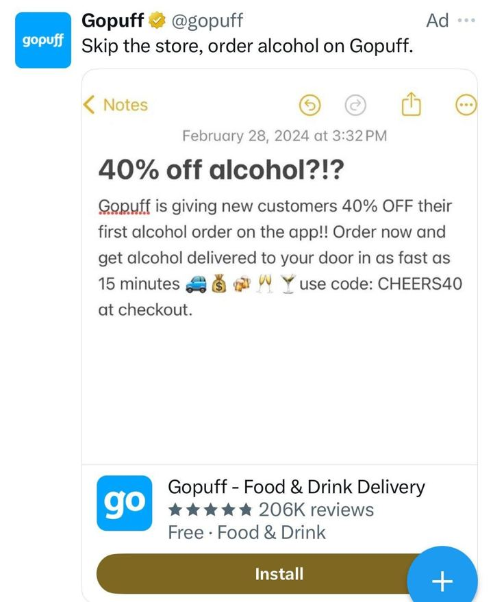

# 32 · Screenshot-native static pack (iPhone Notes, text thread, Reddit, email, Google, IG story/DM, Trustpilot)

<!-- HERO:START -->
[](EXAMPLE.md)

**[See the example and how to make it →](EXAMPLE.md)** · [watch on X](https://x.com/liv_unltd/status/1774923299136716885)
<!-- HERO:END -->


> **LC priority P0** · evidence: High (CPM data + every static list) · hype risk: Low · cost $0 (Figma/AI image) · 15-30 min per static

## What it is
Statics that mimic native phone UI: an iPhone Notes list, an iMessage thread, a Reddit post, an email, a Google search results page, an IG story/DM, a Trustpilot review card, a tweet. The UI is the hook; the copy carries the angle; usually paired with long primary text.

## Why it works
- Cheapest reach in two accounts: screenshot/fake-text/Reddit $7-12 CPM vs $20 for educational talking heads (@PhilKiel).
- Reads as content from a person, not a brand — the brain files it as "someone I follow".
- Each UI = a different Entity ID for the same message; dozens per hour with AI image tools.
- Pairs with long primary text (S-tier "long primary text with organic image", @nicktheriot_).

## Shot-by-shot (LC version)

| Time / slot | Visual | Audio / copy |
|---|---|---|
| Notes | iPhone Notes titled "jewelry I never take off" with 5 bullets, last = "LC herringbone (14K PVD, showers fine)" | Primary text: personal story |
| iMessage | Thread: friend "wait is that the necklace you swam in??" / "yes 6 months, still gold" / "SEND LINK" | Primary text: "my sister made me post this" |
| Reddit | r/jewelry-style post (LC-authored, labeled): "Finally found gold jewelry I can shower in — 6 month update" | Primary text: update copy |
| Google | Search bar "jewelry you can shower in" → LC as result with stars | Headline: "Stop googling" |
| Trustpilot | 5-star card with a real review quote + name initial | Primary text: 3 more reviews |
| Email | Inbox screenshot "Your necklace is still gold? (6-month check-in)" | — |

## Hooks (swap-in openers)
- Notes: "things I stopped doing at 30" (#4: taking my necklace off)
- iMessage: "WAIT is that the necklace you wore in Cabo"
- Google: "why does my necklace turn green"
- Reddit-style: "6 months of showering in the same necklace — update"
- IG DM: "where is your necklace from?? I need it"
- Trustpilot: real review "I swim, shower, sleep in it"

## Real examples from X (studied)
- @PhilKiel — 90-day format CPMs: screenshot/fake-text/Reddit-style $7-12 vs educational talking heads $20 ([post](https://x.com/PhilKiel/status/2096549796408619413)).
- @ads4apps — iPhone Notes, Text Message, Reddit Style, Google Search, Email Screenshot, Trustpilot, IG Story in a 39-format list (930 bookmarks) ([post](https://x.com/ads4apps/status/2081785032679518490)).
- @FedotOff90 — iPhone Notes, Reddit style, "fake PDP" among 37 live formats ([post](https://x.com/FedotOff90/status/2104949773539442831)).
- @EmerieOnoh / @_evancarroll — Notes app, sticky notes, tweet screenshot, press screenshot in static framework lists ([post](https://x.com/EmerieOnoh/status/2098426706612683154), [post](https://x.com/_evancarroll/status/2084775630152114293)).
- @DtcMamun — jewelry brand running AI statics + videos (results screenshot) ([post](https://x.com/DtcMamun/status/2087270100617646477)).

## Production recipe
1. Make 7 UI templates in Figma (Notes, iMessage, Reddit-style, Google SERP, IG DM/story, Trustpilot card, email) at 1080×1350 and 1080×1920.
2. Fill from the angle bank: each angle × 3 UIs.
3. Use real customer quotes (with permission) for review/DM/text content; LC-authored posts must not impersonate a real Reddit user.
4. Long primary text (150-400 words) telling the story behind the screenshot.
5. Batch 20 per week; let Meta pick.

## Bot prompt (copy into the creative agent)
```
For each LC angle in {{ANGLES}}, write copy for 3 native UI statics chosen from: iPhone Notes list, iMessage thread (2 friends), Reddit-style post (clearly LC's own account), Google search page, IG DM, Trustpilot card (REAL review text from {{REVIEWS}} only), email subject+preview. Output UI type, exact on-image text (fits a phone screen), and 200-word primary text in first person. No invented testimonials; flag where a real quote is required.
```

## 3 LC scripts
- A · Notes "Jewelry rules I live by now": 1 if it can't go in the shower it doesn't go on me / 2 gold > silver for my skin tone / 3 stacks > statement / 4 14K PVD only (LC) / 5 any 7 for $85 is a cheat code.
- B · iMessage from sister (real customer thread with permission): "ok I need the necklace" "which one" "THE ONE YOU SWAM IN".
- C · Google SERP: query "jewelry you can shower in" → LC listing card with real rating + "any 7 for $85".

## Variants to test
- UI type (7)
- Long vs short primary text
- Real review vs founder Notes
- Feed 4:5 vs story 9:16

## Omni test plan
- **Budget/structure:** 21 statics (7 UIs × 3 angles) in one CBO, $150/day total, 7 days
- **Primary KPIs:** CPM (expect lower), CTR ≥1.2%, CPA; Omni new-customer revenue by UI type (F32-<ui>-*)
- **Kill rule:** Bottom third by CPA after $40 each
- **Scale rule:** Winning UI × new angles weekly
- **Naming:** `utm_content=F32-<concept>-<variant>`; weekly Omni roll-up of new-customer revenue by format.

## Compliance
Baseline: [_COMPLIANCE.md](../_COMPLIANCE.md) (no fake testimonials, AI disclosure, no bulk/spoofed accounts, copy structure not assets, PDP-only claims).
- Testimonials/DMs/texts must be real (with permission) — no fabricated conversations presented as real. LC-authored "Notes"/Reddit-style posts are fine as the brand's own voice.
- Don't use Reddit/Google/Trustpilot logos in a way that implies endorsement; Trustpilot card only if LC actually has that rating there.
- Meta: avoid fake system notifications/buttons that mislead (no fake "play" or "unread message" UI).

## Related
- Strategies: 41-von-restorff-static-copy-prompt, 35-mass-awareness-placement-to-advertorial, 05-offer-page-engineering
- Formats: [09-native-story-static-to-advertorial](../09-native-story-static-to-advertorial/README.md), [10-shock-headline-text-static](../10-shock-headline-text-static/README.md), [17-lofi-handwritten-sign-promo-static](../17-lofi-handwritten-sign-promo-static/README.md)

## Wave 2c update: more screenshot UIs found running (Fedotoff)
- From the 37 verified formats and the 155-ad screenshot board: iPhone Notes (Japanese Taste, 192 days), iMessage (O Positiv), Twitter screenshot (Beyond Alpha), App Settings UI (The Purest Co), Trustpilot reviews (The Xstance), Email screenshot (Class Action U), Reddit style (Lock'd, 96 days → 5-reasons lander), Google Search, Amazon review, TikTok comments, DMs. The fake product page is split out as **F90**.

<!-- EVIDENCE:START -->
## Wave 3 update: Meta ad-library long-runners (Fedotoff gut-health board)
- British Supplements: Google-search UI static ('Which UK brand has no fillers?'), 331 days live. It mimics the moment the buyer is already in (searching), and the brand appears as the 'answer'.
- Stills, transcripts and LC remakes: [adlibrary/](adlibrary/README.md).

## Wave 4 update: Fedotoff October 2026 swipe boards
- Amy: Verified-buyer review card over car selfie (Amy, beef liver), 382 days live (iPhone Notes / Text Messages / Reddit / Google Search / Breaking News / DMs / Amazon Review / TikTok Comments board). It is a native review screenshot, and the selfie makes the customer real.
- Japanese Taste: iPhone Notes checklist static (Japanese Taste), 238 days live (iPhone Notes / Text Messages / Reddit / Google Search / Breaking News / DMs / Amazon Review / TikTok Comments board). It looks like the user's own note.
- Stills, how-to and LC remakes: [adlibrary/](adlibrary/README.md).

## Evidence from X discovery (auto-generated)

| Date | Author | Post | Engagement | Grade | Gist |
|---|---|---|---|---|---|
| 2026-07-27 | [@ads4apps](https://x.com/ads4apps) | [link](https://x.com/ads4apps/status/2081785032679518490) | 412L/930BM/27kV | VALUE | 39 Meta formats that convert (930 bookmarks): X reasons, IG story, us vs them, Venn, don't buy this, iPhone notes, text message, low stock, we're sorry, breaking news, Reddit, Google search, text on skin, tier list, zero stars… |
| 2026-09-06 | [@PhilKiel](https://x.com/PhilKiel) | [link](https://x.com/PhilKiel/status/2096549796408619413) | 35L/37BM/6kV | VALUE | Format-level CPMs over 90 days: screenshot/fake-text/Reddit formats $7-12 vs educational talking heads $20; partnership creator $11-17 vs brand $18-31. |
| 2026-08-11 | [@DtcMamun](https://x.com/DtcMamun) | [link](https://x.com/DtcMamun/status/2087270100617646477) | 59L/14BM/3kV | SOME | Jewelry brand running AI statics + videos on TikTok/Meta: $14k sales on $7k ads (2.04 ROAS) day screenshot. |
| 2026-08-21 | [@raph_guilhem](https://x.com/raph_guilhem) | [link](https://x.com/raph_guilhem/status/2090725512976970065) | 9L/6BM/0kV | SOME | 35 static/native formats tree: Trustpilot, text msg, email screenshot, Reddit, text on skin, crossed-out, tier list, Venn, breaking news. |
| 2026-09-11 | [@EmerieOnoh](https://x.com/EmerieOnoh) | [link](https://x.com/EmerieOnoh/status/2098426706612683154) | 6L/6BM/0kV | SOME | Static formats printing: us vs them, whiteboard, breaking news, doodle, low stock, iPhone notes, Google search, we're sorry, Reddit, tweet screenshot, text on palm. |
| 2026-08-04 | [@_evancarroll](https://x.com/_evancarroll) | [link](https://x.com/_evancarroll/status/2084775630152114293) | 4L/2BM/0kV | SOME | 15 AI static frameworks: 3 core benefits, bold claim, us vs them, comparison chart, old vs new, 5-star, stat, press screenshot, notes app, sticky notes, meme, lo-fi. |
| 2026-08-05 | [@Yannlce](https://x.com/Yannlce) | [link](https://x.com/Yannlce/status/2085017654364958737) | 3L/2BM/1kV | SOME | Same 40-format list (adds claymation, AI podcast). |
<!-- EVIDENCE:END -->
