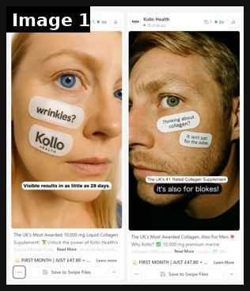
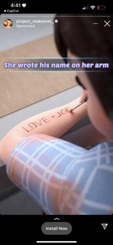

# 33 · Text-on-skin / text-on-palm static: see it, then make it

[](https://x.com/Outscaler/status/1919120416485855259)

**The example:** [@Outscaler on X](https://x.com/Outscaler/status/1919120416485855259) · 1 image · 6 likes, 391 views

**Watch it:** [open the post on X](https://x.com/Outscaler/status/1919120416485855259)

> **How close is this example?** Close: a real Kollo ad reposted in a breakdown. The gallery below has more examples.

> Another ad concept I saw on twitter the other day I just posted on my discovery Text on skin. These guys did it as video format too (Sora'S AI?)

## What you are seeing

A collagen ad from Kollo Health (shared as an example of the 'text on skin' concept): a close-up of a woman's face with small paper-style stickers stuck on her skin — "wrinkles?" and "Kollo" — and the caption "Visible results in as little as 28 days". A second version does the same on a man's face ("it's also for blokes!"). The words sit right on the skin where the problem is.

## Image by image

| Image | Text on it (OCR, rough) |
|---|---|
| 1 | Health od Health od SS SS St Te las Thin about coll It isn't just Ko for the ladies Dh ee Collagen Supplement The UK's #1 Rated Visible results in as little as 28 days. also for blokes! its ae The UK’ Most Awarded 10,000 mg Liquid Collagen The UK's Most Awarded Collagen. Also For Men. ment! Uni powe |

## More real examples (1)

Other posts that show this format, or a close cousin of it. Click a thumbnail to open it on X.

| | | |
|---|---|---|
| [](https://x.com/S1R3NH3AD/status/1708930597014384941)<br>**@S1R3NH3AD** · image · 20K views<br>saw this ad and you will never believe what i thought she was writing on her arm |   |   |

## How to make one like it

**The format in one line:** A close-up photo where the message is written (pen/eyeliner-style) directly on skin — palm, inner wrist, collarbone — next to the product. Lo-fi, intimate, impossible to read as a brand template.

**Why it works:** - Pattern break: handwriting on skin stops the thumb. - Intimate/personal — reads as a note-to-self or confession. - For jewelry the skin shot doubles as a product-on-body shot.

**Contents:** [1. Structure](#1-copy-the-structure) · [2. Shot by shot](#2-shot-by-shot-remake) · [3. Script and hooks](#3-write-the-script) · [4. Prompts](#4-prompts) · [5. Tools and settings](#5-tools-and-settings) · [6. Louise Carter remake](#6-louise-carter-remake) · [7. Variants and test](#7-variants-and-test-plan) · [8. Pitfalls](#8-pitfalls)

### 1. Copy the structure

The skeleton every version follows: **hook → problem or tension → turn (the product shows up) → proof → one clear ask.** The shot-by-shot below fills it in.

### 2. Shot-by-shot remake

**Target length / size:** 1 static 1080x1350 (or a 6s video)

| # | Time / slot | What we see (visual + camera) | Dialogue / on-screen text |
|---|---|---|---|
| 1 | Main | Close-up of a wrist or collarbone with a word written in eyeliner or skin-safe marker, the necklace or bracelet sitting right next to it | Word on skin: "waterproof." |
| 2 | Variant A | Palm facing camera, the ring on a finger | On palm: "shower-proof" |
| 3 | Variant B | Collarbone with a small sticker label (like Kollo's), pointing at the necklace | Sticker: "still gold after 9 months" |
| 4 | Corner | Small logo + offer | "Any 7 for $85" |

<details><summary>Playbook shot list (Louise Carter version from the README)</summary>

| Time / slot | Visual | Audio / copy |
|---|---|---|
| Static 1 | Inner wrist with bracelet stack; on palm: "6 months. never took it off." | Primary text: short story |
| Static 2 | Collarbone with herringbone; on shoulder: "yes I shower in it" | — |
| Static 3 | Hand with rings; on fingers (one word each): "OCEAN PROOF" | — |

</details>

### 3. Write the script

Open with one of these hooks (first 1–3 seconds, or the headline on a static):

- "never took it off"
- "yes, I shower in it"
- "$85 for 7"
- "note to self: stop buying jewelry that turns green"
- "his mom asked where it's from"

Then fill the beats from the table above. Pull the wording from real customer reviews, not from ad copy: a review line beats a copywriter line almost every time. Read every line out loud and cut anything you would not say to a friend. Ready-made Louise Carter scripts are in section 6; hand [BOT.md](BOT.md) to any AI agent to write versions for another brand.

### 4. Prompts

**Shoot**

```text
Natural window light, macro or 2x lens, skin in focus, writing in neat handwriting (not a font).
```

**Word bank (Claude)**

```text
List 20 one- to three-word benefits for [product] that would look good written on skin.
```

**Full creative-agent prompt (from the playbook):**

```
Write 20 text-on-skin messages (≤6 words, handwritten tone, lowercase) for LC waterproof 14K PVD jewelry, each paired with a body location (palm, inner wrist, collarbone, fingers) and the LC piece in frame. Then write 80-word first-person primary text for the best 5.
```

### 5. Tools and settings

1. Shoot real hands/wrists (diverse skin tones) with LC pieces in daylight; write with skin-safe eyeliner pencil.
2. Or composite handwriting in post (Procreate) — keep it believable.
3. Short message ≤6 words; long primary text tells the story.
4. 3 skin locations × 4 messages = 12 statics.

| Setting | Value |
|---|---|
| Canvas | 1080×1350 (4:5) for feed; 1080×1920 (9:16) story/reel version with the same elements stacked |
| Type | Headline 80–110 px, max 8 words; body 36–44 px; at most 2 typefaces |
| Layout | Headline readable at thumbnail size; product at least 40% of the canvas; logo small, bottom corner |
| Safe zone | Keep text out of the bottom 20% on 9:16 (UI overlays) |
| Tools | Figma or Canva for layout; Photoshop or Photoroom to cut out product; Midjourney or Flux only for backgrounds, never for the product itself |
| Export | PNG or JPG at quality 90, sRGB, under 1 MB |

### 6. Louise Carter remake

- A · Palm: "6 months. never took it off." + bracelet stack on wrist.
- B · Collarbone: "yes I shower in it" + Chelsea Herringbone.
- C · Fingers: "any 7 / $85" across knuckles with ring stack.

Brand rules, claims you can and cannot make, and more scripts: [brands/louise-carter.md](brands/louise-carter.md). Step-by-step from idea to scale: [STAGES.md](STAGES.md).

### 7. Variants and test plan

- Real handwriting vs composited
- Skin location
- Message type (proof / price / identity)

**Test plan:** - **Budget/structure:** 12 statics, $25/day each, 5 days - **Primary KPIs:** CTR ≥1.2%, CPA; Omni (F33-*) - **Kill rule:** CTR <0.7% - **Scale rule:** Winning message → F30 video beat - **Naming:** `utm_content=F33-<concept>-<variant>`; weekly Omni roll-up of new-customer revenue by format.

**Naming:** `F33-<variant>-<hook##>-<date>` so results map back to this folder. Change one thing per test (hook, narrator, length or offer), never two.

### 8. Pitfalls

- The writing must be real handwriting; fonts look fake.
- Keep it to 1-4 words; skin is a small canvas.
- Use skin-safe products and say so if asked.
- Too much text: if it cannot be read in 1 second at thumbnail size, cut it.
- AI-generated product images: show the real product; AI is fine for backgrounds only.

**Compliance:** Baseline: [_COMPLIANCE.md](../_COMPLIANCE.md) (no fake testimonials, AI disclosure, no bulk/spoofed accounts, copy structure not assets, PDP-only claims). - Real models with releases; no minors. - Claims within PDP wording.

## More examples

Every post we found for this format, with transcripts: [examples/](examples/README.md). Playbook: [README.md](README.md). Agent brief: [BOT.md](BOT.md).
