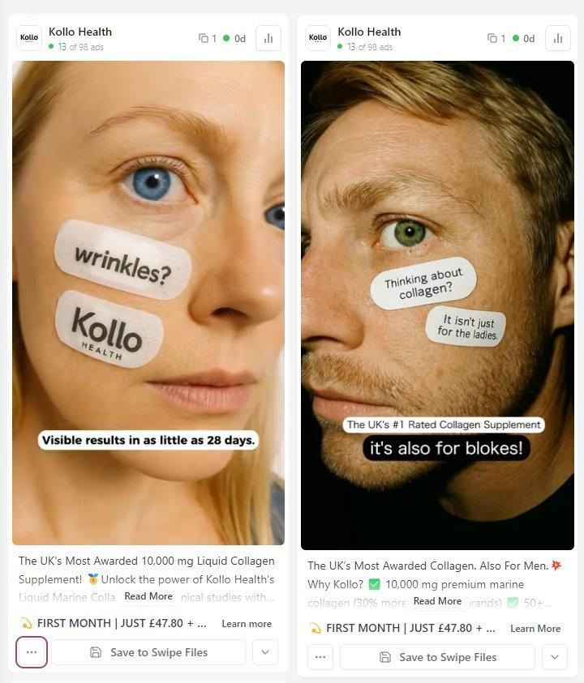

# 33 · Text-on-skin / text-on-palm static

<!-- HERO:START -->
[](EXAMPLE.md)

**[See the example and how to make it →](EXAMPLE.md)** · [watch on X](https://x.com/Outscaler/status/1919120416485855259)
<!-- HERO:END -->


> **LC priority P1** · evidence: Med-High (in 4 independent format lists) · hype risk: Low · cost $0-50 (photo + handwriting or AI) · 20 min

## What it is
A close-up photo where the message is written (pen/eyeliner-style) directly on skin — palm, inner wrist, collarbone — next to the product. Lo-fi, intimate, impossible to read as a brand template.

## Why it works
- Pattern break: handwriting on skin stops the thumb.
- Intimate/personal — reads as a note-to-self or confession.
- For jewelry the skin shot doubles as a product-on-body shot.

## Shot-by-shot (LC version)

| Time / slot | Visual | Audio / copy |
|---|---|---|
| Static 1 | Inner wrist with bracelet stack; on palm: "6 months. never took it off." | Primary text: short story |
| Static 2 | Collarbone with herringbone; on shoulder: "yes I shower in it" | — |
| Static 3 | Hand with rings; on fingers (one word each): "OCEAN PROOF" | — |

## Hooks (swap-in openers)
- "never took it off"
- "yes, I shower in it"
- "$85 for 7"
- "note to self: stop buying jewelry that turns green"
- "his mom asked where it's from"

## Real examples from X (studied)
- @ads4apps — "Text on Skin" in 39 converting Meta formats ([post](https://x.com/ads4apps/status/2081785032679518490)).
- @FedotOff90 — "Text on skin" among 37 formats printing with live days-active ([post](https://x.com/FedotOff90/status/2104949773539442831)).
- @EmerieOnoh — "Text on palm" in statics printing now ([post](https://x.com/EmerieOnoh/status/2098426706612683154)).

## Production recipe
1. Shoot real hands/wrists (diverse skin tones) with LC pieces in daylight; write with skin-safe eyeliner pencil.
2. Or composite handwriting in post (Procreate) — keep it believable.
3. Short message ≤6 words; long primary text tells the story.
4. 3 skin locations × 4 messages = 12 statics.

## Bot prompt (copy into the creative agent)
```
Write 20 text-on-skin messages (≤6 words, handwritten tone, lowercase) for LC waterproof 14K PVD jewelry, each paired with a body location (palm, inner wrist, collarbone, fingers) and the LC piece in frame. Then write 80-word first-person primary text for the best 5.
```

## 3 LC scripts
- A · Palm: "6 months. never took it off." + bracelet stack on wrist.
- B · Collarbone: "yes I shower in it" + Chelsea Herringbone.
- C · Fingers: "any 7 / $85" across knuckles with ring stack.

## Variants to test
- Real handwriting vs composited
- Skin location
- Message type (proof / price / identity)

## Omni test plan
- **Budget/structure:** 12 statics, $25/day each, 5 days
- **Primary KPIs:** CTR ≥1.2%, CPA; Omni (F33-*)
- **Kill rule:** CTR <0.7%
- **Scale rule:** Winning message → F30 video beat
- **Naming:** `utm_content=F33-<concept>-<variant>`; weekly Omni roll-up of new-customer revenue by format.

## Compliance
Baseline: [_COMPLIANCE.md](../_COMPLIANCE.md) (no fake testimonials, AI disclosure, no bulk/spoofed accounts, copy structure not assets, PDP-only claims).
- Real models with releases; no minors.
- Claims within PDP wording.

## Related
- Strategies: 41-von-restorff-static-copy-prompt, 13-identity-shareables-accidental-virality
- Formats: [17-lofi-handwritten-sign-promo-static](../17-lofi-handwritten-sign-promo-static/README.md), [32-screenshot-native-static-pack](../32-screenshot-native-static-pack/README.md)

<!-- EVIDENCE:START -->
## Wave 4 update: Fedotoff October 2026 swipe boards
- Alicia Darling: Gym-clock POV with sticky caption ("Black leggings so I hope no one notices"), 319 days live (Native Unusual Visuals board). An embarrassing secret told as a caption over a mundane POV; the product is implied (period / odor).
- Stills, how-to and LC remakes: [adlibrary/](adlibrary/README.md).

## Evidence from X discovery (auto-generated)

| Date | Author | Post | Engagement | Grade | Gist |
|---|---|---|---|---|---|
| 2026-07-27 | [@ads4apps](https://x.com/ads4apps) | [link](https://x.com/ads4apps/status/2081785032679518490) | 412L/930BM/27kV | VALUE | 39 Meta formats that convert (930 bookmarks): X reasons, IG story, us vs them, Venn, don't buy this, iPhone notes, text message, low stock, we're sorry, breaking news, Reddit, Google search, text on skin, tier list, zero stars… |
| 2026-08-21 | [@raph_guilhem](https://x.com/raph_guilhem) | [link](https://x.com/raph_guilhem/status/2090725512976970065) | 9L/6BM/0kV | SOME | 35 static/native formats tree: Trustpilot, text msg, email screenshot, Reddit, text on skin, crossed-out, tier list, Venn, breaking news. |
| 2026-09-11 | [@EmerieOnoh](https://x.com/EmerieOnoh) | [link](https://x.com/EmerieOnoh/status/2098426706612683154) | 6L/6BM/0kV | SOME | Static formats printing: us vs them, whiteboard, breaking news, doodle, low stock, iPhone notes, Google search, we're sorry, Reddit, tweet screenshot, text on palm. |
| 2026-08-05 | [@Yannlce](https://x.com/Yannlce) | [link](https://x.com/Yannlce/status/2085017654364958737) | 3L/2BM/1kV | SOME | Same 40-format list (adds claymation, AI podcast). |
<!-- EVIDENCE:END -->
