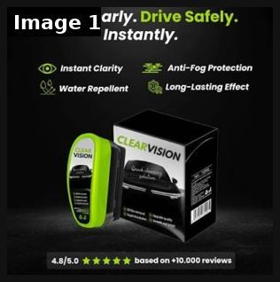

# 34 · Call-out statics: '3 signs…', myth vs fact, 'don't buy this', warning: see it, then make it

[](https://x.com/FedotOff90/status/2096964245485449453)

**The example:** [@FedotOff90 on X](https://x.com/FedotOff90/status/2096964245485449453) · 1 image · 17 likes, 3K views

**Watch it:** [open the post on X](https://x.com/FedotOff90/status/2096964245485449453)

> SafeRoad Magazine runs 209 ads for a windshield spray. Its best: a 7,800-character confession about reading Amazon reviews at 1:23 AM, into a comparison advertorial. 200 days. Nobody in skincare runs this. Use this prompt to steal formats OUTSIDE your niche: https://www.gethookd.ai/mcp/ Beat: what SafeRoad does | skincare port Hook: "Stop scrolling if nothing cleans your windshield 👆" | "Stop scrolling if nothing fad…

## What you are seeing

A product callout static: the headline "See Clearly. Drive Safely. Instantly." over the ClearVision box, four benefit callouts with icons (Instant Clarity, Anti-Fog Protection, Water Repellent, Long-Lasting Effect) and a review bar ("4.8/5.0 based on 10,000+ reviews").

## Image by image

| Image | Text on it (OCR, rough) |
|---|---|
| 1 | See Clearly. Drive Safely. Instantly. Instant Clarity Anti-Fog Protection water Long-Lasting Effect SA Era, 4.8 5.0 Yee te He based on 10.000 reviews |

## How to make one like it

**The format in one line:** A plain, lo-fi static (or 15s text video) that calls out the viewer with a diagnostic list ("3 signs your necklace won't survive summer"), a myth-vs-fact pair, a cross-out ("~~gold-plated~~ PVD bonded"), or a negative/warning hook ("don't buy this if…"). Universal, undated, evergreen — the format that runs for years.

**Why it works:** - Self-diagnosis hooks make the viewer check themselves against the list — high relevance with zero targeting. - No dated references or offers → can run for 1,500+ days (@FedotOff90 PetJoy). - Negative framing ("don't buy", "should be banned") outperforms in some accounts (@KanishDigital). - Educates on the mechanism (PVD vs plating) which is LC's real differentiator.

**Contents:** [1. Structure](#1-copy-the-structure) · [2. Shot by shot](#2-shot-by-shot-remake) · [3. Script and hooks](#3-write-the-script) · [4. Prompts](#4-prompts) · [5. Tools and settings](#5-tools-and-settings) · [6. Louise Carter remake](#6-louise-carter-remake) · [7. Variants and test](#7-variants-and-test-plan) · [8. Pitfalls](#8-pitfalls)

### 1. Copy the structure

The skeleton every version follows: **hook → problem or tension → turn (the product shows up) → proof → one clear ask.** The shot-by-shot below fills it in.

### 2. Shot-by-shot remake

**Target length / size:** 1 static 1080x1350 per variant (4 variants)

| # | Time / slot | What we see (visual + camera) | Dialogue / on-screen text |
|---|---|---|---|
| 1 | "3 signs" variant | Numbered list beside a close-up of a cheap chain | "3 signs your necklace is about to turn green: 1. It's light 2. It says 'gold tone' 3. It cost $9" |
| 2 | Myth vs fact | Two-column card, red X / gold tick | Myth: "You can't shower in gold jewellery." Fact: "You can in 14K PVD." |
| 3 | "Don't buy this" | Product photo with a sticker | "Don't buy this if you like taking your jewellery off." |
| 4 | Warning | Yellow warning bar at the top | "Warning: may cause you to never take it off." |
| 5 | Corner | Logo + offer | "Any 7 for $85" |

<details><summary>Playbook shot list (Louise Carter version from the README)</summary>

| Time / slot | Visual | Audio / copy |
|---|---|---|
| Static A | White bg, bold black text "3 signs your gold jewelry is plated (and will turn green)" + 3 numbered lines | Primary text: mechanism story → LC |
| Static B | Myth vs Fact two-column: "Myth: waterproof gold doesn't exist / Fact: 14K PVD is bonded at the molecular level" | — |
| Static C | Cross-out: "~~take off before showering~~" over LC necklace photo | — |
| Static D | Warning: "Don't buy this necklace if you like taking jewelry off" | Reverse-psychology primary text |

</details>

### 3. Write the script

Open with one of these hooks (first 1–3 seconds, or the headline on a static):

- "3 signs your necklace is about to turn green"
- "Myth: you can't shower in gold jewelry"
- "Don't buy this if you like taking your jewelry off"
- "Stop buying gold-plated jewelry (read this first)"
- "Warning: this stack is addictive"

Then fill the beats from the table above. Pull the wording from real customer reviews, not from ad copy: a review line beats a copywriter line almost every time. Read every line out loud and cut anything you would not say to a friend. Ready-made Louise Carter scripts are in section 6; hand [BOT.md](BOT.md) to any AI agent to write versions for another brand.

### 4. Prompts

**Figma**

```text
Template: headline 88px, list items 44px with gold number badges, product photo 50% width on the right; export 1080x1350.
```

**Claude**

```text
Write 10 "3 signs" lists and 10 myth/fact pairs for [category], each true and checkable.
```

**Full creative-agent prompt (from the playbook):**

```
Using only these LC PDP facts {{PDP_FACTS}}, write: 5 "3 signs…" callouts, 5 myth-vs-fact pairs, 5 cross-out lines, 5 "don't buy this if…" warnings. ≤14 words on image. Then a 250-word first-person primary text for the 3 strongest. No claims about competitors by name; no medical claims.
```

### 5. Tools and settings

1. Pick 5 mechanism truths from the PDP (PVD bonding, 14K, waterproof, hypoallergenic if on PDP, warranty if any).
2. Write 4 template types × 5 truths = 20 statics; deliberately plain design (system font, white or kraft background).
3. Long primary text: personal story of the green-neck problem → mechanism → LC → offer.
4. No dates, no seasonal offers in evergreen versions; separate offer version for BFCM.

| Setting | Value |
|---|---|
| Canvas | 1080×1350 (4:5) for feed; 1080×1920 (9:16) story/reel version with the same elements stacked |
| Type | Headline 80–110 px, max 8 words; body 36–44 px; at most 2 typefaces |
| Layout | Headline readable at thumbnail size; product at least 40% of the canvas; logo small, bottom corner |
| Safe zone | Keep text out of the bottom 20% on 9:16 (UI overlays) |
| Tools | Figma or Canva for layout; Photoshop or Photoroom to cut out product; Midjourney or Flux only for backgrounds, never for the product itself |
| Export | PNG or JPG at quality 90, sRGB, under 1 MB |

### 6. Louise Carter remake

- A · "3 signs your jewelry is plated: 1) it's cheap AND gold 2) it says 'gold tone' 3) your neck tells you after a week." → "LC is 14K PVD — bonded, not painted."
- B · Myth vs Fact: "Myth: real-looking gold can't go in the ocean. Fact: 14K PVD can. (300k+ customers swim in it.)"
- C · "Don't buy this if you enjoy taking your necklace off every night." + Chelsea Herringbone on wet skin.

Brand rules, claims you can and cannot make, and more scripts: [brands/louise-carter.md](brands/louise-carter.md). Step-by-step from idea to scale: [STAGES.md](STAGES.md).

### 7. Variants and test plan

- Template type
- Plain vs branded design
- Positive vs negative framing
- Short vs 7,000-char primary text

**Test plan:** - **Budget/structure:** 20 statics, $20/day each, 7 days; keep winners on for months - **Primary KPIs:** CPA, days-alive; Omni (F34-*) - **Kill rule:** CPA >1.8× after $60 - **Scale rule:** Leave evergreen winners untouched; iterate siblings - **Naming:** `utm_content=F34-<concept>-<variant>`; weekly Omni roll-up of new-customer revenue by format.

**Naming:** `F34-<variant>-<hook##>-<date>` so results map back to this folder. Change one thing per test (hook, narrator, length or offer), never two.

### 8. Pitfalls

- Every "sign" and "fact" must be true.
- Don't attack a named competitor.
- The warning variant must be clearly playful, not a real warning.
- Too much text: if it cannot be read in 1 second at thumbnail size, cut it.
- AI-generated product images: show the real product; AI is fine for backgrounds only.

**Compliance:** Baseline: [_COMPLIANCE.md](../_COMPLIANCE.md) (no fake testimonials, AI disclosure, no bulk/spoofed accounts, copy structure not assets, PDP-only claims). - Mechanism/material claims must match PDP exactly; "hypoallergenic"/"won't tarnish" only if substantiated. - Don't disparage named competitors; generalised category statements must be true.

## Field notes

Newer observations live in the playbook: [Wave 2c update: more call-out variants (Fedotoff 37 formats)](README.md) · [Wave 2d update: cause relocation and the "big enemy"](README.md) · [Wave 3 update: Meta ad-library long-runners (Fedotoff gut-health board)](README.md)

## More examples

Every post we found for this format, with transcripts: [examples/](examples/README.md). Playbook: [README.md](README.md). Agent brief: [BOT.md](BOT.md).
