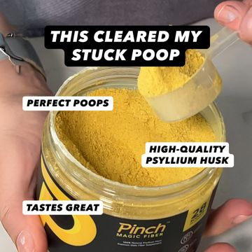

# Meta ad-library examples for F34 (GetHookd board 155932, gut health)

From [@FedotOff90](https://x.com/FedotOff90/status/2108212319113412929)'s public board preview. Days live are as of 2026-10-09. Full board breakdown is in the internal sources folder.

## Libby Babet: Women's-body myth-bust talking head (fitness coach) (305 days live)

- **What happens:** Libby Babet (coach/founder) talking head at home: hook text 'This is why fasted workouts backfire for women' → explains cortisol/muscle → 'for my pro babes' → shows the empty wrapper of the collagen bar she ate this morning → 'go train strong, my ladies'. Burned-in yellow-highlight captions; three versions (different crops/backgrounds) in one DCO ad.
- **Why it lasts:** 305 days live. 'Women's bodies react differently' is an identity hook; the product arrives as the personal fix after 60 s of genuine education; the empty-wrapper detail is proof of real use.
- **How to make one:** Founder/coach to camera, 85-95 s, one take, captions with keyword highlights (CapCut 'highlight' style), 3 framings of the same take as DCO variants.
- **LC remake:** 'This is why your gold necklace turns green (and it's not your skin)' myth-bust by a stylist/founder → science in plain words → 'this is the one I slept in last night' → shows it on.

Transcript

> I really want to clear up a myth that I hear all the time from women, which is that we should train faster for better fat burn. The reality is that women's bodies react really differently to men's when we fast and particularly when we fast and then work out. You see when you skip food before training your cortisol and adrenaline can spike higher and that can actually break down muscle and throw off your hormones completely. When you have a small snack before you train just a little protein and carbs, you actually protect your muscle tissue, you help to regulate your hormones and you perform better which means you get better results and that is so important for everything you're trying to achieve. This is particularly important if you're doing any kind of weight training, high intensity training or endurance training. So for my pro babes out there, you need to be eating before you train. People always used to tell me a piece of fruit or a smoothie would do the trick but those things always felt horrible in my tummy. So for me, I have one of our chief collagen bars. They really just sit so well in my stomach and I don't even feel them if I have them 30 minutes before I train. And the bonus is that collagen also gives your tenons a little bit of support going into a session. So before a workout is the best time to take that. This is the empty packet of the bar I had this morning, which is our mint chocolate covered bar, but there are also non chocolate covered ones if you're a bit more of a plain morning girlie. So give that a go if you want to train harder and better and get better results. So you are absolutely not ruining your burn if you eat before you work out. In fact, you are helping your body to burn smarter and that will help you get your results. So go train strong, my ladies.

## Pinch Magic Fiber: Product callout-label static ('This cleared my stuck poop') (258 days live)

- **What happens:** Close-up of a scoop over the jar, black pill headline 'THIS CLEARED MY STUCK POOP' and 3 small callout labels pointing at the product (perfect poops / high-quality psyllium husk / tastes great).
- **Why it lasts:** 258 days live. A blunt first-person result headline + 3 benefit labels is readable in one glance.
- **How to make one:** One macro photo, Canva pill labels with thin leader lines; 1080x1350.
- **LC remake:** Wrist stack close-up, pill headline 'THIS SURVIVED 200 SHOWERS', labels: 14K PVD / won't turn green / any 7 for $85.
